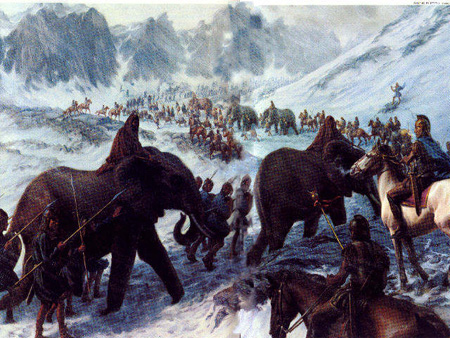
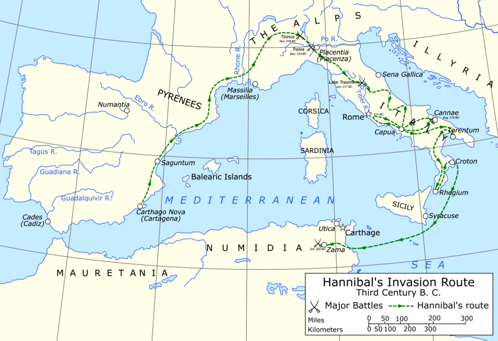
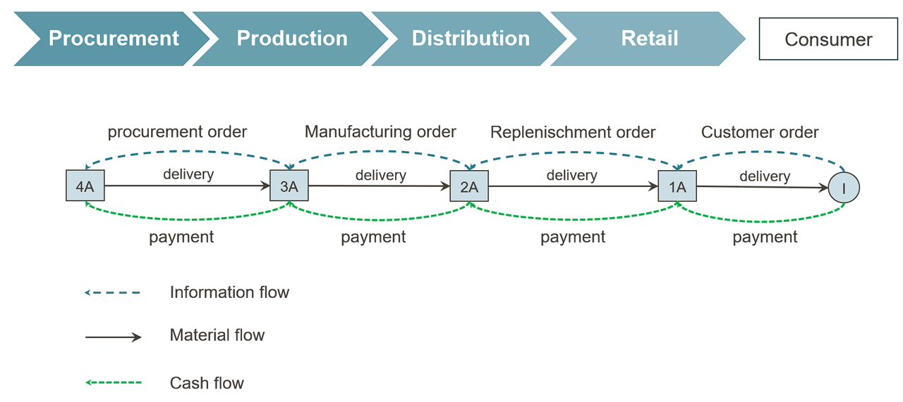
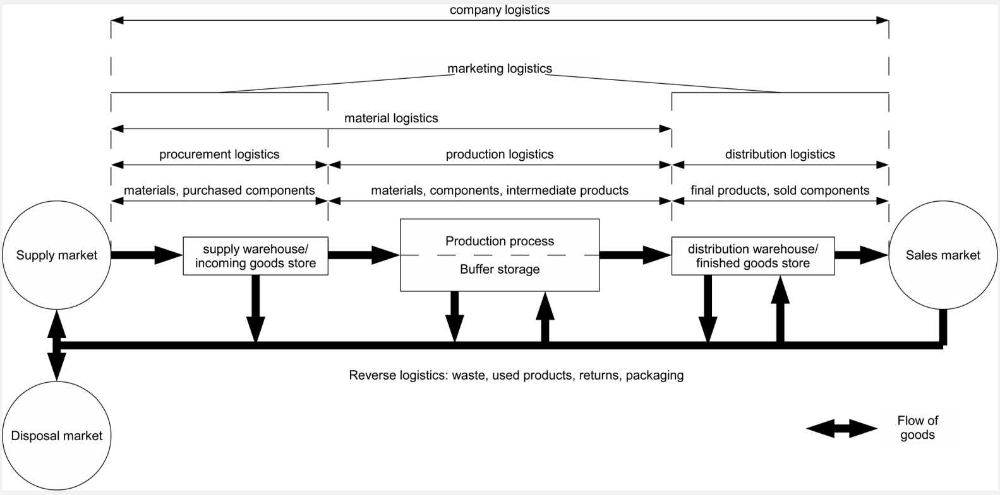
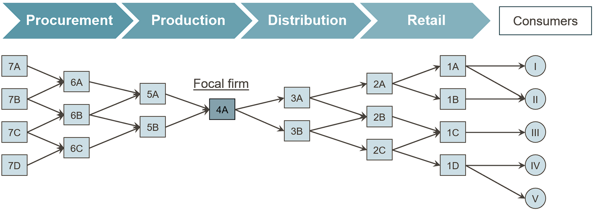
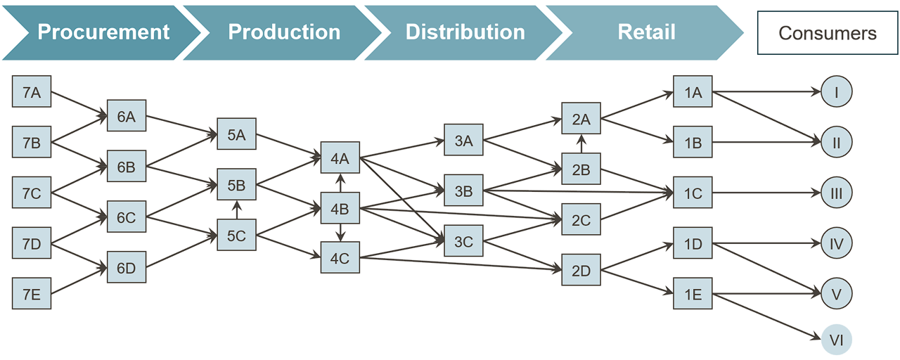

# Introduction and Basic Concepts of Supply Chain Management {#sec-einfuehrung}

::: {.lernziele}
**Learning objectives**

- explain the key concepts, actors and flows of a supply chain,
- distinguish supply chain management from logistics and procurement,
- differentiate between strategic, tactical and operational decisions in supply chains,
- assess the importance of coordination for value creation and competitiveness,
- understand the basic workings of R, RStudio and Quarto and create simple vectors, tables and charts yourself.
:::

## Supply chains are not an invention of the modern age

When people think of supply chain management (SCM), they usually think first of container ships, global plant networks or the distribution system of an online retailer. In fact, coordinating material, information and financial flows across multiple actors is an age-old problem in human history — only the tools for solving it have changed.

An impressive example is the construction of the Great Pyramid of Cheops, which began around 2620 BC and produced a structure originally 147 metres high. Its construction required around 2.3 million stone blocks with an average weight of 2.5 tonnes to be quarried, transported and placed with precision. This was only possible through coordinated transport, functioning tool and spare-parts management, and a supply logistics system that had to feed around 100,000 workers every day. Without the planned coordination of procurement (quarries, tools), transport (the Nile, sledges, ramps) and provisioning, a project of this scale would not have been feasible.

::: {layout-ncol="2"}
{fig-alt="Historical depiction of pyramid construction"}

{fig-alt="Depiction of the construction-site organisation at the Pyramid of Cheops"}
:::

A second, military example is Hannibal's crossing of the Alps during the Second Punic War. Among other things, his army comprised 37 war elephants and around 40,000 soldiers together with a large cavalry — and it had to be supplied over hundreds of kilometres in largely hostile territory. Unlike a stationary construction project such as the pyramid, here the movement of the entire supply chain itself was an additional challenge: supplies had to travel ahead of the army or reach it along the route, while terrain, allies and enemies were constantly changing.

::: {layout-ncol="2"}
{fig-alt="Map of Hannibal's invasion route to Italy"}

{fig-alt="Depiction of the supply situation of Hannibal's army"}
:::

Both examples already show the core characteristics that also shape modern supply chains: multiple actors (quarries, transport columns, provisioning points or supply troops, allies), a target object that is moved or refined over several stages, and the need to coordinate quantities, timing and locations so that a demand is ultimately met. It is precisely this coordination effort — not the individual transport or the individual production stage — that is the subject of supply chain management.

::: {.r-exkurs}
**R aside: R, RStudio and Quarto**

This textbook uses the programming language **R** throughout, a free open-source language for statistical computing and data visualisation. Programming is typically done in **RStudio**, an integrated development environment that combines an editor, a console for immediate code execution, and tools for managing files and packages in a single window.

This book itself is written as a **Quarto** document (file extension `.qmd`). Quarto combines ordinary text (like this paragraph) with executable R code in so-called **code chunks**. A chunk begins and ends with three backticks (`` ``` ``), with the opening line additionally containing `{r}` to identify R as the language. When the document is rendered, the code is actually executed, and results (numbers, tables, charts) are automatically embedded in the text — so text and calculations never diverge.

A minimal example:

```{r}
#| label: ch1-erste-zuweisung

# An assignment: the name "anzahl_akteure" receives the value 5
anzahl_akteure <- 5

# When the name is evaluated, R prints the stored value
anzahl_akteure
```

The line `#| label: ch1-erste-zuweisung` is not output but a **chunk option**: it assigns a unique internal name to this code block, which helps with debugging and with referencing figures.
:::

## An ancient case example: the toga praetexta

How strongly even pre-modern value chains linked raw material procurement, processing and distribution over long distances is illustrated by the production of the *toga praetexta*, the purple-bordered garment of Roman magistrates. The production process began with sheep farming and the shearing and sorting of the raw wool. The wool was spun into yarn, woven into white woollen cloth and then fulled, cleaned, bleached and cut — a processing step that raised the cost of the goods to around 100 sesterces per pound.

In parallel ran a second, considerably more expensive chain: purple production. The hypobranchial gland was removed from specially bred murex snails, salted and heated over several days to obtain the eponymous dye, with which wool or finished lengths of cloth were dyed. This refining step cost around 4,000 sesterces per pound — forty times as much as the wool processing alone. Only in the final step were the purple border and woollen garment assembled into the finished toga.

On the market, this value-creation structure was reflected in drastically tiered prices: a simple white toga cost about 12 sesterces, a better white toga around 60 sesterces, whereas a toga praetexta cost 800 sesterces — with an ordinary soldier's annual pay of around 1,000 sesterces, a single toga praetexta was thus worth almost a year's income. The price difference can be attributed almost entirely to the value-creation step “purple dyeing”, which in turn depended on its own geographically far-flung procurement chain: raw wool came from Tarentum and Miletus, among other places, the purple dye from Tyre in the Levant, while processing and sales were concentrated in Rome.

::: {.definition}
**Definition: Value chain**

A **value chain** is the sequence of activities through which a starting material is transformed step by step in such a way that its value increases from the perspective of the end customer. Each stage either adds value physically (processing, refining) or shifts value in space or time (transport, storage) [@chopra2025supply].
:::

::: {.r-exkurs}
**R aside: Assignment, comments and basic data types**

Like most programming languages, R has named storage locations for values. A value is assigned to a name with the **assignment operator** `<-` (read as “gets”); alternatively, `=` also works, but `<-` is customary in R code. Text after a hash sign `#` is a **comment** and is ignored by R — comments serve solely to make code understandable to humans.

R distinguishes several **basic data types**. The three most important for getting started are:

- `numeric`: numbers, such as prices or quantities,
- `character`: character strings (text), always in quotation marks,
- `logical`: truth values, only `TRUE` or `FALSE`.

```{r}
#| label: ch1-basisdatentypen

# numeric: a number -- here the price of a simple toga in sesterces
preis_einfache_toga <- 12

# character: a character string -- here the product name
produktname <- "Toga praetexta"

# logical: a truth value -- is it a luxury good?
ist_luxusgut <- TRUE

# class() returns the data type of an object
class(preis_einfache_toga)
class(produktname)
class(ist_luxusgut)
```
:::

::: {.r-exkurs}
**R aside: Vectors and vector arithmetic**

Single values are rarely sufficient to represent an entire product range or several supply chain stages. The function `c()` (for *combine*) combines several values into a **vector** — the fundamental data structure in R. Vector elements can be addressed by name, and arithmetic operations are performed **element-wise**, meaning each individual number in the vector is processed separately without having to write a loop by hand.

```{r}
#| label: ch1-toga-preise

# c() combines several named values into a vector
toga_preise <- c(einfach = 12, besser = 60, praetexta = 800)

# Print the entire vector with names
toga_preise

# Element-wise calculation: mark-up factor relative to the simplest toga
# (each element of toga_preise is divided by the same scalar)
aufschlagsfaktor <- toga_preise / toga_preise["einfach"]
round(aufschlagsfaktor, 1)
```

The last call shows that a toga praetexta cost around 67 times as much as the simplest model — a direct reflection of the additional value-creation stage “purple dyeing”.
:::

## Global supply chains before the modern age: the spice trade

The geographical reach of pre-modern supply chains is even more evident in the spice trade of the 15th century than in the example of the toga. Pepper grew almost exclusively in the Moluccas and on the Malabar Coast of India, but was in demand throughout Europe. Before 1498, the trade route ran through a long chain of transhipment points: from the Moluccas via Malacca and Calicut by sea, from there via Aden and the Red Sea, onwards by caravan via Cairo to Alexandria and finally by ship to Venice, from where it was resold to the European consumer regions. Each of these stages — production, transhipment, intermediate trade, transport — required its own actors, its own means of transport and its own contracts, and each stage added a mark-up to the goods.

The result was a drastic price increase along the chain: starting from a value of about 1.5 grams of silver equivalent per kilogram of pepper in the Moluccas, the price rose via Malacca (4 g) and Calicut (8 g) to 12 g in Alexandria, 16 g in Venice and finally around 25 g of silver per kilogram in the European centres of consumption — a tenfold increase before the goods had even reached the end consumer. In 1519, this margin attracted the Magellan expedition, financed by the Spanish Crown, which sought a direct western sea route to the Spice Islands, bypassing the overland route controlled by Venice and Arab intermediaries. The price of this attempt was high: of the five ships and 260 crew members that set sail in 1519, only one ship with 18 survivors returned in 1522 — yet the voyage was still economically profitable thanks to its cargo of cloves, a fact that underlines the importance of this new, shorter supply route [@zweig1983magellan].

After 1498, with Vasco da Gama's circumnavigation of Africa, a second, purely maritime route emerged from Lisbon via Mozambique and Malindi directly to Calicut. It bypassed the numerous intermediate stages of the caravan and Levant route and thereby permanently changed which actors profited from the spice trade — an early example of how a change in network structure shifts the distribution of value creation within a supply chain without the product itself changing.

### The economics of a supply chain innovation: the Magellan expedition

The lecture slides contrast the price development along the spice route with a second chart: the economic balance of the Magellan expedition. It deserves a closer look because it shows a basic pattern of every network decision that we will encounter again in the chapters on facility location planning: a **high, certain initial investment** (ships, equipment, provisions, wages, trade goods) is set against an **uncertain return that lies far in the future** (the revenue from the spice cargo). The cost and revenue items have been handed down in the accounting currency of the Spanish Crown, the *maravedí* [@zweig1983magellan]. To make them comparable with the price data for the spice route, they are converted into silver equivalents (around 3.195 g of silver per 34 maravedís):

```{r}
#| label: ch1-magellan-bilanz
#| fig-cap: "Economic balance of the Magellan expedition in kg of silver equivalent (waterfall chart)"

library(tidyverse)

silber_je_maravedi <- 3.195 / 34   # g of silver per maravedi

magellan <- tribble(
  ~position,                                     ~maravedis,
  "Ships, rigging, artillery, weapons",          -3912241,
  "Provisions and barrels",                      -1585551,
  "Wages for 237 people",                        -1154504,
  "Barter and trade goods",                      -1679769,
  "Other requirements",                           -415060,
  "Revenue from the clove cargo",                 7888684,
  "Other goods",                                  1000000
) |>
  mutate(
    silber_kg = maravedis * silber_je_maravedi / 1000,  # conversion to kg of silver
    typ       = if_else(silber_kg < 0, "Costs", "Revenue"),
    ende      = cumsum(silber_kg),                       # cumulative balance
    anfang    = lag(ende, default = 0),
    nr        = row_number()
  )

# Waterfall chart: each rectangle starts where the previous one ends
ggplot(magellan) +
  geom_rect(aes(xmin = nr - 0.4, xmax = nr + 0.4,
                ymin = pmin(anfang, ende), ymax = pmax(anfang, ende), fill = typ)) +
  geom_hline(yintercept = 0, colour = "grey40") +
  scale_x_continuous(breaks = magellan$nr, labels = magellan$position) +
  scale_fill_manual(values = c(Costs = "#b2182b", "Revenue" = "#1b7837")) +
  labs(x = NULL, y = "kg of silver equivalent", fill = NULL) +
  theme_minimal(base_size = 11) +
  theme(axis.text.x = element_text(angle = 30, hjust = 1))

# Balance of the expedition in kg of silver
round(sum(magellan$silber_kg), 1)
```

Costs of around `r round(-sum(magellan$silber_kg[magellan$silber_kg < 0]), 0)` kg of silver were offset by revenues of around `r round(sum(magellan$silber_kg[magellan$silber_kg > 0]), 0)` kg of silver — so despite the loss of four of the five ships, a narrow surplus remained. The calculation makes two things clear. First, the value of the cargo — a good 20 tonnes of cloves — was so high that even a single returning ship refinanced the entire expedition. The enormous price spread between the Moluccas and Europe (see above) is the economic reason for this. Second, the balance was extremely risky. Had the last ship also been lost, the costs would have been matched by no revenue at all. High margins along a supply chain are therefore not only an expression of market power but often also a **risk premium** for actors who bear transport, spoilage and default risks — an idea that is taken up again in Chapter [-@sec-strategic-fit] (risk allocation) and in the chapters on uncertainty (Chapters [-@sec-unsicherheit-pooling] to [-@sec-bullwhip]).

::: {.r-exkurs}
**R aside: `data.frame` and `tibble` as table structures**

A vector represents only a single quantity. For data with several related variables — such as “trading stage” and “price” — a **table structure** is needed, in which each row represents an observation (here: a stage of the trade route) and each column a variable. In base R, this structure is called `data.frame`; in the so-called **tidyverse** (see next aside), `tibble` is a modernised variant with clearer printed output.

```{r}
#| label: ch1-gewuerzhandel-tabelle

# data.frame(): a table made of named column vectors of equal length
gewuerzhandel <- data.frame(
  stufe = c("Molukken", "Malakka", "Calicut", "Alexandria", "Venedig", "Europa"),
  preis_silber_pro_kg = c(1.5, 4, 8, 12, 16, 25)
)

# str() shows the structure: 6 observations (rows), 2 variables (columns)
str(gewuerzhandel)

gewuerzhandel
```
:::

::: {.r-exkurs}
**R aside: Loading packages with `library()`**

The functionality of R can be extended with **packages** — collections of additional functions provided by the R community. A package has to be installed once with `install.packages("paketname")`, but must be loaded again with `library(paketname)` in **every new R session** before its functions can be used.

This book uses the **tidyverse** throughout, a bundle of packages for data manipulation (including `dplyr`, the package for `tibble`) and visualisation (`ggplot2`).

```{r}
#| label: ch1-library-tidyverse
#| message: false
#| warning: false

# library() loads a previously installed package into the current session.
# tidyverse bundles, among others, dplyr (data manipulation) and ggplot2 (graphics).
library(tidyverse)
```
:::

With the tidyverse loaded, the same table can be created as a `tibble`. The additional step of defining the column `stufe` as a **factor** with a fixed order ensures that the trade route is later displayed in the correct chronological sequence rather than being sorted alphabetically.

```{r}
#| label: ch1-gewuerzhandel-tibble

# tibble() is the tidyverse variant of data.frame()
# factor(..., levels = ...) sets a fixed order of categories
# instead of leaving R to apply the (unwanted) alphabetical sorting
reihenfolge_stufen <- c("Molukken", "Malakka", "Calicut",
                         "Alexandria", "Venedig", "Europa")

gewuerzhandel_tbl <- tibble(
  stufe = factor(reihenfolge_stufen, levels = reihenfolge_stufen),
  preis_silber_pro_kg = c(1.5, 4, 8, 12, 16, 25)
)

gewuerzhandel_tbl
```

::: {.r-exkurs}
**R aside: Your first `ggplot()` chart**

The `ggplot2` package follows the so-called **Grammar of Graphics**: a chart is built from three building blocks that are combined additively with `+`.

1. `data`: the data set containing the values to be displayed,
2. `aes()` (*aesthetic mapping*): the mapping of table columns to visual properties such as the x-axis, y-axis or colour,
3. `geom_*()`: the geometric form of representation, e.g. `geom_col()` for bars or `geom_line()` for lines.

```{r}
#| label: ch1-ggplot-gewuerzhandel
#| fig-cap: "Price increase of pepper along the pre-colonial trade route (before 1498)"

# ggplot(): data + aes() define the data set and axis mapping,
# geom_col() selects columns as the geometric form of representation
ggplot(data = gewuerzhandel_tbl, aes(x = stufe, y = preis_silber_pro_kg)) +
  geom_col(fill = "#2D6A4F") +
  labs(
    x = NULL,
    y = "g of silver per kg of pepper",
    title = "Value creation along the spice trade route"
  ) +
  theme_minimal(base_size = 12)
```

Each additional trading stage visibly increases the price — the chart thus makes immediately clear what the text previously described in figures.
:::

## What is a supply chain? Defining the term

The historical examples already reveal a common pattern: several legally and economically independent actors are connected through physical, informational and financial relationships in such a way that, in the end, a demand is met that no single actor could have met alone.

::: {.definition}
**Definition: Supply chain**

A **supply chain** (value chain or delivery chain) consists of all parties involved, directly or indirectly, in fulfilling a customer request — from raw material suppliers through manufacturers and transporters to wholesalers and retailers as well as the customers themselves. Within each company, the supply chain also includes all functions involved in receiving and filling a customer request, such as new product development, marketing, operations, distribution, finance and customer service [@chopra2025supply].
:::

The crucial point is that a supply chain is **not a linear process** but a network: a manufacturer usually sources from several suppliers and supplies several distribution channels; each of these partners is in turn itself part of further supply chains. Within this network, three types of flows can be distinguished, which run in opposite or parallel directions:

- the **material flow** (also flow of goods): the physical movement of raw materials, semi-finished and finished products downstream, from the origin to the end customer,
- the **financial flow**: payments, which usually flow upstream once a service has been provided, as well as the associated effects on inventory and tied-up capital,
- the **information flow**: demand forecasts, orders, status reports and planning data, which flow in both directions and make it possible to coordinate the other two flows in the first place.

{fig-align="center" width="80%"}

This threefold division can be transferred directly to the levels within the company itself if a company is understood as an open system that exchanges goods as well as information and payments with its environment [@kummer2018grundzuge]:

- The **managerial (dispositive) level** covers the information flow within and between companies as well as the associated planning, decision-making and control processes (management in the narrower sense).
- The **financial level** covers money and payment flows inside and outside the company.
- The **goods level** covers the movement and stock of physical goods — raw materials, auxiliary materials and supplies as well as finished products — within and between companies.

```{r}
#| label: fig-open-firm-model
#| echo: false
#| fig-cap: "The company as an open system with a managerial level, financial level and goods level (after @kummer2018grundzuge)"
#| fig-width: 9
#| fig-height: 6.3
#| out-width: "80%"
#| fig-align: center
source("../R/scm_functions.R")
plot_open_firm_model()
```

These three levels are not independent of one another: a decision at the managerial level (e.g. triggering an order) generates both a future flow of goods and a future flow of payments. It is precisely this interlinking that makes coordination across company boundaries the central management task, referred to in the remainder of this book as supply chain management.

## Value creation and customer benefit in the supply chain

From the end customer's perspective, a product is only valuable when it is available at the right place, at the right time, in the right form and with full power of disposal. In business terms, this customer benefit can be broken down into several types of utility, each generated by particular supply chain functions:

- **Form utility** (*utility by design*): generated by production — the physical transformation of raw materials and intermediate products into a good that meets the customer's needs.
- **Information utility** (*utility by information*): generated by customers and suppliers knowing what is available, when and in what quality.
- **Place utility** (*utility by location*): generated by transport — a good that is not available at the place of demand provides no benefit.
- **Time utility** (*utility by time*): generated by storage and timely provision — a good that is available too early or too late equally fails to serve its purpose.
- **Possession utility** (*utility by property*): generated by the legal and physical transfer of the power of disposal from supplier to buyer in the course of consumption.

These types of utility arise along the classic basic business functions of procurement, production, distribution and consumption: procurement and production contribute primarily to form utility, distribution to place, time and information utility, and consumption finally realises possession utility as the satisfaction of needs. **Logistics** is the function that specifically generates place and time utility — and is therefore a cross-functional activity that links all stages of the supply chain without itself being a separate value-creation stage in the narrower sense.

Within the company, this cross-functional activity can be further subdivided into **procurement logistics** (inbound delivery of goods from the supplier to the plant), **production logistics** (internal material flow between production stages), **distribution logistics** (outbound goods to the customer) and **disposal logistics** (return of packaging, customer returns and residual materials).

{fig-align="center" width="75%"}

The perspective of utility types can be linked with Michael Porter's classic concept of the **value chain**. Porter distinguishes **primary activities**, which contribute directly to the manufacture, sale and delivery of a product (inbound logistics, operations, outbound logistics, marketing & sales, service), from **support activities**, which make these primary activities possible in the first place (firm infrastructure, human resource management, technology development, procurement). Supply chain management can thus also be understood as the attempt to coordinate the primary activities of the value chain not only within a single company but across several legally independent value chains.

::: {layout-ncol="2"}
{fig-alt="Porter's value chain model with primary and support activities"}

{fig-alt="Linked value chains of several supply chain partners"}
:::

From this perspective, the economic success of a supply chain can be expressed formally. The **supply chain surplus (SCM profit)** is the difference between the revenue generated from the end customer and the total costs of all processes and partners involved:

$$
\text{SCM profit} = \text{Customer revenue} - \text{Total costs of all processes and partners}
$$

This SCM profit is at the same time the sum of the individual profits of all actors involved. This leads to a central, often underestimated insight: **optimising the individual profits of single actors does not, as a rule, lead to optimisation of the SCM profit.** A supplier that maximises its own profit by producing large lot sizes may cause high inventory costs and tied-up capital at the customer, reducing the overall profit of the chain. It is precisely this discrepancy between individual and overall optimisation that justifies the distinct need for coordination that supply chain management addresses — a topic that will be taken up again in later chapters of this book, for example in connection with the bullwhip effect.

::: {.vertiefung}
**In depth (theory): Double marginalisation — why local profit maximisation reduces SCM profit**

The statement on the slides that “optimising individual profits does not, as a rule, lead to optimising SCM profit” can be shown precisely using a classic microeconomic model, **double marginalisation** [@spengler1950vertical]. Consider a two-stage chain consisting of a manufacturer and a retailer. The manufacturer produces at unit cost $c$ and sells to the retailer at the wholesale price $w$; the retailer sets the end-customer price $p$. End-customer demand is assumed to be linear, $q = a - p$.

*Integrated chain (one decision-maker):* the total chain profit $(p - c)\,q = (a - q - c)\,q$ is maximised. The first-order condition $a - 2q - c = 0$ yields $q^{I} = (a-c)/2$ and a chain profit of $(a-c)^2/4$.

*Decentralised chain (each actor optimises independently):* the retailer maximises $(a - q - w)\,q$ and chooses $q = (a-w)/2$. The manufacturer anticipates this response and maximises $(w-c)\,(a-w)/2$, from which $w = (a+c)/2$ follows. Substituting gives $q^{D} = (a-c)/4$ — **only half** of the integrated quantity. Both stages successively add their own mark-up (“margin”), the end-customer price rises, the sales volume falls, and chain profit drops to $3(a-c)^2/16$, i.e. to 75% of the possible value.

```{r}
#| label: ch1-doppelte-marginalisierung

a <- 100   # market size (prohibitive price)
k <- 20    # manufacturer's unit cost (do not call it "c": c() is the R function for combining)

# Integrated chain
q_int     <- (a - k) / 2
gewinn_int <- (a - q_int - k) * q_int

# Decentralised chain: manufacturer sets w, retailer responds
w_dez      <- (a + k) / 2
q_dez      <- (a - w_dez) / 2
p_dez      <- a - q_dez
gewinn_haendler   <- (p_dez - w_dez) * q_dez
gewinn_hersteller <- (w_dez - k) * q_dez

tibble(
  Metric  = c("Quantity", "End-customer price", "Manufacturer profit", "Retailer profit", "SCM profit"),
  Integrated = c(q_int, a - q_int, NA, NA, gewinn_int),
  Decentralised  = c(q_dez, p_dez, gewinn_hersteller, gewinn_haendler,
                 gewinn_hersteller + gewinn_haendler)
)
```

The example is deliberately simple, but it shows the core of the coordination problem: each actor behaves entirely rationally on its own, and yet the chain gives away a quarter of its profit potential — at the expense of the manufacturer, the retailer **and** the end customers, who pay higher prices. Instruments such as quantity discounts, buyback or revenue-sharing contracts (*supply chain contracts*) address precisely this issue by aligning the incentives of the individual actors with the chain optimum [@cachon2024matching; @chopra2025supply].
:::

## Supply chain structures: networks, focal and polycentric chains

The term “chain” is misleading in that real supply chains rarely run in a linear fashion. A more realistic picture is that of a multi-stage **network**: at each stage — supplier, manufacturer, distributor, retailer, consumer — there are typically several parallel actors, and the connections between adjacent stages intersect: a manufacturer sources from several suppliers and supplies several distributors, each of which in turn serves several retailers. This network-like structure increases flexibility (e.g. in the event of supplier failures), but at the same time makes coordination more difficult, because decisions at one node can have repercussions for many other nodes in the network.

Within this general network concept, two ideal-typical governance structures can be distinguished, depending on how market power and the coordinating function are distributed in the network:

::: {.definition}
**Definition: Focal supply chain**

A **focal supply chain** is dominated by a single company, usually occupying a bottleneck position, which largely controls the network in terms of actors and structure. The focal company has considerable market power, often controls market access and, as the central coordinator, sets standards and strategic objectives for the rest of the chain. Typical examples are the automotive industry or Apple, where a manufacturer of the end product largely dictates the requirements for upstream and downstream partners.
:::

{fig-align="center" width="85%"}

::: {.definition}
**Definition: Polycentric supply chain**

A **polycentric supply chain** is characterised by distributed and overlapping competences of several actors of broadly equal standing. Here, coordination arises less from instructions issued by a dominant partner than from specialisation and cooperation; market power is distributed more evenly, and uniform standard-setting is correspondingly more difficult. Examples are companies such as IKEA, Neste or Unilever, whose supplier and distribution networks are more broadly diversified and less dependent on a single dominant partner.
:::

{fig-align="center" width="85%"}

Even a cursory comparison of everyday consumer goods shows how different supply chain structures can look in detail: the glass bottle of a soft drink follows a different procurement and distribution logic from a cotton T-shirt, a hand-built gravel bike or a bar of chocolate with cocoa and hazelnut supplies from different continents. Origin of raw materials, depth of processing, transport mode and distribution channel differ so greatly here that one and the same theoretical framework — actors, stages, flows — has to be applied to very different concrete networks in each case.

Why focal structures emerge in some industries and polycentric structures in others can be explained by the **bottleneck position**: whoever controls a scarce, hard-to-replace resource — the brand and access to end customers (Apple), the system integration of a complex product (automotive OEM) or a key technology — can dictate standards, quantities and prices to the other actors. Conversely, the more interchangeable the services of the individual stages are and the more competences overlap, the more likely a polycentric network is to emerge, in which coordination takes place through negotiation and cooperation rather than instruction. For supply chain management, it follows that the **coordination instruments** must fit the structure: in focal chains, the coordinator can set planning data, delivery call-offs and quality standards centrally; in polycentric chains, joint planning, information sharing and contractual incentive systems are the more important levers.

::: {.kontrollfragen}
**Exercise from the lecture: Describing supply chain structures**

Describe the structure of the supply chains — in particular the distribution structure — of the following products: a bottle of Coca-Cola (glass, 0.3 l), a T-shirt from Patagonia, the gravel bike *Waldwiesel* from Urwahn and a bar of Ritter Sport Hazelnut.

1. Describe the main production steps by specifying the raw materials, materials and components used as well as the (intermediate) products generated.
2. Add the logistics processes that link the production stages.
3. Assign the individual process steps (production and logistics) to locations.
4. Is it more of a focal or a polycentric supply chain? Who, if anyone, occupies the bottleneck position?

*Note on working through the exercise:* for each product, it helps to start with the end product and break down the bill of materials “backwards” (e.g. chocolate → cocoa mass, sugar, milk powder, hazelnuts, packaging) before adding locations and means of transport.
:::

## Supply chain management: definitions and delimitation

The term supply chain management is not defined uniformly in the literature, but three frequently cited definitions reveal a common core:

> “Supply chain management is the task of integrating organisational units along a supply chain and coordinating material, information and financial flows in order to fulfil customer demands with the aim of improving the competitiveness of the supply chain as a whole.” [@stadtler2000supply, p. 9]

> “Supply Chain Management is coordination of production, inventory, location, transportation, and information among the participants in a supply chain to achieve the best mix of responsiveness and efficiency for the market being served.” [@hugos2018essentials]

> “Supply chain management encompasses the planning and management of all activities involved in sourcing and procurement, conversion, and all logistics management activities. Importantly, it also includes coordination and collaboration with channel partners […]. In essence, supply chain management integrates supply and demand management within and across companies.” [@cscmp_definition]

::: {.definition}
**Definition: Supply chain management**

**Supply chain management** refers to the cross-company planning, control and monitoring of material, information and financial flows along a supply chain with the aim of improving the competitiveness of the entire chain — not just of individual actors — and of fulfilling customer demands as efficiently and responsively as possible [@stadtler2000supply; @hugos2018essentials; @cscmp_definition].
:::

All three definitions share three characteristics that distinguish SCM from neighbouring concepts. First, the **claim to coordination**: the aim is not the isolated optimisation of individual functions, but their alignment across organisational boundaries — exactly the aspect that was formally justified in the previous section using SCM profit. Second, the **multidimensionality of flows**: material, information and financial flows are considered together, not in isolation. Third, the **focus on demand**: the starting point and target variable is always the fulfilment of a customer demand, not the efficiency of a process step as an end in itself.

This also allows SCM to be clearly distinguished from two neighbouring terms. **Logistics**, as shown above, is primarily concerned with bridging space and time for physical goods and represents one — important — function within SCM, not SCM in its entirety [@corsten2001einfuehrung; @werner2020supply]. **Procurement**, in turn, refers to the upstream function of supplying an individual company with intermediate products, raw materials and services, and thus covers only a section of the entire supply chain. SCM encompasses both functions but goes beyond them in that it makes their interaction across several companies and several types of flow the actual object of design.

## Planning levels in supply chains

Decisions in supply chain management differ considerably in their time horizon, their reversibility and their scope. It is therefore customary to distinguish three **planning levels**, which relate to one another like a pyramid: a few far-reaching strategic decisions form the framework for more numerous tactical decisions, which in turn set the framework for day-to-day operational control.

The **strategic level** comprises decisions with a planning horizon of several years, which can only be reversed at great expense because they involve substantial investment. These include the design of the supply chain network itself — for example, location decisions for plants and warehouses (see the chapters on facility location planning in this book) —, the choice of vertical integration (make or buy) and fundamental decisions about transport modes and cooperation partners.

The **tactical level** comprises decisions with a planning horizon of a few months to about a year, which are made within the network specified by the strategic level. Examples include medium-term production and workforce planning, setting order cycles and safety stocks, or seasonal capacity adjustments.

Finally, the **operational level** comprises short-term, often daily or weekly decisions within the parameters set by the tactical level — such as actually triggering an order, detailed route planning or the day-to-day management of inventory. This level is examined in more depth in later chapters, among other things using inventory models (newsvendor model, safety stocks) and the bullwhip effect.

How closely operational decisions are linked to the levels above them is already evident from a simple key figure: the inventory at different stages of a supply chain. Although inventory is an operational variable (it changes daily), its permissible range is determined by tactical targets (service levels, safety stocks) and indirectly by strategic network decisions (number and location of warehouse sites).

::: {.r-exkurs}
**R aside: A vector of inventory levels — summary**

The following chart brings together the R basics covered so far: a named vector of inventory levels at three supply chain stages is converted into a table and visualised with `ggplot()`.

```{r}
#| label: ch1-lagerbestand-akteure
#| fig-cap: "Example inventory levels at three stages of a supply chain"

# Vector of inventory levels (units) at three stages of the supply chain
lagerbestand <- c(Supplier = 420, Manufacturer = 180, Retailer = 95)

# Conversion into a table (tibble) for ggplot: one column with the
# stage (from the vector names) and one column with the numerical value
lagerbestand_tbl <- tibble(
  stufe = factor(names(lagerbestand), levels = names(lagerbestand)),
  bestand = as.numeric(lagerbestand)
)

# data + aes() + geom_col(): column chart of inventory levels per stage
ggplot(lagerbestand_tbl, aes(x = stufe, y = bestand)) +
  geom_col(fill = "#0B6E4F") +
  labs(
    x = NULL, y = "Inventory (units)",
    title = "Inventory levels along a three-stage supply chain"
  ) +
  theme_minimal(base_size = 12)
```

The decreasing inventory from supplier to retailer is no coincidence but reflects typical inventory patterns that will be examined in more detail in the chapters on uncertainty, pooling and the newsvendor model.
:::

## Summary

This chapter has introduced supply chain management as the cross-company coordination of material, information and financial flows and, using historical examples — from the construction of the pyramids and the toga praetexta to the spice trade of the 15th century — has shown that this coordination problem is as old as value creation based on the division of labour itself. A supply chain was defined as a network of several legally independent actors who jointly fulfil a customer demand; depending on the distribution of market power and the coordinating function, focal and polycentric structures can be distinguished. SCM profit, as the difference between customer revenue and the total costs of all processes, makes clear why individual profit optimisation by single actors does not automatically lead to optimisation of the entire chain — and thus justifies the distinct coordination mandate of supply chain management compared with logistics and procurement. Finally, three time horizons were distinguished — the strategic, tactical and operational levels — which will be examined systematically in the following chapters, beginning with value creation and strategic fit.

In parallel, the first building blocks of the R programming language were introduced: assignment and comments, the three basic data types, vectors and element-wise arithmetic, tables in the form of `data.frame` and `tibble`, loading packages with `library()` and a first chart with `ggplot()`. These tools will be used throughout the following chapters not only to describe supply chain management models but also to calculate and visualise them.

::: {.kontrollfragen}
**Review questions**

1. Using the construction of the pyramids or Hannibal's crossing of the Alps, explain which core characteristics of a supply chain in the modern sense were already present in antiquity.
2. Why can the dramatic price gradient between a simple toga, a better toga and a toga praetexta be interpreted as an expression of a value chain?
3. Name and explain the three types of flow that link a supply chain, and give an example of each from the 15th-century spice trade.
4. What distinguishes the managerial level, the financial level and the goods level of a company from one another, and how are they related?
5. Explain the relationship between SCM profit and the individual profits of partners. Why does individual profit maximisation not necessarily lead to maximum SCM profit?
6. Distinguish a focal from a polycentric supply chain structure and give an example of each.
7. How does supply chain management differ from logistics and from procurement? Justify your answer with at least one of the definitions cited in this chapter.
8. Choose two of the following products — a glass bottle of cola, a T-shirt, a gravel bike, a bar of chocolate — and outline their supply chain structure in bullet points: which raw materials and components are involved, which production steps can be distinguished, and what might strategic, tactical and operational decisions in this chain look like?
9. Explain the principle of double marginalisation. By what percentage does chain profit fall in the linear model if the manufacturer and retailer set their prices independently of one another?
10. Why was the Magellan expedition profitable despite the loss of four ships, and what general pattern of network decisions does its balance illustrate?
:::
