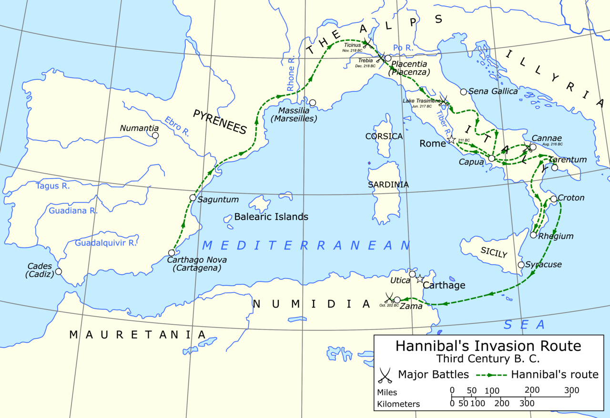
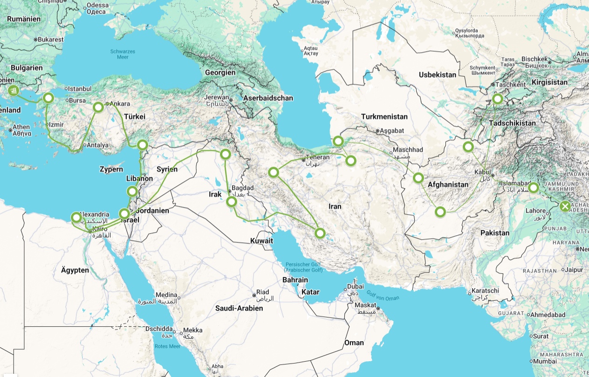
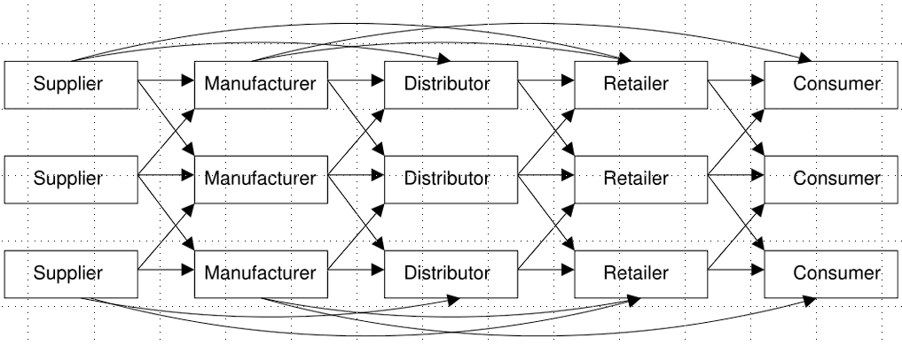
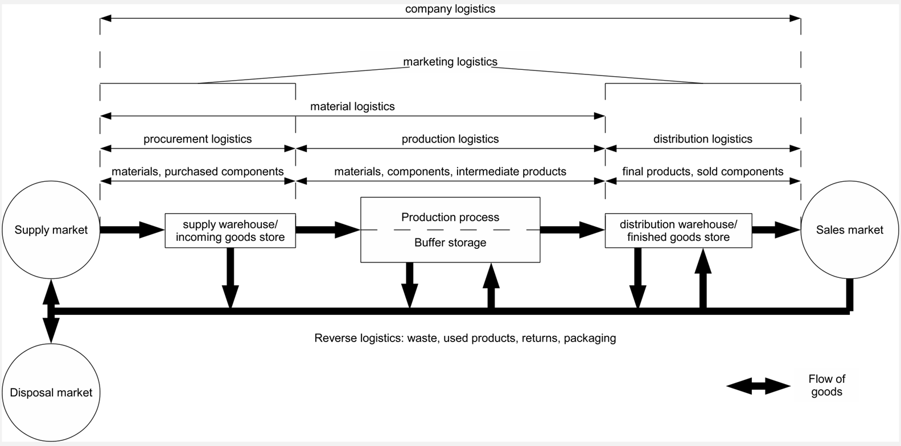

# Part 1: What is a Supply Chain?

## Learning Objectives

After this module, you will be able to:

-   **Define** supply chain and supply chain management
-   **Explain** the three flows in a supply chain
-   **Describe** the SC cycle view and push/pull distinction
-   **Apply** the DuPont framework to SC financial impact
-   **Identify** SC performance dimensions and trade-offs

::: notes
Briefly walk through the module structure. Emphasise that students will
encounter both conceptual frameworks and quantitative tools — the DuPont
analysis in particular links operational decisions directly to financial
returns. Ask students what they already know about supply chains to
activate prior knowledge.
:::

------------------------------------------------------------------------

## Logistics Masterpieces of the Ancient World (I)

### Cheops Pyramid *(2620 BC)*

-   2.3 million stone blocks, avg. 2.5 t each

-   Required coordinated transport, tool inventory, and mass catering
    for \~100,000 workers

-   Quarries in Aswan — over 900 km away

    ::::: columns
    ::: {.column width="45%"}
    [](https://upload.wikimedia.org/wikipedia/commons/e/e3/Kheops-Pyramid.jpg)
    :::

    ::: {.column width="45%"}
    [](https://www.secretofthepyramids.com/)
    :::
    :::::

------------------------------------------------------------------------

## Logistics Masterpieces of the Ancient World (II)

### Hannibal's Alpine Crossing *(218 BC)*

-   37 war elephants + 40,000 troops

-   Multi-modal: sea, mountain, river

-   Supply lines stretched from Carthage to the Po Valley

    ::::: columns
    ::: {.column width="45%"}
    
    :::

    ::: {.column width="45%"}
    
    :::
    :::::

------------------------------------------------------------------------

## Logistics Masterpieces of the Ancient World (III)

### Alexander's Campaign *(334–323 BC)*

-   25,000+ km over 12 years

-   Continuous replenishment of arms, food, medical supplies

    ::::: columns
    ::: {.column width="45%"}
    
    :::

    ::: {.column width="45%"}
    [](https://exploration.marinersmuseum.org/event/alexander-the-great-interactive-map/)
    :::
    :::::

    :::

> **Key insight**
>
> SCM is not new. Coordinating flows of materials, information, and
> money across distances and time has been a decisive competitive
> advantage since antiquity.

::: notes
Use this slide as a hook. Students often think SCM is a modern corporate
invention. The historical examples illustrate that the core problem —
getting the right thing to the right place at the right time — is
timeless. You can ask: "What would happen to Hannibal's campaign if his
supply chain failed?" The elephants would die, the army would starve.
Same principle applies to a modern production line.
:::

------------------------------------------------------------------------

## What Is a Supply Chain?

::: {.callout-note title="Definition"}
A **supply chain** encompasses all parties involved — directly or
indirectly — in fulfilling a customer request. This includes not only
manufacturers and suppliers, but also transporters, warehouses,
retailers, and customers themselves.

*(Chopra & Meindl, Supply Chain Management, 7th ed.)*
:::

The supply chain includes every stage from raw material extraction to
end-customer delivery — and the reverse logistics flows beyond.

**Hugos (2018) on SCM:** "Supply Chain Management is the coordination of
production, inventory, location, transportation, and information among
the participants in a supply chain to achieve the **best mix of
responsiveness and efficiency** for the market being served."

------------------------------------------------------------------------

## Supply Chain Structures



::: notes
Stress that the definition is deliberately broad — "all parties"
includes actors the firm does not directly control or own. That is
precisely what makes SCM challenging. Ask students: "Is the end consumer
part of the supply chain?" Yes — consumer behaviour drives demand
signals upstream.
:::

------------------------------------------------------------------------

## SC Structure Types {.smaller}

:::: {.columns}

::: {.column width="33%"}
**Focal**

One dominant firm orchestrates all supplier and distribution relationships. High control, high dependency.

*→ Apple, Toyota, Boeing*
:::

::: {.column width="33%"}
**Linear**

Strictly sequential stages — each actor processes and hands off to the next. No bypassing, no parallel flows.

*→ Zara, oil refining, semiconductor fab*
:::

::: {.column width="33%"}
**Polycentric**

Multiple autonomous regional hubs, each running their own supplier networks. Coordination across hubs is lateral.

*→ IKEA, Procter & Gamble, Nestlé*
:::

::::

::: notes
These three archetypes are from Harland (1996) and Choi & Rungtusanatham (1999). In practice, most supply chains are hybrids — e.g. Apple is focal at the product level but linear within the Foxconn assembly pipeline. The distinction matters for risk management: focal chains concentrate risk on one firm; polycentric chains distribute it across hubs.
:::

------------------------------------------------------------------------

## Focal Structure — Apple iPhone

```{r}
#| label: fig-sc-focal
#| fig-cap: >
#|   Focal supply chain structure illustrated by the Apple iPhone.
#|   Apple acts as the single orchestrating firm, coordinating hundreds of
#|   specialised Tier-1 suppliers. All component flows converge on Apple before
#|   reaching the consumer.
#| fig-width: 9
#| fig-height: 5.0
#| fig-alt: >
#|   Hub-and-spoke diagram. Apple (Focal Firm) is at the centre. Six supplier
#|   boxes surround it: TSMC (Chips), Sony (Camera), Samsung (Display),
#|   Foxconn (Assembly), Qualcomm (Modem), Murata (Capacitors). Solid arrows
#|   flow from each supplier into Apple. A solid arrow flows from Apple to
#|   Consumer. A dashed arrow returns from Consumer to Apple indicating demand.
#| echo: false
#| out-width: "100%"

library(ggplot2)
library(grid)

col_purple <- "#361E47"; col_violet <- "#5E3EE1"
col_lgray  <- "#F4F1F6"; col_gray   <- "#D8D1DB"

node_box <- function(cx, cy, w, h, fill, border, label, lsize = 2.5) {
  list(
    annotate("rect", xmin=cx-w/2, xmax=cx+w/2, ymin=cy-h/2, ymax=cy+h/2,
             fill=fill, color=border, linewidth=0.55),
    annotate("text", x=cx, y=cy, label=label, size=lsize, color=border,
             fontface="bold", hjust=0.5, vjust=0.5, lineheight=0.88)
  )
}

arr <- function(x1,y1,x2,y2,col,ltype="solid",lw=0.9,atype="closed",aends="last",alen=0.18)
  annotate("segment",x=x1,xend=x2,y=y1,yend=y2,color=col,linewidth=lw,linetype=ltype,
           arrow=arrow(length=unit(alen,"cm"),type=atype,ends=aends))

cx <- 0.50; cy <- 0.50; r <- 0.30; bw <- 0.13; bh <- 0.085

suppliers <- data.frame(
  label = c("TSMC\n(Chips)","Sony\n(Camera)","Samsung\n(Display)",
            "Foxconn\n(Assembly)","Qualcomm\n(Modem)","Murata\n(Capacitors)"),
  angle = c(150, 210, 270, 330, 30, 90))
suppliers$sx <- cx + r * cos(suppliers$angle * pi/180)
suppliers$sy <- cy + r * sin(suppliers$angle * pi/180)

ggplot() +
  annotate("rect", xmin=0,xmax=1,ymin=0,ymax=1, fill=col_lgray,color=NA) +
  annotate("rect", xmin=0.33,xmax=0.67,ymin=0.33,ymax=0.67,
           fill="white",color=col_purple,linewidth=0.3,linetype="dashed") +

  # Supplier → Apple arrows
  {lapply(seq_len(nrow(suppliers)), function(i) {
    s <- suppliers[i,]
    dx <- cx-s$sx; dy <- cy-s$sy; len <- sqrt(dx^2+dy^2)
    ux <- dx/len; uy <- dy/len
    arr(s$sx+ux*bw*1.1, s$sy+uy*bh*1.1, cx-ux*0.062, cy-uy*0.062,
        col_purple, lw=0.75)
  })} +

  # Apple → Consumer
  arr(cx+0.062, cy, 0.91, cy, col_purple, lw=1.1) +
  # Consumer → Apple (demand signal)
  arr(0.91, cy+0.018, cx+0.065, cy+0.018,
      col_violet, ltype="dashed", lw=0.7, aends="last") +

  # Supplier boxes
  {lapply(seq_len(nrow(suppliers)), function(i) {
    s <- suppliers[i,]
    node_box(s$sx, s$sy, bw, bh, fill=col_lgray, border=col_purple,
             label=s$label, lsize=2.0)
  })} +

  # Apple box
  annotate("rect", xmin=cx-0.06,xmax=cx+0.06,ymin=cy-0.05,ymax=cy+0.05,
           fill=col_purple,color=col_purple,linewidth=0.55) +
  annotate("text", x=cx, y=cy, label="Apple\n(Focal Firm)",
           size=2.4, color="white", fontface="bold", hjust=0.5, vjust=0.5, lineheight=0.88) +

  # Consumer box
  annotate("rect", xmin=0.88,xmax=0.98,ymin=cy-0.04,ymax=cy+0.04,
           fill=col_lgray,color=col_purple,linewidth=0.55) +
  annotate("text", x=0.93, y=cy, label="Consumer",
           size=2.0,color=col_purple,fontface="bold") +

  # Title & labels
  annotate("text", x=0.04,y=0.96, label="Focal SC structure",
           hjust=0,vjust=1,size=3.0,color=col_purple,fontface="bold") +
  annotate("text", x=0.04,y=0.90, label="Example: Apple iPhone supply chain",
           hjust=0,vjust=1,size=2.3,color=col_violet,fontface="italic") +

  # Legend
  annotate("segment",x=0.05,xend=0.12,y=0.05,yend=0.05,color=col_purple,
           linewidth=0.85,linetype="solid",
           arrow=arrow(length=unit(0.13,"cm"),type="closed",ends="last")) +
  annotate("text",x=0.13,y=0.05,hjust=0,size=1.9,color=col_purple,
           label="Material / components") +
  annotate("segment",x=0.45,xend=0.52,y=0.05,yend=0.05,color=col_violet,
           linewidth=0.75,linetype="dashed",
           arrow=arrow(length=unit(0.13,"cm"),type="closed",ends="last")) +
  annotate("text",x=0.53,y=0.05,hjust=0,size=1.9,color=col_violet,
           label="Demand / order signal") +

  scale_x_continuous(limits=c(0,1),expand=c(0,0)) +
  scale_y_continuous(limits=c(0,1),expand=c(0,0)) +
  theme_void() +
  theme(plot.background=element_rect(fill="white",color=NA),
        plot.margin=margin(4,4,4,4))
```

::: notes
Apple exemplifies the focal model. Tim Cook transformed Apple's supply chain from a loosely managed network into a tightly controlled hub. Apple does not manufacture — it designs, orchestrates, and controls. Key levers: exclusive contracts with TSMC (A-series chips), deep integration with Foxconn (assembly), strategic pre-payments to lock preferred supply. Apple holds enormous power over Tier-1 suppliers, but this creates concentration risk — as seen in 2022 Zhengzhou factory disruptions.
:::

------------------------------------------------------------------------

## Linear Structure — Fast Fashion (Zara)

```{r}
#| label: fig-sc-linear
#| fig-cap: >
#|   Linear supply chain structure illustrated by Zara (Inditex).
#|   Six sequential production stages link raw material extraction to retail.
#|   Each stage adds value and passes output to the next — no stage can be
#|   bypassed.
#| fig-width: 9
#| fig-height: 5.0
#| fig-alt: >
#|   Six boxes arranged in a horizontal chain connected by rightward arrows:
#|   Raw Materials → Fibre Spinning → Weaving & Dyeing → Cut & Sew →
#|   Distribution Centre → Retail Store. Each box shows example actors below.
#|   A characteristics panel below the chain lists sequential stages,
#|   one-direction flow, no bypassing steps, and approx. 40-week lead time.
#| echo: false
#| out-width: "100%"

library(ggplot2)
library(grid)

col_purple <- "#361E47"; col_violet <- "#5E3EE1"
col_lgray  <- "#F4F1F6"; col_gray   <- "#D8D1DB"

stages  <- c("Raw\nMaterials","Fibre\nSpinning","Weaving &\nDyeing",
             "Cut &\nSew","Distribution\nCentre","Retail\nStore")
details <- c("Cotton,\nPolyester","Yarn\nproduction","Fabric\nfinishing",
             "Bangladesh,\nMorocco","Arteixo,\nSpain","2,100+\nstores")
n  <- length(stages); bw <- 0.11; bh <- 0.10
xs <- seq(0.08, 0.92, length.out=n); y0 <- 0.60; gap <- 0.008

ggplot() +
  annotate("rect",xmin=0,xmax=1,ymin=0,ymax=1,fill=col_lgray,color=NA) +
  annotate("rect",xmin=0.02,xmax=0.98,ymin=y0-0.18,ymax=y0+0.18,
           fill="white",color=col_gray,linewidth=0.3,linetype="dashed") +

  # Arrows between boxes
  {lapply(seq_len(n-1), function(i)
    annotate("segment",x=xs[i]+bw/2+gap,xend=xs[i+1]-bw/2-gap,y=y0,yend=y0,
             color=col_purple,linewidth=0.95,linetype="solid",
             arrow=arrow(length=unit(0.18,"cm"),type="closed",ends="last"))
  )} +

  # Stage boxes (purple fill)
  {lapply(seq_len(n), function(i)
    annotate("rect",xmin=xs[i]-bw/2,xmax=xs[i]+bw/2,ymin=y0-bh/2,ymax=y0+bh/2,
             fill=col_purple,color=col_purple,linewidth=0.55)
  )} +

  # Stage labels (white text)
  {lapply(seq_len(n), function(i)
    annotate("text",x=xs[i],y=y0,label=stages[i],
             size=1.85,color="white",fontface="bold",hjust=0.5,vjust=0.5,lineheight=0.88)
  )} +

  # Detail labels below
  {lapply(seq_len(n), function(i)
    annotate("text",x=xs[i],y=y0-0.155,label=details[i],
             size=1.7,color=col_purple,hjust=0.5,vjust=1,lineheight=0.85)
  )} +

  # Stage numbers above
  {lapply(seq_len(n), function(i)
    annotate("text",x=xs[i],y=y0+0.145,label=paste0("Stage ",i),
             size=1.6,color=col_violet,hjust=0.5,fontface="italic")
  )} +

  # Title
  annotate("text",x=0.04,y=0.97,label="Linear SC structure",
           hjust=0,vjust=1,size=3.0,color=col_purple,fontface="bold") +
  annotate("text",x=0.04,y=0.91,label="Example: Zara / fast fashion",
           hjust=0,vjust=1,size=2.3,color=col_violet,fontface="italic") +

  # Characteristics panel
  annotate("rect",xmin=0.03,xmax=0.97,ymin=0.04,ymax=0.26,
           fill="white",color=col_gray,linewidth=0.4) +
  annotate("text",x=0.50,y=0.24,label="Characteristics",
           size=2.2,color=col_purple,fontface="bold",hjust=0.5) +
  annotate("text",x=0.17,y=0.16,label="Sequential stages",     size=1.9,color=col_purple,hjust=0.5) +
  annotate("text",x=0.17,y=0.10,label="One-direction flow",    size=1.9,color=col_purple,hjust=0.5) +
  annotate("text",x=0.50,y=0.16,label="No bypassing steps",    size=1.9,color=col_purple,hjust=0.5) +
  annotate("text",x=0.50,y=0.10,label="Clear stage handoffs",  size=1.9,color=col_purple,hjust=0.5) +
  annotate("text",x=0.83,y=0.16,label="Long lead times",       size=1.9,color=col_purple,hjust=0.5) +
  annotate("text",x=0.83,y=0.10,label="~40 weeks end-to-end",  size=1.9,color=col_purple,hjust=0.5) +

  scale_x_continuous(limits=c(0,1),expand=c(0,0)) +
  scale_y_continuous(limits=c(0,1),expand=c(0,0)) +
  theme_void() +
  theme(plot.background=element_rect(fill="white",color=NA),
        plot.margin=margin(4,4,4,4))
```

::: notes
The fashion pipeline is the textbook linear chain. A t-shirt can take 40+ weeks from cotton field to store shelf. Zara disrupted this by shortening stage 3–4 (keeping design/cutting close to Spain) and air-freighting finished garments, compressing the cycle to ~2–3 weeks for replenishment. This illustrates that the linear structure is not immutable — firms can compress individual stages. The key insight: *the weakest link sets the speed of the entire chain.*
:::

------------------------------------------------------------------------

## Polycentric Structure — IKEA

```{r}
#| label: fig-sc-polycentric
#| fig-cap: >
#|   Polycentric supply chain structure illustrated by IKEA's global network.
#|   Three autonomous regional hubs (Europe, Asia-Pacific, Americas) each manage
#|   their own supplier base and serve local markets. Lateral coordination links
#|   the hubs.
#| fig-width: 9
#| fig-height: 5.0
#| fig-alt: >
#|   Three vertical sub-chains arranged side by side. Each sub-chain shows
#|   local suppliers at the top feeding into a regional hub (Europe Hub in
#|   Almhult, Asia-Pacific Hub in Shanghai, Americas Hub in Baltimore), which
#|   feeds retail stores below. Dashed bidirectional arrows connect the three
#|   hubs laterally for coordination.
#| echo: false
#| out-width: "100%"

library(ggplot2)
library(grid)

col_purple <- "#361E47"; col_violet <- "#5E3EE1"
col_lgray  <- "#F4F1F6"; col_gray   <- "#D8D1DB"

arr <- function(x1,y1,x2,y2,col,ltype="solid",lw=0.9,atype="closed",aends="last",alen=0.16)
  annotate("segment",x=x1,xend=x2,y=y1,yend=y2,color=col,linewidth=lw,linetype=ltype,
           arrow=arrow(length=unit(alen,"cm"),type=atype,ends=aends))

hub_x <- c(0.22, 0.50, 0.78); hub_y <- 0.55
hub_labels <- c("Europe Hub\n(Älmhult, SE)","Asia-Pacific Hub\n(Shanghai, CN)","Americas Hub\n(Baltimore, US)")
bw_hub <- 0.14; bh_hub <- 0.10; bw_sup <- 0.08; bh_sup <- 0.07; bw_str <- 0.11; bh_str <- 0.07

sup_labels  <- list(c("Sweden","Poland","Germany"),c("China","Vietnam","India"),c("USA","Canada","Mexico"))
store_labels <- list("450+\nEurope stores","60+\nAsia stores","55+\nAmericas stores")

sup_y <- 0.84; store_y <- 0.24

ggplot() +
  annotate("rect",xmin=0,xmax=1,ymin=0,ymax=1,fill=col_lgray,color=NA) +

  # Inter-hub coordination (dashed, bidirectional)
  arr(hub_x[1]+bw_hub/2+0.01, hub_y, hub_x[2]-bw_hub/2-0.01, hub_y,
      col_violet,ltype="dashed",lw=0.65,aends="both",atype="open") +
  arr(hub_x[2]+bw_hub/2+0.01, hub_y, hub_x[3]-bw_hub/2-0.01, hub_y,
      col_violet,ltype="dashed",lw=0.65,aends="both",atype="open") +

  # Supplier arrows & boxes
  {do.call(c, lapply(1:3, function(h) {
    sups <- sup_labels[[h]]
    ns   <- length(sups)
    sxs  <- hub_x[h] + seq(-(ns-1),(ns-1),by=2) * 0.075
    c(
      lapply(sxs, function(sx)
        arr(sx, sup_y-bh_sup/2-0.005,
            hub_x[h]+(sx-hub_x[h])*0.3, hub_y+bh_hub/2+0.005,
            col_purple,lw=0.6)),
      lapply(seq_along(sxs), function(j) list(
        annotate("rect",xmin=sxs[j]-bw_sup/2,xmax=sxs[j]+bw_sup/2,
                 ymin=sup_y-bh_sup/2,ymax=sup_y+bh_sup/2,
                 fill="white",color=col_purple,linewidth=0.5),
        annotate("text",x=sxs[j],y=sup_y,label=sups[j],
                 size=1.7,color=col_purple,fontface="bold",hjust=0.5,vjust=0.5)
      ))
    )
  }))} +

  # Hub → Store arrows
  {lapply(1:3, function(h)
    arr(hub_x[h], hub_y-bh_hub/2-0.005, hub_x[h], store_y+bh_str/2+0.005,
        col_purple,lw=0.8)
  )} +

  # Store boxes
  {lapply(1:3, function(h) list(
    annotate("rect",xmin=hub_x[h]-bw_str/2,xmax=hub_x[h]+bw_str/2,
             ymin=store_y-bh_str/2,ymax=store_y+bh_str/2,
             fill=col_violet,color=col_violet,linewidth=0.55),
    annotate("text",x=hub_x[h],y=store_y,label=store_labels[[h]],
             size=1.75,color="white",fontface="bold",hjust=0.5,vjust=0.5,lineheight=0.85)
  ))} +

  # Hub boxes (on top)
  {lapply(1:3, function(h) list(
    annotate("rect",xmin=hub_x[h]-bw_hub/2,xmax=hub_x[h]+bw_hub/2,
             ymin=hub_y-bh_hub/2,ymax=hub_y+bh_hub/2,
             fill=col_purple,color=col_purple,linewidth=0.55),
    annotate("text",x=hub_x[h],y=hub_y,label=hub_labels[h],
             size=1.9,color="white",fontface="bold",hjust=0.5,vjust=0.5,lineheight=0.85)
  ))} +

  # Row labels
  annotate("text",x=0.50,y=0.94,label="Tier-1 Suppliers",
           size=1.9,color=col_purple,hjust=0.5,fontface="italic") +
  annotate("text",x=0.50,y=0.62,label="Regional Hubs",
           size=1.9,color=col_purple,hjust=0.5,fontface="italic") +
  annotate("text",x=0.50,y=0.155,label="Retail Stores",
           size=1.9,color=col_violet,hjust=0.5,fontface="italic") +

  # Title
  annotate("text",x=0.04,y=0.99,label="Polycentric SC structure",
           hjust=0,vjust=1,size=3.0,color=col_purple,fontface="bold") +
  annotate("text",x=0.04,y=0.92,label="Example: IKEA global network",
           hjust=0,vjust=1,size=2.3,color=col_violet,fontface="italic") +

  # Legend
  annotate("segment",x=0.05,xend=0.11,y=0.07,yend=0.07,color=col_purple,
           linewidth=0.85,linetype="solid",
           arrow=arrow(length=unit(0.12,"cm"),type="closed",ends="last")) +
  annotate("text",x=0.12,y=0.07,hjust=0,size=1.8,color=col_purple,label="Material flow") +
  annotate("segment",x=0.36,xend=0.42,y=0.07,yend=0.07,color=col_violet,
           linewidth=0.7,linetype="dashed",
           arrow=arrow(length=unit(0.12,"cm"),type="open",ends="both")) +
  annotate("text",x=0.43,y=0.07,hjust=0,size=1.8,color=col_violet,label="Inter-hub coordination") +

  scale_x_continuous(limits=c(0,1),expand=c(0,0)) +
  scale_y_continuous(limits=c(0,1),expand=c(0,0)) +
  theme_void() +
  theme(plot.background=element_rect(fill="white",color=NA),
        plot.margin=margin(4,4,4,4))
```

::: notes
IKEA has ~1,800 suppliers in 50 countries but organises them into three largely independent regional sourcing hubs. The Europe hub (anchored in Älmhult, Sweden) handles 60% of volume; Asia-Pacific (Shanghai) ~25%; Americas ~15%. Each hub has its own Trading Service Offices that negotiate independently. The hubs coordinate on assortment range and quality standards but NOT on purchasing — this deliberate autonomy reduces systemic risk. Polycentric structures sacrifice some economies of scale for resilience and speed-to-market in local regions.
:::

------------------------------------------------------------------------

## Supply Chains & Logistics



::: notes
Differences between SC and Logistics: Focus on physical distribution
(logistics) vs. management of physical, monetary and information flows
(SCM)
:::

------------------------------------------------------------------------

## The Three Flows

```{r}
#| label: fig-scm-flows
#| fig-cap: >
#|   Material, information, and cash flows in a multi-echelon supply chain.
#|   Goods flow downstream (supplier → consumer); orders and demand signals
#|   flow bidirectionally; payments flow upstream.
#| fig-width: 9
#| fig-height: 3.5
#| fig-alt: >
#|   Diagram of a five-echelon supply chain (Supplier – Manufacturer –
#|   Distributor – Retailer – Consumer) showing three parallel flows:
#|   solid arrows for material/goods (left to right), dashed bidirectional
#|   arrows for information/orders, and dotted arrows for cash/payments
#|   (right to left).
#| echo: false

library(ggplot2)
library(grid)

# ── HSRM brand colors ─────────────────────────────────────────────────────────
col_mat  <- "#361E47"   # dark purple — material / goods
col_info <- "#5E3EE1"   # violet      — information / orders
col_cash <- "#A42564"   # berry       — cash / payments

# ── Canvas: x ∈ [0,1], y ∈ [0,1] ─────────────────────────────────────────────
labels <- c("Supplier", "Manufacturer", "Distributor", "Retailer", "Consumer")
n      <- length(labels)

# Horizontal layout
margin <- 0.10          # canvas left/right margin
bw     <- 0.040         # box half-width
gap    <- 0.008         # gap between box edge and arrow

s      <- (1 - 2 * margin) / (n - 1)
node_x <- margin + (0:(n - 1)) * s

# Vertical layout — three well-separated bands
y_mat  <- 0.82   # material flow lane
y_node <- 0.50   # node centre + information flow
y_cash <- 0.18   # cash flow lane
bh     <- 0.085  # box half-height (small enough not to enter adjacent lanes)

# Stub termination points (slightly inside the flow lane)
top_stub <- y_mat  - 0.05
bot_stub <- y_cash + 0.05

# ── Horizontal segments (built explicitly — no transform() fragility) ──────────
make_hsegs <- function(y_val) {
  do.call(rbind, lapply(seq_len(n - 1), function(i) {
    data.frame(
      x    = node_x[i]   + bw + gap,
      xend = node_x[i+1] - bw - gap,
      y    = y_val,
      yend = y_val
    )
  }))
}
seg_mat  <- make_hsegs(y_mat)
seg_info <- make_hsegs(y_node)
seg_cash <- make_hsegs(y_cash)

# ── Vertical connector stubs (box top/bottom ↔ flow lane) ─────────────────────
xr <- node_x[-n] + bw
xl <- node_x[-1] - bw

mat_stubs  <- data.frame(x = c(xr, xl), y = y_node + bh, yend = top_stub)
cash_stubs <- data.frame(x = c(xr, xl), y = bot_stub,     yend = y_node - bh)

nodes_df <- data.frame(x = node_x, label = labels)

# ── Build plot ────────────────────────────────────────────────────────────────
ggplot() +

  # Shaded background lanes
  annotate("rect", xmin = 0, xmax = 1,
           ymin = y_mat  - 0.06, ymax = y_mat  + 0.06,
           fill = col_mat,  alpha = 0.08) +
  annotate("rect", xmin = 0, xmax = 1,
           ymin = y_node - bh - 0.01, ymax = y_node + bh + 0.01,
           fill = col_info, alpha = 0.04) +
  annotate("rect", xmin = 0, xmax = 1,
           ymin = y_cash - 0.06, ymax = y_cash + 0.06,
           fill = col_cash, alpha = 0.08) +

  # Vertical stubs — material (solid)
  geom_segment(data = mat_stubs,
               aes(x = x, xend = x, y = y, yend = yend),
               color = col_mat, linewidth = 0.4, linetype = "solid") +

  # Vertical stubs — cash (dotted)
  geom_segment(data = cash_stubs,
               aes(x = x, xend = x, y = y, yend = yend),
               color = col_cash, linewidth = 0.4, linetype = "dotted") +

  # Material flow: solid arrow L→R
  geom_segment(data = seg_mat,
               aes(x = x, xend = xend, y = y, yend = yend),
               color = col_mat, linewidth = 1.0, linetype = "solid",
               arrow = arrow(length = unit(0.20, "cm"),
                             type = "closed", ends = "last")) +

  # Information flow: dashed, bidirectional
  geom_segment(data = seg_info,
               aes(x = x, xend = xend, y = y, yend = yend),
               color = col_info, linewidth = 0.8, linetype = "dashed",
               arrow = arrow(length = unit(0.18, "cm"),
                             type = "open", ends = "both")) +

  # Cash flow: dotted, R→L
  geom_segment(data = seg_cash,
               aes(x = x, xend = xend, y = y, yend = yend),
               color = col_cash, linewidth = 1.0, linetype = "dotted",
               arrow = arrow(length = unit(0.20, "cm"),
                             type = "open", ends = "first")) +

  # Node boxes (drawn on top of stubs and shading)
  geom_rect(data = nodes_df,
            aes(xmin = x - bw, xmax = x + bw,
                ymin = y_node - bh, ymax = y_node + bh),
            fill = "white", color = col_mat, linewidth = 0.6) +

  # Node labels
  geom_text(data = nodes_df,
            aes(x = x, y = y_node, label = label),
            size = 2.3, color = col_mat, fontface = "bold") +

  # Lane labels (left margin, outside nodes)
  annotate("text", x = -0.02, y = y_mat,
           label = "Material\nflow",    size = 2.1, hjust = 1,
           color = col_mat,  fontface = "bold", lineheight = 0.85) +
  annotate("text", x = -0.02, y = y_node,
           label = "Information\nflow", size = 2.1, hjust = 1,
           color = col_info, fontface = "bold", lineheight = 0.85) +
  annotate("text", x = -0.02, y = y_cash,
           label = "Cash\nflow",        size = 2.1, hjust = 1,
           color = col_cash, fontface = "bold", lineheight = 0.85) +

  # Legend strip
  annotate("segment", x = 0.08, xend = 0.17, y = 0.04, yend = 0.04,
           color = col_mat, linewidth = 0.85, linetype = "solid",
           arrow = arrow(length = unit(0.13, "cm"), type = "closed", ends = "last")) +
  annotate("text", x = 0.18, y = 0.04, hjust = 0, size = 2.0,
           color = col_mat, label = "Material / goods flow") +

  annotate("segment", x = 0.40, xend = 0.49, y = 0.04, yend = 0.04,
           color = col_info, linewidth = 0.75, linetype = "dashed",
           arrow = arrow(length = unit(0.13, "cm"), type = "open", ends = "both")) +
  annotate("text", x = 0.50, y = 0.04, hjust = 0, size = 2.0,
           color = col_info, label = "Information / order flow") +

  annotate("segment", x = 0.72, xend = 0.81, y = 0.04, yend = 0.04,
           color = col_cash, linewidth = 0.8, linetype = "dotted",
           arrow = arrow(length = unit(0.13, "cm"), type = "open", ends = "first")) +
  annotate("text", x = 0.82, y = 0.04, hjust = 0, size = 2.0,
           color = col_cash, label = "Cash / payment flow") +

  scale_x_continuous(limits = c(-0.14, 1.01), expand = c(0, 0)) +
  scale_y_continuous(limits = c(0, 1), expand = c(0, 0)) +
  theme_void() +
  theme(
    plot.background = element_rect(fill = "white", color = NA),
    plot.margin     = margin(4, 8, 4, 4)
  )
```

Every supply chain manages **three flows simultaneously**:

| Flow | Direction | Examples |
|------------------|-----------------------------|-------------------------|
| **Material / Product** | Downstream ↓ | Raw materials, WIP, finished goods, returns |
| **Information** | Both directions ↕ | Forecasts, purchase orders, capacity data, POS data |
| **Financial** | Upstream ↑ | Payments, credit terms, revenue sharing, penalties |

::: {.callout-tip title="Management Insight"}
Disruptions in **any** flow cascade through the entire chain.

The COVID-19 pandemic demonstrated how information flow breakdowns
(opacity about real demand) amplified material shortages — the bullwhip
effect in its most extreme form. Semiconductor shortages in 2021–22 were
worsened by panic ordering that no one in the chain could see clearly.
:::

::: notes
Draw the three flows on the board as arrows. Ask students: "Which flow
is usually managed best? Which is usually managed worst?" Information is
typically the most neglected — firms invest heavily in physical
logistics but underinvest in information sharing. Financial flows are
often separated into a different department (treasury/AP) which creates
coordination problems.
:::

------------------------------------------------------------------------

## The Cycle View of Supply Chains

SC processes are organised as **four nested cycles** (Chopra & Meindl):

::::: columns
::: {.column width="55%"}
**1. Customer Order Cycle** Retailer ↔ Customer — triggered by actual
demand

**2. Replenishment Cycle** Distributor ↔ Retailer — triggered by
inventory level

**3. Manufacturing Cycle** Manufacturer ↔ Distributor — batch production
trigger

**4. Procurement Cycle** Supplier ↔ Manufacturer — material sourcing

Each cycle follows the same sub-process: **Order → Supply → Receive**
:::

::: {.column width="45%"}
```         
┌─────────────────────────┐
│   Customer Order Cycle  │  ← customer
│  ┌───────────────────┐  │
│  │ Replenishment     │  │  ← retailer
│  │  ┌─────────────┐  │  │
│  │  │ Manufact.   │  │  │  ← distributor
│  │  │  ┌───────┐  │  │  │
│  │  │  │Procur.│  │  │  │  ← manufacturer
│  │  │  └───────┘  │  │  │
│  │  └─────────────┘  │  │
│  └───────────────────┘  │
└─────────────────────────┘
```
:::
:::::

::: {.callout-note title="Why the Cycle View Matters"}
Each cycle has **different actors, time horizons, and decision
variables**. Distinguishing them prevents confusion between, e.g., order
replenishment policies and production lot-sizing decisions.
:::

::: notes
The cycle view is complementary to the push/pull view (next slide). The
cycle view focuses on *who* interacts *with whom*; the push/pull view
focuses on *when* demand information is used. Chopra & Meindl use both
frameworks — make sure students understand the two perspectives are not
competing.
:::

------------------------------------------------------------------------

## Push vs. Pull — The Decoupling Point

|                           | **Push**               | **Pull**                 |
|-------------------------|-----------------------|------------------------|
| **Basis**                 | Forecast               | Actual demand            |
| **Inventory position**    | Higher (pre-built)     | Lower (built to order)   |
| **Lead time to customer** | Short                  | Longer                   |
| **Primary risk**          | Overstock / understock | Stockout / slow response |
| **Cost driver**           | Inventory holding      | Capacity flexibility     |

**Manufacturing strategy spectrum** — the decoupling point moves
upstream:

```         
MTS ──────────── ATO ──────────── MTO ──────────── ETO
Make-to-Stock  Assemble-to-Order  Make-to-Order  Engineer-to-Order
   (Push)           (Hybrid)          (Pull)         (Pull)
```

::: {.callout-tip title="Real-World Example"}
**Dell (1990s):** Revolutionised PC manufacturing by shifting from MTS
to MTO — customers configured online, components sourced on demand.
Inventory turns went from \~20 days to \~4 days, generating massive
working capital savings. Competitors Compaq and HP took years to
respond.
:::

::: notes
Ask students to name the decoupling point position for IKEA (mostly MTS
— flat-pack products pre-produced), a custom industrial machine
manufacturer (ETO), and a fast-food burger chain (ATO — burger assembled
from pre-made components when ordered). This exercise solidifies the
concept. The key trade-off: responsiveness vs. efficiency, which we will
revisit in Module 2 as the strategic fit framework.
:::

------------------------------------------------------------------------

## Exercise 1.1 — Mapping a Supply Chain {background-color="#361E47"}

**Group exercise (3 persons, 10 minutes)**

Choose **one** product:

:::::: columns
::: {.column width="33%"}
**Option A**

IKEA LACK side table *(flat-pack furniture)*
:::

::: {.column width="33%"}
**Option B**

Ritter Sport hazelnut chocolate *(FMCG food product)*
:::

::: {.column width="33%"}
**Option C**

Canyon Endurace CF 7 road bike *(direct-to-consumer)*
:::
::::::

**For your chosen product, describe:**

1.  Key raw materials and major production steps
2.  Approximate geographic locations of each SC stage
3.  Logistics processes and transport modes connecting stages
4.  Classify the SC structure:
    -   **Hierarchical-pyramidal** (one dominant orchestrator)
    -   **Polycentric / network** (multiple equal partners)

**Present your findings in 5 minutes.**

::: notes
Walk around during group work. Common mistakes: students focus only on
the physical product flow and forget information and financial flows.
Prompt groups to consider: "Who sends demand forecasts upstream? Who
pays whom, and on what credit terms?" For the Canyon bike, note the
disintermediation — Canyon sells direct, bypassing traditional
retailers. What are the SC implications?
:::

------------------------------------------------------------------------

# Part 2: SC Goals and Trade-offs {background-color="#5E3EE1"}

## The SC Profit Equation

::: {.callout-note title="Core Principle"}
**SC Profit = Customer Revenue − Total SC Cost (all partners combined)**
:::

::::: columns
::: {.column width="55%"}
**The double-marginalisation problem:**

When each SC partner maximises *own* profit independently, the result is
**sub-optimal for the chain as a whole**.

-   Each adds its own mark-up
-   Each holds safety stock independently
-   Information is not shared freely

→ Total SC cost is higher than if the chain were one integrated firm.

**Solution approaches:**

-   Vendor-managed inventory (VMI)
-   Revenue sharing contracts
-   Collaborative planning (CPFR)
:::

::: {.column width="45%"}
**DuPont decomposition links SC decisions to ROI:**

```         
         Net Income
ROI = ─────────────────
         Total Assets

     Profit Margin × Asset Turnover

Profit Margin:
  ↑ Reduce transport, inventory costs

Asset Turnover:
  ↑ Reduce inventory (working capital)
  ↑ Reduce fixed assets (outsourcing)
```
:::
:::::

::: notes
The DuPont link is crucial for building a business case for SC
investments. Students need to understand that a logistics manager who
reduces inventory by €1 million is not just saving storage cost — they
are improving the firm's return on assets. This is the language of the
CFO, and SC managers need to speak it. The double marginalisation
problem is a classic result from game theory / industrial organisation —
you may want to explain it with a simple 2-player numerical example.
:::

------------------------------------------------------------------------

## Exercise 1.2 — DuPont Analysis {background-color="#361E47"}

**FabCo GmbH — Annual Financial Data (€ thousands)**

| Income Statement |        | Balance Sheet |       |
|------------------|--------|---------------|-------|
| Revenue          | 11,000 | Fixed assets  | 2,000 |
| Material costs   | 5,500  | Cash          | 500   |
| Personnel costs  | 4,950  | Inventory     | 3,300 |
|                  |        | Receivables   | 1,075 |

**Tasks:**

1.  Build the full **DuPont schema** and calculate ROI *(ROI = Net
    Income / Total Assets)*
2.  What is the ROI impact of a **5% inventory reduction**?
3.  What happens if **transport costs rise by €200k** (shift from
    material to operating cost)?
4.  Which lever has the greater ROI impact — inventory reduction or
    transport optimisation? Why?

::: {.callout-tip title="Hint"}
Net Income = Revenue − Material − Personnel. Total Assets = Fixed
assets + Cash + Inventory + Receivables.
:::

::: notes
Expected results: Net Income = 550; Total Assets = 6,875; ROI = 8.0%.
With 5% inventory reduction (−165): Total Assets = 6,710; ROI = 8.2%.
With transport cost +200: Net Income = 350; ROI = 5.1%. This shows
inventory reduction has a smaller absolute ROI impact than a cost spike
— useful for discussing the asymmetry between cost reduction and cost
increase scenarios. Extend to discuss: what if we could reduce
receivables as well (supply chain finance)?
:::

------------------------------------------------------------------------

## SC Performance Dimensions

**Traditional logistics service metrics:**

| Dimension | Definition | Typical KPI |
|-----------------------|-----------------------|---------------------------|
| **Delivery time** | Order-to-delivery lead time | Average LT in days |
| **Delivery reliability** | \% orders on time | OTIF (On Time In Full) |
| **Delivery quality** | \% damage-free, complete orders | Perfect Order Rate |
| **Flexibility / Resilience** | Response to short-notice demand changes | \% urgent orders fulfilled |
| **Information quality** | Transparency across all order phases | Track & trace coverage |
| **Cost** | Efficiency of all logistics activities | Cost per unit shipped |

::: {.callout-tip title="The Trade-off Space"}
Improving one dimension often **degrades another**:

-   Higher reliability → higher inventory → higher cost
-   Faster delivery → more frequent shipments → higher transport cost
-   More flexibility → lower utilisation → higher unit cost

**Strategic choices determine where on this trade-off surface the firm
positions itself.**
:::

::: notes
Industry context: Amazon has systematically pushed the trade-off
frontier outward — they deliver faster AND at lower cost by investing in
network density and automation. This is not a free lunch; it requires
enormous capital. For most firms, the trade-off is real. Ask students:
"What does a German B2B industrial components supplier prioritise?"
Likely reliability and quality over speed, at a cost premium. Compare to
a fast-fashion retailer.
:::

------------------------------------------------------------------------

## Customer Service Dimensions {.smaller}

**Three phases of the buyer–seller transaction** *(La Londe & Zinszer 1976)*

:::::: columns
::: {.column width="32%"}
**① Pre-Transaction**

*Setting the service environment*

-   Written service policy (e.g. 98% OTIF target)
-   Accessibility — single point of contact
-   Organisational structure — CS authority
-   System flexibility — adapting to special requirements
:::

::: {.column width="34%"}
**② Transaction**

*Order fulfilment execution*

-   **Order fill rate** — % shipped complete
-   **Order cycle time** — placement → delivery
-   **Delivery reliability** — on-time consistency
-   Order accuracy — right product & qty
-   Order convenience — EDI, MOQ, consolidation
:::

::: {.column width="32%"}
**③ Post-Transaction**

*Relationship & support*

-   Shipment tracking & visibility
-   Returns management (reverse logistics)
-   Spare parts availability
-   Complaint & claims handling
-   Product tracing & warranty
:::
::::::

::: {.callout-tip title="Key Insight"}
**Pre-transaction** elements are largely invisible to the customer — until they fail.
**Transaction** elements are operationally intensive and directly drive cost.
**Post-transaction** elements are disproportionately remembered and drive loyalty.
:::

::: notes
Source: La Londe & Zinszer (1976), adopted by Christopher (2005) and Chopra & Meindl.
The three-phase structure is useful because it shifts the conversation from pure logistics metrics to the full customer experience arc. Upstream (pre-transaction) is about designing the right service system; the transaction phase is operational execution; post-transaction is relationship management and loyalty. Ask students: which phase do most companies invest in? (Answer: transaction) — and which phase do customers remember most? (Answer: post-transaction — the "service recovery paradox" shows that a well-handled complaint can create more loyalty than no complaint at all.)
:::

------------------------------------------------------------------------

## The Perfect Order

**A single composite KPI integrating all transaction-phase dimensions:**

$$\text{Perfect Order Rate} = \underbrace{\text{OTD\%}}_{\text{On time}} \times \underbrace{\text{Fill Rate\%}}_{\text{Complete}} \times \underbrace{\text{Accuracy\%}}_{\text{Correct docs}} \times \underbrace{\text{Damage-free\%}}_{\text{Condition}}$$

| Dimension | World-class target | Typical underperformer |
|---|---|---|
| On-time delivery (OTD) | ≥ 97% | 80–85% |
| Order fill rate | ≥ 98% | 90–93% |
| Order accuracy | ≥ 99.5% | 95–97% |
| Damage-free | ≥ 99.8% | 97–99% |
| **Perfect Order Rate** | **≈ 95–97%** | **≈ 65–75%** |

::: {.callout-warning title="The Multiplication Effect"}
Even world-class individual KPIs compound into a lower composite score:
$0.97 \times 0.98 \times 0.995 \times 0.998 \approx \mathbf{0.944}$ — illustrating why perfection is genuinely hard.
:::

::: notes
The Perfect Order concept was popularised by the Supply Chain Council (now APICS/ASCM) as part of the SCOR model. It forces firms to think holistically rather than optimising individual metrics in isolation. A common failure mode: a firm achieves 98% OTIF but has 5% damage rate — the Perfect Order Rate collapses to ~93%. Ask students to compute the perfect order rate for a company with OTD=95%, fill=97%, accuracy=99%, damage-free=99%: 0.95 × 0.97 × 0.99 × 0.99 ≈ 0.904 — only 90.4% perfect orders despite individually reasonable KPIs. The managerial implication: improvement effort should focus on the weakest link, not on already-strong metrics.
:::

------------------------------------------------------------------------

## Value Capture Along the Supply Chain {.smaller}

**Where does the money go?** Three real-world supply chains, by stage as % of retail price:

```{r fig-sc-value-capture}
#| label: fig-sc-value-capture
#| fig-cap: "Value distribution across SC stages (% of final retail/sale price)"
#| fig-width: 9
#| fig-height: 4.8
#| echo: false
#| out-width: "100%"

library(ggplot2)

COL_PURPLE  <- "#361E47"; COL_RED     <- "#E00514"; COL_VIOLET  <- "#5E3EE1"
COL_GOLD    <- "#D19900"; COL_TEAL    <- "#20808D"; COL_GREY    <- "#7A7974"
COL_DARKGLD <- "#B89000"; COL_DARKTEAL<- "#1B474D"; COL_LTGREY  <- "#D4D1CA"
COL_BG      <- "#F7F6F2"

df <- data.frame(
  product = rep(c("Coffee\n(retail per lb)","Chocolate bar\n(GBP 2 bar)","iPhone 4\n(USD 549 retail)"),
                c(7, 6, 5)),
  stage = c(
    "Farmers / growers","Local intermediaries","International traders",
    "Exporters & freight","Roasters / manufacturers","Retailers","Taxes & duties",
    "Cocoa farmers","Cocoa local traders","Cocoa intl. traders",
    "Cocoa processors","Chocolate manufacturers","Retailers & marketing",
    "China assembly & small","Component suppliers",
    "US suppliers & other","Unmeasured inputs & labour","Apple margin"
  ),
  pct = c(20,11,8,8,30,15,8, 6,7,12,15,35,25, 5,18,4,15,58),
  stringsAsFactors = FALSE
)

coffee_lvls <- c("Farmers / growers","Local intermediaries","International traders",
                 "Exporters & freight","Roasters / manufacturers","Retailers","Taxes & duties")
cocoa_lvls  <- c("Cocoa farmers","Cocoa local traders","Cocoa intl. traders",
                 "Cocoa processors","Chocolate manufacturers","Retailers & marketing")
iphone_lvls <- c("China assembly & small","Component suppliers",
                 "US suppliers & other","Unmeasured inputs & labour","Apple margin")
df$stage <- factor(df$stage, levels = c(coffee_lvls, cocoa_lvls, iphone_lvls))

tier_cols <- c(
  "Farmers / growers"=COL_RED,"Local intermediaries"=COL_GOLD,
  "International traders"=COL_GOLD,"Exporters & freight"=COL_DARKGLD,
  "Roasters / manufacturers"=COL_TEAL,"Retailers"=COL_PURPLE,
  "Taxes & duties"=COL_GREY,"Cocoa farmers"=COL_RED,
  "Cocoa local traders"=COL_GOLD,"Cocoa intl. traders"=COL_DARKGLD,
  "Cocoa processors"=COL_TEAL,"Chocolate manufacturers"=COL_VIOLET,
  "Retailers & marketing"=COL_PURPLE,"China assembly & small"=COL_RED,
  "Component suppliers"=COL_TEAL,"US suppliers & other"=COL_DARKTEAL,
  "Unmeasured inputs & labour"=COL_GREY,"Apple margin"=COL_PURPLE
)
df$lbl <- ifelse(df$pct >= 6, paste0(df$pct, "%"), "")

ggplot(df, aes(x = product, y = pct, fill = stage)) +
  geom_col(width = 0.58, colour = "white", linewidth = 0.4) +
  geom_text(aes(label = lbl), position = position_stack(vjust = 0.5),
            size = 3.4, colour = "white", fontface = "bold", family = "sans") +
  scale_fill_manual(values = tier_cols, guide = "none") +
  scale_y_continuous(limits = c(0, 107), breaks = seq(0,100,25),
                     labels = function(x) paste0(x,"%"),
                     expand = expansion(mult = c(0,0))) +
  annotate("rect", xmin=0.57, xmax=1.05, ymin=102, ymax=106, fill=COL_RED,    colour=NA) +
  annotate("rect", xmin=1.07, xmax=1.55, ymin=102, ymax=106, fill=COL_GOLD,   colour=NA) +
  annotate("rect", xmin=1.57, xmax=2.05, ymin=102, ymax=106, fill=COL_TEAL,   colour=NA) +
  annotate("rect", xmin=2.07, xmax=2.55, ymin=102, ymax=106, fill=COL_VIOLET, colour=NA) +
  annotate("rect", xmin=2.57, xmax=3.05, ymin=102, ymax=106, fill=COL_PURPLE, colour=NA) +
  annotate("text", x=0.81, y=104, label="Farming",       colour="white", size=2.7, fontface="bold") +
  annotate("text", x=1.31, y=104, label="Trade",         colour="white", size=2.7, fontface="bold") +
  annotate("text", x=1.81, y=104, label="Processing",    colour="white", size=2.7, fontface="bold") +
  annotate("text", x=2.31, y=104, label="Manufacturing", colour="white", size=2.7, fontface="bold") +
  annotate("text", x=2.81, y=104, label="Brand / Retail",colour="white", size=2.7, fontface="bold") +
  labs(title=NULL, subtitle=NULL, x=NULL, y="Share of retail price (%)") +
  coord_cartesian(clip="off") +
  theme_minimal(base_size=11, base_family="sans") +
  theme(
    plot.background=element_rect(fill=COL_BG,colour=NA),
    panel.background=element_rect(fill=COL_BG,colour=NA),
    panel.grid.major.x=element_blank(), panel.grid.minor=element_blank(),
    panel.grid.major.y=element_line(colour=COL_LTGREY,linewidth=0.35),
    axis.text.x=element_text(colour=COL_PURPLE,face="bold",size=11),
    axis.text.y=element_text(colour=COL_GREY,size=9),
    axis.title.y=element_text(colour=COL_GREY,size=9,margin=margin(r=6)),
    plot.margin=margin(12,18,8,12)
  )
```

::: notes
Sources: Coffee — Talbot (2004) as compiled in industry value chain analysis; Chocolate/Cocoa — Cocoa Barometer 2022 and Cocoa Diaries 2025 (Ghana supply chain perspective); iPhone 4 — Dedrick, Kraemer & Linden (2011), "Who Profits from Innovation in Global Value Chains?", MIT/USITC.

Key teaching points:
- All three chains are dominated by downstream stages: the brand/retail and processing layers far outweigh farming.
- Coffee: Roasters capture 30%, farmers only 20% — despite coffee being perceived as a "farmer product". The paradox: the value-adding transformation (roasting, packaging, branding) happens in the consuming country.
- Chocolate: Cocoa farmers receive only 6%, down from ~50% in the 1970s. Most value is captured by chocolate manufacturers (Nestlé, Mars, Lindt) and retailers — the "commodity trap" in global value chains.
- iPhone: Apple alone captures 58%. China's assembly labour = 1.8% of retail price — a stark illustration of why GVC participation does not automatically deliver development gains. This links to Chopra & Meindl's concept of "focal firm" value capture.
- Discussion question: If you were a cocoa-producing country, what supply chain strategy would you pursue to move up the value chain? (Hint: Ghana's attempts at local processing, Indonesia's export taxes on raw commodities.)
:::

------------------------------------------------------------------------

## Sustainability as a Strategic Dimension

**The Triple Bottom Line in SCM:**

:::::: columns
::: {.column width="33%"}
**Economic**

-   Cost efficiency and profitability
-   Supply chain resilience
-   Long-term partner stability
-   Working capital optimisation
:::

::: {.column width="33%"}
**Environmental**

-   CO₂ / Scope 3 emissions
-   Resource consumption and circular flows
-   Waste reduction
-   Packaging and reverse logistics
:::

::: {.column width="33%"}
**Social**

-   Fair labour standards (own + supplier)
-   Community impact
-   Safety and health standards
-   Diversity and inclusion in the chain
:::
::::::

**UN SDGs most relevant to SCM:**

-   **SDG 8** — Decent work and economic growth
-   **SDG 12** — Responsible consumption and production
-   **SDG 13** — Climate action

::: {.callout-tip title="Management Challenge"}
How do you build a **business case** for sustainable SC practices?

Approaches: carbon tax anticipation, customer willingness-to-pay
premium, regulatory compliance cost avoidance (CSRD, CBAM), risk
reduction (supplier disruption due to climate events), talent
attraction.
:::

::: notes
The EU Corporate Sustainability Reporting Directive (CSRD) and the
Supply Chain Act (Lieferkettensorgfaltspflichtengesetz) in Germany now
make sustainability in supply chains a compliance matter, not just
voluntary CSR. Large German companies must report Scope 3 emissions and
conduct due diligence on suppliers. This transforms sustainability from
a "nice to have" to a strategic necessity.
:::

------------------------------------------------------------------------

# Part 3: SC Management Levels {background-color="#5E3EE1"}

## The SC Planning Matrix

**Three time horizons require different tools and decision authority:**

| Horizon | Time Frame | Planning Tasks | Decision Makers |
|------------------|------------------|------------------|-------------------|
| **Strategic** | 1–10 years | Network design, facility location, make-or-buy, partner selection | C-suite, Board |
| **Tactical** | 3–18 months | Demand planning, lot sizing, distribution planning, supplier contracts | SC / Ops directors |
| **Operational** | Days – weeks | Transport scheduling, order fulfillment, ATP, exception management | Planners, dispatchers |

*(Framework: Stadtler, Kilger & Meyr, 2012)*

::: {.callout-note title="Key Principle"}
Decisions at each horizon **constrain** the decisions at the level
below. A poor strategic network design makes operational excellence very
difficult.

"Structure follows strategy — but *poor* structure constrains strategy."
:::

::: notes
Use the analogy of urban planning: strategic = where to build roads and
cities; tactical = traffic signal timing cycles; operational = GPS
routing for individual drivers. Each level operates within the
constraints set by the level above. Advanced Planning Systems (APS)
attempt to bridge these levels with coordinated models. Key examples of
APS vendors: SAP IBP, Oracle ASCP, Kinaxis RapidResponse.
:::

------------------------------------------------------------------------

## SC as a Strategic Concept

**SCM is not just logistics coordination — it is a strategic
instrument:**

::::: columns
::: {.column width="50%"}
**Strategic SC decisions:**

1.  **Competitive strategy alignment** (Strategic Fit — Module 2)
2.  **Network design** — facility number, size, location
3.  **Vertical integration** — make vs. buy decisions
4.  **Partner selection** — preferred suppliers, LSPs
5.  **Information system integration** — ERP, EDI, cloud platforms
6.  **Planning and forecasting capability** — APS, AI/ML

These decisions are **path-dependent** — switching costs are high.
:::

::: {.column width="50%"}
> "Strategy is the fundamental, long-term behaviour of the firm toward
> its environment to achieve long-term goals."
>
> *(Gabler Wirtschaftslexikon)*

**Strategic SC questions:**

-   *Should we manufacture in-house or outsource to Asia?*
-   *How many European DCs do we need?*
-   *Should we acquire our key logistics provider?*
-   *Do we invest in blockchain for supply chain transparency?*
:::
:::::

::: {.callout-tip title="Why Strategy Matters for SC Managers"}
SC managers increasingly sit in the boardroom. Resilience,
sustainability, and geopolitical risk have elevated SC strategy to
board-level agenda items — especially after COVID-19 and the
Russia-Ukraine conflict.
:::

::: notes
Discuss the "reshoring / nearshoring" trend post-COVID. Many German
companies that had sourced exclusively from Asia are diversifying their
supplier base toward Eastern Europe, Turkey, and Morocco. This is a
strategic SC decision driven by resilience and geopolitical risk
considerations — not just cost. Ask students: "What are the SC
trade-offs of reshoring?" Higher cost, lower lead times, less
vulnerability to long-haul disruptions.
:::

------------------------------------------------------------------------

## Key Takeaways — Module 1

::::: columns
::: {.column width="60%"}
**Core concepts:**

1.  Supply chains are **networks** coordinating material, information,
    and financial flows across multiple organisations

2.  The **SC profit equation** drives toward total chain optimisation —
    not local partner optimisation (→ double marginalisation)

3.  **Push/pull** distinction and decoupling point determine inventory
    levels and customer responsiveness trade-offs

4.  **Three planning horizons** (strategic / tactical / operational)
    require different tools and decision timeframes

5.  **Sustainability** is an emerging fourth performance dimension — and
    increasingly a legal obligation
:::

::: {.column width="40%"}
**Coming up — Module 2:**

-   Strategic Fit framework
-   SC Drivers (Chopra & Meindl)
-   Facility location methods
    -   Weighted Scoring / AHP
    -   Steiner-Weber model
    -   Warehouse Location Problem
-   Network design heuristics

**Preparation:**

Read Chopra & Meindl, Chapters 2–3 (Strategic Fit and SC Drivers).
:::
:::::

::: notes
Summarise the module by drawing the key linkages on the board: three
flows → cycle view → push/pull → planning matrix → strategic SC. These
concepts form the conceptual backbone for everything that follows. The
DuPont exercise should have made clear that SC decisions have direct
financial consequences — this is the management relevance that motivates
the more technical content in subsequent modules.
:::
