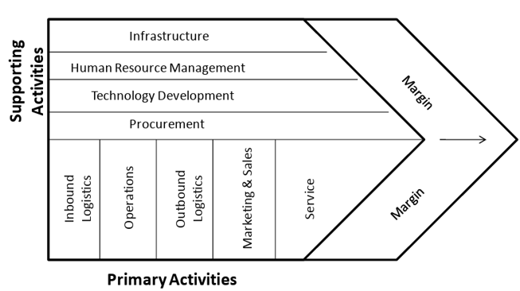
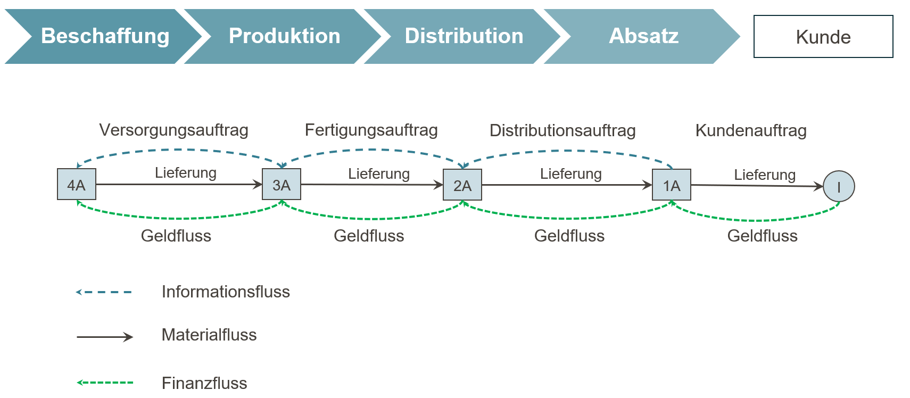
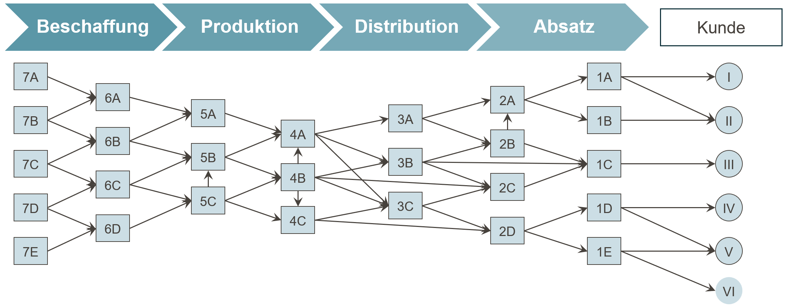
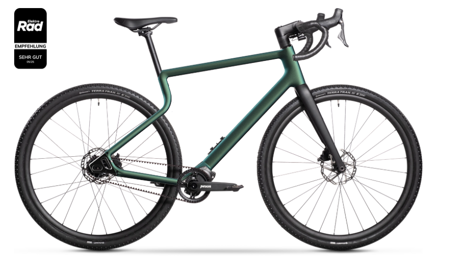

## Organisatorisches {#slide-2}

Dozent: Prof. Dr. Thomas Kirschstein (HS RheinMain + Fraunhofer)

Unterlagen + Materialien: StudIP , ILIAS

Übungen: Werden im Kurs eingeflochen

Klausur: zusammen mit Distribution & BBA-Kurs

## Literatur {#slide-3}

::: small-text
Chopra, S., Meindl, P., Supply Chain Management, Pearson New York, aktuelle Auflage .

Eßig , M., Hofmann, E., Stölzle, W. Supply Chain Management, Vahlen München, aktuelle Auflage.

Christopher, M. Logistics and supply chain management . Pearson Education Limited Edinburgh, aktuelle Auflage.

Günther, H.-O., Tempelmeier, H., Produktion und Logistik, Springer Wiesbaden, aktuelle Auflage.

Kummer, S., Grün, O. & Jammernegg , W. Grundzüge der Beschaffung, Produktion und Logistik, aktuelle Auflage.

Schulte, C., Material- und Logistikmanagement. Verlag Franz Vahlen München, aktuelle Auflage.

Silver , E., Pyke , D. & Douglas, T., Inventory and Production Management in Supply Chains; CRC Press.

Simchi -Levy, D., Operations Rules -- Delivering Customer Value through Flexible Operations ; MIT Press.

Thonemann , U. Operations Management, Pearson Studium, aktuelle Auflage.

Werner, H. Supply Chain Management. Springer Fachmedien Wiesbaden, aktuelle Auflage.
:::

## Aufbau der Vorlesung {#slide-4}

1.  Grundlagen des Supply Chain Managements
2.  Strategische Gestaltung von Supply Chains
3.  Unsicherheits- und Risikomanagement in Supply Chains
4.  Koordination in Supply Chains
5.  Sustainable Supply Chain Management

## Grundlagen des Supply Chain Managements {#slide-5}

- Aufgaben, Begriffe und Konzepte
- Ziele & Zielkonflikte
- Kosten & Management

## Supply chains in History {#slide-6}

::: slide-subtitle
Cheops and building supply chains
:::

- Cheops pyramide building started about 2620 BC, ancient height : 147 m
- 2.3 million stone blocks, avg. 2.5 t each
- Required coordinated transport, tool inventory, and mass catering about 100,000 workers

::: {layout-ncol="2"}


:::

## Supply chains in History {#slide-7}

::: slide-subtitle
Hannibals invasion of Italy
:::

- Invasion from Spain to Italy in 2nd Punic war\
- 37 war elephants + 40,000 troops (incl. large cavalry)
- Supply of troops and beasts need to be realized in hostile territory

::: {layout-ncol="2"}
{width="542"}

{width="559"}
:::


## Supply chains in History
::: slide-subtitle
Toga praetexta: Rohstoffe, Purpur und Absatz
:::

:::::::: columns
::: {.column width="35%"}
### Herstellungsprozess

```{mermaid}
%%| fig-width: 7
%%| fig-height: 5.5
%%{init: {
  "theme": "base",
  "themeVariables": {
    "fontSize": "11px"
  },
  "flowchart": {
    "nodeSpacing": 20,
    "rankSpacing": 25
  }
}}%%

flowchart TB
    A["Schafhaltung"] --> B["Schur und Sortierung<br/>der Rohwolle"]
    B --> D["Spinnen zu Wollgarn"]
    D --> E["Weben des weißen Wolltuchs"]
    E --> F["Walken, Reinigen,<br/>Bleichen, Zuschneiden"]
    F -->|"ca. 100 Sesterzen je Pfund"| H["Anbringen des Purpursaums<br/>Konfektion der Toga"]

    P2["Schneckenzucht"]
    P2 --> P3["Drüsen entnehmen<br/>(Hypobranchialdrüse)"]
    P3 --> P4["Drüsen salzen &<br/>über mehrere Tage erhitzen"]
    P4 --> P7["Wolle / Wollpartien<br/>purpur färben"]
    P7 -->|"4.000 Sesterzen je Pfund"| H

    T["Gesamtwert: 400 - 1.200 Sesterzen je Toga"]

    H ~~~ T

    classDef raw fill:#f5f1e8,stroke:#7a6a4f,color:#2b2b2b;
    classDef proc fill:#eef4fb,stroke:#5179a6,color:#112d3d;
    classDef purple fill:#f4e8fb,stroke:#7a3ea1,color:#321744;
    classDef note fill:#fff8d9,stroke:#b89b2e,color:#3a3212,stroke-width:0.01px;

    class A,B,D,E raw;
    class P2,P3,P4,P7 purple;
    class F,H proc;
    class T note;
```
:::

::::: {.column width="25%"}
{fig-alt="Darstellung und Drapierung einer römischen Toga, einschließlich Toga praetexta mit Purpursaum" width="99%"}

::: smalltable
| Produkt             |         Preis |
|---------------------|--------------:|
| Einfache weiße Toga |  12 Sesterzen |
| Bessere weiße Toga  |  60 Sesterzen |
| Toga praetexta      | 800 Sesterzen |
:::

::: tiny-text
$\rightarrow$ Jahressold einfacher Soldat: 1000 Sesterzen
:::
:::::

::: {.column width="40%"}
### Rohstoff- und Absatzkarte

```{r}
library(leaflet)
library(htmltools)
library(sf)
library(jsonlite)

sichtbare_punkte <- data.frame(
  name = c("Tarent", "Ostia", "Rom", "Tyros", "Milet"),
  rolle = c("Schafwolle", "Empfangshafen", "Weiterverarbeitung und Absatz", "Purpurfarbstoff", "Schafwolle"),
  lat = c(40.4644, 41.7440, 41.8933, 33.2704, 37.5300),
  lng = c(17.2470, 12.2500, 12.4829, 35.2038, 27.2800),
  color = c("#2a6f97", "#b8860b", "#b8860b", "#7a3ea1", "#2a6f97")
)

osrm_route_sf <- function(coords, color, label) {
  coords <- as.matrix(coords)
  if (!is.numeric(coords)) stop("coords muss numerisch sein.")
  if (ncol(coords) != 2) stop("coords muss genau 2 Spalten haben: lon, lat.")
  if (anyNA(coords)) stop("coords enthält NA-Werte. Bitte Koordinaten prüfen.")

  coord_string <- paste(
    apply(coords, 1, function(x) sprintf("%.6f,%.6f", x[1], x[2])),
    collapse = ";"
  )

  url <- paste0(
    "https://router.project-osrm.org/route/v1/driving/",
    coord_string,
    "?overview=full&geometries=geojson&steps=false"
  )

  js <- jsonlite::fromJSON(url)
  line <- sf::st_linestring(as.matrix(js$routes$geometry$coordinates[[1]]))
  sf::st_sf(label = label, color = color, geometry = sf::st_sfc(line, crs = 4326))
}

manual_route_sf <- function(coords, color, label) {
  sf::st_sf(
    label = label,
    color = color,
    geometry = sf::st_sfc(sf::st_linestring(as.matrix(coords)), crs = 4326)
  )
}

route_tarent_rom <- osrm_route_sf(
  coords = matrix(c(
    17.2470, 40.4644,
    12.4829, 41.8933
  ), byrow = TRUE, ncol = 2),
  color = "#2a6f97",
  label = "Tarent → Rom: OSRM-gestützte Landroute"
)

route_milet_ostia <- manual_route_sf(
  matrix(c(
    27.2800, 37.5300,  # Milet
    24.8093, 35.2401,  # Kreta (nur Wegpunkt)
    15.5540, 38.1938,  # Messina (nur Wegpunkt)
    12.2500, 41.7440   # Ostia
  ), byrow = TRUE, ncol = 2),
  color = "#2a6f97",
  label = "Milet → Kreta → Messina → Ostia: Seeweg"
)

route_tyros_ostia <- manual_route_sf(
  matrix(c(
    35.2038, 33.2704,  # Tyros
    24.8093, 35.2401,  # Kreta (nur Wegpunkt)
    15.5540, 38.1938,  # Messina (nur Wegpunkt)
    12.2500, 41.7440   # Ostia
  ), byrow = TRUE, ncol = 2),
  color = "#7a3ea1",
  label = "Tyros → Kreta → Messina → Ostia: Seeweg"
)

route_ostia_rom <- manual_route_sf(
  matrix(c(
    12.2500, 41.7440,
    12.4829, 41.8933
  ), byrow = TRUE, ncol = 2),
  color = "#b8860b",
  label = "Ostia → Rom: Weitertransport"
)

leaflet(width = "100%", height = "480px", options = leafletOptions(zoomControl = TRUE, dragging = TRUE)) |>
  addTiles(
    urlTemplate = "https://{s}.tile.openstreetmap.org/{z}/{x}/{y}.png",
    attribution = "&copy; <a href='https://www.openstreetmap.org/copyright'>OpenStreetMap</a> contributors"
  ) |>
  setView(lng = 19.5, lat = 38.0, zoom = 5) |>
  addCircleMarkers(
    data = sichtbare_punkte,
    lng = ~lng, lat = ~lat,
    radius = 6,
    color = ~color,
    weight = 2,
    fillColor = ~color,
    fillOpacity = 0.85,
    popup = ~paste0("<b>", name, "</b><br>", rolle)
  ) |>
  addPolylines(
    data = route_tarent_rom,
    color = "#2a6f97",
    weight = 3,
    opacity = 0.85,
    dashArray = "5,5",
    popup = ~label
  ) |>
  addPolylines(
    data = route_milet_ostia,
    color = "#2a6f97",
    weight = 4,
    opacity = 0.9,
    popup = ~label
  ) |>
  addPolylines(
    data = route_tyros_ostia,
    color = "#7a3ea1",
    weight = 4,
    opacity = 0.9,
    popup = ~label
  ) |>
  addPolylines(
    data = route_ostia_rom,
    color = "#b8860b",
    weight = 3,
    opacity = 0.9,
    dashArray = "6,6",
    popup = ~label
  ) |>
  addControl(
    html = HTML(paste0(
      "<div style='background:rgba(255,255,255,0.94);padding:8px 10px;",
      "border:1px solid #bbb;border-radius:8px;font-size:12px;line-height:1.4;'>",
      "<div style='margin-bottom:4px;'><b>Legende Wege</b></div>",
      "<div><span style='display:inline-block;width:18px;height:0;border-top:3px dashed #2a6f97;margin-right:6px;vertical-align:middle'></span>Tarent → Rom: Landroute</div>",
      "<div><span style='display:inline-block;width:18px;height:3px;background:#2a6f97;margin-right:6px;vertical-align:middle'></span>Milet → Ostia: Seeweg</div>",
      "<div><span style='display:inline-block;width:18px;height:3px;background:#7a3ea1;margin-right:6px;vertical-align:middle'></span>Tyros → Ostia: Seeweg</div>",
      "<div><span style='display:inline-block;width:18px;height:0;border-top:3px dashed #b8860b;margin-right:6px;vertical-align:middle'></span>Ostia → Rom: Weitertransport</div>",
      "</div>"
    )),
    position = "bottomright"
  )

```
:::
::::::::


## Supply chains in History {#slide-8}

::: slide-subtitle
Gewürzhandel im 15. Jahrhundert
:::

:::::::: columns
::::: {.column width="55%"}
```{r}
#| echo: false
#| warning: false
#| message: false
#| out-width: "100%"

  library(plotly)
  library(dplyr)
  library(tibble)
  library(jsonlite)

nodes <- tribble(
  ~id, ~label, ~lon, ~lat, ~type,
  'ternate', 'Ternate', 127.40, 0.79, 'Produktion/Umschlag',
  'malacca', 'Malakka', 102.25, 2.19, 'Emporium',
  'calicut', 'Calicut/Kozhikode', 75.78, 11.25, 'Indischer Umschlag',
  'aden', 'Aden', 45.03, 12.78, 'Arabischer Umschlag',
  'jeddah', 'Jiddah', 39.17, 21.54, 'Rotes Meer',
  'suez', 'Suez', 32.55, 29.97, 'Rotes Meer',
  'cairo', 'Kairo', 31.24, 30.04, 'Karawanen-Umschlag',
  'alexandria', 'Alexandria', 29.92, 31.20, 'Mediterraner Umschlag',
  'venice', 'Venedig', 12.33, 45.44, 'Europa',
  'mozambique', 'Mozambique Island', 40.73, -15.03, 'Ostafrika',
  'malindi', 'Malindi', 40.12, -3.22, 'Ostafrika',
  'lisbon', 'Lissabon', -9.14, 38.72, 'Europa'#,
  #'antwerp', 'Antwerpen', 4.40, 51.22, 'Europa'
)

routes <- list(
  list(name='Vor 1498 See: Molukken-Malakka-Calicut', period='Vor 1498', mode='See', coords=list(
    c(127.40,0.79), c(126.2,0.2), c(124.8,-0.8), c(123.0,-1.8), c(121.0,-3.0), c(118.5,-4.4),
    c(116.0,-5.3), c(113.0,-5.9), c(110.0,-6.3), c(107.2,-6.0), c(105.0,-5.7), c(104.0,-3.2), c(103.0,-0.5), c(102.25,2.19),
    c(100.5,5.0), c(97.5,7.5), c(94.0,8.7), c(90.0,8.9), c(86.0,8.3), c(82.5,7.8), c(79.8,8.2), c(77.5,9.5), c(75.78,11.25)
  )),
  list(name='Vor 1498 See: Calicut-Aden-Suez', period='Vor 1498', mode='See', coords=list(
    c(75.78,11.25), c(73.5,10.8), c(70.0,11.0), c(66.0,11.5), c(62.0,12.1), c(58.0,12.4), c(54.0,12.5), c(50.0,12.6), c(47.0,12.7), c(45.03,12.78),
    c(43.5,12.6), c(42.8,13.6), c(42.0,15.2), c(41.3,17.0), c(40.4,19.2), c(39.17,21.54), c(37.3,24.0), c(35.4,26.2), c(33.7,28.2), c(32.55,29.97)
  )),
  list(name='Vor 1498 Karawane: Suez-Kairo', period='Vor 1498', mode='Karawane', coords=list(
    c(32.55,29.97), c(32.30,29.98), c(32.05,29.99), c(31.80,30.00), c(31.50,30.02), c(31.24,30.04)
  )),
  list(name='Vor 1498 Karawane: Kairo-Alexandria', period='Vor 1498', mode='Karawane', coords=list(
    c(31.24,30.04), c(30.95,30.25), c(30.60,30.45), c(30.25,30.70), c(29.92,31.20)
  )),
  list(name='Vor 1498 See: Alexandria-Venedig', period='Vor 1498', mode='See', coords=list(
    c(29.92,31.20), c(27.0,32.3), c(24.5,33.6), c(22.0,35.0), c(19.5,36.5), c(17.5,38.5), c(15.5,40.8), c(13.5,43.0), c(12.33,45.44)
  )),
  
  list(name='Nach 1498 See: Lissabon-Mozambique-Malindi-Calicut', period='Nach 1498', mode='See', coords=list(
    c(-9.14,38.72), c(-11.0,35.5), c(-14.0,31.0), c(-17.5,25.0), c(-19.0,18.5), c(-18.0,12.0), c(-15.0,5.0), c(-11.0,-2.0), c(-5.0,-10.0), c(1.0,-18.0),
    c(7.0,-24.0), c(12.0,-29.0), c(16.0,-33.0), 
    c(18.47,-34.36),  c(19.50,-34.72), c(21.00,-34.65), c(23.50,-34.6), c(26.00,-34.5), c(28.50,-34.3),
    c(31.00,-33.8), c(33.20,-33.1), c(34.70,-31.8), c(36.00,-30.3), c(37.20,-28.4), c(38.10,-26.5), 
    c(38.80,-24.5), c(39.10,-22.8), c(39.50,-21.0), c(39.95,-19.3),c(40.35,-17.6), c(40.55,-16.2),    c(40.73,-15.03),
    c(40.6,-13.0), c(40.5,-11.0), c(40.3,-9.0), c(40.1,-7.0), c(39.85,-5.2), c(39.6,-4.1), c(39.8,-3.7), c(39.95,-3.4), c(40.12,-3.22),
    c(43.0,-0.5), c(46.5,2.0), c(50.0,4.5), c(54.0,7.0), c(58.0,9.0), c(62.0,10.2), c(66.0,10.8), c(70.0,11.0), c(73.0,11.1), c(75.78,11.25)
  )),
  list(name='Nach 1498 See: Molukken-Malakka-Calicut', period='Nach 1498', mode='See', coords=list(
    c(127.40,0.79), c(126.2,0.2), c(124.8,-0.8), c(123.0,-1.8), c(121.0,-3.0), c(118.5,-4.4),
    c(116.0,-5.3), c(113.0,-5.9), c(110.0,-6.3), c(107.2,-6.0), c(105.0,-5.7), c(104.0,-3.2), c(103.0,-0.5), c(102.25,2.19),
    c(100.5,5.0), c(97.5,7.5), c(94.0,8.7), c(90.0,8.9), c(86.0,8.3), c(82.5,7.8), c(79.8,8.2), c(77.5,9.5), c(75.78,11.25)
  ))
)

geojson_features <- lapply(routes, function(r) {
  list(type='Feature', properties=list(name=r$name, period=r$period, mode=r$mode), geometry=list(type='LineString', coordinates=r$coords))
})
geojson_obj <- list(type='FeatureCollection', features=geojson_features)

fig <- plot_ly()
legend_done <- new.env(parent = emptyenv())
for (r in routes) {
  mat <- do.call(rbind, r$coords)
  lg <- paste(r$period, r$mode)
  show_leg <- if (!exists(lg, envir = legend_done, inherits = FALSE)) { assign(lg, TRUE, envir = legend_done); TRUE } else FALSE
  line_style <- if (r$mode == 'Karawane') list(color='#8c510a', width=2, dash='dot') else if (r$mode == 'Landroute') list(color='#5f5f5f', width=2.5, dash='dash') else if (r$period == 'Vor 1498') list(color='#8c510a', width=3) else list(color='#01696f', width=3)
  fig <- fig %>% add_trace(
    type='scattermapbox', mode='lines', lon=mat[,1], lat=mat[,2],
    line=line_style, name=lg, legendgroup=lg, showlegend=show_leg,
    hoverinfo='text', text=r$name
  )
}

node_palette <- c(
  'Produktion/Umschlag'='#d73027', 'Emporium'='#fee08b', 'Indischer Umschlag'='#91bfdb',
  'Arabischer Umschlag'='#74add1', 'Rotes Meer'='#4575b4', 'Karawanen-Umschlag'='#bdbdbd',
  'Mediterraner Umschlag'='#b8e186', 'Europa'='#4dac26', 'Ostafrika'='#8073ac'
)
for (tp in unique(nodes$type)) {
  d <- nodes %>% filter(type == tp)
  fig <- fig %>% add_trace(
    data=d, type='scattermapbox', mode='markers+text', lon=~lon, lat=~lat,
    text=~label, textposition='top right', marker=list(size=10, color=unname(node_palette[tp]), opacity=0.95),
    name=tp, legendgroup=tp, showlegend=TRUE,
    hoverinfo='text', hovertext=~paste0(label, '<br>', type)
  )
}

fig <- fig %>% layout(
  title=NA, #list(text='Gewürzhandelsrouten: korrigierte Segmente vor und nach 1498')
  legend=list(orientation='h', y=-0.1),
  mapbox=list(style='open-street-map', zoom=1, center=list(lon=40, lat=12)),
  margin=list(l=20, r=20, t=60, b=90),
  height = 500,
  width = 850
)


fig

```

:::: {.fragment .fade-up}
::: small-text
- Magellan-Expedition der spanischen Krone von 1519 - 1522
- Ziel: westlicher Seeweg zu Molukken
- Start: 5 Schiffe / 260 Mann Besatzung
- Ende: 1 Schiff / 18 Mann Besatzung
:::
::::
:::::

:::: {.column width="45%"}
```{r}
#| echo: false
#| warning: false
#| message: false
#| out-width: "100%"

library(tidyverse)
library(plotly)
library(scales)

# Einheitlicher Vergleich in g Silber pro kg Pfeffer
prices <- tribble(
  ~route, ~stage, ~value,
  "Vor 1498", "Molukken", 1.5,
  "Vor 1498", "Malakka", 4,
  "Vor 1498", "Calicut", 8,
  "Vor 1498", "Alexandria", 12.0,
  "Vor 1498", "Venedig", 16.0,
  "Vor 1498", "Europäische Konsumräume", 25.0,
)

stage_order <- c(
  "Molukken",
  "Malakka",
  "Calicut",
  "Alexandria",
  "Venedig",
  "Europäische Konsumräume"
)

prices_plot <- prices %>%
  mutate(stage = factor(stage, levels = stage_order))

p1 <- ggplot(prices_plot, aes(x = stage, y = value, fill = route)) +
  geom_col(position = position_dodge(width = 0.8), width = 0.7) +
  geom_text(aes(label = round(value, 1)),
            position = position_dodge(width = 0.8),
            vjust = -0.4, size = 3.5) +
  scale_fill_manual(values = c("Vor 1498" = "#8c510a", "Nach 1498" = "#01696f")) +
  labs(
    title = "Preisniveaus im Gewürzhandel in Silberäquivalenten",
    subtitle = "g Silber pro kg Pfeffer",
    x = NULL,
    y = "g Silber pro kg"
  ) +
  theme_minimal(base_size = 12) +
  theme(axis.text.x = element_text(angle = 25, hjust = 1))

p1
```

::: {.fragment .fade-up}
```{r}
#| echo: false
#| warning: false
#| message: false
#| out-width: "100%"

silver_per_maravedi <- 3.195 / 34

costs <- tribble(
  ~Schritt, ~Maravedis, ~Typ,
  "Schiffe, Takelage, Artillerie, Bewaffnung", -3912241, "Kosten",
  "Proviant und Fässer", -1585551, "Kosten",
  "Heuer für 237 Personen", -1154504, "Kosten",
  "Tausch- und Handelswaren", -1679769, "Kosten",
  "Sonstiger Bedarf", -415060, "Kosten",
  "Erlös der Nelkenladung", 7888684, "Erlös",
  "Weitere Waren", 1000000, "Erlös"
) %>%
  mutate(
    Silber_g = Maravedis * silver_per_maravedi,
    Silber_kg = Silber_g / 1000
  )


waterfall <- costs %>%
  mutate(
    end = cumsum(Silber_kg),
    start = lag(end, default = 0)
  )

p <- ggplot(waterfall) +
  geom_rect(aes(
    xmin = seq_along(Schritt) - 0.35,
    xmax = seq_along(Schritt) + 0.35,
    ymin = pmin(start, end),
    ymax = pmax(start, end),
    fill = Typ
  )) +
  geom_hline(yintercept = 0, linewidth = 0.4, color = "grey40") +
  geom_text(aes(
    x = seq_along(Schritt),
    y = ifelse(Silber_kg < 0, end - 35, end + 35),
    label = round(Silber_kg, 1)
  ), size = 3.3) +
  scale_x_continuous(breaks = seq_along(waterfall$Schritt), labels = waterfall$Schritt) +
  scale_fill_manual(values = c("Kosten" = "#b2182b", "Erlös" = "#1b7837")) +
  labs(
    title = "Wirtschaftliche Bilanz der Magellan-Expedition",
    subtitle = "Kosten und Erlösen in kg Silberäquivalent",
    x = NULL,
    y = "kg Silberäquivalent",
    fill = NULL
  ) +
  theme_minimal(base_size = 12) +
  theme(axis.text.x = element_text(angle = 25, hjust = 1))

p

```
:::
::::
::::::::


## Wozu Supply Chain Management? {#slide-9}

::: slide-subtitle
Kundennutzen entlang der Supply Chain.
:::

```{dot}
//| label: fig-scm-nutzen
//| fig-width: 15.0
//| fig-height: 4.8
//| out-width: 94%

digraph scm_nutzen {
  graph [
    rankdir = TB,
    splines = ortho,
    nodesep = 0.25,
    ranksep = 0.4,
    pad = 0.08,
    margin = 0,
    bgcolor = "transparent"
  ]

  node [
    shape = box,
    style = "filled",
    fillcolor = "#ffffff",
    color = "#29464b",
    penwidth = 1.15,
    fontname = "Arial",
    fontsize = 18,
    margin = "0.10,0.06"
  ]

  edge [
    color = "#6c6662",
    penwidth = 1.2,
    arrowhead = none,
    arrowsize = 0
  ]

  good [label = "Good/service", width = 1.90, height = 0.56]

  procurement [  label = "Procurement",  shape = rarrow,  width = 2.10,  height = 0.72,  style = filled,  fillcolor = "white" ]
  production  [  label = "Production",  shape = rarrow,  width = 2.10,  height = 0.72,  style = filled,  fillcolor = "white" ]
  distribution[  label = "Distribution",  shape = rarrow,  width = 2.10,  height = 0.72,  style = filled,  fillcolor = "white" ]
  consumption [label = "Consumption", width = 1.95, height = 0.64]

  design      [label = <<FONT POINT-SIZE="14"><I>utility by</I></FONT><BR/><B>design</B>>,      width = 1.28, height = 0.76]
  information [label = <<FONT POINT-SIZE="14"><I>utility by</I></FONT><BR/><B>information</B>>, width = 1.34, height = 0.76]
  location    [label = <<FONT POINT-SIZE="14"><I>utility by</I></FONT><BR/><B>location</B>>,    width = 1.26, height = 0.76]
  time        [label = <<FONT POINT-SIZE="14"><I>utility by</I></FONT><BR/><B>time</B>>,        width = 1.18, height = 0.76]
  property    [label = <<FONT POINT-SIZE="14"><I>utility by</I></FONT><BR/><B>property</B>>,    width = 1.26, height = 0.76]

  satisfaction [label = <<B>Satisfaction of</B><BR/><B>need</B>>, width = 1.74, height = 0.76]
  logistics    [label = <<B>Logistics</B>>, width = 1.72, height = 0.56, shape = box, style = "rounded,filled", size =18]

  plus1  [label = "+", shape = plaintext, fontsize = 20, fontcolor = "#4f4a47"]
  plus2  [label = "+", shape = plaintext, fontsize = 20, fontcolor = "#4f4a47"]
  plus3  [label = "+", shape = plaintext, fontsize = 20, fontcolor = "#4f4a47"]
  plus4  [label = "+", shape = plaintext, fontsize = 20, fontcolor = "#4f4a47"]
  equals [label = "=", shape = plaintext, fontsize = 22, fontcolor = "#4f4a47"]

  top_l   [shape = point, width = 0.01, label = "", style = invis]
  top_c   [shape = point, width = 0.01, label = "", style = invis]
  top_r   [shape = point, width = 0.01, label = "", style = invis]
  //dist_l  [shape = point, width = 0.01, label = "", style = invis] 
  // dist_r  [shape = point, width = 0.01, label = "", style = invis] 
  dist_m  [shape = point, width = 0.01, label = "", style = invis]
  log_l   [shape = point, width = 0.01, label = "", style = invis]
  //log_r   [shape = point, width = 0.01, label = "", style = invis]
  log_m   [shape = point, width = 0.01, label = "", style = invis]
  dash_j  [shape = point, width = 0.01, label = "", style = invis]

  { rank = same; procurement; production; distribution; consumption }
  { rank = same; design; plus1; information; plus2; location; plus3; time; plus4; property; equals; satisfaction }
  { rank = same; top_l; top_c; top_r }
  //{ rank = same; dist_l; dist_r }
  { rank = same; log_l }

  procurement -> production [style = invis, weight = 20]
  production  -> distribution [style = invis, weight = 20, minlen = 8]
  distribution -> consumption [style = invis, weight = 20, minlen = 8]

  design -> plus1 [style = invis, weight = 10]
  plus1 -> information [style = invis, weight = 10]
  information -> plus2 [style = invis, weight = 10]
  plus2 -> location [style = invis, weight = 10]
  location -> plus3 [style = invis, weight = 10]
  plus3 -> time [style = invis, weight = 10]
  time -> plus4 [style = invis, weight = 10]
  plus4 -> property [style = invis, weight = 10]
  property -> equals [style = invis, weight = 10]
  equals -> satisfaction [style = invis, weight = 10]


 good -> procurement
 good -> distribution
good -> production [minlen = 2]
good -> consumption

  production -> design

  distribution -> dist_m
  dist_m -> information
  dist_m -> location
  dist_m -> time
  dist_m -> property

  consumption -> satisfaction [penwidth = 1.0]

  procurement -> design [style = dashed, color = "#7a7470", penwidth = 1.0]

  location -> log_l
  time -> log_l
  log_l -> logistics
  
  information -> log_l [style = dashed, color = "#7a7470", penwidth = 1.0]
  //dash_j -> log_l [style = dashed, color = "#7a7470", penwidth = 1.0]
}
```

## Logistiksysteme im Unternehmen {#slide-10}


## Supply Chain Strukturen {#slide-11}

::: slide-subtitle
Netzwerkgedanke & Grundparadigma
:::

```{dot}
//| label: fig-scn-network
//| fig-cap: "Supply chain network mit mehreren Akteuren je Stufe."
//| fig-width: 13
//| fig-height: 3.5
//| out-width: 96%

digraph scn_network {

  graph [
    rankdir = LR,
    splines = curved,
    nodesep = 0.55,
    ranksep = 1.1,
    pad = 0.15,
    bgcolor = "transparent"
  ]

  node [
    shape = box,
    style = filled,
    fillcolor = "white",
    color = "black",
    penwidth = 1.1,
    fontname = "Arial",
    fontsize = 14,
    width = 1.9,
    height = 0.65
  ]

  edge [
    color = "black",
    penwidth = 1.1,
    arrowhead = normal,
    arrowsize = 0.8
  ]

  // Knoten je Stufe (Spalte) und Akteur (Zeile)
  s1 [label = "Supplier"];     s2 [label = "Supplier"];     s3 [label = "Supplier"];
  m1 [label = "Manufacturer"]; m2 [label = "Manufacturer"]; m3 [label = "Manufacturer"];
  d1 [label = "Distributor"];  d2 [label = "Distributor"];  d3 [label = "Distributor"];
  r1 [label = "Retailer"];     r2 [label = "Retailer"];     r3 [label = "Retailer"];
  c1 [label = "Consumer"];     c2 [label = "Consumer"];     c3 [label = "Consumer"];

  // gemeinsame Ranks je Stufe (Spalte)
  { rank = same; s1; s2; s3 }
  { rank = same; m1; m2; m3 }
  { rank = same; d1; d2; d3 }
  { rank = same; r1; r2; r3 }
  { rank = same; c1; c2; c3 }

  // vertikale Reihenfolge innerhalb jeder Stufe erzwingen
  s1 -> s2 -> s3 [style = invis, weight = 20]
  m1 -> m2 -> m3 [style = invis, weight = 20]
  d1 -> d2 -> d3 [style = invis, weight = 20]
  r1 -> r2 -> r3 [style = invis, weight = 20]
  c1 -> c2 -> c3 [style = invis, weight = 20]

  // Horizontale Basisverbindungen (gleiche Reihe)
  s1 -> m1 [weight = 10]
  s2 -> m2 [weight = 10]
  s3 -> m3 [weight = 10]

  m1 -> d1 [weight = 10]
  m2 -> d2 [weight = 10]
  m3 -> d3 [weight = 10]

  d1 -> r1 [weight = 10]
  d2 -> r2 [weight = 10]
  d3 -> r3 [weight = 10]

  r1 -> c1 [weight = 10]
  r2 -> c2 [weight = 10]
  r3 -> c3 [weight = 10]

  // Kreuzverbindungen zwischen Nachbarreihen: Supplier -> Manufacturer
  s1 -> m2
  s2 -> m1
  s2 -> m3
  s3 -> m2

  // Kreuzverbindungen: Manufacturer -> Distributor
  m1 -> d2
  m2 -> d1
  m2 -> d3
  m3 -> d2

  // Kreuzverbindungen: Distributor -> Retailer
  d1 -> r2
  d2 -> r1
  d2 -> r3
  d3 -> r2

  // Kreuzverbindungen: Retailer -> Consumer
  r1 -> c2
  r2 -> c1
  r2 -> c3
  r3 -> c2

  // äußere Bögen: erste und letzte Zeile jeweils komplett vernetzt (Supplier <-> Consumer)
  //s1 -> c1 //[constraint = true]
  //s1 -> c2 [constraint = false]
  //s1 -> c3 [constraint = false]
  //s2 -> c1 [constraint = false]
  //s2 -> c3 [constraint = false]
  //s3 -> c1 [constraint = false]
  //s3 -> c2 [constraint = false]
  //s3 -> c3 //[constraint = true]
}
```

SCM-Gewinn = Kundenumsatz -- Gesamtkosten aller Prozesse/Partner = Summe der indi. Gewinne

. . .

$\rightarrow$ **Optimierung der indiv . Gewinne führt i.d.R. nicht zur Optimierung des SCM-Gewinns !**

## Transformation {#slide-12}

::: slide-subtitle
Wertschöpfung in der Supply Chain
:::

:::::: columns
::: {.column width="40%"}
### Porter's value chain


:::

:::: {.column width="60%"}
::: {.fragment .fade-up}

:::
::::
::::::

## Definitionen des SCM {#slide-13}

::: slide-subtitle
Vielfalt & gemeinsamer Kern
:::

::: small-text
Stadtler (2000, S. 9): "*Supply Chain Management ist die Aufgabe, Organisationseinheiten entlang der Supply Chain zu integrieren , den Material-, Informations- und Geldfluss zu koordinieren und die Wettbewerbsfähigkeit der gesamten Supply Chain zu verbessern, um Kundenbedarfe zu erfüllen*." <br><br> Hugos (2018): „*Supply Chain Management is coordination of production , inventory , location , transportation , and information among the participants in a supply chain to achieve the best mix of responsiveness and efficiency for the market being served .*" <br><br> Corsten and Gössinger (2001): „*Supply chain management encompasses the planning and management of all activities involved in sourcing and procurement, conversion, and all logistics management activities. Importantly, it also includes coordination and collaboration with channel partners, which can be suppliers, intermediaries, third party service providers, and customers. In essence, supply chain management integrates supply and demand management within and across companies .*"
:::

## Unternehmen und ihre Umwelt {#slide-14}

::: slide-subtitle
Offenes Unternehmensmodell
:::

::::: columns
::: {.column width="50%"}
{width="760"}
:::

::: {.column width="50%"}
- **Dispositive Ebene**: behandelt den Informationsfluss im und zwischen Unternehmen, Planungsprozesse, Entscheiden und Kontrollieren (Management i.e.S.)
- **Finanzebene**: erfasst Geld- und Zahlungsströme innerhalb und außerhalb des Unternehmens
- **Güterebene**: erfasst die Bewegung und den Bestand physischer Güter (Roh-, Hilfs- und Betriebsstoffe) innerhalb und zwischen Unternehmen
:::
:::::

## Flüsse in Supply Chains {#slide-15}



## Supply Chain Strukturen {#slide-16}

::: slide-subtitle
Fokale Supply Chain
:::

{fig-align="center" width="2428"}

::: small-text
**Charakteristiken**:

- Fokales Unternehmen an der Engpassposition → „kontrolliert" das Netzwerk (Akteure und Struktur)
- Hohe Marktmacht → kontrolliert den Marktzugang
- Häufig Koordinator → legt Standards und strategische Ziele fest
- Beispiele: Automobilindustrie, Apple, ...
:::

## Supply Chain Strukturen {#slide-17}

::: slide-subtitle
Polyzentrische Supply Chains
:::



::: small-text
**Charakteristiken**:

- Verteilte und sich überschneidende Kompetenzen
- Spezialisierung und Kooperation
- Keine klare Standardisierung und eher egalitäre Verteilung der Marktmacht
- Beispiele: IKEA, Neste, Unilever, ...
:::

## Beispiele Für Supply Chains {#slide-19}

::: slide-subtitle
Aufgabe
:::

:::::: {.column width="63%"}
::::: small-text
Versuchen Sie die Struktur der Supply Chains insbesondere der Distributionsstruktur der folgenden Produkte zu beschreiben:

::: vspace-1
:::

- Eine Flasche Coca-Cola (Glas, 0,3 l)
- T-Shirt von Patagonia
- Gravel-Bike *Waldwiesel* von Urwahn
- Rittersport Haselnuss

::: vspace-2
:::

Beschreiben Sie die wesentlichen Produktionsschritte durch Angabe der verwendeten Rohstoffe, Materialien und Bauteile sowie den erzeugten (Zwischen-)Produkt(-en). Ergänzen Sie die Darstellung durch Angabe der logistischen Prozesse, die die Fertigungsstufen verbinden.

Ordnen Sie die einzelnen Prozessschritte (Produktion und Logistik) räumlich zu.
:::::
::::::

:::: {.column width="37%"}
<!-- ::: product-grid -->
<!-- {.product-image .chocolate} -->

<!-- {.product-image .bottle} -->

<!-- {.product-image .shirt} -->
<!-- ::: -->
{width="300"}
{width="200"}
{width="150"}
{width="400"}
::::
