## Organisatorisches {#slide-2}

Dozent: Prof. Dr. Thomas Kirschstein (HS RheinMain + Fraunhofer)

Unterlagen + Materialien: StudIP , ILIAS

Übungen: Werden im Kurs eingeflochen

Klausur: zusammen mit Distribution & BBA-Kurs

## Literatur {#slide-3}

Chopra, S., Meindl, P., Supply Chain Management, Pearson New York, aktuelle Auflage .

Eßig , M., Hofmann, E., Stölzle, W. Supply Chain Management, Vahlen München, aktuelle Auflage.

Christopher, M. Logistics and supply chain management . Pearson Education Limited Edinburgh, aktuelle Auflage.

Günther, H.-O., Tempelmeier, H., Produktion und Logistik, Springer Wiesbaden, aktuelle Auflage.

Kummer, S., Grün, O. & Jammernegg , W. Grundzüge der Beschaffung, Produktion und Logistik, aktuelle Auflage.

Schulte, C., Material- und Logistikmanagement. Verlag Franz Vahlen München, aktuelle Auflage.

Silver , E., Pyke , D. & Douglas, T., Inventory and Production Management in Supply Chains; CRC Press.

Simchi -Levy, D., Operations Rules -- Delivering Customer Value through Flexible Operations ; MIT Press.

Thonemann , U. Operations Management, Pearson Studium, aktuelle Auflage.

Werner, H. Supply Chain Management. Springer Fachmedien Wiesbaden, aktuelle Auflage.

## Aufbau der Vorlesung {#slide-4}

1.  Grundlagen des Supply Chain Managements
2.  Strategische Gestaltung von Supply Chains
3.  Unsicherheits- und Risikomanagement in Supply Chains
4.  Koordination in Supply Chains
5.  Sustainable Supply Chain Management

## Grundlagen des Supply Chain Managements {#slide-5}

- Aufgaben, Begriffe und Konzepte
- Ziele & Zielkonflikte
- Kosten & Management

## Supply chains in History {#slide-6}

Cheops and building supply chains

- Cheops pyramide building started about 2620 BC, ancient height : 147 m
- 2.3 million stone blocks, avg. 2.5 t each
- Required coordinated transport, tool inventory, and mass catering about 100,000 workers

::: {layout-ncol="2"}


:::

## Supply chains in History {#slide-7}

Hannibals invasion of Italy

- Invasion from Spain to Italy in 2nd Punic war\
- 37 war elephants + 40,000 troops (incl. large cavalry)
- Supply of troops and beasts need to be realized in hostile territory

::: {layout-ncol="2"}


:::

## Supply chains in History {#slide-8}

Alexander the Great and the conquest of the Persian Empire

Campaing lasted 12 years (334 - 323 BC) and covered more than 25,000 km

- initially about 35,000 troops (mostly infantry)
- Building local basis for supply (resources and troops) + support from Macedonia

::: {layout-ncol="2"}


:::

## What is Supply for ? {#slide-9}


```{dot}
//| label: fig-scm-nutzen
//| fig-cap: "Nutzenstiftung entlang der Supply Chain."
//| fig-width: 12
//| fig-height: 5

digraph scm_nutzen {

  graph [
    rankdir = TB,
    splines = ortho,
    nodesep = 0.35,
    ranksep = 0.65,
    pad = 0.25,
    bgcolor = "transparent"
  ]

  node [
    shape = box,
    style = "filled",
    fillcolor = "white",
    color = "#263D42",
    fontname = "Arial",
    fontsize = 16,
    margin = "0.14,0.08"
  ]

  edge [
    color = "#263D42",
    penwidth = 1.3,
    arrowsize = 0.6
  ]

  good [label = "Gut / Dienstleistung", width = 2.2]

  procurement [
    label = "Beschaffung",
    shape = hexagon
  ]

  production [
    label = "Produktion",
    shape = hexagon
  ]

  distribution [
    label = "Distribution",
    shape = hexagon
  ]

  consumption [label = "Konsum"]

  design       [label = <<I>Nutzen durch</I><BR/><B>Gestaltung</B>>]
  information  [label = <<I>Nutzen durch</I><BR/><B>Information</B>>]
  location     [label = <<I>Nutzen durch</I><BR/><B>Ort</B>>]
  time         [label = <<I>Nutzen durch</I><BR/><B>Zeit</B>>]
  property     [label = <<I>Nutzen durch</I><BR/><B>Eigentum</B>>]

  satisfaction [
    label = <<B>Bedürfnis-</B><BR/><B>befriedigung</B>>,
    width = 2.0
  ]

  logistics [
    label = <<B>Logistik</B>>,
    width = 1.8
  ]

  plus1 [label = "+", shape = plaintext, fontsize = 22]
  plus2 [label = "+", shape = plaintext, fontsize = 22]
  plus3 [label = "+", shape = plaintext, fontsize = 22]
  plus4 [label = "+", shape = plaintext, fontsize = 22]
  equals [label = "=", shape = plaintext, fontsize = 22]

  { rank = same; procurement; production; distribution; consumption }
  { rank = same; design; plus1; information; plus2; location; plus3; time; plus4; property; equals; satisfaction }

  good -> procurement [arrowhead = none]
  good -> production [arrowhead = none]
  good -> distribution [arrowhead = none]
  good -> consumption [arrowhead = none]

  procurement -> design [arrowhead = none]
  production -> information [arrowhead = none]
  distribution -> location [arrowhead = none]
  distribution -> time [arrowhead = none]
  distribution -> property [arrowhead = none]
  consumption -> satisfaction [arrowhead = none]

  location -> logistics [arrowhead = none]
  time -> logistics [arrowhead = none]

  procurement -> production [style = invis, weight = 10]
  production -> distribution [style = invis, weight = 10]
  distribution -> consumption [style = invis, weight = 10]

  design -> plus1 [style = invis]
  plus1 -> information [style = invis]
  information -> plus2 [style = invis]
  plus2 -> location [style = invis]
  location -> plus3 [style = invis]
  plus3 -> time [style = invis]
  time -> plus4 [style = invis]
  plus4 -> property [style = invis]
  property -> equals [style = invis]
  equals -> satisfaction [style = invis]
}
```

## Logistiksysteme im Unternehmen {#slide-10}

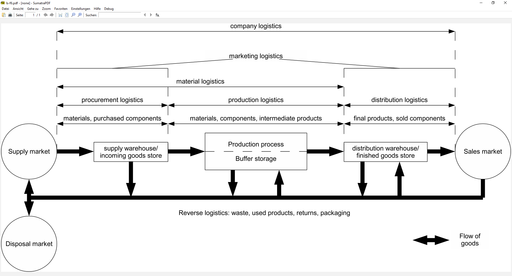

## Supply Chain Strukturen {#slide-11}

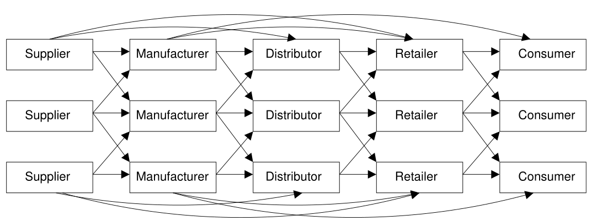

SCM-Gewinn = Kundenumsatz -- Gesamtkosten aller Prozesse /Partner = Summe der indi. Gewinne

--\> Optimierung der indiv . Gewinne führt i.d.R. nicht zur Optimierung des SCM- Gewinns !

## Transformation {#slide-12}

- Qualitative transformation -> utility by design
- Spatial transformation -> utility by location
- Temporal transformation -> utility by time
- Quantitative transformation -> utility by quantity

Value adding -- Porter's value chain

::: {layout-ncol="2"}
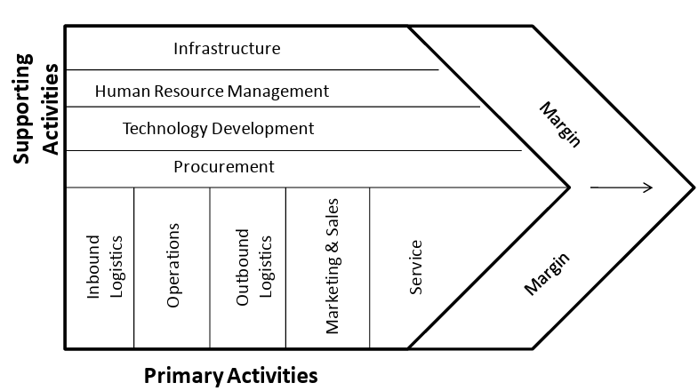
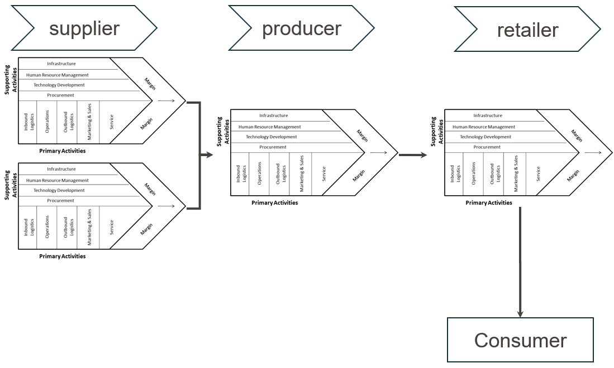
:::


## Definitionen des SCM {#slide-13}


Stadtler (2000, S. 9): " Supply Chain Management ist die Aufgabe, Organisationseinheiten entlang der Supply Chain zu integrieren , den Material-, Informations- und Geldfluss zu koordinieren und die Wettbewerbsfähigkeit der gesamten Supply Chain zu verbessern, um Kundenbedarfe zu erfüllen . "

Hugos (2018): „ Supply Chain Management is coordination of production , inventory , location , transportation , and information among the participants in a supply chain to achieve the best mix of responsiveness and efficiency for the market being served ."

Corsten and Gössinger (2001): „ Supply chain management encompasses the planning and management of all activities involved in sourcing and procurement, conversion, and all logistics management activities. Importantly, it also includes coordination and collaboration with channel partners, which can be suppliers, intermediaries, third party service providers, and customers. In essence, supply chain management integrates supply and demand management within and across companies ."

## Unternehmen und ihre Umwelt {#slide-14}

Offenes Unternehmensmodell


(Kummer et al., 2022, S. 42)

Dispositive Ebene : behandelt den Informationsfluss im und zwischen Unternehmen, Planungsprozesse, Entscheiden und Kontrollieren (Management i.e.S.)

Finanzebene : erfasst Geld- und Zahlungsströme innerhalb und außerhalb des Unternehmens

Güterebene : erfasst die Bewegung und den Bestand physischer Güter (Roh-, Hilfs- und Betriebsstoffe) innerhalb und zwischen Unternehmen

## Flüsse in supply Chains {#slide-15}


1A

::: {.smartart .chevron1 data-smartart-layout="chevron1"}
:::

I

2A

3A

4A

Kunde

Kundenauftrag

Distributionsauftrag

Fertigungsauftrag

Versorgungsauftrag

Lieferung

Lieferung

Lieferung

Lieferung

Geldfluss

Geldfluss

Geldfluss

Geldfluss

Informationsfluss

Materialfluss

Finanzfluss

Fragen:

- Welche Flüsse werden initiiert?
- Wann werden Flüsse initiiert?
- Wieviel/was sollte fließen?

## supply Chain strukturen {#slide-16}

Fokale Supply Chains

Supply Chain Management

16

1A

I

1B

II

1C

III

1D

IV

V

2A

2B

2C

3A

3B

4A

5A

5B

7A

7B

7C

7D

6A

6B

6C

Charakteristiken:

- Fokales Unternehmen an der Engpassposition → „kontrolliert" das Netzwerk (Akteure und Struktur)
- Hohe Marktmacht → kontrolliert den Marktzugang
- Häufig Koordinator → legt Standards und strategische Ziele fest
- Beispiele: Automobilindustrie, Apple, ...

Fokales

Unternehmen

::: {.smartart .chevron1 data-smartart-layout="chevron1"}
:::

Kunde

## supply Chain structures {#slide-17}

Polycentric supply chains

Supply Chain Management

17

Charakteristiken:

- Verteilte und sich überschneidende Kompetenzen
- Spezialisierung und Kooperation
- Keine klare Standardisierung und eher egalitäre Verteilung der Marktmacht
- Beispiele: IKEA, Neste, Unilever, ...

1A

I

1B

II

1C

III

1D

IV

1E

V

2A

2B

2C

2D

3A

3B

3C

4A

4B

5A

5B

5C

7A

7B

7C

7D

7E

6A

6B

6C

6D

VI

4C

::: {.smartart .chevron1 data-smartart-layout="chevron1"}
:::

Kunde

## Example of Supply Chains {#slide-18}

Toyota Supply Chain

Supply Chain Management

18

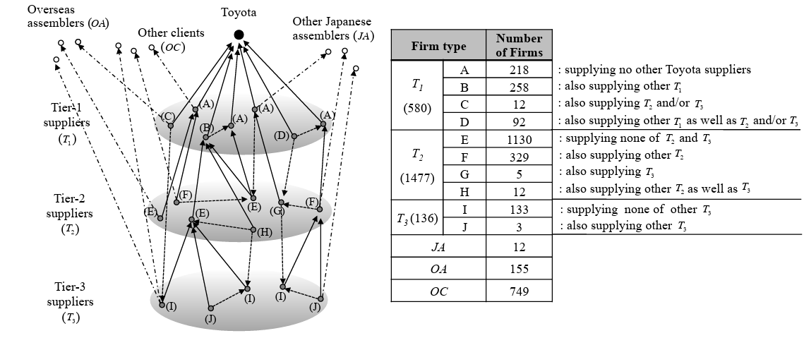

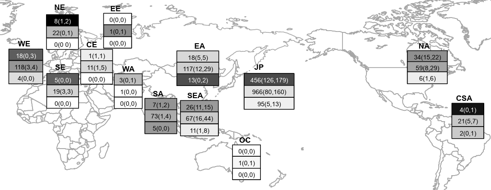

(Kito et al. 2014)

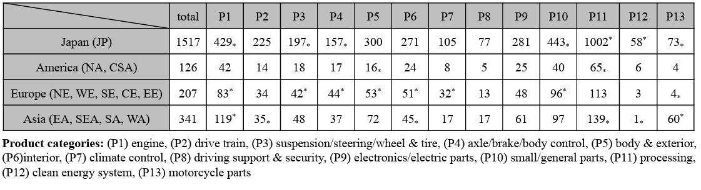

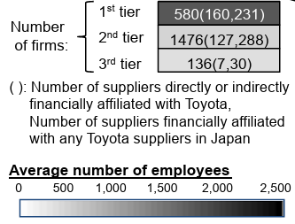

## Beispiele Für Supply Chains {#slide-19}

| Aufgabe |   |
|:-----------------------------------|------------------------------------|
| Versuchen Sie die Struktur der Supply Chains insbesondere der Distributionsstruktur der folgenden Produkte zu beschreiben: Eine Flasche Coca-Cola (Glas, 0,3 l) T-Shirt von Patagonia Rennrad ' Endurace CF 7' von Canyon Rittersport Haselnuss Beschreiben Sie die wesentlichen Produktionsschritte durch Angabe der verwendeten Rohstoffe, Materialien und Bauteile sowie den erzeugten (Zwischen-)Produkt(-en). Ergänzen Sie die Darstellung durch Angabe der logistischen Prozesse, die die Fertigungsstufen verbinden. Ordnen Sie die einzelnen Prozessschritte (Produktion und Logistik) räumlich zu. |  |

Übung

Supply Chain Management

19


## Slide 20

Supply Chain Management

20

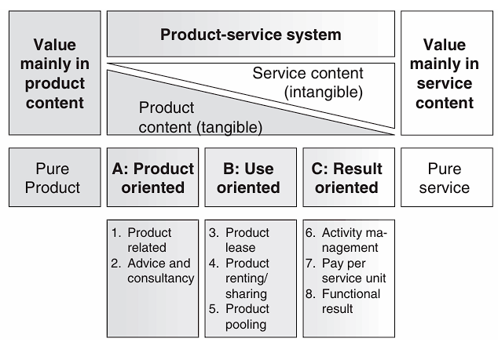

( Tukker , 2004)

## Output von Transformationsprozessen {#slide-21}

Produkte dienen der Bedürfnisbefriedigung

Übel sind i.d.R. mit negativen externen Effekten verbunden (z.B. Treibhaus-effekt)

Abgrenzung zwischen Ab- und Beiprodukten z.T. schwierig bzw. abhängig von Marktgegebenheiten

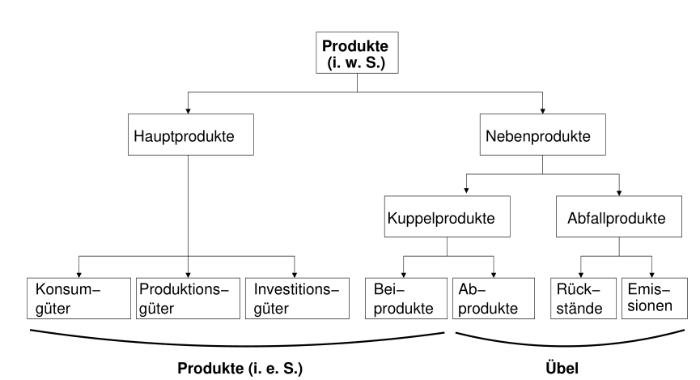

Produktklassifikation

Supply Chain Management

21

## Klassifikation von logistiksystemen {#slide-22}

22

- Beschaffungslogistik

<!-- -->

- Bestellpunkt-, Bestellmengenrechnung
- Bestellerteilung nach Verträgen des Einkaufs
- Abrufe und Liefererteilungen
- Terminverfolgung
- Sicherstellung der Lieferbereitschaft gegenüber den zu versorgenden Stellen

<!-- -->

- Produktionslogistik

<!-- -->

- Planung der Menge an Fertigprodukten
- Bedarfsermittlung an Teilen und Baugruppen
- Terminierung des Material- und Warendurchlaufs
- Sicherstellen der Lieferbereitschaft gegenüber den zu versorgenden Stellen

<!-- -->

- Absatzlogistik

<!-- -->

- Fertigwarenbereitstellung und Lagerung
- Verkehrsmittelplanung und Verkehrsmitteleinsatz
- Veranlassen und Sicherstellen der Lieferbereitschaft gegenüber den Kunden
- 
- 
- 
- 
- 
- 
- 
- 
- 

Supply Chain Management

## Abgrenzung zu verwandten Begriffen {#slide-23}

Wertschöpfungsketten

Berücksichtigen sämtliche Faktoren, die zur Wertsteigerung oder Wertvernichtung beitragen. Dazu zählen auch Design oder Image. Protagonist: M. E. Porter.

Logistikketten

Erstrecken sich auf physische Tätigkeiten zur Raum- und Zeitüberbrückung. Primär unternehmensintern ausgerichtet. Außerbetrieblich nur zu den direkten Schnittstellen: Systemlieferanten und unmittelbaren Kunden.

Kaum Berücksichtigung von Geldflüssen (Fakturierung). Funktionsorientierte Verzahnung tradierter Unternehmungsbereiche.

Demand Chain Management (DCM)

Synonym „Chain of Customer". Strikte Kundenintegration in den Unternehmensabläufen (Pull-Orientierung). Lieferanten werden kaum berücksichtigt.

Customer Relationship Management (CRM)

Kundenbeziehungsmanagement. Aufbau dauerhafter Interaktionsprozesse mit ausgewählten (profitablen) Kunden.

Supply Chain Management

23

## Abgrenzung zu verwandten Begriffen {#slide-24}

Supplier Relationship Management (SRM)

Umfasst z. B. Lieferantenauswahl, -entwicklung und -integration.

Berücksichtigt externe Kunden kaum.

Synonym: „Supply Management".

Beziehungsmanagement

Abstimmung von Leitbildern und Maßnahmen von Akteuren, um Beziehungen aufrechtzuerhalten und zum gegenseitigen Nutzen auszubauen.

Schwerpunkt des Beziehungsmanagements: Sozialebene (psychologische und emotionale Faktoren).

Supply Chain Relationship Management (SCRM)

Basiert auf SCM und Beziehungsmanagement (Koexistenz).

Untersuchungsfeld: Soziale Beziehungen (und nicht Material-, Informations- und Geldflüsse).

Beziehungsaffiner Teil des SCM. Einsatz von Beziehungspromotoren.

Supply Chain Management

24

## Eigenschaften und Typen von Supply Chains {#slide-25}

Charakteristisch: Klassische Koordinationsmechanismen verwischen. Supply Chains haben keine übergeordnete, lenkende Instanz.

Regel: Zumeist steuert die nachgelagerte Stufe (Kunde) die vorgelagerte (Pull-Prinzip).

Weisungen, Pläne und Programme sind von ihrem Wirkungsgrad schwächer ausgeprägt als in einzelwirtschaftlichem Unternehmen.

Häufig ist Konsens notwendig, um die Kooperation aufrecht zu erhalten (Kompromiss).

Zwei Grundformen („Phänotypen") von Supply Chains:

Hierarchisch-pyramidale Supply Chains.

Polyzentrische Supply Chains.

Supply Chain Management

25

## Charakteristika Hierarchisch-pyramidaler Supply Chains {#slide-26}

- Im Mittelpunkt steht eine strategische relevante Unternehmung  „Hub-Firm" bzw. fokales Unternehmen\
- Beherrschung des Netzwerks durch Größe, Finanzausstattung, Wissenspotenzial oder dem Beschaffungszugang/Absatzzugang des fokalen Unternehmen  Marktmacht  langfristig struktur-konservativ
- Der Aufbau hierarchisch pyramidaler Netzwerke entspricht häufig der produktbezogenen Zwangsfolge technologischer Arbeitsschritte.
- Prägende Elemente hierarchischer Supply Chains sind klare Strukturierung und Übersichtlichkeit.

26

Supply Chain Management


## Charakteristika Polyzentrischer Supply Chains {#slide-27}

- Prägend für polyzentrische Lieferketten sind homogene, wechselseitige Abhängigkeitsverhältnisse („ heterarchische Supply Chain").
- Entscheidungskompetenzen und Koordinierungsaufgaben sind verteilter. Teilweise steuern einzelne Akteure eigenverantwortlich bestimmte Bereiche, weil sie über besondere Kenntnisse verfügen („Spezialisierungsfunktion").
- Vielfach überlappen die Tätigkeiten , da Aktionen parallel ablaufen. Die Koppelungen richten sich zumeist auf den Kunden aus (Pull-Gedanke).
- Im Sinne multifunktionaler Partnerschaften sind die Akteure häufig gleichsam in mehreren Supply Chains integriert.
- Mögliche Streitpunkte in polyzentrischen Supply Chains flammen beispielsweise auf, wenn es um die Aufnahme neuer Partner, die Verteilung von Kosten, die Zuteilung knapper Ressourcen oder das Outphasen von Akteuren geht.

27


Supply Chain Management

## Beispiel einer Supply Chain {#slide-28}

Supply Chain Management

28

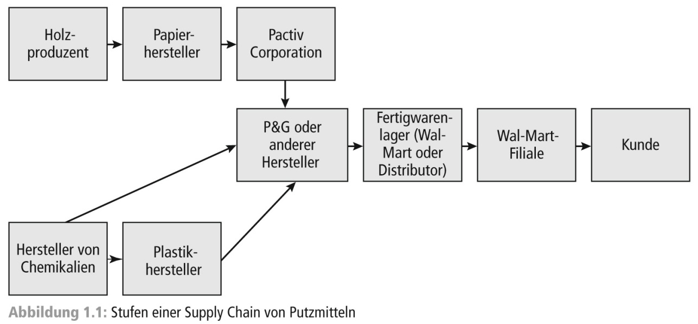

(Chopra/Meindl, S.23)

## Ebenen im Supply chain management {#slide-29}

29


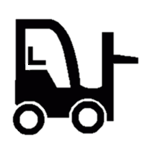

Die physische Übergabe und Kapazitäten müssen passen

Die Prozesse müssen abgestimmt sein

Die IT-Systeme müssen vernetzt werden

A

C

D

B

Verantwortliche & Kommunikation klären

Supply Chain Management
