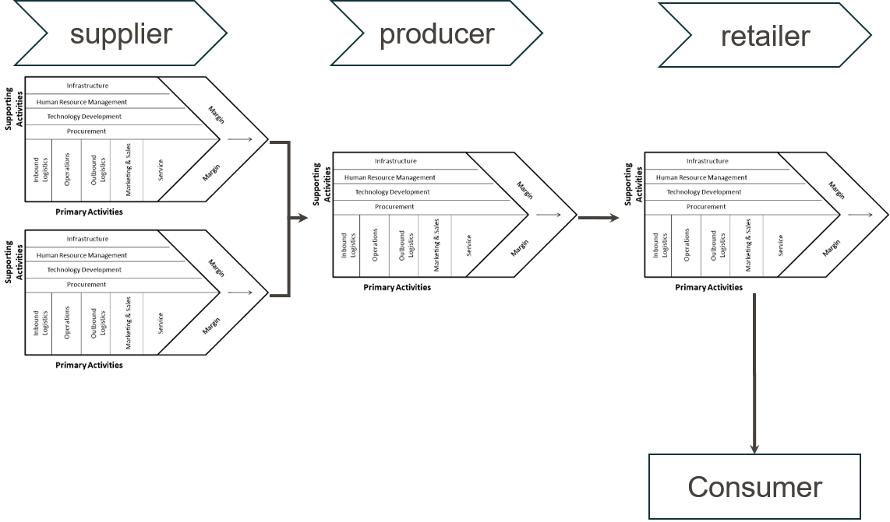

```{r}
#| echo: false
#| warning: false
#| message: false

# Load functions from scm_functions.R
source("../R/scm_functions.R")

library(tidyverse)
library(leaflet)
library(readxl)
library(dplyr)
library(plotly)

```

# Introduction & Course Organisation

## Course organisation {#slide-2}

- Lecturers: Prof. Dr. Matthias Kalverkamp & Prof. Dr. Thomas Kirschstein
- Documents + materials: https://github.com/tkirschstein/SCM
- Case studies: 6 case studies in group work 3-6 persons
- Exam: reflection report

## Literature {#slide-3}


::: {#refs}
:::

## Structure of the lecture {#slide-4}

1.  Fundamentals of Supply Chain Management
2.  Strategic Design of Supply Chains
3.  Uncertainty and Risk Management in Supply Chains


# Fundamentals of Supply Chain Management

## Fundamentals of Supply Chain Management {#slide-5}

- **Tasks, terms and concepts**
- Objectives & trade-offs
- Costs & management

## Learning objectives {#learning-objectives-introduction}

After this unit you will be able to …

- **explain** key terms, actors and flows of a supply chain,
- **distinguish** supply chain management from logistics and procurement,
- **differentiate** between strategic, tactical and operational decisions in supply chains,
- **assess** the importance of coordination for value creation and competitiveness.

**Further reading**

- **SCM fundamentals and decision levels:** Chapters 1–3 in [@chopra2025supply].
- **Strategies, instruments and controlling in the German-speaking context:** Chapters 1–3 in [@werner2020supply].
- **Case-oriented introduction to supply chain structures:** Chapters 1–3 in [@sople2011supply].

## Supply chains in History {#slide-6}

::: slide-subtitle
Cheops and building supply chains
:::

- Cheops pyramid building started about 2620 BC, ancient height: 147 m
- 2.3 million stone blocks, avg. 2.5 t each
- Required coordinated transport, tool inventory, and mass catering for about 100,000 workers

::: {layout-ncol="2"}


:::

## Supply chains in History {#slide-7}

::: slide-subtitle
Hannibal's invasion of Italy
:::

- Invasion from Spain to Italy in the 2nd Punic War\
- 37 war elephants + 40,000 troops (incl. large cavalry)
- Supply of troops and beasts had to be realised in hostile territory

::: {layout-ncol="2"}
{width="542"}

{width="559"}
:::


## Supply chains in History
::: slide-subtitle
Toga praetexta: raw materials, purple and sales
:::

:::::::: columns
::: {.column width="35%"}

### Production process

```{mermaid}
%%| fig-width: 7
%%| fig-height: 5.5
%%{init: {
  "theme": "base",
  "themeVariables": {
    "fontSize": "11px"
  },
  "flowchart": {
    "nodeSpacing": 20,
    "rankSpacing": 25
  }
}}%%

flowchart TB
    A["Sheep farming"] --> B["Shearing and sorting<br/>of raw wool"]
    B --> D["Spinning into wool yarn"]
    D --> E["Weaving the white woollen cloth"]
    E --> F["Fulling, cleaning,<br/>bleaching, cutting"]
    F -->|"approx. 100 sesterces per pound"| H["Attaching the purple border<br/>Making up the toga"]

    P2["Snail breeding"]
    P2 --> P3["Extracting glands<br/>(hypobranchial gland)"]
    P3 --> P4["Salting glands &<br/>heating over several days"]
    P4 --> P7["Dyeing wool / wool batches<br/>purple"]
    P7 -->|"4,000 sesterces per pound"| H

    T["Total value: 400 - 1,200 sesterces per toga"]

    H ~~~ T

    classDef raw fill:#f5f1e8,stroke:#7a6a4f,color:#2b2b2b;
    classDef proc fill:#eef4fb,stroke:#5179a6,color:#112d3d;
    classDef purple fill:#f4e8fb,stroke:#7a3ea1,color:#321744;
    classDef note fill:#fff8d9,stroke:#b89b2e,color:#3a3212,stroke-width:0.01px;

    class A,B,D,E raw;
    class P2,P3,P4,P7 purple;
    class F,H proc;
    class T note;
```
:::

::::: {.column width="25%"}
{fig-alt="Illustration and draping of a Roman toga, including the toga praetexta with purple border" width="99%"}

::: smalltable
| Product             |          Price |
|---------------------|---------------:|
| Simple white toga   |  12 sesterces  |
| Better white toga   |  60 sesterces  |
| Toga praetexta      | 800 sesterces  |
:::

::: tiny-text
$\rightarrow$ Annual pay of a common soldier: 1,000 sesterces
:::
:::::

::: {.column width="40%"}

### Raw material and sales map

```{r}
library(leaflet)
library(htmltools)
library(sf)
library(jsonlite)

sichtbare_punkte <- data.frame(
  name = c("Taranto", "Ostia", "Rome", "Tyre", "Miletus"),
  rolle = c("Sheep's wool", "Receiving port", "Further processing and sales", "Purple dye", "Sheep's wool"),
  lat = c(40.4644, 41.7440, 41.8933, 33.2704, 37.5300),
  lng = c(17.2470, 12.2500, 12.4829, 35.2038, 27.2800),
  color = c("#2a6f97", "#b8860b", "#b8860b", "#7a3ea1", "#2a6f97")
)

osrm_route_sf <- function(coords, color, label) {
  coords <- as.matrix(coords)
  if (!is.numeric(coords)) stop("coords must be numeric.")
  if (ncol(coords) != 2) stop("coords must have exactly 2 columns: lon, lat.")
  if (anyNA(coords)) stop("coords contains NA values. Please check coordinates.")

  coord_string <- paste(
    apply(coords, 1, function(x) sprintf("%.6f,%.6f", x[1], x[2])),
    collapse = ";"
  )

  url <- paste0(
    "https://router.project-osrm.org/route/v1/driving/",
    coord_string,
    "?overview=full&geometries=geojson&steps=false"
  )

  js <- jsonlite::fromJSON(url)
  line <- sf::st_linestring(as.matrix(js$routes$geometry$coordinates[[1]]))
  sf::st_sf(label = label, color = color, geometry = sf::st_sfc(line, crs = 4326))
}

manual_route_sf <- function(coords, color, label) {
  sf::st_sf(
    label = label,
    color = color,
    geometry = sf::st_sfc(sf::st_linestring(as.matrix(coords)), crs = 4326)
  )
}

route_tarent_rom <- osrm_route_sf(
  coords = matrix(c(
    17.2470, 40.4644,
    12.4829, 41.8933
  ), byrow = TRUE, ncol = 2),
  color = "#2a6f97",
  label = "Taranto → Rome: OSRM-based land route"
)

route_milet_ostia <- manual_route_sf(
  matrix(c(
    27.2800, 37.5300,  # Miletus
    24.8093, 35.2401,  # Crete (waypoint only)
    15.5540, 38.1938,  # Messina (waypoint only)
    12.2500, 41.7440   # Ostia
  ), byrow = TRUE, ncol = 2),
  color = "#2a6f97",
  label = "Miletus → Crete → Messina → Ostia: sea route"
)

route_tyros_ostia <- manual_route_sf(
  matrix(c(
    35.2038, 33.2704,  # Tyre
    24.8093, 35.2401,  # Crete (waypoint only)
    15.5540, 38.1938,  # Messina (waypoint only)
    12.2500, 41.7440   # Ostia
  ), byrow = TRUE, ncol = 2),
  color = "#7a3ea1",
  label = "Tyre → Crete → Messina → Ostia: sea route"
)

route_ostia_rom <- manual_route_sf(
  matrix(c(
    12.2500, 41.7440,
    12.4829, 41.8933
  ), byrow = TRUE, ncol = 2),
  color = "#b8860b",
  label = "Ostia → Rome: onward transport"
)

leaflet(width = "100%", height = "480px", options = leafletOptions(zoomControl = TRUE, dragging = TRUE)) |>
  addTiles(
    urlTemplate = "https://{s}.tile.openstreetmap.org/{z}/{x}/{y}.png",
    attribution = "&copy; <a href='https://www.openstreetmap.org/copyright'>OpenStreetMap</a> contributors"
  ) |>
  setView(lng = 19.5, lat = 38.0, zoom = 5) |>
  addCircleMarkers(
    data = sichtbare_punkte,
    lng = ~lng, lat = ~lat,
    radius = 6,
    color = ~color,
    weight = 2,
    fillColor = ~color,
    fillOpacity = 0.85,
    popup = ~paste0("<b>", name, "</b><br>", rolle)
  ) |>
  addPolylines(
    data = route_tarent_rom,
    color = "#2a6f97",
    weight = 3,
    opacity = 0.85,
    dashArray = "5,5",
    popup = ~label
  ) |>
  addPolylines(
    data = route_milet_ostia,
    color = "#2a6f97",
    weight = 4,
    opacity = 0.9,
    popup = ~label
  ) |>
  addPolylines(
    data = route_tyros_ostia,
    color = "#7a3ea1",
    weight = 4,
    opacity = 0.9,
    popup = ~label
  ) |>
  addPolylines(
    data = route_ostia_rom,
    color = "#b8860b",
    weight = 3,
    opacity = 0.9,
    dashArray = "6,6",
    popup = ~label
  ) |>
  addControl(
    html = HTML(paste0(
      "<div style='background:rgba(255,255,255,0.94);padding:8px 10px;",
      "border:1px solid #bbb;border-radius:8px;font-size:12px;line-height:1.4;'>",
      "<div style='margin-bottom:4px;'><b>Route legend</b></div>",
      "<div><span style='display:inline-block;width:18px;height:0;border-top:3px dashed #2a6f97;margin-right:6px;vertical-align:middle'></span>Taranto → Rome: land route</div>",
      "<div><span style='display:inline-block;width:18px;height:3px;background:#2a6f97;margin-right:6px;vertical-align:middle'></span>Miletus → Ostia: sea route</div>",
      "<div><span style='display:inline-block;width:18px;height:3px;background:#7a3ea1;margin-right:6px;vertical-align:middle'></span>Tyre → Ostia: sea route</div>",
      "<div><span style='display:inline-block;width:18px;height:0;border-top:3px dashed #b8860b;margin-right:6px;vertical-align:middle'></span>Ostia → Rome: onward transport</div>",
      "</div>"
    )),
    position = "bottomright"
  )

```
:::
::::::::

## Supply chains in History {#slide-8}

::: slide-subtitle
Spice trade in the 15th century
:::

:::::::: columns
::::: {.column width="55%"}
```{r}
#| echo: false
#| warning: false
#| message: false
#| out-width: "100%"

  library(plotly)
  library(dplyr)
  library(tibble)
  library(jsonlite)

nodes <- tribble(
  ~id, ~label, ~lon, ~lat, ~type,
  'ternate', 'Ternate', 127.40, 0.79, 'Production/transhipment',
  'malacca', 'Malacca', 102.25, 2.19, 'Emporium',
  'calicut', 'Calicut/Kozhikode', 75.78, 11.25, 'Indian transhipment',
  'aden', 'Aden', 45.03, 12.78, 'Arabian transhipment',
  'jeddah', 'Jeddah', 39.17, 21.54, 'Red Sea',
  'suez', 'Suez', 32.55, 29.97, 'Red Sea',
  'cairo', 'Cairo', 31.24, 30.04, 'Caravan transhipment',
  'alexandria', 'Alexandria', 29.92, 31.20, 'Mediterranean transhipment',
  'venice', 'Venice', 12.33, 45.44, 'Europe',
  'mozambique', 'Mozambique Island', 40.73, -15.03, 'East Africa',
  'malindi', 'Malindi', 40.12, -3.22, 'East Africa',
  'lisbon', 'Lisbon', -9.14, 38.72, 'Europe'#,
  #'antwerp', 'Antwerp', 4.40, 51.22, 'Europe'
)

routes <- list(
  list(name='Before 1498 sea: Moluccas-Malacca-Calicut', period='Before 1498', mode='Sea', coords=list(
    c(127.40,0.79), c(126.2,0.2), c(124.8,-0.8), c(123.0,-1.8), c(121.0,-3.0), c(118.5,-4.4),
    c(116.0,-5.3), c(113.0,-5.9), c(110.0,-6.3), c(107.2,-6.0), c(105.0,-5.7), c(104.0,-3.2), c(103.0,-0.5), c(102.25,2.19),
    c(100.5,5.0), c(97.5,7.5), c(94.0,8.7), c(90.0,8.9), c(86.0,8.3), c(82.5,7.8), c(79.8,8.2), c(77.5,9.5), c(75.78,11.25)
  )),
  list(name='Before 1498 sea: Calicut-Aden-Suez', period='Before 1498', mode='Sea', coords=list(
    c(75.78,11.25), c(73.5,10.8), c(70.0,11.0), c(66.0,11.5), c(62.0,12.1), c(58.0,12.4), c(54.0,12.5), c(50.0,12.6), c(47.0,12.7), c(45.03,12.78),
    c(43.5,12.6), c(42.8,13.6), c(42.0,15.2), c(41.3,17.0), c(40.4,19.2), c(39.17,21.54), c(37.3,24.0), c(35.4,26.2), c(33.7,28.2), c(32.55,29.97)
  )),
  list(name='Before 1498 caravan: Suez-Cairo', period='Before 1498', mode='Caravan', coords=list(
    c(32.55,29.97), c(32.30,29.98), c(32.05,29.99), c(31.80,30.00), c(31.50,30.02), c(31.24,30.04)
  )),
  list(name='Before 1498 caravan: Cairo-Alexandria', period='Before 1498', mode='Caravan', coords=list(
    c(31.24,30.04), c(30.95,30.25), c(30.60,30.45), c(30.25,30.70), c(29.92,31.20)
  )),
  list(name='Before 1498 sea: Alexandria-Venice', period='Before 1498', mode='Sea', coords=list(
    c(29.92,31.20), c(27.0,32.3), c(24.5,33.6), c(22.0,35.0), c(19.5,36.5), c(17.5,38.5), c(15.5,40.8), c(13.5,43.0), c(12.33,45.44)
  )),

  list(name='After 1498 sea: Lisbon-Mozambique-Malindi-Calicut', period='After 1498', mode='Sea', coords=list(
    c(-9.14,38.72), c(-11.0,35.5), c(-14.0,31.0), c(-17.5,25.0), c(-19.0,18.5), c(-18.0,12.0), c(-15.0,5.0), c(-11.0,-2.0), c(-5.0,-10.0), c(1.0,-18.0),
    c(7.0,-24.0), c(12.0,-29.0), c(16.0,-33.0),
    c(18.47,-34.36),  c(19.50,-34.72), c(21.00,-34.65), c(23.50,-34.6), c(26.00,-34.5), c(28.50,-34.3),
    c(31.00,-33.8), c(33.20,-33.1), c(34.70,-31.8), c(36.00,-30.3), c(37.20,-28.4), c(38.10,-26.5),
    c(38.80,-24.5), c(39.10,-22.8), c(39.50,-21.0), c(39.95,-19.3),c(40.35,-17.6), c(40.55,-16.2),    c(40.73,-15.03),
    c(40.6,-13.0), c(40.5,-11.0), c(40.3,-9.0), c(40.1,-7.0), c(39.85,-5.2), c(39.6,-4.1), c(39.8,-3.7), c(39.95,-3.4), c(40.12,-3.22),
    c(43.0,-0.5), c(46.5,2.0), c(50.0,4.5), c(54.0,7.0), c(58.0,9.0), c(62.0,10.2), c(66.0,10.8), c(70.0,11.0), c(73.0,11.1), c(75.78,11.25)
  )),
  list(name='After 1498 sea: Moluccas-Malacca-Calicut', period='After 1498', mode='Sea', coords=list(
    c(127.40,0.79), c(126.2,0.2), c(124.8,-0.8), c(123.0,-1.8), c(121.0,-3.0), c(118.5,-4.4),
    c(116.0,-5.3), c(113.0,-5.9), c(110.0,-6.3), c(107.2,-6.0), c(105.0,-5.7), c(104.0,-3.2), c(103.0,-0.5), c(102.25,2.19),
    c(100.5,5.0), c(97.5,7.5), c(94.0,8.7), c(90.0,8.9), c(86.0,8.3), c(82.5,7.8), c(79.8,8.2), c(77.5,9.5), c(75.78,11.25)
  ))
)

geojson_features <- lapply(routes, function(r) {
  list(type='Feature', properties=list(name=r$name, period=r$period, mode=r$mode), geometry=list(type='LineString', coordinates=r$coords))
})
geojson_obj <- list(type='FeatureCollection', features=geojson_features)

fig <- plot_ly()
legend_done <- new.env(parent = emptyenv())
for (r in routes) {
  mat <- do.call(rbind, r$coords)
  lg <- paste(r$period, r$mode)
  show_leg <- if (!exists(lg, envir = legend_done, inherits = FALSE)) { assign(lg, TRUE, envir = legend_done); TRUE } else FALSE
  line_style <- if (r$mode == 'Caravan') list(color='#8c510a', width=2, dash='dot') else if (r$mode == 'Land route') list(color='#5f5f5f', width=2.5, dash='dash') else if (r$period == 'Before 1498') list(color='#8c510a', width=3) else list(color='#01696f', width=3)
  fig <- fig %>% add_trace(
    type='scattermapbox', mode='lines', lon=mat[,1], lat=mat[,2],
    line=line_style, name=lg, legendgroup=lg, showlegend=show_leg,
    hoverinfo='text', text=r$name
  )
}

node_palette <- c(
  'Production/transhipment'='#d73027', 'Emporium'='#fee08b', 'Indian transhipment'='#91bfdb',
  'Arabian transhipment'='#74add1', 'Red Sea'='#4575b4', 'Caravan transhipment'='#bdbdbd',
  'Mediterranean transhipment'='#b8e186', 'Europe'='#4dac26', 'East Africa'='#8073ac'
)
for (tp in unique(nodes$type)) {
  d <- nodes %>% filter(type == tp)
  fig <- fig %>% add_trace(
    data=d, type='scattermapbox', mode='markers+text', lon=~lon, lat=~lat,
    text=~label, textposition='top right', marker=list(size=10, color=unname(node_palette[tp]), opacity=0.95),
    name=tp, legendgroup=tp, showlegend=TRUE,
    hoverinfo='text', hovertext=~paste0(label, '<br>', type)
  )
}

fig <- fig %>% layout(
  title=NA, #list(text='Spice trade routes: corrected segments before and after 1498')
  legend=list(orientation='h', y=-0.1),
  mapbox=list(style='open-street-map', zoom=1, center=list(lon=40, lat=12)),
  margin=list(l=20, r=20, t=60, b=90),
  height = 500,
  width = 850
)


fig

```

:::: {.fragment .fade-up}
::: small-text
- Magellan expedition of the Spanish Crown, 1519 - 1522
- Goal: western sea route to the Moluccas
- Start: 5 ships / 260 crew
- End: 1 ship / 18 crew
:::
::::
:::::

:::: {.column width="45%"}
```{r}
#| echo: false
#| warning: false
#| message: false
#| out-width: "100%"

library(tidyverse)
library(plotly)
library(scales)

# Uniform comparison in g silver per kg pepper
prices <- tribble(
  ~route, ~stage, ~value,
  "Before 1498", "Moluccas", 1.5,
  "Before 1498", "Malacca", 4,
  "Before 1498", "Calicut", 8,
  "Before 1498", "Alexandria", 12.0,
  "Before 1498", "Venice", 16.0,
  "Before 1498", "European consumer markets", 25.0,
)

stage_order <- c(
  "Moluccas",
  "Malacca",
  "Calicut",
  "Alexandria",
  "Venice",
  "European consumer markets"
)

prices_plot <- prices %>%
  mutate(stage = factor(stage, levels = stage_order))

p1 <- ggplot(prices_plot, aes(x = stage, y = value, fill = route)) +
  geom_col(position = position_dodge(width = 0.8), width = 0.7) +
  geom_text(aes(label = round(value, 1)),
            position = position_dodge(width = 0.8),
            vjust = -0.4, size = 3.5) +
  scale_fill_manual(values = c("Before 1498" = "#8c510a", "After 1498" = "#01696f")) +
  labs(
    title = "Price levels in the spice trade in silver equivalents",
    subtitle = "g silver per kg pepper",
    x = NULL,
    y = "g silver per kg"
  ) +
  theme_minimal(base_size = 12) +
  theme(axis.text.x = element_text(angle = 25, hjust = 1))

p1
```

::: {.fragment .fade-up}
```{r}
#| echo: false
#| warning: false
#| message: false
#| out-width: "100%"

silver_per_maravedi <- 3.195 / 34

costs <- tribble(
  ~Schritt, ~Maravedis, ~Typ,
  "Ships, rigging, artillery, arms", -3912241, "Costs",
  "Provisions and barrels", -1585551, "Costs",
  "Wages for 237 persons", -1154504, "Costs",
  "Barter and trade goods", -1679769, "Costs",
  "Other requirements", -415060, "Costs",
  "Revenue from clove cargo", 7888684, "Revenue",
  "Other goods", 1000000, "Revenue"
) %>%
  mutate(
    Silber_g = Maravedis * silver_per_maravedi,
    Silber_kg = Silber_g / 1000
  )


waterfall <- costs %>%
  mutate(
    end = cumsum(Silber_kg),
    start = lag(end, default = 0)
  )

p <- ggplot(waterfall) +
  geom_rect(aes(
    xmin = seq_along(Schritt) - 0.35,
    xmax = seq_along(Schritt) + 0.35,
    ymin = pmin(start, end),
    ymax = pmax(start, end),
    fill = Typ
  )) +
  geom_hline(yintercept = 0, linewidth = 0.4, color = "grey40") +
  geom_text(aes(
    x = seq_along(Schritt),
    y = ifelse(Silber_kg < 0, end - 35, end + 35),
    label = round(Silber_kg, 1)
  ), size = 3.3) +
  scale_x_continuous(breaks = seq_along(waterfall$Schritt), labels = waterfall$Schritt) +
  scale_fill_manual(values = c("Costs" = "#b2182b", "Revenue" = "#1b7837")) +
  labs(
    title = "Economic balance of the Magellan expedition",
    subtitle = "Costs and revenues in kg silver equivalent",
    x = NULL,
    y = "kg silver equivalent",
    fill = NULL
  ) +
  theme_minimal(base_size = 12) +
  theme(axis.text.x = element_text(angle = 25, hjust = 1))

p

```
:::
::::
::::::::

## Why Supply Chain Management? {#slide-9}

::: slide-subtitle
Customer value along the supply chain
:::

```{dot}
//| fig-width: 15.0
//| fig-height: 4.8
//| out-width: 94%

digraph scm_nutzen {
  graph [
    rankdir = TB,
    splines = ortho,
    nodesep = 0.25,
    ranksep = 0.4,
    pad = 0.08,
    margin = 0,
    bgcolor = "transparent"
  ]

  node [
    shape = box,
    style = "filled",
    fillcolor = "#ffffff",
    color = "#29464b",
    penwidth = 1.15,
    fontname = "Arial",
    fontsize = 18,
    margin = "0.10,0.06"
  ]

  edge [
    color = "#6c6662",
    penwidth = 1.2,
    arrowhead = none,
    arrowsize = 0
  ]

  good [label = "Good/service", width = 1.90, height = 0.56]

  procurement [  label = "Procurement",  shape = rarrow,  width = 2.10,  height = 0.72,  style = filled,  fillcolor = "white" ]
  production  [  label = "Production",  shape = rarrow,  width = 2.10,  height = 0.72,  style = filled,  fillcolor = "white" ]
  distribution[  label = "Distribution",  shape = rarrow,  width = 2.10,  height = 0.72,  style = filled,  fillcolor = "white" ]
  consumption [label = "Consumption", width = 1.95, height = 0.64]

  design      [label = <<FONT POINT-SIZE="14"><I>utility by</I></FONT><BR/><B>design</B>>,      width = 1.28, height = 0.76]
  information [label = <<FONT POINT-SIZE="14"><I>utility by</I></FONT><BR/><B>information</B>>, width = 1.34, height = 0.76]
  location    [label = <<FONT POINT-SIZE="14"><I>utility by</I></FONT><BR/><B>location</B>>,    width = 1.26, height = 0.76]
  time        [label = <<FONT POINT-SIZE="14"><I>utility by</I></FONT><BR/><B>time</B>>,        width = 1.18, height = 0.76]
  property    [label = <<FONT POINT-SIZE="14"><I>utility by</I></FONT><BR/><B>property</B>>,    width = 1.26, height = 0.76]

  satisfaction [label = <<B>Satisfaction of</B><BR/><B>need</B>>, width = 1.74, height = 0.76]
  logistics    [label = <<B>Logistics</B>>, width = 1.72, height = 0.56, shape = box, style = "rounded,filled", size =18]

  plus1  [label = "+", shape = plaintext, fontsize = 20, fontcolor = "#4f4a47"]
  plus2  [label = "+", shape = plaintext, fontsize = 20, fontcolor = "#4f4a47"]
  plus3  [label = "+", shape = plaintext, fontsize = 20, fontcolor = "#4f4a47"]
  plus4  [label = "+", shape = plaintext, fontsize = 20, fontcolor = "#4f4a47"]
  equals [label = "=", shape = plaintext, fontsize = 22, fontcolor = "#4f4a47"]

  top_l   [shape = point, width = 0.01, label = "", style = invis]
  top_c   [shape = point, width = 0.01, label = "", style = invis]
  top_r   [shape = point, width = 0.01, label = "", style = invis]
  //dist_l  [shape = point, width = 0.01, label = "", style = invis] 
  // dist_r  [shape = point, width = 0.01, label = "", style = invis] 
  dist_m  [shape = point, width = 0.01, label = "", style = invis]
  log_l   [shape = point, width = 0.01, label = "", style = invis]
  //log_r   [shape = point, width = 0.01, label = "", style = invis]
  log_m   [shape = point, width = 0.01, label = "", style = invis]
  dash_j  [shape = point, width = 0.01, label = "", style = invis]

  { rank = same; procurement; production; distribution; consumption }
  { rank = same; design; plus1; information; plus2; location; plus3; time; plus4; property; equals; satisfaction }
  { rank = same; top_l; top_c; top_r }
  //{ rank = same; dist_l; dist_r }
  { rank = same; log_l }

  procurement -> production [style = invis, weight = 20]
  production  -> distribution [style = invis, weight = 20, minlen = 8]
  distribution -> consumption [style = invis, weight = 20, minlen = 8]

  design -> plus1 [style = invis, weight = 10]
  plus1 -> information [style = invis, weight = 10]
  information -> plus2 [style = invis, weight = 10]
  plus2 -> location [style = invis, weight = 10]
  location -> plus3 [style = invis, weight = 10]
  plus3 -> time [style = invis, weight = 10]
  time -> plus4 [style = invis, weight = 10]
  plus4 -> property [style = invis, weight = 10]
  property -> equals [style = invis, weight = 10]
  equals -> satisfaction [style = invis, weight = 10]


 good -> procurement
 good -> distribution
good -> production [minlen = 2]
good -> consumption

  production -> design

  distribution -> dist_m
  dist_m -> information
  dist_m -> location
  dist_m -> time
  dist_m -> property

  consumption -> satisfaction [penwidth = 1.0]

  procurement -> design [style = dashed, color = "#7a7470", penwidth = 1.0]

  location -> log_l
  time -> log_l
  log_l -> logistics
  
  information -> log_l [style = dashed, color = "#7a7470", penwidth = 1.0]
  //dash_j -> log_l [style = dashed, color = "#7a7470", penwidth = 1.0]
}
```

## Logistics systems in the company {#slide-10}


## Supply chain structures {#slide-11}

::: slide-subtitle
Network concept & basic paradigm
:::

```{dot}
//| fig-width: 13
//| fig-height: 3.5
//| out-width: 96%

digraph scn_network {

  graph [
    rankdir = LR,
    splines = curved,
    nodesep = 0.55,
    ranksep = 1.1,
    pad = 0.15,
    bgcolor = "transparent"
  ]

  node [
    shape = box,
    style = filled,
    fillcolor = "white",
    color = "black",
    penwidth = 1.1,
    fontname = "Arial",
    fontsize = 14,
    width = 1.9,
    height = 0.65
  ]

  edge [
    color = "black",
    penwidth = 1.1,
    arrowhead = normal,
    arrowsize = 0.8
  ]

  // Nodes per stage (column) and actor (row)
  s1 [label = "Supplier"];     s2 [label = "Supplier"];     s3 [label = "Supplier"];
  m1 [label = "Manufacturer"]; m2 [label = "Manufacturer"]; m3 [label = "Manufacturer"];
  d1 [label = "Distributor"];  d2 [label = "Distributor"];  d3 [label = "Distributor"];
  r1 [label = "Retailer"];     r2 [label = "Retailer"];     r3 [label = "Retailer"];
  c1 [label = "Consumer"];     c2 [label = "Consumer"];     c3 [label = "Consumer"];

  // common ranks per stage (column)
  { rank = same; s1; s2; s3 }
  { rank = same; m1; m2; m3 }
  { rank = same; d1; d2; d3 }
  { rank = same; r1; r2; r3 }
  { rank = same; c1; c2; c3 }

  // enforce vertical order within each stage
  s1 -> s2 -> s3 [style = invis, weight = 20]
  m1 -> m2 -> m3 [style = invis, weight = 20]
  d1 -> d2 -> d3 [style = invis, weight = 20]
  r1 -> r2 -> r3 [style = invis, weight = 20]
  c1 -> c2 -> c3 [style = invis, weight = 20]

  // Horizontal base connections (same row)
  s1 -> m1 [weight = 10]
  s2 -> m2 [weight = 10]
  s3 -> m3 [weight = 10]

  m1 -> d1 [weight = 10]
  m2 -> d2 [weight = 10]
  m3 -> d3 [weight = 10]

  d1 -> r1 [weight = 10]
  d2 -> r2 [weight = 10]
  d3 -> r3 [weight = 10]

  r1 -> c1 [weight = 10]
  r2 -> c2 [weight = 10]
  r3 -> c3 [weight = 10]

  // Cross-links between adjacent rows: Supplier -> Manufacturer
  s1 -> m2
  s2 -> m1
  s2 -> m3
  s3 -> m2

  // Cross-links: Manufacturer -> Distributor
  m1 -> d2
  m2 -> d1
  m2 -> d3
  m3 -> d2

  // Cross-links: Distributor -> Retailer
  d1 -> r2
  d2 -> r1
  d2 -> r3
  d3 -> r2

  // Cross-links: Retailer -> Consumer
  r1 -> c2
  r2 -> c1
  r2 -> c3
  r3 -> c2

  // outer arcs: first and last row each fully connected (Supplier <-> Consumer)
  //s1 -> c1 //[constraint = true]
  //s1 -> c2 [constraint = false]
  //s1 -> c3 [constraint = false]
  //s2 -> c1 [constraint = false]
  //s2 -> c3 [constraint = false]
  //s3 -> c1 [constraint = false]
  //s3 -> c2 [constraint = false]
  //s3 -> c3 //[constraint = true]
}
```

SCM profit = customer revenue -- total costs of all processes/partners = sum of indiv. profits

. . .

$\rightarrow$ **Optimising indiv. profits does not, as a rule, optimise the SCM profit!**

## Transformation {#slide-12}

::: slide-subtitle
Value creation in the supply chain
:::

:::::: columns
::: {.column width="40%"}

### Porter's value chain


:::

:::: {.column width="60%"}
::: {.fragment .fade-up}

:::
::::
::::::

## Definitions of SCM {#slide-13}

::: slide-subtitle
Diversity & common core
:::

::: small-text
[@stadtler2000supply, p. 9]: "*Supply chain management is the task of integrating organisational units along the supply chain, coordinating the flows of materials, information and money, and improving the competitiveness of the entire supply chain in order to meet customer needs*." <br><br> [@hugos2018essentials]: “*Supply Chain Management is coordination of production , inventory , location , transportation , and information among the participants in a supply chain to achieve the best mix of responsiveness and efficiency for the market being served .*" <br><br> [@cscmp_definition]: “*Supply chain management encompasses the planning and management of all activities involved in sourcing and procurement, conversion, and all logistics management activities. Importantly, it also includes coordination and collaboration with channel partners, which can be suppliers, intermediaries, third party service providers, and customers. In essence, supply chain management integrates supply and demand management within and across companies .*"
:::

## Companies and their environment {#slide-14}

::: slide-subtitle
Open model of the firm
:::

::::: columns
::: {.column width="50%"}
```{r}
#| echo: false
#| fig-width: 9
#| fig-height: 6.3
#| out-width: "100%"
plot_open_firm_model(base_size = 13)
```

:::{.smaller-text}
[@kummer2018grundzuge]
:::
:::

::: {.column width="50%"}
- **Dispositive level**: covers the information flow within and between companies, planning processes, decision-making and control (management in the narrow sense)
- **Financial level**: covers money and payment flows within and outside the company
- **Goods level**: covers the movement and stock of physical goods (raw materials, auxiliary materials and supplies) within and between companies
:::
:::::

## Flows in supply chains {#slide-15}


## Supply chain structures {#slide-16}

::: slide-subtitle
Focal supply chain
:::

{fig-align="center" width="2428"}

::: small-text
**Characteristics**:

- Focal company in the bottleneck position → “controls” the network (actors and structure)
- High market power → controls market access
- Often the coordinator → sets standards and strategic objectives
- Examples: automotive industry, Apple, ...
:::

## Supply chain structures {#slide-17}

::: slide-subtitle
Polycentric supply chains
:::

{fig-align="center" width="2600"}

::: small-text
**Characteristics**:

- Distributed and overlapping competences
- Specialisation and cooperation
- No clear standardisation and a rather egalitarian distribution of market power
- Examples: IKEA, Neste, Unilever, ...
:::

## Examples of supply chains {#slide-19}

::: slide-subtitle
Task
:::

:::::: {.column width="63%"}
::::: small-text
Try to describe the structure of the supply chains, in particular the distribution structure, of the following products:

::: vspace-1
:::

- A bottle of Coca-Cola (glass, 0.3 l)
- T-shirt from Patagonia
- Gravel bike *Waldwiesel* from Urwahn
- Ritter Sport Hazelnut

::: vspace-2
:::

Describe the main production steps by specifying the raw materials, materials and components used as well as the (intermediate) product(s) created. Complement the description by specifying the logistics processes that link the production stages.

Assign the individual process steps (production and logistics) to locations.
:::::
::::::

:::: {.column width="37%"}
{width="300"}
{width="200"}
{width="150"}
{width="400"}
::::
