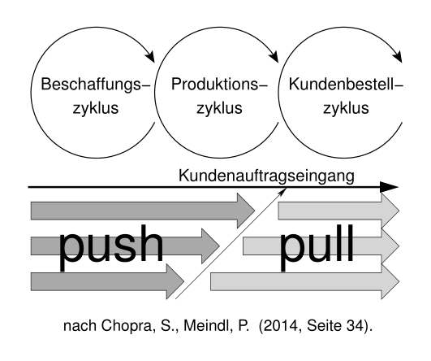
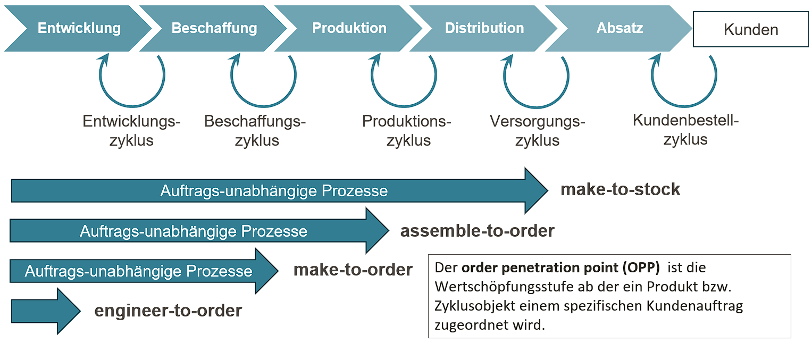
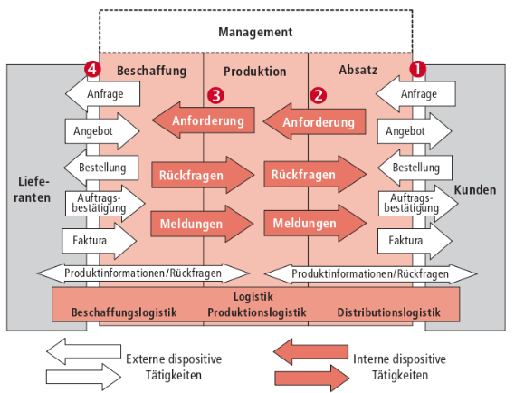
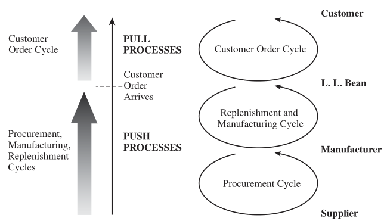
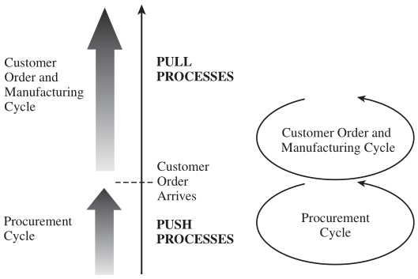
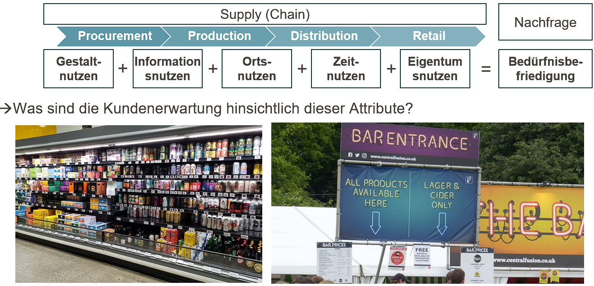

## Grundlagen des Supply Chain Managements {#slide-30}

- Aufgaben, Begriffe und Konzepte
- Ziele & Zielkonflikte
- Kosten & Management

## Wertschöpfung als Prozess {#slide-31}

{width="1500"}

:::::: columns
::: {.column width="50%"}
***Beschaffung*** ist der Prozess zum Einkauf und Bereit-stellung von Rohstoffen, Komponenten und Dienst-leistungen von externen Partnern, die für die Produktion von Waren und Dienstleistungen erforderlich sind.

***Produktion*** ist ein zielgerichteter Prozess der Kombination von Gütern und Dienstleistungen in höherwertige Produkte.

***Distribution*** umfasst die physische Verteilung von Waren vom Hersteller zum Endkunden und umfasst Lagerhaltung, Transport und Logistik von Fertigprodukten.

***Absatz*** ist der Prozess des Verkaufs der Endprodukte an den Konsumenten oder Handelspartner.
:::

:::: {.column width="50%"}
::: {.fragment .fade-up}

:::
::::
::::::

## Strategische Fertigung {#slide-32}

::: slide-subtitle
Entkopplungspunkt & Fertigungsstrategien
:::



## Strategische Fertigung {#slide-33}

::: slide-subtitle
Denken in Zyklen
:::

:::::: columns
:::: {.column width="50%"}
::: large-text
**Kundenbestellzyklus**: Verarbeitung von externen Kundenbedarfen

**Distributions-/Versorgungszyklus**: Umwandlung von Kundenbedarfen in interne Bedarfe an Fertigprodukten

**Produktionszyklus**: Umwandlung von internen Bedarfen in Produktions-bedarfe von Zwischenprodukten und Rohstoffen

**Beschaffungszyklus**: Gestaltung von Bestell-/Versorgungsprozessen für Rohstoffe und Dienstleistungen, die extern bezogen werden müssen
:::
::::

::: {.column width="50%"}
{width="707"}

(Kummer et al., 2022, S. 45)
:::
::::::

## Strategische Fertigung {#slide-34}

::: slide-subtitle
Entkopplung von Zyklen
:::

::::::: columns
:::: {.column width="50%"}
::: large-text
**Make-to-stock**
:::

{width="690"}

*Beispiele*: Lebensmitteleinzelhandel, Drogerien, ...
::::

:::: {.column width="50%"}
::: large-text
**Make-to-order**
:::

{width="600"}

*Beispiele*: Gebäude, Flugzeuge, Gemälde
::::
:::::::

(Chopra & Meindl, 2019)

## Strategische Ziele {#slide-35}

::: slide-subtitle
Kundenzufriedenheit -- Kundenerwartungen erfüllen
:::

{width="391"}

## Strategische Ziele {#slide-36}

::: slide-subtitle
Kundenzufriedenheit & Unsicherheit
:::

``` tikz
%%| label: fig-kundenzufriedenheit
%%| filename: kundenzufriedenheit.svg

\usetikzlibrary{calc,decorations.pathmorphing}

\begin{tikzpicture}[
  x=2.5cm,
  y=1.25cm,
  >=latex,
  font=\Large
]

% Farben
\definecolor{boxblue}{RGB}{201,230,242}
\definecolor{linegray}{RGB}{90,90,90}
\definecolor{fillgray}{RGB}{245,245,245}

% Oberer Baum
\node[
  draw=linegray,
  thick,
  fill=fillgray,
  minimum width=3.1cm,
  minimum height=0.9cm
] (dim) at (8.1,7.1) {Dimensionen};

\node[
  draw=linegray,
  thick,
  fill=fillgray,
  minimum width=2.3cm,
  minimum height=0.9cm
] (kosten) at (2.4,5.3) {Kosten};

\node[
  draw=linegray,
  thick,
  fill=fillgray,
  minimum width=2.3cm,
  minimum height=0.9cm
] (quali) at (5.0,5.3) {Qualität};

\node[
  draw=linegray,
  thick,
  fill=fillgray,
  minimum width=2.3cm,
  minimum height=0.9cm
] (zeit) at (7.6,5.3) {Zeit};

\node[
  draw=linegray,
  thick,
  fill=fillgray,
  minimum width=2.3cm,
  minimum height=0.9cm,
  align=center
] (zuver) at (10.2,5.3) {Zuverlässig-\\keit};

\node[
  draw=linegray,
  thick,
  fill=fillgray,
  minimum width=2.3cm,
  minimum height=0.9cm,
  align=center
] (zug) at (12.8,5.3) {Zugänglich-\\keit};

% Verbindung Dimensionen -> fünf Dimensionen
\coordinate (junction) at (8.1,6.45);

\draw[linegray, thick] (dim.south) -- (junction);
\draw[linegray, thick] (2.4,6.45) -- (12.8,6.45);

\foreach \n in {kosten,quali,zeit,zuver,zug} {
  \draw[linegray, thick] (\n.north) -- (\n.north |- junction);
}

% Servicedimensionen
\node[
  draw=linegray,
  thick,
  decorate,
  decoration={
    random steps,
    segment length=12pt,
    amplitude=0.8pt
  },
  fill=fillgray,
  minimum width=7.3cm,
  minimum height=0.95cm,
  align=center
] (service) at (10.1,3.7) {Servicedimensionen};

\draw[linegray, thick] (zeit.south) -- ++(0,-0.35) -| (service.north);
\draw[linegray, thick] (zuver.south) -- ++(0,-0.18) |- (service.north);


\end{tikzpicture}
```

:::::::::::: columns
::: {.column width="40%"}
**Kunden und Supply-Chain-Unsicherheit**

- Nachfragemenge je Kundenauftrag
- Lieferzeit, die von Kunden akzeptiert wird
- Erwartete Produktvielfalt
- Erwartete Lieferbereitschaft
- Preis/Zahlungsbereitschaft
- Innovationsgrad der Produkte
:::

:::::::::: {.column width="60%"}
::::::::: large-text
::: vspace-2
:::

:::: {.fragment .fade-up}
::: callout-note
## Nachfrageunsicherheit

Unsicherheit der Nachfrage nach einem Produkt
:::
::::

::: vspace-2
:::

:::: {.fragment .fade-up}
::: callout-note
## Implizierte Nachfrageunsicherheit

Unsicherheit desjenigen Nachfragesegments, das durch die Supply Chain bedient werden soll basierend auf den definierten Nachfrageattributen
:::
::::
:::::::::
::::::::::
::::::::::::

## Umgang mit Unsicherheit {#slide-37}

::: slide-subtitle
Kundenbedürfnisse & implizierte Unsicherheit
:::

::: large-text
| Kundenbedürfnisse | Verursacht implizite Unsicherheit da ... |
|:-------------------------------|:---------------------------------------|
| (max.) Nachfragemengen steigen | Erhöhte Spannweite des Bedarfs größere Varianz / Schwankung der Nachfragemengen verursacht |
| Lieferzeit sinkt | Weniger Zeit bleibt um auf Nachfrageschwankungen zu reagieren |
| Anzahl angebotener Produkte erhöht | Nachfrage der einzelnen Produkte schwieriger zu prognostizieren |
| Lieferbereitschaftsgrad erhöht sich | Nachfragespitzen müssen nun abgefedert werden |
| Innovationsgrad erhöht sich | Nachfrage neuer Produkte in der Regel unbekannt oder schwer zu prognostizieren |
| Anzahl der Vertriebskanäle steigt | Nachfrage der einzelnen Vertriebskanäle schwieriger zu prognostizieren |
:::

## Umgang mit Unsicherheit {#slide-38}

::: slide-subtitle
Rollen & Risikoallokation in Supply Chain
:::

::: {.r-stretch .tikz-slide}
``` tikz
%%| label: fig-implied-uncertainty
%%| fig-width: 12
%%| fig-height: 5
%%| fig-align: center

% Farben
\definecolor{boxblue}{RGB}{201,230,242}
\definecolor{linegray}{RGB}{90,90,90}
\definecolor{fillgray}{RGB}{245,245,245}

\usetikzlibrary{calc,decorations.pathmorphing}


\begin{tikzpicture}[
  x=1cm,
  y=1cm,
  font=\normalsize,
  box/.style={
    draw=black,
    line width=0.8pt,
    minimum height=0.90cm,
    align=center
  },
  chainlabel/.style={
    font=\bfseries\large,
    anchor=west
  },
  connector/.style={
    ->,
    line width=0.9pt
  },
  uncertainty/.style={
    <->,
    line width=2.8pt
  }
]

\useasboundingbox (-1.45,-1.60) rectangle (12.5,5);

\node[box, minimum width=2.5cm] (sup1) at (0,3) {Lieferant};
\node[box, minimum width=2.5cm, anchor=west] (man1) at (1.25,3) {Produzent};
\node[box, minimum width=5cm, anchor=west] (ret1) at (3.75,3) {Händler};
\node[chainlabel] at (9.0,3) {Supply Chain I};

\node[
  draw=linegray,
  thick,
  decorate,
  decoration={
    random steps,
    segment length=12pt,
    amplitude=0.8pt
  },
  fill=fillgray,
  minimum width=10cm,
  minimum height=0.95cm,
  align=center
] at (3.75,1.85)
{gesamte implizierte Unsicherheit der Supply Chain};


\node[box, minimum width=2.5cm] (sup2) at (0,0.75) {Lieferant};
\node[box, minimum width=5cm, anchor=west] (man2) at (1.25,0.75) {Produzent};
\node[box, minimum width=2.5cm, anchor=west] (ret2) at (6.25,0.75) {Händler};
\node[chainlabel] at (9.0,0.75) {Supply Chain II};


\node[
  anchor=west,
  font=\scriptsize,
  text=black!65
] at (-1.25,-1.45) {(Chopra \& Meindl, 2019)};

\end{tikzpicture}
```
:::

## Umgang mit Unsicherheit {#slide-39}

::: slide-subtitle
Reaktionsfähigkeit / responsiveness
:::

:::::::::: columns
:::::: {.column width="50%"}
::::: large-text
::: callout-note
## Reaktionsfähigkeit

ist die Fähigkeit einer Supply Chain mit Nachfrageunsicherheit umzugehen
:::

::: vspace-2
:::

*Reaktionsfähigkiet kann u.a. erreicht werden durch*:

- Hohe Lagerbestände
- Kurze Reaktions -/ Lieferzeiten
- Hohe Produktvielfalt
- Kurze Entwicklungszyklen neuer Produkte
- Hohe Bereitschaftsgrade
- Reduktion von Versorgungsunsicherheiten
:::::
::::::

::::: {.column width="50%"}
:::: {.fragment .fade-up}
::: {style="width:100%; text-align:center;"}
``` tikz
%%| label: fig-strategic-fit
%%| fig-width: 12
%%| fig-height: 6
%%| out-width: 100%
%%| fig-align: center

\begin{tikzpicture}[
  x=2cm,
  y=2cm,
  font=\LARGE,
  axis/.style={->, line width=0.8pt},
  fitarrow/.style={
    ->,
    line width=6pt,
    draw=black!35
  }
]

% Zeichenfläche eng um die Grafik legen
\useasboundingbox (-2,-1.50) rectangle (8,6.35);

% Achsen
\draw[axis] (0,0) -- (6.75,0);
\draw[axis] (0,0) -- (0,5.85);

% X-Achse: Nachfrageunsicherheit
\node[anchor=north west] at (0,-0.25) {niedrig};
\node[anchor=north] at (3.35,-0.65) {\textbf{Nachfrageunsicherheit}};
\node[anchor=north east] at (6.75,-0.25) {hoch};

% Y-Achse: Supply-Chain-Optimierungsziel
\node[
  rotate=90,
  anchor=south,
  align=center
] at (-0.95,2.90) {\textbf{Supply-Chain-Optimierungsziel}};

\node[
  rotate=90,
  anchor=south
] at (-0.45,1.00) {Effizienz};

\node[
  rotate=90,
  anchor=south
] at (-0.45,4.60) {Reaktionsfähigkeit};

% Diagonaler Strategic-Fit-Pfeil
\draw[fitarrow] (0.75,0.85) -- (6.10,5.65);

% Beschriftung des Pfeils
\node[
  rotate=42,
  text=black,
] at (3.35,3.40) {Strategic Fit};

% Produkt-/Marktbeispiele
\node[
  anchor=west,
  align=left,
  text=black!80
] at (0.38,1.18) {Etablierte\\Grundstoffe};

\node[
  anchor=west,
  align=left,
  text=black!80
] at (4.62,5.18) {Neues Produkt in\\neuem Markt};

\end{tikzpicture}
```
:::
::::
:::::
::::::::::

## Strategische Ziele {#slide-40}

::: slide-subtitle
Reaktionsfähigkeit vs. Effizienz
:::

:::::::::::: large-text
::::::::::: columns
::::::: {.column width="50%"}
::: callout-note
## Reaktionsfähigkeit

Die Reaktionsfähigkeit einer Supply Chain ist die Fähigkeit einer Supply Chain mit Nachfrageunsicherheit umzugehen
:::

::: vspace-2
:::

:::: {.fragment .fade-up}
**Strategische Treiber**

``` tikz
%%| label: fig-strategic_drivers
%%| fig-width: 9
%%| fig-height: 6
%%| out-width: 100%
%%| fig-align: center

\begin{tikzpicture}[
  x=2cm,
  y=1cm,
  font=\LARGE\bfseries
]

% Zeichenfläche auf die tatsächlichen Inhalte begrenzen
\useasboundingbox (-1.25,0) rectangle (10.25,1.5);

\node[box, fill=black!20, minimum width=4cm, minimum height=1.5cm] at (0,0.75) {Produktion};
\node[box, fill=black!20, minimum width=4cm, minimum height=1.5cm] at (2.25,0.75) {Logistik};
\node[box, fill=black!20, minimum width=4cm, minimum height=1.5cm] at (4.5,0.75) {Struktur};
\node[box, fill=black!20, minimum width=4cm, minimum height=1.5cm] at (6.75,0.75) {Preis};
\node[box, fill=black!20, minimum width=4cm, minimum height=1.5cm] at (9,0.75) {Infrastruktur};

\end{tikzpicture}
```

::: vspace-2
:::

$\rightarrow$ Reaktionsfähigkeit verursacht Kosten!
::::
:::::::

::::: {.column width="50%"}
:::: {.fragment .fade-up}
::: callout-note
## Effizienz

Effizienz einer Supply Chain ist das Inverse der Gesamtkosten einer Supply Chain, d.h. aller Kosten eines Produkts von
:::

``` tikz
%%| label: fig-cost-responsiveness-frontier
%%| fig-width: 9
%%| fig-height: 6
%%| out-width: 100%
%%| fig-align: center

\begin{tikzpicture}[
  x=2cm,
  y=2cm,
  font=\LARGE,
  axis/.style={->, line width=1.1pt},
  frontier/.style={line width=1.0pt}
]

% Zeichenfläche auf die tatsächlichen Inhalte begrenzen
\useasboundingbox (-1.5,-1) rectangle (10,6.7);

% Achsen
\draw[axis] (0,0) -- (7.40,0);
\draw[axis] (0,0) -- (0,6.00);

% Kostenachse
\node[anchor=south] at (0,6.05) {Kosten};
\node[anchor=east] at (-0.15,5.15) {niedrig};
\node[anchor=east] at (-0.15,0.28) {hoch};

% Reaktionsfähigkeitsachse
\node[anchor=west] at (7.55,0) {Reaktionsfähigkeit};
\node[anchor=north west] at (0.15,-0.20) {niedrig};
\node[anchor=north] at (6.05,-0.20) {hoch};

% Kosten-Reaktionsfähigkeits-Grenze
\draw[frontier]
  (0.02,5.10)
  .. controls (2.40,5.05) and (5.95,3.95) ..
  (6.10,0.02);

\end{tikzpicture}
```
::::
:::::
:::::::::::
::::::::::::

## Strategisches Management {#slide-41}

::: slide-subtitle
Supply Chain Treiber
:::

::: {.r-stretch .tikz-slide}
``` tikz
%%| label: fig-supply-chain-treiber
%%| fig-width: 12
%%| fig-height: 3
%%| out-width: 96%
%%| fig-align: center

\begin{tikzpicture}[
  x=2cm,
  y=1cm,
  font=\small,
  header/.style={
    draw=black!70,
    line width=0.8pt,
    fill=black!8,
    minimum width=2.15cm,
    minimum height=0.75cm,
    align=center,
    font=\bfseries\Large
  },
  driver/.style={
    fill=black!20,
    text=black,
    minimum width=3cm,
    minimum height=1cm,
    align=center,
    font=\bfseries\Large
  },
  bullet/.style={
    anchor=north west,
    align=left,
    text width=2.15cm,
    font=\normalsize
  },
  arrow/.style={
    ->,
    line width=0.75pt,
    draw=black!75
  }
]

% Enger Exportbereich ohne große Leerflächen
\useasboundingbox (0.1,-0.70) rectangle (12.35,3.05);

% Primärziel
\node[header, minimum width=2.30cm] (goal) at (5.80,2.45) {Primärziel};

% Zielkonflikt: Effizienz versus Reaktionsfähigkeit
\node[font=\LARGE, anchor=east] at (1.65,1.48) {Effizienz};
\node[font=\LARGE, anchor=west] at (10.00,1.48) {Reaktionsfähigkeit};

\draw[<->, line width=0.85pt, draw=black!70]
  (2.05,1.43) -- (9.65,1.43);

% Verbindung vom Primärziel zur Zielachse
\draw[arrow] (goal.south) -- (5.80,1.45);

% Kopfboxen der Treiber
\node[driver] (production)  at (0.95,0.20) {Produktion};
\node[driver] (logistics)   at (3.45,0.20) {Logistik};
\node[driver] (structure)   at (5.95,0.20) {Struktur};
\node[driver] (price)       at (8.45,0.20) {Preis};
\node[driver] (information) at (10.95,0.20) {Information};

% Verbindungen: Zielachse zu Treibern
\draw[arrow] (5.80,1.43) -- (production.north);
\draw[arrow] (5.80,1.43) -- (logistics.north);
\draw[arrow] (5.80,1.43) -- (structure.north);
\draw[arrow] (5.80,1.43) -- (price.north);
\draw[arrow] (5.80,1.43) -- (information.north);

\end{tikzpicture}
```
:::

:::: {.large-text}
::::: columns
::: {.column width="20%"}
- Produktions-  technologie
- Produktportfolio
- Fertigungstiefe
:::

::: {.column width="20%"}
- Transportmodi
- Lagerkapazitäten
- Sicherheits- bestände
:::

::: {.column width="20%"}
- Lieferanten- auswahl
- Standort- kapazitäten
- Stufen & Verbindungen
:::

::: {.column width="20%"}
- Preisgestaltung
- Nachfrage- steuerung
- Rabattierung
:::

::: {.column width="20%"}
- Informations-teilung
- System- integration
- Kollaborative Prognose & Planung
:::
:::::
::::

## Strategisches Management

::: slide-subtitle
Teilstrategien
:::

|   | **Effiziente Supply Chains** | **Reaktive Supply Chains** |
|--------------|:-----------------------|:-----------------------|
| **Primärziel** | Nachfragebefriedigung zu niedrigsten Kosten | Schnellstmögliche Nachfragebefriedigung |
| **Produkt-Design-Strategie** | Geringe Produktvielfalt , Konzentation auf einfaches Design und hohe Durchsätze | Modulare Produktentwicklung und Postponement |
| **Preisstrategie** | Niedrige Preise und Margen da Kunden preissensitiv | Höhere Preise mit höherer Marge, da Kunden wenig preissensitiv |
| **Fertigungsstrategie** | Hohe Maschinenauslastung | Freie Kapazitäten um kurzfristig Produktionsmengen ausweiten zu können |
| **Lagerstrategie** | Minimierung von (Sicherheits-)Beständen | Einrichtung von Sicherheitsbeständen zur Absicherung von Nachfrageschwankungen |
| **Versorgungsstrategie** | Reduziere Zykluszeiten solange Kosten nicht steigen | Reduziere Zykluszeiten auch wenn Kosten steigen |
| **Beschaffungsstrategie** | Lieferantenauswahl nach Kosten und Verlässlichkeit | Lieferantenauswahl nach Reaktionsfähigkeit, Geschwindigkeit, Flexibilität und Qualität |

## Strategisches Management {#slide-42}

::: slide-subtitle
Normstrategien & SCM
:::

::: vspace-2
:::

<!-- | Definition Strategie (nach Gabler Wirtschaftslexikon) | -->
<!-- |:-----------------------------------------------------------------------| -->
<!-- | Strategie ist die grundsätzliche, langfristige Verhaltensweise (Maßnahmenkombination) der Unternehmung und relevanter Teilbereiche gegenüber ihrer Umwelt zur Verwirklichung der langfristigen Ziele. | -->


| **Normstrategie** | **Vorteil** | **Wettbewerbsbasis** | **Beitrag des SCM** |
|:-----------------|:-----------------|:-----------------|:-----------------|
| Kostenführer | Kosteneffiziente Produktion anstoßen | Niedrigste Preise in der Produktkategorie | Effiziente kostengünstige Infrastruktur |
| Innovationsführer | Marktstärke nutzen und singuläre Technologie einsetzen | Begehrte und innovative Produkte generieren | Kurze Time- to -Market sichern, Volumen steigern |
| Serviceführer | Service auf Kunden konsequent zuschneiden | Erwartungen kundenspezifisch erfüllen | Kundenorientierte Entwicklung ermöglichen |
| Qualitätsführer | Sichere und zuverlässige Produkte herstellen | Singuläre Produkteigenschaften | Verlässliche SC, Quality Assurance |
| Nachhaltigkeitsführer | Nachhaltige Produkte und Prozesse | Nachhaltigkeitserwartungen der Kunden erfüllen | CO2-Neutralität, Energie- und Ressourcen-Schonung |


