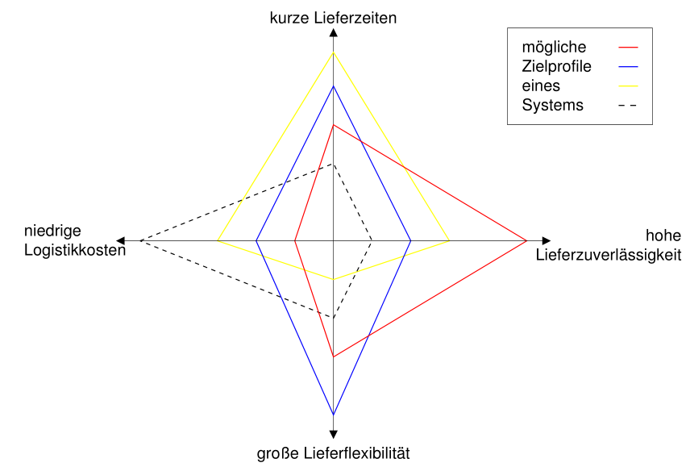
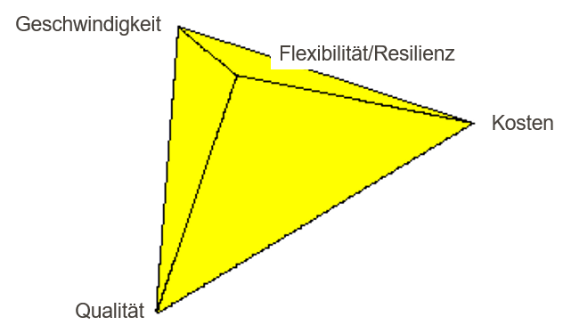
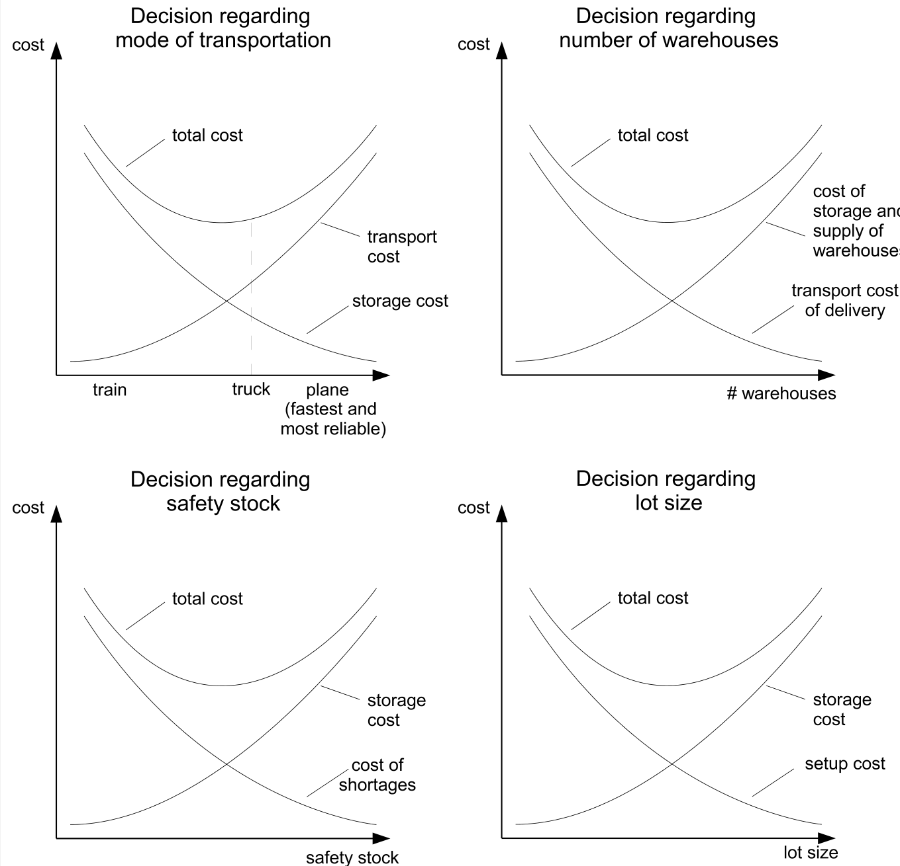
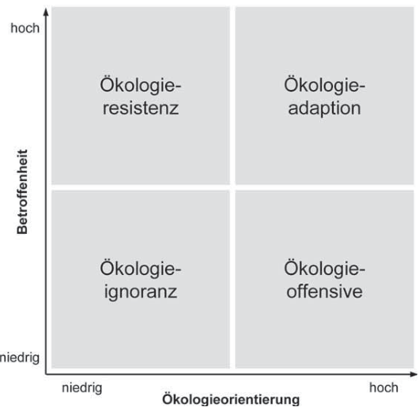
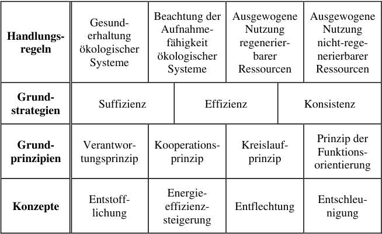

## Grundlagen des Supply Chain Managements {#slide-52}

- Aufgaben, Begriffe und Konzepte
- Ziele & Zielkonflikte
- Kosten & Management

Supply Chain Management

52

## Arten von Zielen im Unternehmen {#slide-53}

53

Supply Chain Management

(Dyckhoff, 1998)

Ebenen im Managementsystem

Ziele in Managementsystemen

## Ziele in Logistik und SCM {#slide-54}

54

::: {.smartart .radial5 data-smartart-layout="radial5"}
**Zielgrößen**

- Kosten
- Lieferzeit
- Information
- Flexibilität
- Lieferqualität
- Liefertreue
:::

Supply Chain Management

- Lieferzeit

<!-- -->

- Zeitspanne zwischen Auftragserteilung und Auftragserfüllung

<!-- -->

- Liefertreue

<!-- -->

- Verhältnis zwischen zugesagtem und tatsächlichem Liefertermin

<!-- -->

- Lieferqualität

<!-- -->

- Anteil qualitativ und quantitativ korrekt ausgeführter Aufträge

<!-- -->

- Flexibilität/Resilienz

<!-- -->

- Realisierbarkeit kurzfristiger Mengen-, Termin- und Spezifikationsänderungen

<!-- -->

- Information

<!-- -->

- Qualität und Transparenz der Information in allen Phasen der Auftragsabwicklung

<!-- -->

- Kosten

<!-- -->

- Effizienz aller Logistikaktivitäten

<!-- -->

- 
- 

Traditionelle  Zielmetriken

## Supply Chain  management   zielDimensionen {#slide-55}

Konflikte & Profile

Supply Chain Management

55

Kosten

Zieldimensionen

Zielprofile

## Logistikkosten {#slide-56}

- In vielen Teilbereichen der Logistik widerstreitende Kostenkomponenten   Kostenoptimum existiert (zumindest theoretisch)

Logistikmanagement heißt u.a.  Ent -scheidungen über Logistiksysteme treffen

Transparenz der Kostenfunktionen z.T. stark eingeschränkt

Datenverfügbarkeit

Intertemporale Zurechenbarkeit

Kostenträgerschaft

Stochastizität

...

Abwägungsentscheidungen in Logistik und SCM

Supply Chain Management

56

## Logistikkosten {#slide-57}

Logistikkosten : bewerteter Verzehr von Sachgütern und Dienstleistungen zum Zweck der Erbringung logistischer Dienstleistungen.

Beispiele

Supply Chain Management

57

## Supply Chain  Costing {#slide-58}

Beispiel -- Apple Video IPod 30 GB

Supply Chain Management

58

::: {.smartart .chevron1 data-smartart-layout="chevron1"}
:::

Kunden

USA

Japan

Hard  drive  + Display

Korea

Memory

USA

Processor  +  flash

Others

Battery  + ...

China

assembly

USA

distribution

USA

retail

USA

Apple

Verkaufspreis : \$299

\$97

\$3

\$16

\$24

\$140

\$4

\$75

Herstellungskosten (von Apple):  \$219

Deckungsbeitrag Apple : absolut:  \$80,  relative : 26%

(Dedrick et al. 2008)

## Sustainable  Supply Chain  management {#slide-59}

Nachhaltigkeit als Zieldimension

Supply Chain Management

59

  Definition (Versuch)
  -----------------------------------------------------------------------------------------------------------------------------------------------------------------------------------------------------------------------------------------------------------------------------------------------------------------
  Ein Gesellschaftssystem wird als nachhaltig bezeichnet, wenn es  intra- als intergenerativ gerecht  angesehen werden kann. Gerecht  heisst  „die  Bedürfnisse  der  Gegenwart  befriedigt, ohne zu riskieren, dass  künftige   Generationen  ihre eigenen  Bedürfnisse  nicht befriedigen können" (Hauff, 1987)

Nachhaltigkeit & nachhaltige Entwicklung

Mögliche Zieldimensionen

( Baumast  & Pape, 2013)

( Baumast  & Pape, 2013)

## Strategic Fit & Strategiewahl {#slide-60}

Nachhaltigkeit & SCM-Strategie

Supply Chain Management

60

(Dyckhoff, 2008)

(Günther, 2008)

## Nachhaltigkeit {#slide-61}

Allgemeine Konzepte

Supply Chain Management

61

::: {.smartart .pyramid1 data-smartart-layout="pyramid1"}
:::

Nachhaltigkeitspyramide

(Ellen MacArthur  Foundation )

## Sustainable  Supply Chain Management {#slide-62}

Begriffsabgrenzung

Supply Chain Management

62

Beschaffung

Res-sourcen

Produktion

Distribution

Absatz

Kunden

Nutzung

Rückgabe

Wieder-nutzung

Wiederauf -bereitung

Wiederauf -integration

Recycling

Abfallverwertung

Lineare/klassische Supply Chain 

Reverse Supply Chain 

Circular  Supply Chain 

  Sustainable  SCM  bezeichnet die Planung, Ausführung und Kontrolle von Geschäftsprozessen unter Berücksichtigung ökonomischer, ökologischer und sozialer Ziele um die langfristige Wettbewerbsfähigkeit der Supply Chain sicherzustellen.
  -------------------------------------------------------------------------------------------------------------------------------------------------------------------------------------------------------------------------------------------

## Sustainable  SCM {#slide-63}

Planungsaufgaben

Supply Chain Management

63

Stint (2017)

## Sustainable  Supply Chain Management {#slide-64}

Circular  Supply Chains & strategische Konzepte

Supply Chain Management

64

Beschaffung

Produktion

Distribution

Absatz

Nutzung

Rückgabe

Wieder-nutzung

Wiederauf -bereitung

Re-integration

Recycling

- Circular   Product  Design

<!-- -->

- Reyclingfähigkeit
- Wiederverwendung
- Recycled   content

<!-- -->

- Sustainable   logistics

<!-- -->

- Gewichtsreduktion
- Distanzreduktion
- Transportvermeidung

<!-- -->

- Circular   production

<!-- -->

- Erneuerbare Energie
- Verwendung von Produktionsabfällen
- Kreislaufführung von Betriebs- und Hilfsstoffen

ReUse

ReManufacturing

Abfall-verwertung

## Circular  Supply Chain Management {#slide-65}

Normstrategien Produktdesign

Supply Chain Management

65

Produkt-

komplexität

Kunden-

präferenzen

hoch

niedrig

dynamisch

statisch

Computer

Smartphones

Stahl

Verpackungen

Möbel

Bekleidung

Haushaltsgeräte

Autos

Design  for  

Recycled  Content

Design  for  

Repair  &  Durability

Design  for   Remanufacture  & 

Reuse

Design  for  

Recycling

In Anlehnung an  Bouchery  et al. 2017

