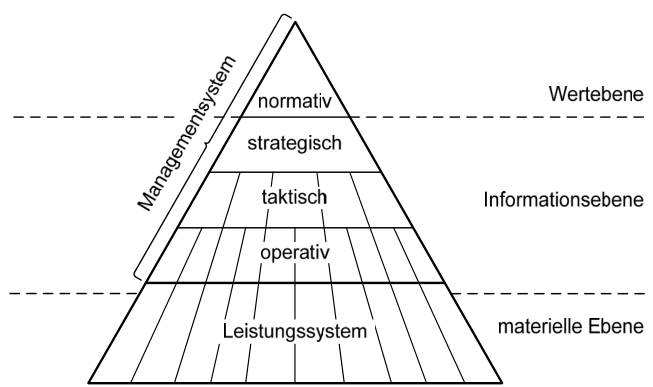
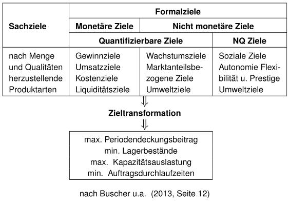
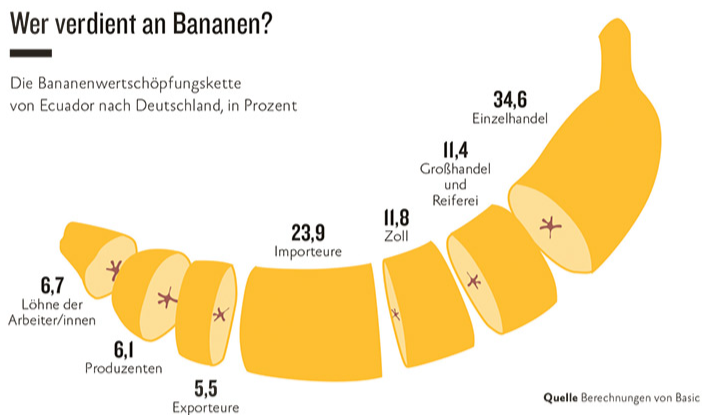
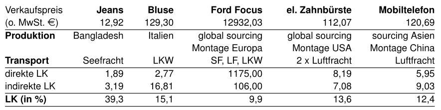
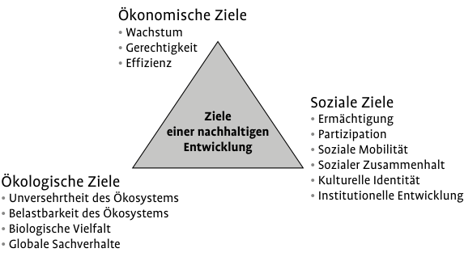
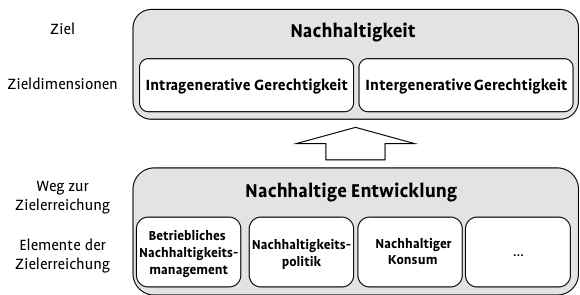
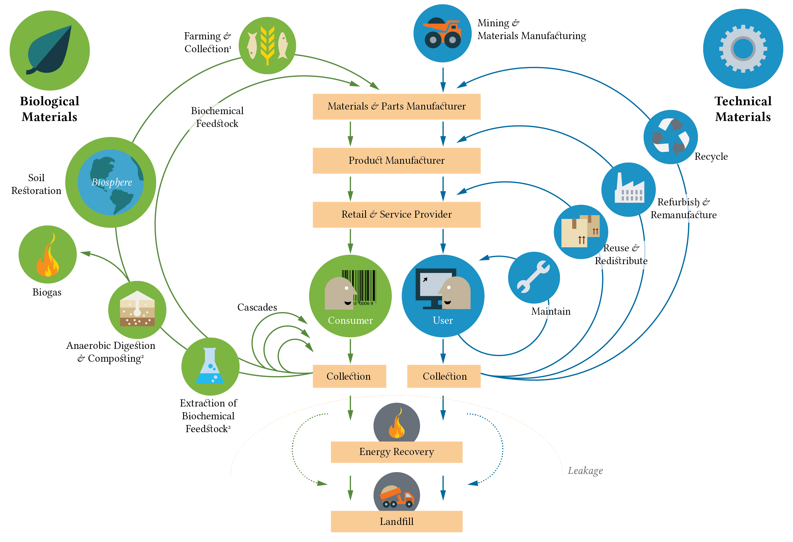
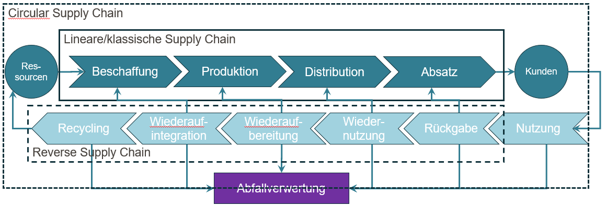
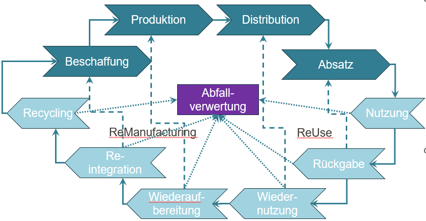
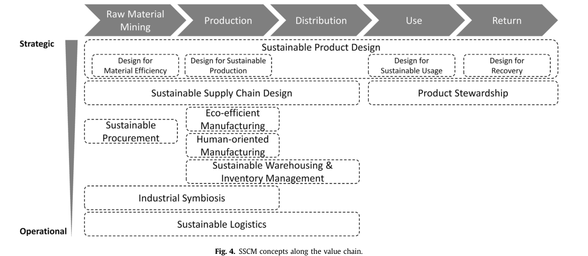

## Grundlagen des Supply Chain Managements {#slide-52}

- Aufgaben, Begriffe und Konzepte
- Ziele & Zielkonflikte
- **Kosten & Management**

## Arten von Zielen im Unternehmen {#slide-53}

::::::: columns
:::: {.column width="50%"}
::: large-text
**Ebenen im Managementsystem**
:::

 (Dyckhoff, 1998)
::::

:::: {.column width="50%"}
::: large-text
**Ziele im Managementsystem**
:::


::::
:::::::

## Ziele in Logistik und SCM {#slide-54}

::: slide-subtitle
Traditionelle Zielmetriken
:::

:::::: columns
::: {.column width="50%"}
``` tikz
%%| label: fig-scm-zielgroessen
%%| fig-width: 6
%%| fig-height: 6
%%| out-width: 95%
%%| fig-align: center

\begin{tikzpicture}[
  x=2.5cm,
  y=2.5cm,
  font=\LARGE\bfseries,
  target/.style={
    circle,
    minimum size=4cm,
    inner sep=0pt,
    align=center,
    font=\LARGE
  },
  arrow/.style={
    ->,
    line width=8pt,
    draw=blue!15!black!25
  }
]

% Fläche eng auf das Diagramm beschränken
\useasboundingbox (-3.70,-3.95) rectangle (3.70,3.95);

% Zentrum
\node[
  circle,
  fill=black!35,
  text=white,
  minimum size=4cm,
  align=center,
  font=\LARGE\bfseries
] (center) at (0,0) {Zielgrößen};

% Sechs Zielgrößen im Kreis
\node[target, fill=green!100!black, text=black] (loyalty)
  at (0,2.55) {Liefertreue};

\node[target, fill=orange!85!yellow, text=black] (quality)
  at (2.20,1.28) {Lieferqualität};

\node[target, fill=blue!85!violet!50!white, text=black] (information)
  at (2.20,-1.28) {Information};

\node[target, fill=red, text=black] (costs)
  at (0,-2.55) {Kosten};

\node[target, fill=green!60!black, text=black] (flexibility)
  at (-2.20,-1.28) {Flexibilität};

\node[target, fill=green!85!yellow, text=black] (leadtime)
  at (-2.20,1.28) {Lieferzeit};

% Kreisförmige Verbindungspfeile zwischen Zentrum und Außenkreis
% Die gekrümmten Pfeile bilden den zyklischen Charakter der Vorlage ab.
\draw[arrow] (center.north) to (loyalty.south);
\draw[arrow] (center.north east) to (quality.west);
\draw[arrow] (center.south east) to (information.west);
\draw[arrow] (center.south) to (costs.north);
\draw[arrow] (center.west) to (flexibility.north east);
\draw[arrow] (center.north west) to (leadtime.east);
\end{tikzpicture}
```
:::

:::: {.column width="50%"}
::: small-text
- **Lieferzeit**: Zeitspanne zwischen Auftragserteilung und Auftragserfüllung
- **Liefertreue**: Verhältnis zwischen zugesagtem und tatsächlichem Liefertermin
- **Lieferqualität**: Anteil qualitativ und quantitativ korrekt ausgeführter Aufträge
- **Flexibilität/Resilienz**: Realisierbarkeit kurzfristiger Mengen-, Termin- und Spezifikationsänderungen
- **Information**: Qualität und Transparenz der Information in allen Phasen der Auftragsabwicklung
- **Kosten**: Effizienz aller Logistikaktivitäten, Gesamtkosten der logistischen Aktivitäten
:::
::::
::::::

## Zieldimensionen {#slide-55}

::: slide-subtitle
Konflikte & Profile
:::

:::::: columns
::: {.column width="50%"}
**Zieldimensionen**

```{r}
#| echo: false
#| warning: false
#| message: false
#| out-width: "99%"

library(plotly)

# Vier Ecken des Tetraeders
# 1–3: Grundfläche; 4: Spitze
punkte <- data.frame(
  ziel = c(
    "Qualität",
    "Geschwindigkeit",
    "Kosten",
    "Flexibilität / Resilienz"
  ),
  x = c(-3.8,  0.0,  3.8,  0.0),
  y = c(-2.2,  3.2, -2.2,  0.0),
  z = c( 0.0,  0.0,  0.0,  4.2)
)

# Vier Dreiecksflächen:
# Grundfläche (0,1,2) und die drei Seitenflächen zur Spitze (3).
faces_i <- c(0, 0, 0, 1)
faces_j <- c(1, 2, 3, 2)
faces_k <- c(2, 3, 1, 3)

fig <- plot_ly() |>
  add_trace(
    type = "mesh3d",
    x = punkte$x,
    y = punkte$y,
    z = punkte$z,
    i = faces_i,
    j = faces_j,
    k = faces_k,
    intensity = c(0.20, 0.55, 0.85, 1.00),
    colors = c("#FFF700", "#FFD000", "#F4B400", "#FFF9A8"),
    opacity = 0.78,
    flatshading = TRUE,
    showscale = FALSE,
    hoverinfo = "skip",
    name = "Zielkonflikt"
  ) |>
  add_trace(
    type = "scatter3d",
    mode = "lines",
    x = c(
      punkte$x[1], punkte$x[2], punkte$x[3], punkte$x[1], NA,
      punkte$x[1], punkte$x[4], NA,
      punkte$x[2], punkte$x[4], NA,
      punkte$x[3], punkte$x[4]
    ),
    y = c(
      punkte$y[1], punkte$y[2], punkte$y[3], punkte$y[1], NA,
      punkte$y[1], punkte$y[4], NA,
      punkte$y[2], punkte$y[4], NA,
      punkte$y[3], punkte$y[4]
    ),
    z = c(
      punkte$z[1], punkte$z[2], punkte$z[3], punkte$z[1], NA,
      punkte$z[1], punkte$z[4], NA,
      punkte$z[2], punkte$z[4], NA,
      punkte$z[3], punkte$z[4]
    ),
    line = list(color = "#1A1A1A", width = 7),
    hoverinfo = "skip",
    showlegend = FALSE
  ) |>
  add_trace(
    type = "scatter3d",
    mode = "markers+text",
    x = punkte$x,
    y = punkte$y,
    z = punkte$z,
    text = c(
      "Qualität",
      "Geschwindigkeit",
      "Kosten",
      "Flexibilität<br>/ Resilienz"
    ),
    textposition = c(
      "bottom left",
      "top center",
      "bottom right",
      "top center"
    ),
    textfont = list(size = 15, color = "#202020"),
    marker = list(
      size = c(6, 6, 6, 9),
      color = c("#1A1A1A", "#1A1A1A", "#1A1A1A", "#3E3E3E")
    ),
    hovertemplate = "%{text}<extra></extra>",
    showlegend = FALSE
  ) |>
  layout(
    height = 480,
    width = 650,
    margin = list(l = 0, r = 0, b = 0, t = 0),
    paper_bgcolor = "white",
    scene = list(
      bgcolor = "white",
      xaxis = list(visible = FALSE),
      yaxis = list(visible = FALSE),
      zaxis = list(visible = FALSE),
      aspectmode = "manual",
      aspectratio = list(x = 1.25, y = 1.00, z = 0.90),
      camera = list(
        eye = list(x = 1.55, y = -1.60, z = 1.25)
      )
    )
  )

fig
```
:::

:::: {.column width="50%"}
::: {.fragment .fade-up}
**Zielprofile**

```{r}
#| echo: false
#| warning: false
#| message: false
#| out-width: "100%"

library(plotly)

scale_max <- 10

to_polygon <- function(top, right, bottom, left, name, color, dash = "solid") {
  data.frame(
    x = c(0, right, 0, -left, 0),
    y = c(top, 0, -bottom, 0, top),
    label = c("kurze Lieferzeiten", "hohe Lieferzuverlässigkeit",
              "große Lieferflexibilität", "niedrige Logistikkosten",
              "kurze Lieferzeiten"),
    profile = name,
    color = color,
    dash = dash
  )
}

p_red <- to_polygon(5.8, 8.7, 5.8, 1.8, "Profil 1", "#e53935", "solid")
p_blue <- to_polygon(7.6, 3.2, 8.6, 3.2, "Profil 2", "#3f51b5", "solid")
p_yellow <- to_polygon(9.3, 4.9, 1.5, 5.0, "Profil 3", "#e6df2a", "solid")
p_black <- to_polygon(3.6, 1.5, 3.6, 8.2, "Profil 4", "#333333", "dash")

profiles <- list(p_red, p_blue, p_yellow, p_black)

fig <- plot_ly()

# Achsen
fig <- fig |>
  add_segments(
    x = -scale_max, xend = scale_max,
    y = 0, yend = 0,
    line = list(color = "#555555", width = 1.2),
    hoverinfo = "skip",
    showlegend = FALSE
  ) |>
  add_segments(
    x = 0, xend = 0,
    y = -scale_max, yend = scale_max,
    line = list(color = "#555555", width = 1.2),
    hoverinfo = "skip",
    showlegend = FALSE
  )

# Pfeilspitzen
arrow_len <- 0.7
arrow_w   <- 0.28

arrow_df <- data.frame(
  x = c(0, 0, scale_max, -scale_max),
  y = c(scale_max, -scale_max, 0, 0),
  ax = c(0, 0, -arrow_len, arrow_len),
  ay = c(-arrow_len, arrow_len, 0, 0)
)

for (i in 1:nrow(arrow_df)) {
  fig <- fig |>
    add_annotations(
      x = arrow_df$x[i], y = arrow_df$y[i],
      ax = arrow_df$ax[i] * 20, ay = arrow_df$ay[i] * 20,
      xref = "x", yref = "y", axref = "pixel", ayref = "pixel",
      text = "",
      showarrow = TRUE,
      arrowhead = 2,
      arrowsize = 1.3,
      arrowwidth = 1.4,
      arrowcolor = "#111111"
    )
}

# Profile
for (p in profiles) {
  fig <- fig |>
    add_trace(
      data = p,
      x = ~x, y = ~y,
      type = "scatter",
      mode = "lines",
      name = unique(p$profile),
      line = list(
        color = unique(p$color),
        width = ifelse(unique(p$dash) == "dash", 2, 2.2),
        dash = unique(p$dash)
      ),
      hovertemplate = paste0(unique(p$profile), "<extra></extra>")
    )
}

# Achsenbeschriftungen
fig <- fig |>
  add_annotations(
    x = 0, y = scale_max + 1.0,
    text = "kurze Lieferzeiten",
    showarrow = FALSE,
    font = list(size = 18, color = "#222")
  ) |>
  add_annotations(
    x = scale_max + 1.8, y = 0,
    text = "hohe<br>Lieferzuverlässigkeit",
    showarrow = FALSE,
    xanchor = "left",
    font = list(size = 18, color = "#222")
  ) |>
  add_annotations(
    x = 0, y = -scale_max - 1.25,
    text = "große Lieferflexibilität",
    showarrow = FALSE,
    font = list(size = 18, color = "#222")
  ) |>
  add_annotations(
    x = -scale_max - 2.2, y = 0.1,
    text = "niedrige<br>Logistikkosten",
    showarrow = FALSE,
    xanchor = "right",
    font = list(size = 18, color = "#222")
  ) |>
  add_annotations(
    x = 15, y = 9.7,
    text = "mögliche<br>Zielprofile<br>eines<br>Systems",
    showarrow = FALSE,
    align = "left",
    xanchor = "left",
    yanchor = "top",
    bordercolor = "#6f6f6f",
    borderwidth = 0,
    borderpad = 10,
    bgcolor = "rgba(255,255,255,0.96)",
    font = list(size = 18, color = "#222")
  )

fig <- fig |>
  layout(
    height = 480,
    width = 650,
    paper_bgcolor = "white",
    plot_bgcolor = "white",
    margin = list(l = 120, r = 180, t = 30, b = 70),
    xaxis = list(
      visible = FALSE,
      range = c(-12.5, 13.2),
      fixedrange = TRUE
    ),
    yaxis = list(
      visible = FALSE,
      range = c(-11.5, 11.2),
      fixedrange = TRUE,
      scaleanchor = "x",
      scaleratio = 1
    ),
    legend = list(
      x = 0.80,
      y = 0.93,
      bgcolor = "rgba(0,0,0,0)",
      borderwidth = 0,
      font = list(size = 14)
    )
  )

fig
```
:::
::::
::::::

## Logistikkosten {#slide-56}

::: slide-subtitle
Abwägungsentscheidungen in Logistik und SCM
:::

:::::::: columns
:::: {.column width="60%"}
```{r}
#| echo: false
#| warning: false
#| message: false

library(plotly)

make_cost_tradeoff_plot <- function(
  titel,
  x_titel,
  x_vals,
  y_gesamt,
  y_kurve1,
  y_kurve2,
  label_gesamt = "Gesamtkosten",
  label_kurve1,
  label_kurve2,
  anno_gesamt,
  anno_kurve1,
  anno_kurve2,
  x_tickvals = NULL,
  x_ticktext = NULL,
  x_range = NULL,
  y_range = c(0.5, 9.3),
  height = 420,
  width = 600
) {

  fig <- plot_ly() |>
    add_trace(
      x = x_vals, y = y_gesamt,
      type = "scatter", mode = "lines",
      line = list(color = "#7a7a7a", width = 2),
      name = label_gesamt,
      hovertemplate = paste0(label_gesamt, "<extra></extra>")
    ) |>
    add_trace(
      x = x_vals, y = y_kurve1,
      type = "scatter", mode = "lines",
      line = list(color = "#9a9a9a", width = 2),
      name = label_kurve1,
      hovertemplate = paste0(label_kurve1, "<extra></extra>")
    ) |>
    add_trace(
      x = x_vals, y = y_kurve2,
      type = "scatter", mode = "lines",
      line = list(color = "#9a9a9a", width = 2),
      name = label_kurve2,
      hovertemplate = paste0(label_kurve2, "<extra></extra>")
    )

  if (is.null(x_range)) {
    x_range <- c(min(x_vals) - 0.2, max(x_vals) + 0.2)
  }

  fig |>
    layout(
      showlegend = FALSE,
      height = height,
      width = width,
      margin = list(l = 70, r = 40, t = 60, b = 70),
      paper_bgcolor = "white",
      plot_bgcolor = "white",
      xaxis = list(
        title = x_titel,
        tickmode = if (!is.null(x_tickvals)) "array" else "linear",
        tickvals = x_tickvals,
        ticktext = x_ticktext,
        showline = TRUE,
        linewidth = 1.5,
        linecolor = "black",
        zeroline = FALSE,
        showgrid = FALSE,
        showticklabels = is.null(x_tickvals) || !all(is.na(x_ticktext)),
        range = x_range,
        fixedrange = TRUE
      ),
      yaxis = list(
        title = "Kosten",
        showline = TRUE,
        linewidth = 1.5,
        linecolor = "black",
        zeroline = FALSE,
        showgrid = FALSE,
        showticklabels = FALSE,
        range = y_range,
        fixedrange = TRUE
      ),
      annotations = list(
        list(
          x = mean(range(x_vals)),
          y = y_range - 0.15,
          text = titel,
          showarrow = FALSE,
          font = list(size = 18)
        ),
        c(
          list(
            text = label_gesamt,
            showarrow = TRUE,
            arrowhead = 0,
            font = list(size = 13)
          ),
          anno_gesamt
        ),
        c(
          list(
            text = label_kurve1,
            showarrow = TRUE,
            arrowhead = 0,
            font = list(size = 13)
          ),
          anno_kurve1
        ),
        c(
          list(
            text = label_kurve2,
            showarrow = TRUE,
            arrowhead = 0,
            font = list(size = 13)
          ),
          anno_kurve2
        )
      )
    )
}

x.val<- seq(1,5, length.out = 100)
y.1 <- 0.1*x.val^2
y.2 <- 1/x.val
y.g <- y.1 + y.2

```

::: panel-tabset
### Transportmittel

```{r}
#| echo: false
#| warning: false
#| message: false
#| out-width: "100%"

make_cost_tradeoff_plot(
  titel = "Entscheidung über das<br>Transportmittel",
  x_titel = "",
  x_vals = x.val,
  y_gesamt = y.g,
  y_kurve1 = y.1,
  y_kurve2 = y.2,
  label_kurve1 = "Transport-<br>kosten",
  label_kurve2 = "Lagerkosten",
  anno_gesamt = list(x = 1.50, y = 0.95, ax = 55, ay = -30),
  anno_kurve1 = list(x = 2.8, y = 0.75, ax = 60, ay = 20),
  anno_kurve2 = list(x = 1.9, y = 0.55, ax = 55, ay = -30),
  x_tickvals = c(1, 2, 3),
  x_ticktext = c("Zug", "Lkw", "Flugzeug<br>(am schnellsten und<br>zuverlässigsten)"),
  x_range = c(0.8, 4),
  y_range = c(0, 2)
)
```

### Anzahl der Lager

```{r}
#| echo: false
#| warning: false
#| message: false
#| out-width: "100%"

make_cost_tradeoff_plot(
  titel = "Entscheidung über die<br>Anzahl der Lager",
  x_titel = "Anzahl Lager",
  x_vals = x.val,
  y_gesamt = y.g,
  y_kurve1 = y.1,
  y_kurve2 = y.2,
  label_kurve1 = "Kosten der<br>Lagerhaltung und<br>Versorgung der Lager",
  label_kurve2 = "Transportkosten<br>der Auslieferung",
  anno_gesamt = list(x = 1.50, y = 0.95, ax = 55, ay = -30),
  anno_kurve1 = list(x = 3.2, y = 0.95, ax = 60, ay = 20),
  anno_kurve2 = list(x = 1.9, y = 0.55, ax = 55, ay = -30),
  x_tickvals = NULL,
  x_ticktext = NULL,
  x_range = c(0.8, 4),
  y_range = c(0, 2)
)
```

### Sicherheitsbestand

```{r}
#| echo: false
#| warning: false
#| message: false
#| out-width: "100%"

make_cost_tradeoff_plot(
  titel = "Entscheidung über den<br>Sicherheitsbestand",
  x_titel = "Sicherheitsbestand",
  x_vals = x.val,
  y_gesamt = y.g,
  y_kurve1 = y.1,
  y_kurve2 = y.2,
  label_kurve1 = "Lagerkosten",
  label_kurve2 = "Fehlmengen-<br>kosten",
  anno_gesamt = list(x = 1.50, y = 0.95, ax = 55, ay = -30),
  anno_kurve1 = list(x = 3.2, y = 0.95, ax = 60, ay = 20),
  anno_kurve2 = list(x = 1.9, y = 0.55, ax = 55, ay = -30),
  x_tickvals = c(1),
  x_ticktext = c(""),
  x_range = c(0.8, 4),
  y_range = c(0, 2)
)
```

### Losgröße

```{r}
#| echo: false
#| warning: false
#| message: false
#| out-width: "100%"

make_cost_tradeoff_plot(
  titel = "Entscheidung über die<br>Losgröße",
  x_titel = "Losgröße",
  x_vals = x.val,
  y_gesamt = y.g,
  y_kurve1 = y.1,
  y_kurve2 = y.2,
  label_kurve1 = "Lagerkosten",
  label_kurve2 = "Rüstkosten",
  anno_gesamt = list(x = 1.50, y = 0.95, ax = 55, ay = -30),
  anno_kurve1 = list(x = 3.2, y = 0.95, ax = 60, ay = 20),
  anno_kurve2 = list(x = 1.9, y = 0.55, ax = 55, ay = -30),
  x_tickvals = c(1),
  x_ticktext = c(""),
  x_range = c(0.8, 4),
  y_range = c(0, 2)
)
```
:::
::::

::::: {.column width="40%"}
:::: {.fragment .fade-up}
::: small-text
- In vielen Teilbereichen der Logistik widerstreitende Kostenkomponenten $\rightarrow$ Kostenoptimum existiert (zumindest theoretisch)
- Logistikmanagement heißt u.a. Entscheidungen über Logistiksysteme treffen
- Transparenz der Kostenfunktionen z.T. stark eingeschränkt
  - Datenverfügbarkeit
  - Intertemporale Zurechenbarkeit
  - Kostenträgerschaft
  - Stochastizität
:::
::::
:::::
::::::::

## Logistikkosten {#slide-57}

::: slide-subtitle
Beispiele
:::

::: callout-note
## Logistikkosten

bewerteter Verzehr von Sachgütern und Dienstleistungen zum Zweck der Erbringung logistischer Dienstleistungen.
:::

::: panel-tabset
### Bananen



### McKinsey


:::

## Supply Chain Costing {#slide-58}

::: slide-subtitle
Beispiel -- Apple Video IPod 30 GB
:::

::: {.r-stretch .tikz-slide}
```{tikz}
\usetikzlibrary{arrows.meta}
\begin{tikzpicture}[
  x=1.75cm,
  y=1.4cm,
  >={Stealth[length=2.2mm, width=1.5mm]},
  font=\sffamily\footnotesize
]

% Hintergrund
%\fill[gray!10] (-0.2,-0.2) rectangle (13.35,7.35);

% Farben
\definecolor{band}{RGB}{121,169,186}
\definecolor{boxfill}{RGB}{191,210,220}
\definecolor{linecol}{RGB}{80,74,70}

% Oberer Prozessbalken
\foreach \pos/\prozess in {
  0.3/{Beschaffung},
  3.0/{Produktion},
  5.6/{Distribution},
  8.2/{Absatz}
} {
  \fill[band]
    (\pos,6.5) --
    (\pos+2.45,6.5) --
    (\pos+2.85,7) --
    (\pos+2.45,7.5) --
    (\pos,7.5) --
    (\pos+0.35,7) --
    cycle;

  \node[
    white,
    font=\bfseries\fontsize{14}{14}\selectfont
  ] at (\pos+1.45,7) {\prozess};
}

% Kundenbox
\draw[line width=0.3pt, draw=linecol]
  (11.2,6.6) rectangle (13.15,7.4);

\node[font=\fontsize{12}{14}\selectfont]
  at (12.18,7) {Kunden};

% Kostenpositionen links
\node[
  anchor=east,
  font=\fontsize{12}{14}\selectfont
] at (0.42,5.90) {\$97};

\node[
  anchor=east,
  font=\fontsize{12}{14}\selectfont
] at (0.42,4.85) {\$3};

\node[
  anchor=east,
  font=\fontsize{12}{14}\selectfont
] at (0.42,3.80) {\$16};

\node[
  anchor=east,
  font=\fontsize{12}{14}\selectfont
] at (0.42,2.75) {\$24};

\draw[line width=0.6pt, draw=linecol]
  (0.05,2.25) -- (0.62,2.25);

\node[
  anchor=west,
  font=\fontsize{12}{14}\selectfont
] at (0.15,1.65) {\$140};

\draw[line width=0.6pt, draw=linecol]
  (0.05,1.35) -- (10.3,1.35);

% Zulieferer
\foreach \ypos/\land/\komponente in {
  5.60/{Japan}/{Hard drive+Display},
  4.55/{Korea}/{Memory},
  3.50/{USA}/{Processor+flash},
  2.45/{Others}/{Battery+\ldots}
} {
  \draw[
    fill=boxfill,
    draw=linecol,
    line width=0.3pt
  ] (\ypos*0+0.62,\ypos) rectangle (2.8,\ypos+0.75);

  \node[
    font=\bfseries\fontsize{10}{12}\selectfont,
    align=center,
    text width=1.8cm
  ] at (1.71,\ypos+0.53) {\land};

  \node[
    font=\fontsize{8}{10}\selectfont,
    align=center,
    text width=2.75cm
  ] at (1.71,\ypos+0.18) {\komponente};
}

% Montage in China
\draw[
  fill=boxfill,
  draw=linecol,
  line width=0.3pt
] (3.55,4.05) rectangle (5.25,4.80);

\node[
  font=\bfseries\fontsize{10}{12}\selectfont
] at (4.40,4.57) {China};

\node[
  font=\fontsize{10}{12}\selectfont
] at (4.40,4.23) {assembly};

\node[
  font=\fontsize{12}{14}\selectfont
] at (4.38,3.48) {\$4};

% Distribution in den USA
\draw[
  fill=boxfill,
  draw=linecol,
  line width=0.3pt
] (6.00,4.05) rectangle (7.70,4.80);

\node[
  font=\bfseries\fontsize{10}{12}\selectfont
] at (6.85,4.57) {USA};

\node[
  font=\fontsize{10}{12}\selectfont
] at (6.85,4.23) {distribution};

% Einzelhandel
\draw[
  fill=boxfill,
  draw=linecol,
  line width=0.3pt
] (8.55,5.35) rectangle (10.25,6.10);

\node[
  font=\bfseries\fontsize{10}{12}\selectfont
] at (9.40,5.83) {USA};

\node[
  font=\fontsize{10}{12}\selectfont
] at (9.40,5.48) {retail};

% Apple
\draw[
  fill=boxfill,
  draw=linecol,
  line width=0.3pt
] (8.55,4.35) rectangle (10.25,5.10);

\node[
  font=\bfseries\fontsize{10}{12}\selectfont
] at (9.40,4.88) {USA};

\node[
  font=\fontsize{10}{12}\selectfont
] at (9.40,4.53) {Apple};

% Endkunde
\draw[
  fill=boxfill,
  draw=linecol,
  line width=0.3pt
] (12.20,5.00) circle [radius=0.38];

\node[
  font=\fontsize{10}{12}\selectfont
] at (12.20,5.00) {USA};

% Materialfluss: Zulieferer -> China
\draw[->, line width=0.35pt, draw=linecol]
  (2.80,5.95) -- (3.55,4.42);

\draw[->, line width=0.35pt, draw=linecol]
  (2.80,4.92) -- (3.55,4.42);

\draw[->, line width=0.35pt, draw=linecol]
  (2.80,3.87) -- (3.55,4.42);

\draw[->, line width=0.35pt, draw=linecol]
  (2.80,2.82) -- (3.55,4.42);

% Zentraler Material- und Absatzfluss
\draw[->, line width=0.35pt, draw=linecol]
  (5.25,4.42) -- (6.00,4.42);

\draw[->, line width=0.35pt, draw=linecol]
  (7.70,4.42) -- (8.55,5.72);

\draw[->, line width=0.35pt, draw=linecol]
  (7.70,4.42) -- (8.55,4.72);

\draw[->, line width=0.35pt, draw=linecol]
  (10.25,5.72) -- (11.82,5.00);

\draw[->, line width=0.35pt, draw=linecol]
  (10.25,4.72) -- (11.82,5.00);

% Distributionskosten
\draw[line width=0.6pt, draw=linecol]
  (6.10,3.55) -- (10.25,3.55);

\node[
  font=\fontsize{12}{14}\selectfont
] at (8.30,3.05) {\$75};

% Verkaufspreis und Produktbild
\node[
  anchor=west,
  font=\fontsize{12}{14}\selectfont
] at (10.85,3.80) {Verkaufspreis: \$299};

% Passe den Pfad an den tatsächlichen Ablageort an.
\node[
  anchor=north west,
  inner sep=0pt
] at (10.72,3.48) {
  \includegraphics[
    width=2.5cm,
    height=2.9cm,
    keepaspectratio
  ]{../images/image52.jpeg}
};

% Untere Kennzahlen
\node[
  font=\fontsize{14}{16}\selectfont
] at (6.10,0.95) {
  Herstellungskosten (von Apple): \textbf{\$219}
};

\node[
  font=\fontsize{14}{16}\selectfont
] at (6.10,0.25) {
  Deckungsbeitrag Apple: absolut: \textbf{\$80},
  relativ: \textbf{26\%}
};

\end{tikzpicture}
```
:::

(Dedrick et al. 2008)

## Sustainable Supply Chain management {#slide-59}

::: slide-subtitle
Nachhaltigkeit als Zieldimension
:::

::: callout-note
## Definition Nachhaltigkiet (Versuch)

Ein Gesellschaftssystem wird als nachhaltig bezeichnet, wenn es intra- als intergenerativ gerecht angesehen werden kann. Gerecht heisst „die Bedürfnisse der Gegenwart befriedigt, ohne zu riskieren, dass künftige Generationen ihre eigenen Bedürfnisse nicht befriedigen können" (Hauff, 1987)
:::

::::: columns
::: {.column width="50%"}
**Nachhaltigkeit & nachhaltige Entwicklung**


:::

::: {.column width="50%"}
**Mögliche Zieldimensionen**


:::
:::::

(Baumast & Pape, 2013)

## Ökologischer strategic fit {#slide-60a}

::: slide-subtitle
Ökologieorientierung und Betroffenheit (Günther, 2008)
:::

::::::: columns
:::: {.column width="58%"}
::: {#eco-matrix}
:::
::::

:::: {.column width="42%"}
::: {#info-panel}
<h3>Ökologieresistenz</h3>

<p>Hohe Betroffenheit, aber geringe Ökologieorientierung. Typisch sind verzögernde oder minimalistische Reaktionsmuster.</p>

<ul>

<li><b>SKW Piesteritz</b> (Chemie)<br> nur regulatorische Mindestanpassung; ökologische Investitionen werden verschoben, Lobbyismus<br></li>

</ul>
:::
::::
:::::::

```{=html}
<script id="eco-json" type="application/json">
{
  "resistenz": {
    "title": "Ökologieresistenz",
    "intro": "Hohe Betroffenheit, aber geringe Ökologieorientierung. Typisch sind verzögernde oder minimalistische Reaktionsmuster.",
    "examples": [
      {
        "name": "SKW Piesteritz",
        "sector": "Chemie",
        "points": ["nur regulatorische Mindestanpassung; ökologische Investitionen werden verschoben, Lobbyismus"]
      }
    ]
  },
  "adaption": {
    "title": "Ökologieadaption",
    "intro": "Hohe Betroffenheit und aktive Anpassung an ökologische Anforderungen zur Sicherung von Resilienz und Wettbewerbsfähigkeit.",
    "examples": [
      {
        "name": "EON",
        "sector": "Energie",
        "points": ["Ausbau erneuerbarer Erzeugungsanlagen","Inestitionen in intelligentes Stromnetz"]
      },
      {
        "name": "Stegra",
        "sector": "Stahlindustrie",
        "points": ["Implementierung neuer Technologie (DRI-EAF-Werk mit erneuerbarem Strom und grünem Wasserstoff)"]
      }
    ]
  },
  "ignoranz": {
    "title": "Ökologieignoranz",
    "intro": "Niedrige Betroffenheit und geringe strategische Relevanz ökologischer Themen.",
    "examples": [
      {
        "name": "Volkswagen",
        "sector": "Automobilindustrie",
        "points": ["Diesel-Skandal", "Lobbyismus gegen Flottengrenzwerte","verschlafene E-Strategie"]
      }
    ]
  },
  "offensive": {
    "title": "Ökologieoffensive",
    "intro": "Hohe Ökologieorientierung. Nachhaltigkeit wird aktiv als Innovations- und Wettbewerbschance genutzt.",
    "examples": [
      {
        "name": "Patagonia",
        "sector": "Outdoor",
        "points": ["Reparaturservice", "Kreislaufansätze", "nachhaltigkeitsgetriebene Positionierung"]
      },
      {
        "name": "IKEA",
        "sector": "Einzelhandel",
        "points": ["erneuerbare Energien", "nachhaltige Materialien"]
      }
    ]
  }
}
</script>
```

```{=html}
<style>
#eco-matrix {
  width: 100%;
  max-width: 760px;
  margin: 0 auto;
}

#eco-matrix .quad {
  cursor: pointer;
}

#eco-matrix .quad rect {
  transition: fill 0.2s ease, stroke 0.2s ease;
}

#eco-matrix .quad:hover rect,
#eco-matrix .quad:focus rect {
  fill: #b8d7e8;
  stroke: #4d8fb3;
}

#eco-matrix .quad.active rect {
  fill: #7fc4e3;
  stroke: #1f6f96;
}

#eco-matrix .quad:focus {
  outline: none;
}

#info-panel {
  border-left: 6px solid #5aa8cc;
  background: #f7fbfd;
  padding: 1rem 1.2rem;
  border-radius: 10px;
  min-height: 360px;
  font-size: 0.9em;
}

#info-panel h3 {
  margin-top: 0;
  margin-bottom: 0.5rem;
  color: #124c68;
}

#info-panel ul {
  margin-top: 0.5rem;
  padding-left: 1.1rem;
}

#info-panel li {
  margin-bottom: 0.55rem;
}

.info-note {
  font-size: 0.78em;
  color: #555;
  margin-top: 0.8rem;
}
</style>
```

```{=html}
<script>
document.addEventListener("DOMContentLoaded", function () {
  const matrix = document.getElementById("eco-matrix");
  const dataNode = document.getElementById("eco-json");
  const panel = document.getElementById("info-panel");
  if (!matrix || !dataNode || !panel) return;

  matrix.innerHTML = `
    <svg viewBox="0 0 760 560" width="100%" style="font-family: Arial, sans-serif;">
      <line x1="70" y1="500" x2="710" y2="500" stroke="#333" stroke-width="3"></line>
      <polygon points="710,500 695,492 695,508" fill="#333"></polygon>

      <line x1="70" y1="500" x2="70" y2="40" stroke="#333" stroke-width="3"></line>
      <polygon points="70,40 62,55 78,55" fill="#333"></polygon>

      <text x="390" y="545" text-anchor="middle" font-size="26" font-weight="700" fill="#333">
        Ökologieorientierung
      </text>
      <text x="20" y="280" transform="rotate(-90 20 280)" text-anchor="middle"
            font-size="24" font-weight="700" fill="#333">
        Betroffenheit
      </text>

      <text x="100" y="525" font-size="18" fill="#333">niedrig</text>
      <text x="615" y="525" font-size="18" fill="#333">hoch</text>
      <text x="18" y="485" font-size="18" fill="#333">niedrig</text>
      <text x="10" y="70" font-size="18" fill="#333">hoch</text>

      <g class="quad active" data-key="resistenz" tabindex="0" role="button" aria-label="Ökologieresistenz">
        <rect x="80" y="50" width="300" height="210" fill="#d9d9d9" stroke="#ffffff" stroke-width="6" rx="4"></rect>
        <text x="230" y="150" text-anchor="middle" font-size="30" fill="#333" pointer-events="none">
          <tspan x="230" dy="0">Ökologie-</tspan>
          <tspan x="230" dy="38">resistenz</tspan>
        </text>
      </g>

      <g class="quad" data-key="adaption" tabindex="0" role="button" aria-label="Ökologieadaption">
        <rect x="390" y="50" width="300" height="210" fill="#d9d9d9" stroke="#ffffff" stroke-width="6" rx="4"></rect>
        <text x="540" y="150" text-anchor="middle" font-size="30" fill="#333" pointer-events="none">
          <tspan x="540" dy="0">Ökologie-</tspan>
          <tspan x="540" dy="38">adaption</tspan>
        </text>
      </g>

      <g class="quad" data-key="ignoranz" tabindex="0" role="button" aria-label="Ökologieignoranz">
        <rect x="80" y="270" width="300" height="210" fill="#d9d9d9" stroke="#ffffff" stroke-width="6" rx="4"></rect>
        <text x="230" y="370" text-anchor="middle" font-size="30" fill="#333" pointer-events="none">
          <tspan x="230" dy="0">Ökologie-</tspan>
          <tspan x="230" dy="38">ignoranz</tspan>
        </text>
      </g>

      <g class="quad" data-key="offensive" tabindex="0" role="button" aria-label="Ökologieoffensive">
        <rect x="390" y="270" width="300" height="210" fill="#d9d9d9" stroke="#ffffff" stroke-width="6" rx="4"></rect>
        <text x="540" y="370" text-anchor="middle" font-size="30" fill="#333" pointer-events="none">
          <tspan x="540" dy="0">Ökologie-</tspan>
          <tspan x="540" dy="38">offensive</tspan>
        </text>
      </g>
    </svg>
  `;

  const ecoData = JSON.parse(dataNode.textContent);
  const quads = matrix.querySelectorAll(".quad");

  function renderPanel(key) {
    const d = ecoData[key];
    if (!d) return;

    const items = d.examples.map(ex => `
      <li>
        <b>${ex.name}</b> (${ex.sector})<br>
        ${ex.points.join("; ")}<br>
      </li>
    `).join("");

    panel.innerHTML = `
      <h3>${d.title}</h3>
      <p>${d.intro}</p>
      <ul>${items}</ul>
    `;

    quads.forEach(q => q.classList.remove("active"));
    const active = matrix.querySelector('.quad[data-key="' + key + '"]');
    if (active) active.classList.add("active");
  }

  quads.forEach(q => {
    q.addEventListener("click", function () {
      renderPanel(this.dataset.key);
    });
    q.addEventListener("keydown", function (e) {
      if (e.key === "Enter" || e.key === " ") {
        e.preventDefault();
        renderPanel(this.dataset.key);
      }
    });
  });

  renderPanel("resistenz");
});
</script>
```

## Dimensionen ökologischer SCM-Strategien {#slide-oeko-matrix}

::: slide-subtitle
(Dyckhoff, 2008)
:::

:::::::: columns
::::: {.column width="56%"}
:::: {#eco-matrix-wrap}
::: {#eco-matrix-rows}
:::
::::
:::::

:::: {.column width="44%"}
::: {#eco-detail}
:::
::::
::::::::

```{=html}
<script>
(function () {
  const ecoData = {
    "handlungsregeln_1": {
      title: "Gesunderhaltung ökologischer Systeme",
      subtitle: "Handlungsregel",
      intro: "Ökonomische Aktivität soll natürliche Systeme so nutzen, dass ihre Funktionsfähigkeit dauerhaft erhalten bleibt.",
      examples: [
        {
          name: "IKEA – Forstwirtschaft und Holzbeschaffung",
          sector: "Einzelhandel / Möbel",
          points: [
            "Einsatz zertifizierter oder recycelter Holzquellen",
            "Schutz von Waldökosystemen als Beschaffungsanforderung",
            "Relevant für Biodiversität, Böden und Wasserkreisläufe"
          ]
        },
        {
          name: "REWE – biodiversitätsfreundliche Beschaffung",
          sector: "Lebensmitteleinzelhandel",
          points: [
            "Förderung biodiversitätsfreundlicher Produktion",
            "Ökologische Systemstabilität wird Teil der Sortimentspolitik",
            "Beispiel für naturbezogene Beschaffungsstandards"
          ]
        }
      ]
    },

    "handlungsregeln_2": {
      title: "Beachtung der Aufnahmefähigkeit ökologischer Systeme",
      subtitle: "Handlungsregel",
      intro: "Emissionen und Reststoffe dürfen die Belastungs- und Regenerationsgrenzen von Luft, Wasser und Böden nicht überschreiten.",
      examples: [
        {
          name: "Kommunale Kläranlagen",
          sector: "Wasserwirtschaft",
          points: [
            "Abwasserreinigung orientiert sich an Aufnahmegrenzen von Gewässern",
            "Technik und Betrieb zielen auf Schadstoffminderung vor Einleitung",
            "Klassisches Beispiel für kapazitätsorientierten Umweltschutz"
          ]
        },
        {
          name: "Chemiepark mit Emissionsmonitoring",
          sector: "Chemische Industrie",
          points: [
            "Kontinuierliche Überwachung von Luft- und Abwasseremissionen",
            "Produktionssteuerung reagiert auf Grenzwerte",
            "Ökologische Tragfähigkeit wird zur Betriebsrestriktion"
          ]
        }
      ]
    },

    "handlungsregeln_3": {
      title: "Ausgewogene Nutzung regenerierbarer Ressourcen",
      subtitle: "Handlungsregel",
      intro: "Regenerierbare Ressourcen sollen nur so genutzt werden, dass ihre natürliche Erneuerung nicht überfordert wird.",
      examples: [
        {
          name: "Fischerei mit Fangquoten",
          sector: "Ernährungswirtschaft",
          points: [
            "Entnahmemengen orientieren sich an Reproduktionsvermögen",
            "Übernutzung soll vermieden werden",
            "Anschauliches Beispiel für regenerative Ressourcen"
          ]
        },
        {
          name: "Nachhaltige Holzwirtschaft",
          sector: "Forstwirtschaft",
          points: [
            "Holzeinschlag wird am Nachwuchs des Waldes orientiert",
            "Langfristige Bestandsstabilität ist Teil der Planung",
            "Verbindet Ressourcennutzung mit Generationengerechtigkeit"
          ]
        }
      ]
    },

    "handlungsregeln_4": {
      title: "Ausgewogene Nutzung nicht-regenerierbarer Ressourcen",
      subtitle: "Handlungsregel",
      intro: "Nicht-regenerierbare Ressourcen sollen sparsam eingesetzt, substituiert und möglichst lange im Kreislauf gehalten werden.",
      examples: [
        {
          name: "Aluminium-Recycling",
          sector: "Verpackungswirtschaft",
          points: [
            "Sekundäraluminium senkt Primärrohstoffbedarf",
            "Materialkreisläufe reduzieren den Verbrauch endlicher Ressourcen",
            "Alltagsnahes Beispiel"
          ]
        },
        {
          name: "Refurbishment von IT-Geräten",
          sector: "Elektronik / IT",
          points: [
            "Längere Nutzungsdauer spart Metalle und seltene Rohstoffe",
            "Wiederverwendung ersetzt einen Teil der Neuproduktion",
            "Ressourcenschonung durch Lebensdauerverlängerung"
          ]
        }
      ]
    },

    "strategie_suffizienz": {
      title: "Suffizienz",
      subtitle: "Grundstrategie",
      intro: "Suffizienz zielt auf geringeren absoluten Ressourcenverbrauch durch weniger, langsameren oder bedarfsgerechteren Konsum.",
      examples: [
        {
          name: "Patagonia – Reparatur statt Neukauf",
          sector: "Bekleidung",
          points: [
            "Reparaturservice und Kommunikation gegen Überkonsum",
            "Nutzungsdauerverlängerung statt Absatzmaximierung",
            "Klassischer Fall suffizienzorientierter Praxis"
          ]
        },
        {
          name: "Sharing-Modelle",
          sector: "Dienstleistung / Kommunen",
          points: [
            "Produkte werden gemeinschaftlich statt individuell genutzt",
            "Weniger Neuanschaffungen bei gleicher Funktion",
            "Suffizienz durch Nutzungsintensivierung"
          ]
        }
      ]
    },

    "strategie_effizienz": {
      title: "Effizienz",
      subtitle: "Grundstrategie",
      intro: "Effizienz bedeutet, mit weniger Energie- und Materialeinsatz dieselbe oder eine höhere Leistung zu erzielen.",
      examples: [
        {
          name: "DHL – Tourenoptimierung",
          sector: "Logistik",
          points: [
            "Bessere Routenplanung reduziert Kraftstoffverbrauch pro Sendung",
            "Gleiche Transportleistung mit geringerem Ressourceneinsatz",
            "Typisches Logistikbeispiel"
          ]
        },
        {
          name: "LED-Umrüstung in Filialnetzen",
          sector: "Handel",
          points: [
            "Gleiche Beleuchtungsleistung bei geringerem Stromeinsatz",
            "Schnell verständliches Standardbeispiel für Effizienz",
            "Technische Verbesserung ohne Verzichtslogik"
          ]
        }
      ]
    },

    "strategie_konsistenz": {
      title: "Konsistenz",
      subtitle: "Grundstrategie",
      intro: "Konsistenz versucht, Stoff- und Energieströme naturverträglich zu gestalten, etwa durch Kreisläufe und erneuerbare Energien.",
      examples: [
        {
          name: "Interface – Teppichfliesen im Kreislauf",
          sector: "Bodenbeläge",
          points: [
            "Rücknahme- und Recyclingansätze für Materialien",
            "Fokus auf kreislauffähige Produktgestaltung",
            "Lehrbuchnahes Beispiel"
          ]
        },
        {
          name: "Grünstromnutzung im Betrieb",
          sector: "Energie / Immobilien",
          points: [
            "Ersatz fossiler Energieträger durch erneuerbare Quellen",
            "Anpassung der Versorgung an ökologische Systemlogik",
            "Konsistenz statt bloßer Einsparung"
          ]
        }
      ]
    },

    "prinzip_verantwortung": {
      title: "Verantwortungsprinzip",
      subtitle: "Grundprinzip",
      intro: "Verursacher ökologischer Wirkungen sollen Verantwortung für Folgen, Prävention und Kompensation übernehmen.",
      examples: [
        {
          name: "Herstellerverantwortung bei Verpackungen",
          sector: "Konsumgüter",
          points: [
            "Hersteller tragen Mitverantwortung für Sammlung und Verwertung",
            "Kosten werden nicht vollständig externalisiert",
            "Anschauliches Beispiel"
          ]
        },
        {
          name: "CO2-Bilanzierung in Unternehmen",
          sector: "Branchenübergreifend",
          points: [
            "Emissionen werden der eigenen Wertschöpfung zugerechnet",
            "Transparenz schafft Grundlage für Reduktion",
            "Verantwortung wird mess- und steuerbar"
          ]
        }
      ]
    },

    "prinzip_kooperation": {
      title: "Kooperationsprinzip",
      subtitle: "Grundprinzip",
      intro: "Ökologische Probleme werden über Zusammenarbeit besser gelöst als durch isoliertes Einzelhandeln.",
      examples: [
        {
          name: "Brancheninitiativen für nachhaltige Lieferketten",
          sector: "Textil / Handel",
          points: [
            "Gemeinsame Standards mit Lieferanten und Prüforganisationen",
            "Koordination reduziert Informations- und Kontrollprobleme",
            "Ökologische Wirkung entsteht durch kollektives Handeln"
          ]
        },
        {
          name: "Industriesymbiose in Industrieparks",
          sector: "Industrie",
          points: [
            "Abwärme oder Nebenprodukte eines Werks werden von anderen genutzt",
            "Kooperation ersetzt lineare Entsorgung",
            "Umwelt- und Kostenvorteile greifen zusammen"
          ]
        }
      ]
    },

    "prinzip_kreislauf": {
      title: "Kreislaufprinzip",
      subtitle: "Grundprinzip",
      intro: "Materialien sollen möglichst lange im Umlauf gehalten und wiederverwendet oder wiederverwertet werden.",
      examples: [
        {
          name: "Pfandsystem für Getränkeverpackungen",
          sector: "Handel / Getränke",
          points: [
            "Rückführung von Verpackungen in Wiederverwendung oder Recycling",
            "Hohe Anschaulichkeit im Alltag",
            "Kernidee geschlossener Stoffkreisläufe"
          ]
        },
        {
          name: "Renault – Remanufacturing von Autoteilen",
          sector: "Automobilindustrie",
          points: [
            "Wiederaufbereitung statt Neuproduktion bestimmter Komponenten",
            "Rohstoff- und Energieeinsatz sinken",
            "Kreislaufwirtschaft als industrielles Geschäftsmodell"
          ]
        }
      ]
    },

    "prinzip_funktion": {
      title: "Prinzip der Funktionsorientierung",
      subtitle: "Grundprinzip",
      intro: "Nicht das physische Produkt steht im Zentrum, sondern die gewünschte Funktion oder Dienstleistung.",
      examples: [
        {
          name: "Carsharing statt Autobesitz",
          sector: "Mobilität",
          points: [
            "Nutzung der Mobilitätsfunktion statt Eigentum am Fahrzeug",
            "Höhere Auslastung je Fahrzeug",
            "Weniger Materialbedarf pro Nutzungseinheit"
          ]
        },
        {
          name: "Licht als Dienstleistung",
          sector: "Gebäudetechnik",
          points: [
            "Kund:innen kaufen Beleuchtungsfunktion statt Lampenbestand",
            "Anbieter haben Anreiz für langlebige Systeme",
            "Funktion ersetzt mengenorientierten Produktverkauf"
          ]
        }
      ]
    },

    "konzept_entstofflichung": {
      title: "Entstofflichung",
      subtitle: "Konzept",
      intro: "Materielle Prozesse oder Produkte werden teilweise durch digitale oder immaterielle Lösungen ersetzt.",
      examples: [
        {
          name: "Digitale Rechnungen und Dokumente",
          sector: "Unternehmenspraxis",
          points: [
            "Weniger Papier, Druck und physische Archivierung",
            "Administrative Prozesse werden materialärmer",
            "Einfach verständliches Beispiel"
          ]
        },
        {
          name: "Streaming statt physischer Datenträger",
          sector: "Medienwirtschaft",
          points: [
            "Weniger CDs, DVDs und physische Distribution",
            "Teilweise Verlagerung von Material- zu Datenströmen",
            "Alltagsnahes Beispiel"
          ]
        }
      ]
    },

    "konzept_energieeffizienz": {
      title: "Energieeffizienzsteigerung",
      subtitle: "Konzept",
      intro: "Dieselbe Leistung wird mit geringerem Energieeinsatz erbracht.",
      examples: [
        {
          name: "Wärmerückgewinnung in der Industrie",
          sector: "Produktion",
          points: [
            "Abwärme wird in Prozesse zurückgeführt",
            "Primärenergiebedarf sinkt",
            "Technikbeispiel mit direktem Praxisbezug"
          ]
        },
        {
          name: "LED-Umrüstung im Einzelhandel",
          sector: "Handel",
          points: [
            "Deutlich geringerer Strombedarf bei gleicher Beleuchtungsfunktion",
            "Kurze Amortisationszeiten in vielen Fällen",
            "Klassisches Einstiegsbeispiel"
          ]
        }
      ]
    },

    "konzept_entflechtung": {
      title: "Entflechtung",
      subtitle: "Konzept",
      intro: "Problematische Kopplungen von Wachstum, Verkehr, Emissionen oder Ressourcenverbrauch sollen gelockert werden.",
      examples: [
        {
          name: "Homeoffice und Videokonferenzen",
          sector: "Dienstleistungen",
          points: [
            "Weniger Pendel- und Geschäftsverkehr bei gleicher Arbeitsfunktion",
            "Verkehrsaufwand wird teilweise entkoppelt",
            "Anschauliches Gegenwartsbeispiel"
          ]
        },
        {
          name: "Regionale Beschaffung zur Transportvermeidung",
          sector: "Lebensmittel / Industrie",
          points: [
            "Wertschöpfung wird weniger transportintensiv organisiert",
            "Leistung und Verkehrsaufwand werden partiell entkoppelt",
            "Praxisnah im SCM-Kontext"
          ]
        }
      ]
    },

    "konzept_entschleunigung": {
      title: "Entschleunigung",
      subtitle: "Konzept",
      intro: "Langsamere, planbarere und langlebigere Nutzungs- und Produktionsmuster können ökologische Belastungen reduzieren.",
      examples: [
        {
          name: "Slow Fashion",
          sector: "Bekleidung",
          points: [
            "Längere Kollektionszyklen und langlebigere Produkte",
            "Weniger Trenddruck und geringere Austauschfrequenz",
            "Beispiel gegen Überhitzung des Konsums"
          ]
        },
        {
          name: "Bahn statt Flug bei Geschäftsreisen",
          sector: "Unternehmensmobilität",
          points: [
            "Langsameres Verkehrsmittel mit meist geringerer Klimawirkung",
            "Planung ersetzt reine Beschleunigungslogik",
            "Entschleunigung als Managemententscheidung"
          ]
        }
      ]
    }
  };

  const rowConfig = [
    {
      label: "Handlungs-<br>regeln",
      cols: 4,
      items: [
        { key: "handlungsregeln_1", html: "Gesunderhaltung<br>ökologischer Systeme" },
        { key: "handlungsregeln_2", html: "Beachtung der<br>Aufnahmefähigkeit<br>ökologischer Systeme" },
        { key: "handlungsregeln_3", html: "Ausgewogene Nutzung<br>regenerierbarer Ressourcen" },
        { key: "handlungsregeln_4", html: "Ausgewogene Nutzung<br>nicht-regenerierbarer Ressourcen" }
      ]
    },
    {
      label: "Grund-<br>strategien",
      cols: 3,
      items: [
        { key: "strategie_suffizienz", html: "Suffizienz" },
        { key: "strategie_effizienz", html: "Effizienz" },
        { key: "strategie_konsistenz", html: "Konsistenz" }
      ]
    },
    {
      label: "Grund-<br>prinzipien",
      cols: 4,
      items: [
        { key: "prinzip_verantwortung", html: "Verantwortungs-<br>prinzip" },
        { key: "prinzip_kooperation", html: "Kooperations-<br>prinzip" },
        { key: "prinzip_kreislauf", html: "Kreislaufprinzip" },
        { key: "prinzip_funktion", html: "Prinzip der<br>Funktions-<br>orientierung" }
      ]
    },
    {
      label: "Konzepte",
      cols: 4,
      items: [
        { key: "konzept_entstofflichung", html: "Entstofflichung" },
        { key: "konzept_energieeffizienz", html: "Energieeffizienz-<br>steigerung" },
        { key: "konzept_entflechtung", html: "Entflechtung" },
        { key: "konzept_entschleunigung", html: "Entschleunigung" }
      ]
    }
  ];

  const rowsWrap = document.getElementById("eco-matrix-rows");
  const detail = document.getElementById("eco-detail");
  if (!rowsWrap || !detail) return;

  function renderDetail(key) {
    const d = ecoData[key];
    if (!d) return;

    document.querySelectorAll("#eco-matrix-rows .eco-cell").forEach(el => {
      el.classList.toggle("active", el.dataset.key === key);
    });

    detail.innerHTML = `
      <div class="eco-card">
        <div class="eco-minihead">${d.subtitle}</div>
        <h3>${d.title}</h3>
        <p>${d.intro}</p>
        ${d.examples.map(ex => `
          <div class="eco-example">
            <h4>${ex.name}</h4>
            <div class="eco-sector">${ex.sector}</div>
            <ul>
              ${ex.points.map(p => `<li>${p}</li>`).join("")}
            </ul>
          </div>
        `).join("")}
      </div>
    `;
  }

  rowsWrap.innerHTML = "";

  rowConfig.forEach(row => {
    const rowEl = document.createElement("div");
    rowEl.className = "eco-row";

    const labelEl = document.createElement("div");
    labelEl.className = "eco-row-label";
    labelEl.innerHTML = row.label;

    const itemsEl = document.createElement("div");
    itemsEl.className = `eco-row-items cols-${row.cols}`;

    row.items.forEach(item => {
      const btn = document.createElement("button");
      btn.type = "button";
      btn.className = "eco-cell";
      btn.dataset.key = item.key;
      btn.innerHTML = item.html;
      btn.addEventListener("click", () => renderDetail(item.key));
      itemsEl.appendChild(btn);
    });

    rowEl.appendChild(labelEl);
    rowEl.appendChild(itemsEl);
    rowsWrap.appendChild(rowEl);
  });

  renderDetail("handlungsregeln_1");
})();
</script>
```

```{=html}
<style>
#eco-matrix-wrap {
  width: 100%;
}

#eco-matrix-rows {
  display: flex;
  flex-direction: column;
  gap: 6px;
}

.eco-row {
  display: grid;
  grid-template-columns: 120px 1fr;
  gap: 4px;
  align-items: stretch;
}

.eco-row-label {
  border: 1px solid #cfcfcf;
  border-radius: 4px;
  background: #e9e9e9;
  min-height: 84px;
  padding: 8px 6px;
  font-size: 0.58em;
  line-height: 1.1;
  text-align: center;
  display: flex;
  align-items: center;
  justify-content: center;
  white-space: normal;
  word-break: normal;
  overflow-wrap: normal;
  color: #222;
  font-weight: 700;
}

.eco-row-items {
  display: grid;
  gap: 4px;
}

.eco-row-items.cols-4 {
  grid-template-columns: repeat(4, minmax(0, 1fr));
}

.eco-row-items.cols-3 {
  grid-template-columns: repeat(3, minmax(0, 1fr));
}

.eco-cell {
  min-height: 84px;
  padding: 8px 6px;
  border: 1px solid #cfcfcf;
  border-radius: 4px;
  background: #f7f7f7;
  font-size: 0.56em;
  line-height: 1.12;
  text-align: center;
  cursor: pointer;
  display: flex;
  align-items: center;
  justify-content: center;
  white-space: normal;
  word-break: normal;
  overflow-wrap: normal;
  hyphens: manual;
  color: #222;
}

.eco-cell:hover {
  background: #eef4ff;
  border-color: #7aa4e8;
}

.eco-cell.active {
  border-color: #2563eb;
  box-shadow: inset 0 0 0 1px #2563eb;
  background: #dbeafe;
}

#eco-detail {
  width: 100%;
}

.eco-card {
  border: 1px solid #d1d5db;
  border-radius: 10px;
  background: #ffffff;
  padding: 0.9rem 1rem;
  min-height: 530px;
  color: #222;
}

.eco-minihead {
  font-size: 1.2rem;
  text-transform: uppercase;
  letter-spacing: 0.05em;
  color: #2563eb;
  font-weight: 700;
  margin-bottom: 0.22rem;
}

.eco-card h3 {
  margin: 0 0 0.35rem 0;
  font-size: 1.4rem;
  line-height: 1.15;
}

.eco-card p {
  font-size: 1rem;
  line-height: 1.32;
  margin: 0 0 0.7rem 0;
}

.eco-example {
  border-top: 1px solid #e5e7eb;
  padding-top: 0.5rem;
  margin-top: 0.5rem;
}

.eco-example h4 {
  margin: 0 0 0.12rem 0;
  font-size: 1.2rem;
  line-height: 1.18;
}

.eco-sector {
  font-size: 0.9rem;
  color: #6b7280;
  margin-bottom: 0.2rem;
}

.eco-example ul {
  margin: 0.15rem 0 0 1rem;
  padding: 0;
  font-size: 1rem;
  line-height: 1.24;
}
</style>
```

## Nachhaltigkeit {#slide-61}

::: slide-subtitle
Allgemeine Konzepte (Ellen MacArthur Foundation)
:::

::::: columns
::: {.column width="50%"}
**Nachhlatigkeitspyramide**

```{tikz}
%| fig-align: center
%| out-width: 55%

\definecolor{pyrblue}{RGB}{90,180,210}

\begin{tikzpicture}[x=1cm,y=1cm,font=\sffamily]
\fill[pyrblue] (-3,0) -- (0,6.6) -- (3,0) -- cycle;
\draw[white, line width=0.04cm] (-2.50,1.10) -- (2.50,1.10);
\draw[white, line width=0.04cm] (-2.00,2.20) -- (2.00,2.20);
\draw[white, line width=0.04cm] (-1.50,3.30) -- (1.50,3.30);
\draw[white, line width=0.04cm] (-1.00,4.40) -- (1.00,4.40);
\draw[white, line width=0.04cm] (-0.50,5.50) -- (0.50,5.50);

\node[font=\bfseries\large, text=black!65, align=center] at (0,5.95) {Pre-\\vent};
\node[font=\bfseries\large, text=black!65] at (0,4.95) {Reduce};
\node[font=\bfseries\large, text=black!65] at (0,3.85) {Reuse};
\node[font=\bfseries\large, text=black!65] at (0,2.75) {Recycling};
\node[font=\bfseries\large, text=black!65] at (0,1.65) {Energy Recovery};
\node[font=\bfseries\large, text=black!65] at (0,0.55) {Disposal};
\end{tikzpicture}
```
:::

::: {.column width="50%"}
**Kreislaufwirtschaft** 
:::
:::::

## Circular Supply Chain {#slide-circular-supply-chain-overview}

::: slide-subtitle
Zusammenhang von linearer, reverser und zirkulärer Supply Chain
:::



::: callout-note
## Sustainable SCM

bezeichnet die Planung, Ausführung und Kontrolle von Geschäftsprozessen unter Berücksichtigung ökonomischer, ökologischer und sozialer Ziele um die langfristige Wettbewerbsfähigkeit der Supply Chain sicherzustellen.
:::

## Sustainable Supply Chain Management {#slide-sustainable-circular-scm}

:::::: columns
::: {.column width="63%"}

:::

:::: {.column width="37%"}
::: small-text
- **Circular Product Design**
  - Recyclingfähigkeit
  - Wiederverwendung
  - Recycled content
- **Sustainable logistics**
  - Gewichtsreduktion
  - Distanzreduktion
  - Transportvermeidung
- **Circular production**
  - Erneuerbare Energie
  - Verwendung von Produktionsabfällen
  - Kreislaufführung von Betriebs- und Hilfsstoffen
:::
::::
::::::

## Sustainable SCM {#slide-63}

::: slide-subtitle
Planungsaufgaben (Stint, 2017)
:::




## Circular Supply Chain Management {auto-animate=true}
::: slide-subtitle
Normstrategien
:::

::: {.r-stretch}
```{r}
#| echo: false
#| warning: false
#| message: false
#| out-width: "100%"
#| fig-height: 7.5
#| 
library(plotly)
library(htmltools)

make_matrix_plot <- function(show_quadrants = FALSE,
                             show_items = FALSE,
                             highlight_right = FALSE) {

  items <- data.frame(
    name = c("Bekleidung", "Möbel", "Verpackungen", "Stahl",
             "Smartphones", "Computer", "Autos", "Haushaltsgeräte"),
    x = c(-7.2, -5.9, -6.6, -8.1, 4.3, 5.5, 6.6, 4.6),
    y = c(7.2, 0.9, -3.9, -7.1, 6.6, 4.8, -1.0, -6.3)
  )

  quads <- data.frame(
    xmin = c(-9, 0, -9, 0),
    xmax = c(0, 9, 0, 9),
    ymin = c(0, 0, -9, -9),
    ymax = c(9, 9, 0, 0),
    fill = c("rgba(63,127,146,0.08)",
             "rgba(63,127,146,0.12)",
             "rgba(63,127,146,0.08)",
             "rgba(63,127,146,0.12)")
  )

  quad_text <- data.frame(
    text = c(
      "<b><i>Design for<br>Recycling</i></b>",
      "<b><i>Design for Remanufacture &<br>Reuse</i></b>",
      "<b><i>Design for<br>Recycled Content</i></b>",
      "<b><i>Design for<br>Repair & Durability</i></b>"
    ),
    x = c(-2.8, 4.5, -3.1, 3.9),
    y = c(1.8, 1.8, -1.9, -1.9)
  )

  axis_col <- "#3b7f92"
  txt_col  <- "#463f3a"
  red_col  <- "#d7191c"

  fig <- plot_ly()

  fig <- fig |>
    add_trace(
      x = c(-9.5, 9.5), y = c(-9, 9.5),
      type = "scatter", mode = "markers",
      marker = list(opacity = 0),
      hoverinfo = "skip", showlegend = FALSE
    )

  shape_list <- list()

  if (show_quadrants) {
    for (i in seq_len(nrow(quads))) {
      shape_list[[length(shape_list) + 1]] <- list(
        type = "rect",
        x0 = quads$xmin[i], x1 = quads$xmax[i],
        y0 = quads$ymin[i], y1 = quads$ymax[i],
        line = list(width = 0),
        fillcolor = quads$fill[i],
        layer = "below"
      )
    }
  }

  if (highlight_right) {
    shape_list[[length(shape_list) + 1]] <- list(
      type = "rect",
      x0 = 0, x1 = 9,
      y0 = -9, y1 = 9,
      line = list(color = "rgba(215,25,28,0.7)", width = 2),
      fillcolor = "rgba(215,25,28,0.05)",
      layer = "below"
    )
  }

  shape_list <- c(
    shape_list,
    list(
      list(type = "line", x0 = -8.9, x1 = 8.6, y0 = 0, y1 = 0,
           line = list(color = axis_col, width = 4)),
      list(type = "path",
           path = "M 8.6 0 L 8.05 0.35 L 8.20 0 L 8.05 -0.35 Z",
           fillcolor = axis_col,
           line = list(color = axis_col, width = 2)),
      list(type = "path",
           path = "M -8.9 0 L -8.35 0.35 L -8.50 0 L -8.35 -0.35 Z",
           fillcolor = axis_col,
           line = list(color = axis_col, width = 2)),
      list(type = "line", x0 = 0, x1 = 0, y0 = -8.5, y1 = 8.6,
           line = list(color = axis_col, width = 4)),
      list(type = "path",
           path = "M 0 8.6 L 0.35 8.05 L 0 8.2 L -0.35 8.05 Z",
           fillcolor = axis_col,
           line = list(color = axis_col, width = 2)),
      list(type = "path",
           path = "M 0 -8.5 L 0.35 -7.95 L 0 -8.10 L -0.35 -7.95 Z",
           fillcolor = axis_col,
           line = list(color = axis_col, width = 2))
    )
  )

  ann <- list(
    list(
      x = 0, y = 9.25,
      text = "Kunden-<br>präferenzen",
      showarrow = FALSE,
      font = list(size = 20, color = txt_col)
    ),
    list(
      x = 0.4, y = 8.15,
      text = "<i>dynamisch</i>",
      showarrow = FALSE,
      xanchor = "left",
      font = list(size = 15, color = txt_col)
    ),
    list(
      x = 0.4, y = -8.55,
      text = "<i>statisch</i>",
      showarrow = FALSE,
      xanchor = "left",
      font = list(size = 15, color = txt_col)
    ),
    list(
      x = -8.95, y = -0.7,
      text = "<i>niedrig</i>",
      showarrow = FALSE,
      font = list(size = 15, color = txt_col)
    ),
    list(
      x = 8.2, y = 0.85,
      text = "<i>hoch</i>",
      showarrow = FALSE,
      font = list(size = 15, color = txt_col)
    ),
    list(
      x = 9.2, y = 0.1,
      text = "Produkt-<br>komplexität",
      showarrow = FALSE,
      xanchor = "left",
      font = list(size = 20, color = txt_col)
    )
  )

  if (show_quadrants) {
    for (i in seq_len(nrow(quad_text))) {
      ann[[length(ann) + 1]] <- list(
        x = quad_text$x[i],
        y = quad_text$y[i],
        text = quad_text$text[i],
        showarrow = FALSE,
        align = "center",
        font = list(size = 19, color = txt_col)
      )
    }
  }

  if (show_items) {
    for (i in seq_len(nrow(items))) {
      ann[[length(ann) + 1]] <- list(
        x = items$x[i],
        y = items$y[i],
        text = paste0("<b>", items$name[i], "</b>"),
        showarrow = FALSE,
        xanchor = "center",
        yanchor = "middle",
        font = list(size = 15, color = txt_col),
        bgcolor = "white",
        bordercolor = red_col,
        borderwidth = 2,
        borderpad = 6
      )
    }
  }

  fig |>
    layout(
      width = 1200,
      height = 700,
      paper_bgcolor = "white",
      plot_bgcolor = "white",
      margin = list(l = 10, r = 90, t = 10, b = 10),
      xaxis = list(
        visible = FALSE,
        range = c(-9.5, 9.5),
        fixedrange = TRUE
      ),
      yaxis = list(
        visible = FALSE,
        range = c(-9, 9.5),
        fixedrange = TRUE,
        scaleanchor = "x",
        scaleratio = 1
      ),
      shapes = shape_list,
      annotations = ann
    ) |>
    config(displayModeBar = FALSE)
}

make_matrix_plot(show_quadrants = FALSE, show_items = FALSE)
```
:::

## Circular Supply Chain Management {auto-animate=true}
::: slide-subtitle
Normstrategien
:::

::: {.r-stretch}
```{r}
#| echo: false
#| warning: false
#| message: false
#| out-width: "100%"
#| fig-height: 7.5
#| 
make_matrix_plot(show_quadrants = TRUE, show_items = FALSE)
```
:::

## Circular Supply Chain Management {auto-animate=true}
::: slide-subtitle
Normstrategien
:::

::: {.r-stretch}
```{r}
#| echo: false
#| warning: false
#| message: false
#| out-width: "100%"
#| fig-height: 7.5

make_matrix_plot(show_quadrants = TRUE, show_items = TRUE)
```
:::

## Circular Supply Chain Management {auto-animate=true}
::: slide-subtitle
Normstrategien
:::

::: {.r-stretch}
```{r}
#| echo: false
#| warning: false
#| message: false
#| out-width: "100%"
#| fig-height: 7.5

make_matrix_plot(show_quadrants = TRUE, show_items = TRUE, highlight_right = TRUE)
```
:::
