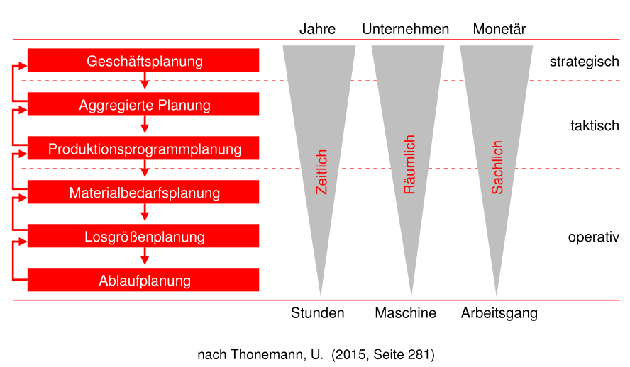
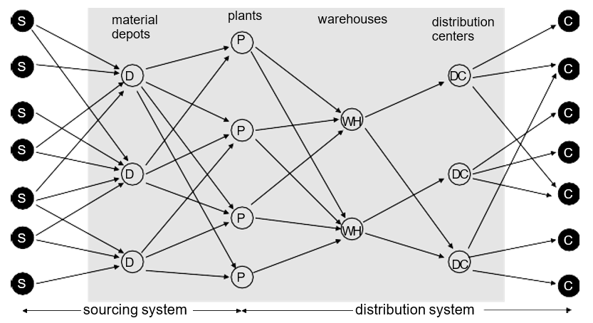
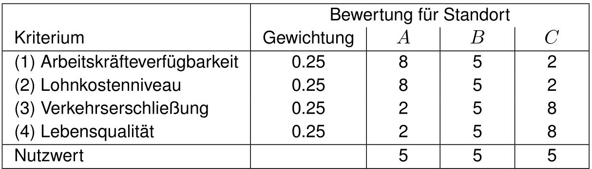
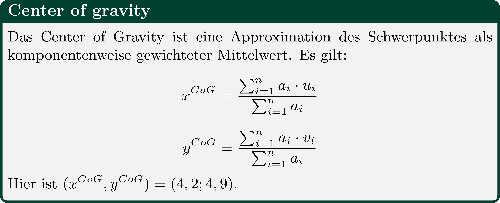
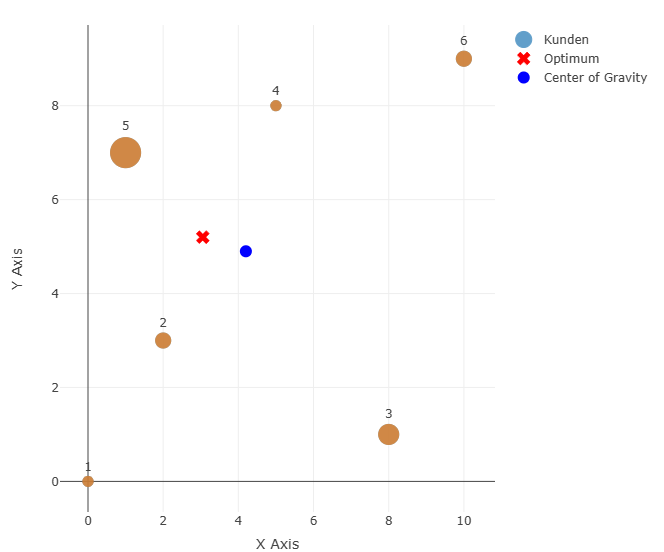
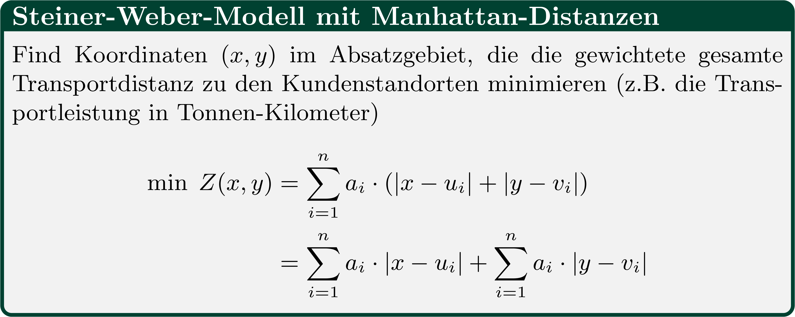
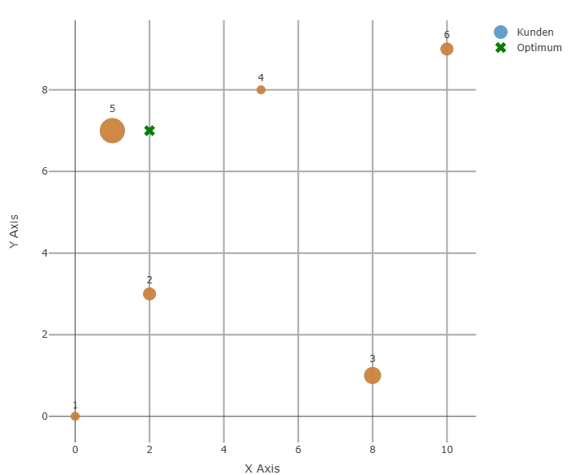

## Strategische Gestaltung von Supply Chains {#slide-66}

- Multikriterielle  Standortplanung
- Kontinuierliche Standortplanung
- Netzwerkplanung
- Diskrete Standortplanung

Supply Chain Management

66

## Planung im Supply Chain Management {#slide-67}

Supply Chain  Planning  Matrix

Supply Chain Management

67

::: {.smartart .chevron1 data-smartart-layout="chevron1"}
:::

  Strategische  Netzwerkplanung
  -------------------------------

Vorgaben

Feedback/ Feedforward

langfristig

mittelfristig

kurzfristig

Kapazitäts-

planung

Absatz- und Nachfrage- Planung

Fulfilment  ATP

Distributions-planung

Transport-planung

Losgrößen-planung

Ablaufplanung

Materialbedarfs-planung

Produktions- programmplanung

Bestellmengen-planung

(Stadtler et al., 2012)

## Planung im Supply Chain Management {#slide-68}

Supply Chain  Planning  Matrix

Supply Chain Management

68

::: {.smartart .chevron1 data-smartart-layout="chevron1"}
:::

  Strategische  Netzwerkplanung
  -------------------------------

Vorgaben

Feedback/ Feedforward

langfristig

mittelfristig

kurzfristig

Kapazitäts-

planung

Absatz- und Nachfrage- Planung

Fulfilment  ATP

Distributions-planung

Transport-planung

Losgrößen-planung

Ablaufplanung

Materialbedarfs-planung

Produktions- programmplanung

Bestellmengen-planung

(Stadtler et al., 2012)

## PlanungsHierarchie  im SCM {#slide-69}

Supply Chain Management

69

## Strategische Gestaltung von Supply Chains {#slide-70}

- Multikriterielle  Standortplanung
- Kontinuierliche Standortplanung
- Diskrete Standortplanung

70

Supply Chain Management

## Strategische Netzwerkplanung {#slide-71}

Zielstellung der Standortplanung

Supply Chain Management

71

Entscheidung über Standort von:

- Auslieferungslägern
- Fabriken
- Verkaufsstandorten
- Versorgungslägern
- ...

## Strategische Netzwerkplanung {#slide-72}

Phasen  der  Standortwahl

Supply Chain Management

72

(Chopra/Meindl, 2019)

## Strategische  Netzwerkplanung {#slide-73}

Standort im globalen und regionalen Sinne 

- Auf globaler Ebene Optionen meist überschaubar (Kontinent/Land)    Faktoren stark vereinfacht und aggregiert    unspezifisch, Ziel ist strategische Passfähigkeit
- Auf regionaler Ebene Ziel optimalen Standort identifizieren  präzisere Anforderungen

Standortplanungsprozess

Supply Chain Management

73

( Kik , 2022)

## Strategische  Netzwerkplanung {#slide-74}

Bewertung von Standorten für Ansiedlungen oft schwierig

- kurzfristig irreversible   Pfadabhängigkeiten
- Mehrdimensional   Auswirkungen auf Zielsystem schwer zu überblicken
- Subjektiv  Einschätzung zu weichen Faktoren oft schwankend & Bedeutung wird unterschiedlich gewichtet

Standortfaktoren

Supply Chain Management

74

( Lahner , 2020)

## Strategische  Netzwerkplanung {#slide-75}

- Qualitative Verfahren    heuristische, meist umfragebasierte Verfahren  Stimmungsbild und Sammlung individueller Einschätzungen
- Quantitative Verfahren

<!-- -->

- Optimierung: Entscheidungsraum (Optionen) und eindimensionales Zielsystem nötig
- Simulation: komplex, schwer  übertragbar,mehrdimensional
- Spielthorie : Antizipation des  Konkurrentenverhalten   Absatzmaximierung
- Investitionsrechnung: ausschließlich monetäre Größen (Optimierung)

Methoden der Standortplanung

Supply Chain Management

75

( Kik , 2022)

Merkmale von Optimierungsmodellen

## Qualitative Standortplanung {#slide-76}

Nutzwertanalyse

Supply Chain Management

76

Ablauf

Bestimme   relevante   Bewertungskriterien

Gewichte   Kriterien

Einzelbewertung  der  Alternativen  ( Teilnutzenbewertung )

Gesamtnutzenbewertung der Alternativen durch gewichtete  Teilnutzenkummulation  

Sortiere   Standortalternativen  

Kritik

Interpretierbarkeit

Substituierbarkeit

Nutzenunabhängigkeit

Gewichtung

Zielsplittung

Beispiel

## Qualitative Standortplanung {#slide-77}

Analytical  Hierarchy   Process  (AHP Methode)

Supply Chain Management

77

Bilde paarweise Vergleiche zwischen allen Alternativen im Hinblick auf die Bewertungskriterien.

Bilde für jedes Bewertungskriterium ein  Alternativenranking  (Synthese).

Bilde paarweise Vergleiche zwischen allen Bewertungskriterien.

Bilde ein Ranking der Bewertungskriterien (Synthese).

Berechne den Scoring-Wert für die Alternativen.

Ablauf

## Qualitative Standortplanung {#slide-78}

Analytical  Hierarchy   Process  (AHP Methode)- Beispiel

Supply Chain Management

78

Eine Investitionsgesellschaft sucht einen Standort zur Errichtung eines Einkaufszentrums. Es stehen drei alternative Standorte A, B, C zur Verfügung. Folgende Bewertungskriterien werden herangezogen.

Kundenmarkt : Größe, Kaufkraft, Altersstruktur

Kundennähe : Erreichbarkeit durch Kunden

Infrastruktur : Lage, Erschließungszustand

Transport : Erreichbarkeit durch Lieferanten

  Präferenz                       Wert
  ------------------------------- ------
  Gleich                          1
  Gleich bis leicht bevorzugt     2
  leicht bevorzugt                3
  leicht bis deutlich bevorzugt   4
  deutlich bevorzugt              5
  deutlich bis stark bevorzugt    6
  stark bevorzugt                 7
  Stark bis  extrem bevorzugt     8
  Extremely  preferred            9

## Qualitative Standortplanung {#slide-79}

Analytical  Hierarchy   Process  (AHP Methode) - Beispiel

Supply Chain Management

79

Bilde paarweise Vergleiche zwischen allen Alternativen im Hinblick auf die Bewertungskriterien.

Bilde für jedes Bewertungskriterium ein  Alternativenranking  (Synthese).

Bilde paarweise Vergleiche zwischen allen Bewertungskriterien.

Bilde ein Ranking der Bewertungskriterien (Synthese).

Berechne den Scoring-Wert für die Alternativen.

Ablauf

  site   A     B   C
  ------ ----- --- -----
  A      1     3   2
  B      1/3   1   1/5
  C      1/2   5   1

  site   A     B   C
  ------ ----- --- -----
  A      1     6   1/3
  B      1/6   1   1/9
  C      3     9   1

  site   A   B     C
  ------ --- ----- ---
  A      1   1/3   1
  B      3   1     7
  C      1   1/7   1

  site   A   B     C
  ------ --- ----- -----
  A      1   1/3   1/2
  B      3   1     4
  C      2   1/4   1

Kundenmarkt

Kundennähe

Infrastruktur

Transport

## Qualitative Standortplanung {#slide-80}

Analytical  Hierarchy   Process  (AHP Methode) - Beispiel

Supply Chain Management

80

Bilde paarweise Vergleiche zwischen allen Alternativen im Hinblick auf die Bewertungskriterien.

Bilde für jedes Bewertungskriterium ein  Alternativenranking  (Synthese).

Bilde paarweise Vergleiche zwischen allen Bewertungskriterien.

Bilde ein Ranking der Bewertungskriterien (Synthese).

Berechne den Scoring-Wert für die Alternativen.

Ablauf

Kundenmarkt

  S ite   A      B   C         site   A      B     C         site   A        B        C        Avg .
  ------- ------ --- ------ -- ------ ------ ----- ------ -- ------ -------- -------- -------- --------
  A       1      3   2         A      6/11   3/9   5/8       A      0.5455   0.3333   0.6250   0.5012
  B       1/3    1   1/5       B      2/11   1/9   1/16      B      0.1818   0.1111   0.0625   0.1185
  C       1/2    5   1         C      3/11   5/9   5/16      C      0.2727   0.5556   0.3125   0.3803
          11/6   9   16/5             1.0    1.0   1.0              1.0000   1.0000   1.0000   1.0000

## Qualitative Standortplanung {#slide-81}

Analytical  Hierarchy   Process  (AHP Methode) - Beispiel

Supply Chain Management

81

Bilde paarweise Vergleiche zwischen allen Alternativen im Hinblick auf die Bewertungskriterien.

Bilde für jedes Bewertungskriterium ein  Alternativenranking  (Synthese).

Bilde paarweise Vergleiche zwischen allen Bewertungskriterien.

Bilde ein Ranking der Bewertungskriterien (Synthese).

Berechne den Scoring-Wert für die Alternativen.

Ablauf

Präferenzvektoren aller Alternativen für alle Kriterien

  site   Kundenmarkt   Kundennähe   Infrastruktur   Transport
  ------ ------------- ------------ --------------- -----------
  A      0.5012        0.2819       0.1790          0.1561
  B      0.1185        0.0598       0.6850          0.6196
  C      0.3803        0.6583       0.1360          0.2243

## Qualitative Standortplanung {#slide-82}

Analytical  Hierarchy   Process  (AHP Methode) - Beispiel

Supply Chain Management

82

Bilde paarweise Vergleiche zwischen allen Alternativen im Hinblick auf die Bewertungskriterien.

Bilde für jedes Bewertungskriterium ein  Alternativenranking  (Synthese).

Bilde paarweise Vergleiche zwischen allen Bewertungskriterien.

Bilde ein Ranking der Bewertungskriterien (Synthese).

Berechne den Scoring-Wert für die Alternativen.

Ablauf

  Kriterium       Kundenmarkt   Kundennähe   Infrastru k tur   Transport
  --------------- ------------- ------------ ----------------- -----------
  Kundenmarkt     1             1/5          3                 4
  Kundennähe      5             1            9                 7
  Infrastruktur   1/3           1/9          1                 2
  Transport       1/4           1/7          1/2               1
                  79/12         458/315      27/2              14

  Kriterium       Kundenmarkt   Kundennähe   Infrastru k tur   Transport   Durchschnitt
  --------------- ------------- ------------ ----------------- ----------- --------------
  Kundenmarkt     0.1519        0.1375       0.2222            0.2857      0.1993
  Kundennähe      0.7595        0.6878       0.6667            0.5000      0.6535
  Infrastruktur   0.0506        0.0764       0.0741            0.1429      0.0860
  Transport       0.0380        0.0983       0.0370            0.0714      0.0612
                                                                           1.0000

## Qualitative Standortplanung {#slide-83}

Analytical  Hierarchy   Process  (AHP Methode) - Beispiel

Supply Chain Management

83

Bilde paarweise Vergleiche zwischen allen Alternativen im Hinblick auf die Bewertungskriterien.

Bilde für jedes Bewertungskriterium ein  Alternativenranking  (Synthese).

Bilde paarweise Vergleiche zwischen allen Bewertungskriterien.

Bilde ein Ranking der Bewertungskriterien (Synthese).

Berechne den Scoring-Wert für die Alternativen.

Ablauf

= Score A

= Score B

= Score C

Multiplikation der Präferenzvektoren der Alternativen mit dem der Kriterien: 

Ergebnis :  Beste Alternative ist Standort C !

Vorteile  AHP

- Paarweises Vergleichen erhöht die Transparenz und vereinfacht die Rangbildung zwischen Alternativen.
- AHP bietet der "Voreingenommenheit" von Entscheidern weniger Angriffsfläche als die Nutzwertanalyse.
- Irrationale Beurteilungen der Entscheider können durch einen Konsistenzindex erfasst werden

## Qualitative Standortplanung {#slide-84}

Analytical  Hierarchy   Process  (AHP Methode) - Konsistenzindex

Supply Chain Management

84

## Strategische Gestaltung von Supply Chains {#slide-85}

- Multikriterielle  Standortplanung
- Kontinuierliche Standortplanung
- Diskrete Standortplanung

85

Supply Chain Management

## Kontinuierliche Standortplanung {#slide-86}

Neoklassische Standorttheorie -- Steiner-Weber-Modell

Supply Chain Management

86

Annahmen

Eine homogene Ebene ( Absatzgebiet ), in der sich eine endliche Anzahl von  Kundenstandorten  befindet.

Eine individuelle  Nachfragemenge  für jeden der Standorte.

Eine  Transportkostenfunktion , die von der Transportentfernung und der Transportmenge abhängt.

http://www.zeno.org/Literatur/I/bwe1346b

Ziel

Gesucht ist der transportkostenminimale Standort für eine Produktions-, Lager- oder Umschlagsstelle im Absatzgebiet.

## Kontinuierliche Standortplanung {#slide-87}

Neoklassische Standorttheorie -- Steiner-Weber-Modell

Supply Chain Management

87

![\\PassOptionsToPackage{svgnames}{xcolor}
\\documentclass{article}
\\usepackage{amsmath}
\\usepackage{amsfonts} 
\\usepackage{amssymb}
\\usepackage{amsthm}
\\usepackage{nicefrac}
\\usepackage{booktabs}
\\usepackage{multirow}
\\usepackage{geometry} 
\\usepackage{eurosym} 
\\geometry{lmargin = 3cm, rmargin = 3cm}
\\usepackage{tabularx}
\\usepackage{tcolorbox}

\\graphicspath{{\"C:/Users/ThomasK/ownCloud/PL/1920/Latex/\"}}

\\pagestyle{empty}
%\\tcbuselibrary{skins}
%\\usetikzlibrary{shadings,shadows}
\\definecolor{basic}{RGB}{0,65,49}

 \\newcolumntype{Y}{\>{\\centering\\arraybackslash}X}
\\newcommand{\\Rre}{\\mathbb{R}}

\\newenvironment{block}\[1\]{%
  \\tcolorbox\[boxsep=1pt,left=2pt,right=2pt,top=4pt,bottom=4pt, noparskip,colframe=basic, fonttitle=\\bfseries,  title=#1\]}%
  {\\endtcolorbox}

\\setlength{\\parindent}{0pt}

\\begin{document}
\\begin{block}{Modellformulierung}\\small
  Finde Koordinaten \$(x,y)\$ im Absatzgebiet, die die gewichtete gesamte Transportdistanz zu den Kundenstandorten minimieren (z.B. die Transportleistung in Tonnen-Kilometer) 
  \$\$\\min \\; Z(x,y) = \\sum\_{i=1}\^n a_i \\cdot d\\left((x,y), (u_i,v_i)\\right)\$\$
  Entscheidungsvariablen und Parameter:
  \\begin{description}\\itemsep0pt
   \\item\[\$x,y\$:\] Koordinaten des Standorts (Entscheidungsvariablen). 
   \\item\[\$u_i,v_i\$:\] Koordinaten der Kundenstandorte \$i=1,\\ldots n\$.
   \\item\[\$a_i\$: \] Nachfrage von Kundenstandort \$i\$ (z.B. in Tonnen pro Jahr).
  \\end{description}
  
\\end{block}

\\end{document}](../images/image70.png "Grafik 2")

## Kontinuierliche Standortplanung {#slide-88}

Neoklassische Standorttheorie -- euklidisches Steiner-Weber-Modell

Supply Chain Management

88

Steiner-Weber-Model:  Lösungsansatz   bei   euklidischer   Distanz

Lösungsheuristik

## Kontinuierliche Standortplanung {#slide-89}

euklidisches Steiner-Weber-Modell - Beispiel

Supply Chain Management

89

Eingabedaten

Iterationen

## Kontinuierliche Standortplanung {#slide-90}

euklidisches Steiner-Weber-Modell -- Short  cut  

Supply Chain Management

90

Gewichtete Distanz zum Zentrum

::: {layout-ncol="2"}
{.formula-img}

:::

## Kontinuierliche Standortplanung {#slide-91}

Steiner-Weber-Modell mit Manhattan-Distanzen

Supply Chain Management

91

Algorithmus für optimalen Standort

::: {layout-ncol="2"}
{.formula-img}

:::

