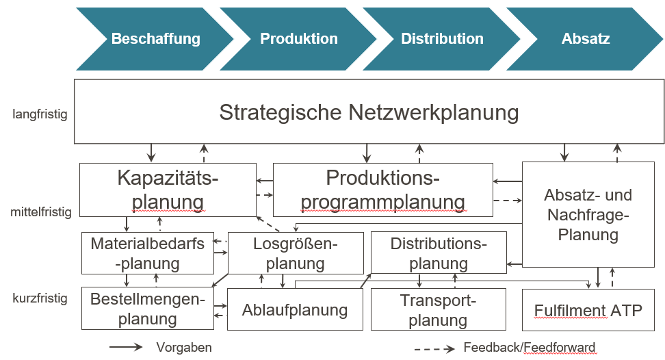
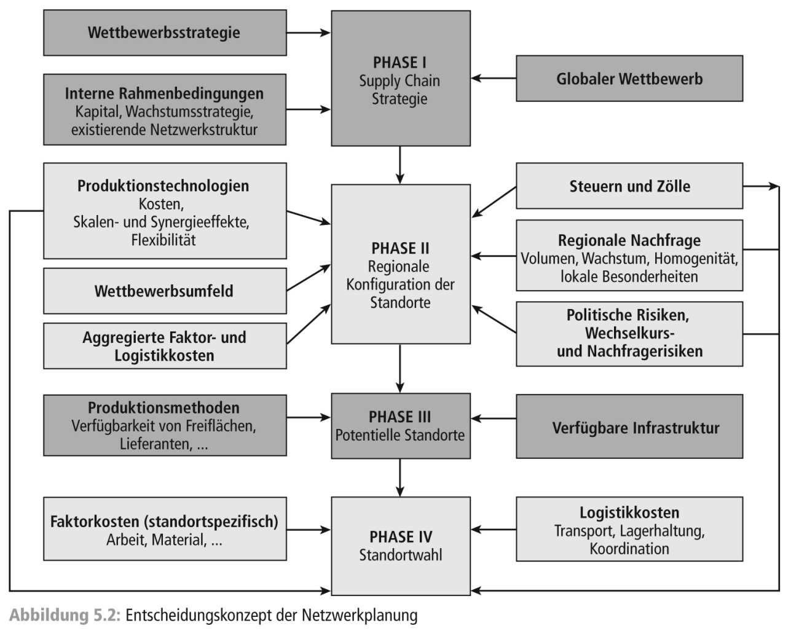
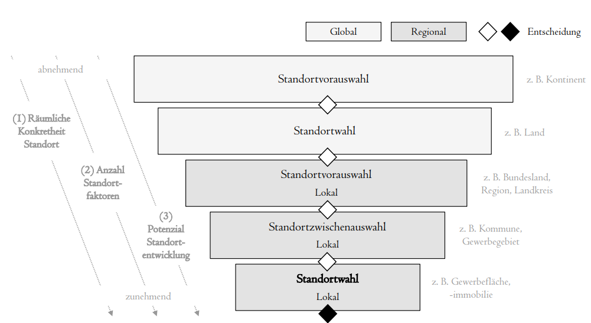
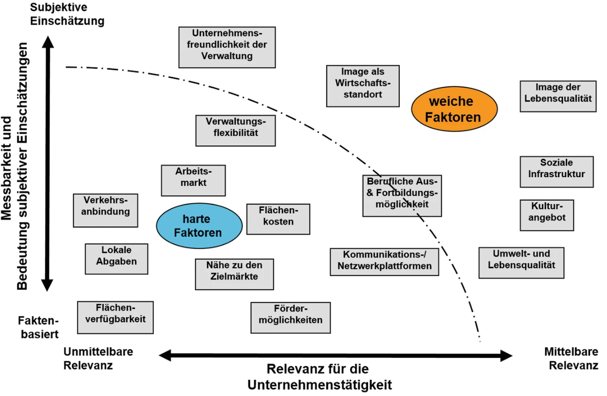
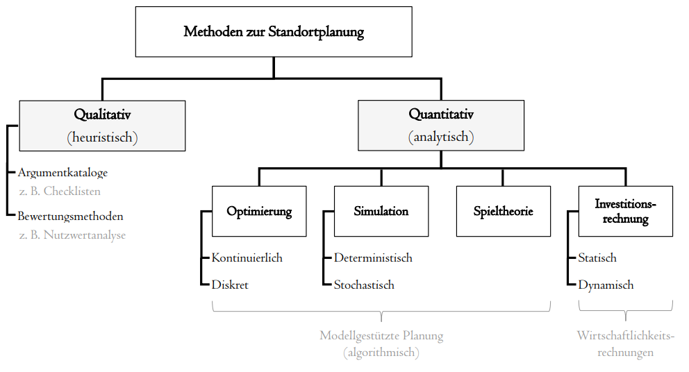
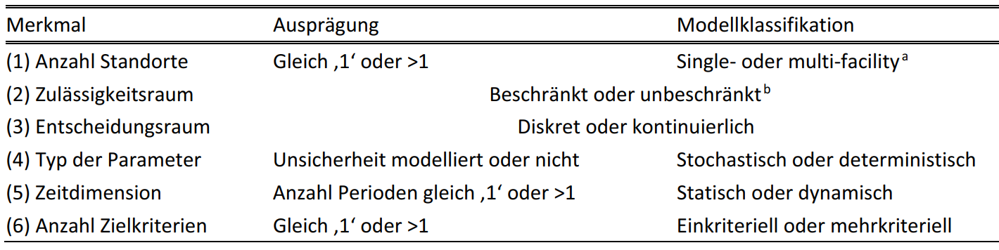
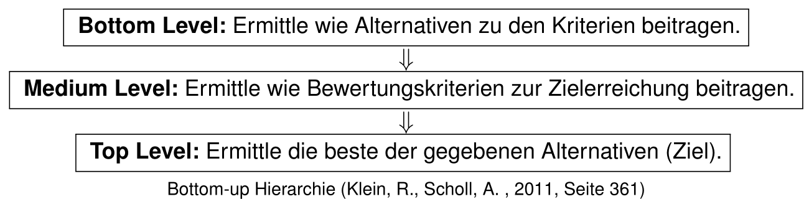
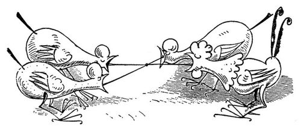

```{r}
#| echo: false
#| warning: false
#| message: false

# Funktionen aus scm_functions.R einbinden
source("../../R/scm_functions.R")

library(tidyverse)
library(leaflet)
library(readxl)
library(dplyr)
library(plotly)

```

## Strategische Gestaltung von Supply Chains {#slide-66}

- Multikriterielle Standortplanung
- Kontinuierliche Standortplanung
- Netzwerkplanung
- Diskrete Standortplanung

## Planung im Supply Chain Management {#slide-67}

::: slide-subtitle
Supply Chain Planning Matrix
:::



## Strategische Netzwerkplanung {#slide-71}

::: slide-subtitle
Zielstellung der Standortplanung
:::

::::::: columns
::::: {.column width="60%"}
::: r-stretch
```{r}
#| echo: false
#| warning: false
#| message: false
#| out-width: "100%"
#| fig-height: 1.1

library(plotly)

top_boxes <- data.frame(
  label = c("Beschaffung", "Produktion", "Distribution", "Absatz"),
  x0 = c(0.00, 2.00, 4.00, 6.00),
  x1 = c(2.00, 4.00, 6.00, 8.00),
  y0 = 9.25,
  y1 = 9.75
)


shapes <- c(
  lapply(seq_len(nrow(top_boxes)), function(i) {
    shape_path(
      chevron_path(top_boxes$x0[i], top_boxes$x1[i], top_boxes$y0[i], top_boxes$y1[i]),
      fill = cols$top
    )
  })
)


fig <- plot_ly()

fig <- fig %>%
  add_text(
    x = mid(top_boxes$x0, top_boxes$x1),
    y = mid(top_boxes$y0, top_boxes$y1),
    text = top_boxes$label,
    textfont = list(size = 18, color = "white", family = "Arial"),
    hoverinfo = "skip", showlegend = FALSE
  )  %>%
  layout(
    xaxis = list(visible = FALSE, range = c(0, 8), fixedrange = T),
    yaxis = list(visible = FALSE, range = c(9.1, 9.8), fixedrange = T),
    plot_bgcolor = cols$bg,
    paper_bgcolor = cols$bg,
    margin = list(l = 10, r = 10, t = 10, b = 10),
    shapes = shapes,
    width = 900,
    height = 100
  )

fig

```
:::

::: r-stretch
```{r}
#| echo: false
#| warning: false
#| message: false
#| out-width: "95%"
#| fig-height: 5.5

library(DiagrammeR)

grViz("
digraph network {

  graph [
    rankdir = LR,
    bgcolor = 'transparent',
    nodesep = 0.35,
    ranksep = 0.75,
    splines = line
  ]

  node [
    shape = box,
    style = filled,
    fillcolor = '#DCEAF0',
    color = '#4B5563',
    fontname = Arial,
    fontsize = 16,
    width = 0.55,
    height = 0.38,
    fixedsize = true
  ]

  edge [
    color = '#4B4B4B',
    penwidth = 1.3,
    arrowsize = 0.8
  ]

  { rank = same; '7A'; '7B'; '7C'; '7D'; '7E' }
  { rank = same; '6A'; '6B'; '6C'; '6D' }
  { rank = same; '5A'; '5B'; '5C' }
  { rank = same; '4A'; '4B'; '4C' }
  { rank = same; '3A'; '3B'; '3C' }
  { rank = same; '2A'; '2B'; '2C'; '2D' }
  { rank = same; '1A'; '1B'; '1C'; '1D'; '1E' }

  
  '7A' -> '6A'
  '7B' -> '6A'
  '7B' -> '6B'
  '7C' -> '6B'
  '7C' -> '6C'
  '7D' -> '6C'
  '7D' -> '6D'
  '7E' -> '6D'

  '6A' -> '5A'
  '6B' -> '5A'
  '6B' -> '5B'
  '6C' -> '5B'
  '6C' -> '5C'
  '6D' -> '5C'

  '5A' -> '4A'
  '5B' -> '4A'
  '5B' -> '4B'
  '5C' -> '4B'
  '5C' -> '4C'

  '4A' -> '4B'
  '4B' -> '4C'

  '4A' -> '3A'
  '4A' -> '3B'
  '4A' -> '3C'
  '4B' -> '3B'
  '4B' -> '3C'
  '4C' -> '3C'

  '3A' -> '2A'
  '3A' -> '2B'
  '3B' -> '2B'
  '3B' -> '2C'
  '3C' -> '2C'
  '3C' -> '2D'

  '2B' -> '2A'

  '2A' -> '1A'
  '2A' -> '1B'
  '2B' -> '1C'
  '2C' -> '1C'
  '2D' -> '1D'
  '2D' -> '1E'
}
")
```
:::
:::::

::: {.column width="40%"}
**Entscheidung über Standort von:**

- Auslieferungslägern
- Fabriken
- Verkaufsstandorten
- Versorgungslägern
- ...
:::
:::::::

## Strategische Netzwerkplanung {#slide-72}

::: slide-subtitle
Phasen der Standortwahl
:::



(Chopra/Meindl, 2019)

## Strategische Netzwerkplanung {#slide-73}

::: slide-subtitle
Standortplanungsprozess
:::

::::: columns
::: {.column width="70%"}


(Kik, 2022)
:::

::: {.column width="30%"}
- Auf globaler Ebene Optionen meist überschaubar (Kontinent/Land) $\rightarrow$ Faktoren stark vereinfacht und aggregiert $\rightarrow$ unspezifisch, Ziel ist strategische Passfähigkeit
- Auf regionaler Ebene Ziel optimalen Standort identifizieren $\rightarrow$ präzisere Anforderungen
:::
:::::

## Strategische Netzwerkplanung {#slide-74}

::: slide-subtitle
Standortfaktoren
:::

:::::: columns
::: {.column width="70%"}
{width="950"}

(Lahner, 2020)
:::

:::: {.column width="30%"}
::: small-text
- Bewertung von Standorten für Ansiedlungen oft schwierig
- kurzfristig irreversible $\rightarrow$ Pfadabhängigkeiten
- Mehrdimensional $\rightarrow$ Auswirkungen auf Zielsystem schwer zu überblicken
- Subjektiv $\rightarrow$ Einschätzung zu weichen Faktoren oft schwankend & Bedeutung wird unterschiedlich gewichtet
:::
::::
::::::

## Strategische Netzwerkplanung {#slide-75}

::: slide-subtitle
Methoden der Standortplanung
:::

::::::: columns
:::: {.column width="60%"}
{width="800"}

::: small-text
Merkmale von Optimierungsmodellen (Kik, 2022) {width="800"}
:::
::::

:::: {.column width="40%"}
::: small-text
- Qualitative Verfahren $\rightarrow$ heuristische, meist umfragebasierte Verfahren $\rightarrow$ Stimmungsbild und Sammlung individueller Einschätzungen
- Quantitative Verfahren
  - Optimierung: Entscheidungsraum (Optionen) und eindimensionales Zielsystem nötig
  - Simulation: komplex, schwer übertragbar,mehrdimensional
  - Spielthorie: Antizipation des Konkurrentenverhalten $\rightarrow$ Absatzmaximierung
  - Investitionsrechnung: ausschließlich monetäre Größen (Optimierung)
:::
::::
:::::::

## Qualitative Standortplanung {#slide-76}

::: slide-subtitle
Nutzwertanalyse
:::

::::::: {.columns .v-center}
:::: {.column width="42%"}
::: smaller-text
### Vorgehen

1.  Relevante Bewertungskriterien festlegen
2.  Kriteriengewichte bestimmen
3.  Alternativen je Kriterium bewerten
4.  Gewichtete Teilnutzwerte zum Gesamtnutzwert aggregieren
5.  Alternativen nach Gesamtnutzwert rangordnen

### Kritische Punkte

- Additives Modell nur eingeschränkt interpretierbar
- Schlechte Ausprägungen können durch gute kompensiert werden
- Nutzenunabhängigkeit der Kriterien oft fraglich
- Ergebnisse reagieren empfindlich auf die Gewichtung
- Gefahr der Zielaufspaltung
:::
::::

:::: {.column width="58%"}
::: callout-note
## Fallbeispiel

Ein Unternehmen sucht einen neuen Distributionsstandort und vergleicht drei Alternativen A, B und C. Bewertet werden die Kriterien **Arbeitskräfteverfügbarkeit**, **Lohnkostenniveau**, **Verkehrserschließung** und **Lebensqualität**, die hier aus Vereinfachungsgründen gleich gewichtet werden.

Die Konstellation ist bewusst so gewählt, dass sich sehr unterschiedliche Standortprofile ergeben: Standort **A** ist stark bei Arbeitsmarkt und Kosten, Standort **C** bei Infrastruktur und Lebensqualität, während **B** in allen Kriterien mittlere Werte erreicht.

Gerade dieses Beispiel zeigt die Schwäche der additiven Nutzwertanalyse: Trotz klar unterschiedlicher Stärken- und Schwächenprofile können alle Alternativen denselben Gesamtnutzwert erreichen.
:::
::::
:::::::

## Qualitative Standortplanung

::: slide-subtitle
Nutzwertanalyse in R: Code und Ergebnistabelle
:::

::: small-text
```{r}
#| echo: true
#| eval: true
#| warning: false
#| message: false
#| output-location: column
#| code-overflow: wrap

library(dplyr)
library(knitr)

# Tabelle mit Rohdaten der Fallstudie
nwa <- tibble(
  Kriterium = c(
    "Arbeitskräfteverfügbarkeit",
    "Lohnkostenniveau",
    "Verkehrserschließung",
    "Lebensqualität"
  ),
  Gewicht = c(0.25, 0.25, 0.25, 0.25),
  A = c(8, 8, 2, 2),
  B = c(5, 5, 5, 5),
  C = c(2, 2, 8, 8)
)

# Berechne Nutzwerte der Alternativen
nutzwert <- c(
    A = sum(nwa$Gewicht * nwa$A),
    B = sum(nwa$Gewicht * nwa$B),
    C = sum(nwa$Gewicht * nwa$C)
  )

# Verbinde Rohdaten und Nutzwerte in einer Tabelle
nwa <- bind_rows(nwa, nutzwert) 

# Setze Namen Nutzwert in Zeile 5 und Spalte Kriterium
nwa$Kriterium[5] <- "Nutzwert"

# Gib Tabelle aus
nwa |> 
  mutate(
    Gewicht = ifelse(is.na(Gewicht), "", sprintf("%.2f", Gewicht)), # Stelle 2 Nachkommastellen dar
    A = sprintf("%.0f", A), # Schneide Nachkommastellen ab
    B = sprintf("%.0f", B), # Schneide Nachkommastellen ab
    C = sprintf("%.0f", C) # Schneide Nachkommastellen ab
  ) |>
  kable(
    col.names = c("Kriterium", "Gewichtung", "A", "B", "C"),
    format = "html",
    align = c("l", "c", "c", "c", "c")
  )
```
:::

------------------------------------------------------------------------

## Qualitative Standortplanung {#slide-77}

::: slide-subtitle
Analytical Hierarchy Process (AHP Methode)
:::

{width="500"}

### Ablauf

1.  Bilde paarweise Vergleiche zwischen allen Alternativen im Hinblick auf die Bewertungskriterien.
2.  Bilde für jedes Bewertungskriterium ein Alternativenranking (Synthese).
3.  Bilde paarweise Vergleiche zwischen allen Bewertungskriterien.
4.  Bilde ein Ranking der Bewertungskriterien (Synthese).
5.  Berechne den Scoring-Wert für die Alternativen.

## Qualitative Standortplanung {#slide-78}

::: slide-subtitle
Analytical Hierarchy Process (AHP Methode) - Beispiel
:::

::::::: {.columns .v-center}
:::: {.column width="50%"}
::: callout-note
## Fallbeispiel

Eine Investitionsgesellschaft sucht einen Standort zur Errichtung eines Einkaufszentrums. Es stehen drei alternative Standorte A, B, C zur Verfügung. Folgende Bewertungskriterien werden herangezogen.

1.  Kundenmarkt: Größe, Kaufkraft, Altersstruktur
2.  Kundennähe: Erreichbarkeit durch Kunden
3.  Infrastruktur: Lage, Erschließungszustand
4.  Transport: Erreichbarkeit durch Lieferanten
:::
::::

:::: {.column width="50%"}
::: smaller-text
**Bewertungsskala**

| Präferenz                     | Wert |
|:------------------------------|:-----|
| Gleich                        | 1    |
| Gleich bis leicht bevorzugt   | 2    |
| leicht bevorzugt              | 3    |
| leicht bis deutlich bevorzugt | 4    |
| deutlich bevorzugt            | 5    |
| deutlich bis stark bevorzugt  | 6    |
| stark bevorzugt               | 7    |
| Stark bis extrem bevorzugt    | 8    |
| Extremely preferred           | 9    |
:::
::::
:::::::

## Qualitative Standortplanung {#slide-79}

::: slide-subtitle
Analytical Hierarchy Process (AHP Methode) - Beispiel
:::

::: smaller-text
**Ablauf**

1.  **Bilde paarweise Vergleiche zwischen allen Alternativen im Hinblick auf die Bewertungskriterien.**
2.  Bilde für jedes Bewertungskriterium ein Alternativenranking (Synthese).
3.  Bilde paarweise Vergleiche zwischen allen Bewertungskriterien.
4.  Bilde ein Ranking der Bewertungskriterien (Synthese).
5.  Berechne den Scoring-Wert für die Alternativen.
:::

::::::: {.columns .v-center}
::: {.column width="25%"}
Kundenmarkt

| site |  A  |  B  |  C  |
|:-----|:---:|:---:|:---:|
| A    |  1  |  3  |  2  |
| B    | 1/3 |  1  | 1/5 |
| C    | 1/2 |  5  |  1  |
:::

::: {.column width="25%"}
Kundennähe

| site |  A  |  B  |  C  |
|:-----|:---:|:---:|:---:|
| A    |  1  |  6  | 1/3 |
| B    | 1/6 |  1  | 1/9 |
| C    |  3  |  9  |  1  |
:::

::: {.column width="25%"}
Infrastruktur

| site |  A  |  B  |  C  |
|:-----|:---:|:---:|:---:|
| A    |  1  | 1/3 |  1  |
| B    |  3  |  1  |  7  |
| C    |  1  | 1/7 |  1  |
:::

::: {.column width="25%"}
Transport

| site |  A  |  B  |  C  |
|:-----|:---:|:---:|:---:|
| A    |  1  | 1/3 | 1/2 |
| B    |  3  |  1  |  4  |
| C    |  2  | 1/4 |  1  |
:::
:::::::

## Qualitative Standortplanung {#slide-80}

::: slide-subtitle
Analytical Hierarchy Process (AHP Methode) - Beispiel
:::

::: smaller-text
**Ablauf**

1.  Bilde paarweise Vergleiche zwischen allen Alternativen im Hinblick auf die Bewertungskriterien.
2.  **Bilde für jedes Bewertungskriterium ein Alternativenranking (Synthese).**
3.  Bilde paarweise Vergleiche zwischen allen Bewertungskriterien.
4.  Bilde ein Ranking der Bewertungskriterien (Synthese).
5.  Berechne den Scoring-Wert für die Alternativen.
:::

::::::: small-text
**Kundenmarkt**

:::::: {.columns .v-center}
::: {.column width="30%"}
Spaltensummen

| site   |  A   |  B  |  C   |
|:-------|:----:|:---:|:----:|
| A      |  1   |  3  |  2   |
| B      | 1/3  |  1  | 1/5  |
| C      | 1/2  |  5  |  1   |
| $\sum$ | 11/6 |  9  | 16/5 |
:::

::: {.column width="30%"}
spaltenweise Normierung

| Site   |  A   |  B  |  C   |
|:-------|:----:|:---:|:----:|
| A      | 6/11 | 3/9 | 5/8  |
| B      | 2/11 | 1/9 | 1/16 |
| C      | 3/11 | 5/9 | 5/16 |
| $\sum$ | 1.0  | 1.0 | 1.0  |
:::

::: {.column width="40%"}
Durchschnittsbildung

| Site   |   A    |   B    |   C    | Avg .  |
|:-------|:------:|:------:|:------:|:------:|
| A      | 0.5455 | 0.3333 | 0.6250 | 0.5012 |
| B      | 0.1818 | 0.1111 | 0.0625 | 0.1185 |
| C      | 0.2727 | 0.5556 | 0.3125 | 0.3803 |
| $\sum$ | 1.0000 | 1.0000 | 1.0000 | 1.0000 |
:::
::::::
:::::::

## Qualitative Standortplanung {#slide-81}

::: slide-subtitle
Analytical Hierarchy Process (AHP Methode) - Beispiel
:::

::: smaller-text
**Ablauf**

1.  Bilde paarweise Vergleiche zwischen allen Alternativen im Hinblick auf die Bewertungskriterien.
2.  **Bilde für jedes Bewertungskriterium ein Alternativenranking (Synthese).**
3.  Bilde paarweise Vergleiche zwischen allen Bewertungskriterien.
4.  Bilde ein Ranking der Bewertungskriterien (Synthese).
5.  Berechne den Scoring-Wert für die Alternativen.
:::

Präferenzvektoren aller Alternativen für alle Kriterien

| site | Kundenmarkt | Kundennähe | Infrastruktur | Transport |
|:-----|:-----------:|:----------:|:-------------:|:---------:|
| A    |   0.5012    |   0.2819   |    0.1790     |  0.1561   |
| B    |   0.1185    |   0.0598   |    0.6850     |  0.6196   |
| C    |   0.3803    |   0.6583   |    0.1360     |  0.2243   |

## Qualitative Standortplanung {#slide-82}

::: slide-subtitle
Analytical Hierarchy Process (AHP Methode) - Beispiel
:::

::: smaller-text
**Ablauf**

1.  Bilde paarweise Vergleiche zwischen allen Alternativen im Hinblick auf die Bewertungskriterien.
2.  Bilde für jedes Bewertungskriterium ein Alternativenranking (Synthese).
3.  **Bilde paarweise Vergleiche zwischen allen Bewertungskriterien.**
4.  Bilde ein Ranking der Bewertungskriterien (Synthese).
5.  Berechne den Scoring-Wert für die Alternativen.
:::

| Kriterium     | Kundenmarkt | Kundennähe | Infrastruktur | Transport |
|:--------------|:-----------:|:----------:|:-------------:|:---------:|
| Kundenmarkt   |      1      |    1/5     |       3       |     4     |
| Kundennähe    |      5      |     1      |       9       |     7     |
| Infrastruktur |     1/3     |    1/9     |       1       |     2     |
| Transport     |     1/4     |    1/7     |      1/2      |     1     |
| $\sum$        |    79/12    |  458/315   |     27/2      |    14     |

## Qualitative Standortplanung

::: slide-subtitle
Analytical Hierarchy Process (AHP Methode) - Beispiel
:::

::: smaller-text
**Ablauf**

1.  Bilde paarweise Vergleiche zwischen allen Alternativen im Hinblick auf die Bewertungskriterien.
2.  Bilde für jedes Bewertungskriterium ein Alternativenranking (Synthese).
3.  Bilde paarweise Vergleiche zwischen allen Bewertungskriterien.
4.  **Bilde ein Ranking der Bewertungskriterien (Synthese).**
5.  Berechne den Scoring-Wert für die Alternativen.
:::

| Kriterium     | Kundenmarkt | Kundennähe | Infrastruktur | Transport | Aver.  |
|:--------------|:------------|:-----------|:--------------|:----------|--------|
| Kundenmarkt   | 0.1519      | 0.1375     | 0.2222        | 0.2857    | 0.1993 |
| Kundennähe    | 0.7595      | 0.6878     | 0.6667        | 0.5000    | 0.6535 |
| Infrastruktur | 0.0506      | 0.0764     | 0.0741        | 0.1429    | 0.0860 |
| Transport     | 0.0380      | 0.0983     | 0.0370        | 0.0714    | 0.0612 |
| $\sum$        |             |            |               |           | 1.0000 |

## Qualitative Standortplanung {#slide-83}

::: slide-subtitle
Analytical Hierarchy Process (AHP Methode) - Beispiel
:::

::: smaller-text
**Ablauf**

1.  Bilde paarweise Vergleiche zwischen allen Alternativen im Hinblick auf die Bewertungskriterien.
2.  Bilde für jedes Bewertungskriterium ein Alternativenranking (Synthese).
3.  Bilde paarweise Vergleiche zwischen allen Bewertungskriterien.
4.  Bilde ein Ranking der Bewertungskriterien (Synthese).
5.  **Berechne den Scoring-Wert für die Alternativen.**
:::

::: smaller-text
$\left(
\begin{array}{cccc}
0.5012 & 0.2819 & 0.1790 & 0.1561 \\
0.1185 & 0.0598 & 0.6850 & 0.6196 \\
0.3803 & 0.6583 & 0.1360 & 0.2243
\end{array}
\right)
\times
\left(
\begin{array}{c}
0.1993\\
0.6535\\
0.0860\\
0.0612
\end{array}
\right)
=
\left(
\begin{array}{c}
0.3091\\
0.1595\\
0.5314
\end{array}
\right)
\begin{array}{c}
\text{= Score A}\\
\text{= Score B}\\
\text{= Score C}
\end{array}$

**Ergebnis:** Beste Alternative ist Standort C !

::: {.fragment .fade-up}
**Vorteile AHP**

- Paarweises Vergleichen erhöht die Transparenz und vereinfacht die Rangbildung zwischen Alternativen.
- AHP bietet der "Voreingenommenheit" von Entscheidern weniger Angriffsfläche als die Nutzwertanalyse.
- Irrationale Beurteilungen der Entscheider können durch einen Konsistenzindex erfasst werden
:::
:::

## Qualitative Standortplanung {#slide-84}

::: slide-subtitle
Analytical Hierarchy Process (AHP Methode) - Konsistenzindex
:::

:::::: {.columns .v-center}
:::: {.column width="70%"}

::: smaller-text
1.  Produkt aus nicht-normalisierter Präferenzmatrix und Präferenzvektor (Kriterienvergleich): $$\left(\begin{array}{cccc}
     1 & 1\!/\!5 & 3 & 4 \\
     5 & 1 & 9 & 7 \\
     1\!/\!3 & 1\!/\!9 & 1 & 2 \\
     1\!/\!4 & 1\!/\!7 & 1\!/\!2 & 1 \\ 
     \end{array}
     \right)\times\left(\begin{array}{c}
     0.1993\\
     0.6535\\
     0.0860\\
     0.0612\\
     \end{array}\right)=\left(\begin{array}{c}
     0.8328 \\
     2.8524\\
     0.3474\\
     0.2473\\
     \end{array}\right)$$
2.  Dividiere den Vektor komponentenweise durch die Präferenzwerte: $$\begin{align*}
    0.8328 / 0.1993 &=  4.1773\\
    2.8524 / 0.6535 &=  4.3649\\
    0.3474 / 0.0860 &=  4.0397\\
    0.2473 / 0.0612 &=  4.0436\\
    \text{average }\bar{P} &= 4.15464
    \end{align*}$$
3.  Berechne den Konsistenzwert mit $n=4$ durch $$ KI =\frac{\bar{P}- n}{n-1} = 0.0521. $$
:::
::::

:::: {.column width="30%"}
::: {.fragment .fade-up}
::: callout-note
## Interpretation

Je näher $KI$ an 0 liegt, desto konsistenter ist die Präferenzmatrix. Wenn $KI=0$ ist sie perfekt konsistent. $\bar{P}$ ist der größte Eigenwert der Präferenzmatrix.
:::
:::
::::
::::::

## Strategische Gestaltung von Supply Chains {#slide-85}

- Multikriterielle Standortplanung
- **Kontinuierliche Standortplanung**
- Diskrete Standortplanung


## Kontinuierliche Standortplanung {#slide-86}
::: slide-subtitle
Neoklassische Standorttheorie -- Steiner-Weber-Modell
:::

:::::: {.columns .v-center}
:::: {.column width="60%"}
::: small-text
**Annahmen**

1. Eine homogene Ebene (**Absatzgebiet**), in der sich eine endliche Anzahl von **Kundenstandorten** befindet.
2. **Nachfragemengen** sind für jeden der Kundenstandorte gegeben und muss vollständig bedient werden.
3. Eine **Transportkostenfunktion**, die von der Transportentfernung und der Transportmenge abhängt.
4. Zeit wird nicht betrachtet
:::
::::

:::: {.column width="40%"}


::::
::::::

::: {.fragment .fade-up}
**Ziel**

Gesucht ist der **transportkostenminimale Standort** für eine Produktions-, Lager- oder Umschlagsstelle im Absatzgebiet.
:::

---

## Kontinuierliche Standortplanung {#slide-87}

::: {.slide-subtitle}
Neoklassische Standorttheorie – Steiner-Weber-Modell
:::

:::::: {.columns .v-center}
::: {.column width="55%"}
::: {.smaller-text}

**Modellformulierung**

Bestimme Koordinaten $(x,y)$ im Absatzgebiet, die die gewichtete gesamte Transportdistanz zu den Kundenstandorten minimieren.

$$
\min\; Z(x,y) = \sum_{i=1}^{n} a_i \cdot d\big((x,y),(u_i,v_i)\big)
$$

**Entscheidungsvariable**

- $(x,y)$: Koordinaten des zu bestimmenden Standorts.

**Parameter**

- $(u_i,v_i)$: Koordinaten von Kundenstandort $i$.
- $a_i$: Nachfrage von Kundenstandort $i$, z. B. in Tonnen pro Jahr.
- $d(\cdot)$: verwendetes Distanzmaß.

:::
:::

::: {.column width="45%"}
::: {.smaller-text}
::: {.fragment .fade-up}
**Distanzmaße**

- Euklidische Distanz: $d = \sqrt{(x-u_i)^2 + (y-v_i)^2}$
- Manhattan-Distanz: $d = |x-u_i| + |y-v_i|$
- Straßendistanzen: kürzeste Wege in einem Verkehrsnetz.

```{r}
#| echo: false
#| warning: false
#| message: false

library(sf)
library(osrm)
library(leaflet)
library(dplyr)
library(units)

start <- data.frame(
  id = "Standort",
  lon = 8.2410,
  lat = 50.0820
)

goal <- data.frame(
  id = "Kunde",
  lon = 8.2875,
  lat = 50.1038
)

start_sf <- st_as_sf(start, coords = c("lon", "lat"), crs = 4326)
goal_sf  <- st_as_sf(goal,  coords = c("lon", "lat"), crs = 4326)

xy_start <- st_coordinates(start_sf)
xy_goal  <- st_coordinates(goal_sf)

route_sf <- osrmRoute(src = start_sf, dst = goal_sf) |>
  mutate(
    dist_km = round(as.numeric(distance), 1),
    label_txt = paste0("Straßennetz: ", format(dist_km, nsmall = 1), " km")
  )

euclid_sf <- st_sf(
  name = "Euklidische Distanz",
  geometry = st_sfc(
    st_linestring(rbind(xy_start[1, ], xy_goal[1, ])),
    crs = 4326
  )
)

manhattan_sf <- st_sf(
  name = "Manhattan-Distanz",
  geometry = st_sfc(
    st_linestring(matrix(
      c(
        xy_start[1, 1], xy_start[1, 2],
        xy_goal[1, 1],  xy_start[1, 2],
        xy_goal[1, 1],  xy_goal[1, 2]
      ),
      ncol = 2,
      byrow = TRUE
    )),
    crs = 4326
  )
)

crs_proj <- 25832

euclid_sf <- euclid_sf |>
  st_transform(crs_proj) |>
  mutate(
    dist_km = round(as.numeric(set_units(st_length(geometry), "km")), 1),
    label_txt = paste0("Euklidisch: ", format(dist_km, nsmall = 1), " km")
  ) |>
  st_transform(4326)

manhattan_sf <- manhattan_sf |>
  st_transform(crs_proj) |>
  mutate(
    dist_km = round(as.numeric(set_units(st_length(geometry), "km")), 1),
    label_txt = paste0("Manhattan: ", format(dist_km, nsmall = 1), " km")
  ) |>
  st_transform(4326)

all_routes <- bind_rows(
  euclid_sf |> mutate(route_type = "Euklidisch"),
  manhattan_sf |> mutate(route_type = "Manhattan"),
  route_sf |> mutate(route_type = "Straßennetz")
)

label_points <- all_routes |>
  st_transform(crs_proj)

label_geom <- st_line_sample(label_points, sample = 0.5)

label_points <- st_as_sf(
  label_points |>
    st_drop_geometry() |>
    select(route_type, label_txt),
  geometry = label_geom,
  crs = crs_proj
) |>
  st_transform(4326)

label_coords <- st_coordinates(label_points)

leaflet(width = "100%", height = 420) |>
  addProviderTiles(providers$OpenStreetMap.Mapnik) |>
  addPolylines(
    data = route_sf,
    color = "#dc2626",
    weight = 5,
    opacity = 0.9,
    label = ~paste0("Straßendistanz (kürzester Weg): ", format(dist_km, nsmall = 1), " km")
  ) |>
  addPolylines(
    data = euclid_sf,
    color = "#2563eb",
    weight = 4,
    opacity = 0.85,
    label = ~paste0("Euklidische Distanz: ", format(dist_km, nsmall = 1), " km")
  ) |>
  addPolylines(
    data = manhattan_sf,
    color = "#059669",
    weight = 4,
    opacity = 0.85,
    dashArray = "8,8",
    label = ~paste0("Manhattan-Distanz: ", format(dist_km, nsmall = 1), " km")
  ) |>
  addLabelOnlyMarkers(
    lng = label_coords[, 1],
    lat = label_coords[, 2],
    label = label_points$label_txt,
    labelOptions = labelOptions(
      noHide = TRUE,
      textOnly = TRUE,
      direction = "top",
      offset = c(0, -6),
      style = list(
        "color" = "#111827",
        "font-size" = "12px",
        "font-weight" = "600",
        "background-color" = "rgba(255,255,255,0.85)",
        "padding" = "2px 6px",
        "border" = "1px solid rgba(17,24,39,0.15)",
        "border-radius" = "4px",
        "box-shadow" = "0 1px 3px rgba(0,0,0,0.15)"
      )
    )
  ) |>
  addCircleMarkers(
    data = start_sf,
    radius = 6,
    color = "#0f172a",
    fillColor = "#0f172a",
    fillOpacity = 1,
    label = "Standort"
  ) |>
  addCircleMarkers(
    data = goal_sf,
    radius = 6,
    color = "#7c3aed",
    fillColor = "#7c3aed",
    fillOpacity = 1,
    label = "Kunde"
  ) |>
  addLegend(
    "bottomright",
    colors = c("#2563eb", "#059669", "#dc2626"),
    labels = c("Euklidisch", "Manhattan", "Straßennetz"),
    opacity = 1
  ) |>
  fitBounds(
    lng1 = min(c(start$lon, goal$lon)) - 0.01,
    lat1 = min(c(start$lat, goal$lat)) - 0.01,
    lng2 = max(c(start$lon, goal$lon)) + 0.01,
    lat2 = max(c(start$lat, goal$lat)) + 0.01
  )
```
:::
:::

:::
::::::

---

## Kontinuierliche Standortplanung {#slide-88}
::: slide-subtitle
Steiner-Weber-Modell bei euklidischer Distanz
:::

:::::: columns
:::: {.column width="54%"}
::: {.smaller-text}

### Iterativer Lösungsansatz

Für gegebene Kundenstandorte $(u_i,v_i)$ und Gewichte $a_i$ gilt mit

$$
g_i(x,y)=\frac{a_i}{\sqrt{(x-u_i)^2+(y-v_i)^2}}
$$

die Update-Regel

$$
x_{t+1}=\frac{\sum_{i=1}^n u_i\, g_i(x_t,y_t)}{\sum_{i=1}^n g_i(x_t,y_t)},
\qquad
y_{t+1}=\frac{\sum_{i=1}^n v_i\, g_i(x_t,y_t)}{\sum_{i=1}^n g_i(x_t,y_t)}.
$$

### Weiszfeld-Algorithmus (vereinfacht)

1. Wähle eine Startlösung $(x_0,y_0)$, z. B. den gewichteten Schwerpunkt.
2. Berechne mit der Update-Regel einen neuen Standort.
3. Wiederhole den Schritt bis die Änderung kleiner als eine Toleranz ist. 


:::
::::

:::: {.column width="46%"}
::: {.fragment .fade-up}
::: {.smaller-text}
**Umsetzung in R**

```{r}
#| echo: true
#| eval: true
#| attr-source: 'style="max-height: 380px;"'

steiner_weber_euclid <- function(data, x0 = NULL, y0 = NULL,
                                 tol = 1e-6, max_iter = 1000) {
  # data muss die Spalten u, v und a enthalten:
  # u = x-Koordinate der Kunden
  # v = y-Koordinate der Kunden
  # a = Nachfragegewicht

  stopifnot(all(c("u", "v", "a") %in% names(data)))

  # Startwert: gewichteter Schwerpunkt, falls nichts vorgegeben ist
  if (is.null(x0)) x0 <- sum(data$a * data$u) / sum(data$a)
  if (is.null(y0)) y0 <- sum(data$a * data$v) / sum(data$a)

  x <- x0
  y <- y0

  history <- data.frame(
    iter = 0,
    x = x,
    y = y,
    delta = NA_real_
  )

  for (t in 1:max_iter) {
    # Abstand des aktuellen Standorts zu jedem Kunden
    d <- sqrt((x - data$u)^2 + (y - data$v)^2)

    # Iterationsgewichte gemäß Weiszfeld-Algorithmus
    g <- data$a / d

    # Aktualisierung der Koordinaten
    x_new <- sum(data$u * g) / sum(g)
    y_new <- sum(data$v * g) / sum(g)

    # Änderung zwischen zwei Iterationen
    delta <- sqrt((x_new - x)^2 + (y_new - y)^2)

    history <- rbind(
      history,
      data.frame(iter = t, x = x_new, y = y_new, delta = delta)
    )

    # Abbruch bei hinreichend kleiner Änderung
    if (delta < tol) {
      return(list(
        x = x_new,
        y = y_new,
        iter = t,
        converged = TRUE,
        history = history
      ))
    }

    x <- x_new
    y <- y_new
  }

  list(
    x = x,
    y = y,
    iter = max_iter,
    converged = FALSE,
    history = history
  )
}
```


::: callout-note
## Hinweise
- Nahe Kunden mit hoher Nachfrage erhalten im Iterationsschritt ein hohes Gewicht $\rightarrow$ Standort verschiebt sich in diese Richtung
- Startwert zweckmäßig: gewichteter Schwerpunkt.
- Abbruch: kleine Positionsänderung oder maximale Iterationszahl.
:::


:::
:::
::::
::::::

---

## Kontinuierliche Standortplanung {#slide-89}
::: slide-subtitle
Steiner-Weber-Modell bei euklidischer Distanz - Beispiel
:::

```{r}
#| include: false
library(ggplot2)
library(dplyr)
library(knitr)
library(plotly)

kunden <- data.frame(
  i = 1:6,
  u = c(0, 2, 8, 5, 1, 10),
  v = c(0, 3, 1, 8, 7, 9),
  a = c(10, 15, 20, 10, 30, 15)
)

res <- steiner_weber_euclid(kunden, x0 = 6, y0 = 2, tol = 1e-4, max_iter = 100)
iter_tbl <- res$history |> 
  mutate(
    Standort = paste0("(", format(round(x, 3), nsmall = 3), "; ", format(round(y, 3), nsmall = 3), ")"),
    Abweichung = ifelse(is.na(delta), "---", format(round(delta, 3), nsmall = 3))
  ) |> 
  transmute(`Iteration t` = iter, `Standort (x,y)` = Standort, Abweichung)

input_tbl <- kunden |>
  transmute(`Kunde i` = i,
            `Standort (u_i,v_i)` = paste0("(", u, ";", v, ")"),
            `Nachfrage a_i` = a)

anim_df <- res$history |>
  mutate(frame = iter,
         label = paste0("t = ", iter))
```


:::::: {.columns}
::: {.column width="42%"}

```{r}
#| echo: false
#| results: asis
#| out-width: 100%

fig <- plot_ly(height = "100%", width = 650) |>
  add_markers(data = kunden,
              x = ~u, y = ~v,
              size = ~a^2, sizes = c(10, 400),
              color = I("#5ba3d0"), opacity = 0.85,
              text = ~paste("Kunde", i), hoverinfo = "text",
              showlegend = FALSE) |>
  add_text(data = kunden,
           x = ~u, y = ~v + 0.35,
           text = ~i, showlegend = FALSE,
           textfont = list(color = "#7a5b3a", size = 15)) |>
  add_lines(data = anim_df,
            x = ~x, y = ~y,
            frame = ~frame,
            line = list(color = "#d11f2f", width = 3),
            showlegend = FALSE,
            hoverinfo = "none") |>
  add_markers(data = anim_df,
              x = ~x, y = ~y, 
              frame = ~frame,
              marker = list(color = "#e31a1c", symbol = "x", size = 11),
              text = ~label, hoverinfo = "text",
              showlegend = FALSE) |>
  layout(
    margin = list(l = 40, r = 10, t = 10, b = 35),
    xaxis = list(title = "X Axis", range = c(-0.5, 11), dtick = 2, zeroline = FALSE, gridcolor = "#e5e5e5"),
    yaxis = list(title = "Y Axis", range = c(-0.5, 11), dtick = 2, zeroline = FALSE, gridcolor = "#e5e5e5"),
    paper_bgcolor = "white",
    plot_bgcolor = "white"
  ) |>
  animation_opts(frame = 900, transition = 250, redraw = FALSE) |>
  animation_button(x = 1, xanchor = "right", y = 0, yanchor = "top")

htmltools::tagList(
  htmltools::tags$div(class = "anim-title", "Animation des Iterationsverlaufs"),
  fig
)
```

:::

::: {.column width="58%"}
::: {.smaller-text}
### Eingabedaten

```{r}
#| echo: false
#| results: asis
kable(input_tbl, align = c("c", "c", "c"), format = "html", table.attr = 'class="steiner-table"')
```

### Iterationen

```{r}
#| echo: false
#| results: asis
kable(iter_tbl |> slice(1:6), align = c("c", "c", "c"), format = "html", table.attr = 'class="steiner-table"')
```
:::
:::
::::::


---

## Kontinuierliche Standortplanung {#slide-steiner-weber-shortcut}
::: slide-subtitle
euklidisches Steiner-Weber-Modell — Short cut
:::

```{r}
#| include: false

# Euklidisches Optimum aus der vorhandenen Weiszfeld-Funktion
res_euclid <- steiner_weber_euclid(
  data = kunden,
  x0 = 5,
  y0 = 5,
  tol = 1e-6,
  max_iter = 1000
)

euclid_opt <- data.frame(
  x = res_euclid$x,
  y = res_euclid$y
)

# Center of Gravity als gewichteter Schwerpunkt
cog <- data.frame(
  x = weighted.mean(kunden$u, kunden$a),
  y = weighted.mean(kunden$v, kunden$a)
)

# Vergleich der gewichteten euklidischen Distanzen
vergleich <- kunden |>
  mutate(
    `Opt. Standort (x, y)` =
      sqrt((u - euclid_opt$x)^2 + (v - euclid_opt$y)^2) * a,
    `Center of gravity (x, y)` =
      sqrt((u - cog$x)^2 + (v - cog$y)^2) * a
  ) |>
  transmute(
    Kunde = i,
    `Opt. Standort` =
      sprintf(
        "%.2f · %d = %.2f",
        sqrt((u - euclid_opt$x)^2 + (v - euclid_opt$y)^2),
        a,
        `Opt. Standort (x, y)`
      ),
    `Center of gravity` =
      sprintf(
        "%.2f · %d = %.2f",
        sqrt((u - cog$x)^2 + (v - cog$y)^2),
        a,
        `Center of gravity (x, y)`
      )
  )

vergleich <- bind_rows(
  vergleich,
  data.frame(
    "Kunde" = NA,
    "Opt. Standort" = sprintf(
      "%.2f",
      sum(
        sqrt((kunden$u - euclid_opt$x)^2 +
             (kunden$v - euclid_opt$y)^2) * kunden$a
      )
    ),
    "Center of gravity" = sprintf(
      "%.2f",
      sum(
        sqrt((kunden$u - cog$x)^2 +
             (kunden$v - cog$y)^2) * kunden$a
      )
    )
  )
)

# Für die Darstellung im Diagramm
kunden_plot <- kunden |>
  mutate(
    kunden_label = as.character(i),
    nachfrage_label = paste0("Nachfrage: ", a)
  )

rmse.eucl <- sum(sqrt((kunden$u - euclid_opt$x)^2 + (kunden$v - euclid_opt$y)^2) * kunden$a )
rmse.cog <- sum(sqrt((kunden$u - cog$x)^2 + (kunden$v - cog$y)^2) * kunden$a )

```

:::::: {.columns}
::::: {.column width="50%"}

:::: {.small-text}
::: {.callout-tip appearance="simple"}
## Center of gravity

Das Center of Gravity ist eine Schwerpunkt-Approximation des euklidischen Steiner-Weber-Problems:

$$
x^{CoG} = \frac{\sum_{i=1}^{n} a_i u_i}{\sum_{i=1}^{n} a_i},
\qquad
y^{CoG} = \frac{\sum_{i=1}^{n} a_i v_i}{\sum_{i=1}^{n} a_i}.
$$
Für das Zahlenbeispiel gilt:

$$
(x^{CoG}, y^{CoG}) =
(`r sprintf("%.1f", cog$x)`; `r sprintf("%.1f", cog$y)`).
$$

:::


::: {.callout-note appearance="simple"}
Das Center of Gravity ist schnell berechenbar, aber nur eine Approximation:
Der iterative Steiner-Weber-Standort weist im Beispiel eine geringere
gewichtete Gesamtdistanz auf (`r round(rmse.eucl,0)` vs. `r round(rmse.cog,0)`)   .
:::


::::
:::::

:::: {.column width="50%"}
::: {.fragment .fade-up}
```{r}
#| echo: false
#| fig-width: 6.3
#| fig-height: 5.5
#| out-width: 100%
#| fig-align: center

ggplot(kunden_plot, aes(x = u, y = v)) +
  geom_point(
    aes(size = a),
    color = "#c97a2b",
    alpha = 0.90
  ) +
  geom_text(
    aes(label = kunden_label),
    vjust = -1.0,
    size = 3.2,
    color = "#6b5a4a"
  ) +
  geom_point(
    data = euclid_opt,
    aes(x = x, y = y),
    inherit.aes = FALSE,
    shape = 4,
    size = 4.2,
    stroke = 1.4,
    color = "#e31a1c"
  ) +
  geom_point(
    data = cog,
    aes(x = x, y = y),
    inherit.aes = FALSE,
    shape = 16,
    size = 3.5,
    color = "#2563eb"
  ) +
  annotate(
    "text",
    x = euclid_opt$x + 0.8,
    y = euclid_opt$y + 0.2,
    label = "Optimum",
    color = "#e31a1c",
    size = 3.1
  ) +
  annotate(
    "text",
    x = cog$x + 0.9,
    y = cog$y,
    label = "Center of gravity",
    color = "#2563eb",
    size = 3.1
  ) +
  scale_size_area(max_size = 12, guide = "none") +
  scale_x_continuous(
    limits = c(-0.5, 11),
    breaks = seq(0, 10, 2)
  ) +
  scale_y_continuous(
    limits = c(-0.5, 11),
    breaks = seq(0, 8, 2)
  ) +
  labs(x = "X Axis", y = "Y Axis") +
  theme_minimal(base_size = 12) +
  theme(
    panel.grid.major = element_line(color = "#e5e5e5", linewidth = 0.4),
    panel.grid.minor = element_blank(),
    axis.title = element_text(size = 10, color = "#555555"),
    axis.text = element_text(size = 9, color = "#666666"),
    plot.margin = margin(5, 5, 5, 5)
  )
```
:::
::::
::::::

---

##Kontinuierliche Standortplanung {#slide-steiner-weber-manhattan}

::: slide-subtitle
Steiner-Weber-Modell mit Manhattan-Distanzen
:::

```{r}
#| include: false

library(dplyr)
library(ggplot2)
library(knitr)

# Gewichteter Median einer Koordinate:
# kleinster Wert, bei dem die kumulierte Nachfrage mindestens
# die Hälfte der Gesamtnachfrage erreicht
weighted_median <- function(x, w) {
  ord <- order(x)
  x <- x[ord]
  w <- w[ord]

  x[which(cumsum(w) >= sum(w) / 2)][2]
}

# Manhattan-Optimum: gewichteter Median je Koordinate
manhattan_opt <- data.frame(
  x = weighted_median(kunden$u, kunden$a),
  y = weighted_median(kunden$v, kunden$a)
)

```

:::::: {.columns}
:::: {.column width="52%"}

::: {.smaller-text}
::: {.callout-tip appearance="simple"}
## Steiner-Weber-Modell mit Manhattan-Distanzen

Bestimme Koordinaten $(x,y)$ im Absatzgebiet, die die gewichtete
gesamte Transportdistanz zu den Kundenstandorten minimieren.

$$
\min \; Z(x,y) = \sum_{i=1}^{n} a_i \left( |x-u_i| + |y-v_i| \right) = \sum_{i=1}^{n} a_i |x-u_i| + \sum_{i=1}^{n} a_i |y-v_i|
$$
:::

**Algorithmus für den optimalen Standort**

Bestimme für jede Dimension den **gewichteten Median** — hier beispielhaft
für die $x$-Koordinate:

1. Sortiere die Kunden nach aufsteigenden $u_i$-Koordinaten.
2. Bestimme die kumulierte Nachfrage $A_j = \sum_{i=1}^{j} a_i$.
3. Wähle den ersten Kunden mit $A_j \geq \frac{1}{2}\sum_{i=1}^{n} a_i$.
4. Seine $u_i$-Koordinate ist die optimale $x$-Koordinate.

:::
::::

::: {.column width="48%"}

::: {.fragment .fade-up}

```{r}
#| echo: false
#| fig-width: 6.3
#| fig-height: 4.0
#| out-width: 100%
#| fig-align: center

ggplot(kunden_plot, aes(x = u, y = v)) +
  geom_point(
    aes(size = a),
    color = "#c97a2b",
    alpha = 0.90
  ) +
  geom_text(
    aes(label = kunden_label),
    vjust = -1.0,
    size = 3.2,
    color = "#6b5a4a"
  ) +
  geom_point(
    data = manhattan_opt,
    aes(x = x, y = y),
    inherit.aes = FALSE,
    shape = 4,
    size = 4.2,
    stroke = 1.4,
    color = "#15803d"
  ) +
  annotate(
    "text",
    x = manhattan_opt$x + 0.8,
    y = manhattan_opt$y + 0.2,
    label = "Optimum",
    color = "#15803d",
    size = 3.2
  ) +
  scale_size_area(max_size = 12, guide = "none") +
  scale_x_continuous(
    limits = c(-0.5, 11),
    breaks = seq(0, 10, 2)
  ) +
  scale_y_continuous(
    limits = c(-0.5, 11),
    breaks = seq(0, 8, 2)
  ) +
  labs(x = "X Axis", y = "Y Axis") +
  theme_minimal(base_size = 12) +
  theme(
    panel.grid.major = element_line(color = "#d5d5d5", linewidth = 0.45),
    panel.grid.minor = element_blank(),
    axis.title = element_text(size = 10, color = "#555555"),
    axis.text = element_text(size = 9, color = "#666666"),
    plot.margin = margin(5, 5, 5, 5)
  )
```

::: {.small-text}
::: {.callout-note appearance="simple"}
Für das Zahlenbeispiel ergibt sich:
$$
(x^*, y^*) = (`r manhattan_opt$x`; `r manhattan_opt$y`)
$$
:::
:::
:::
:::
::::::
