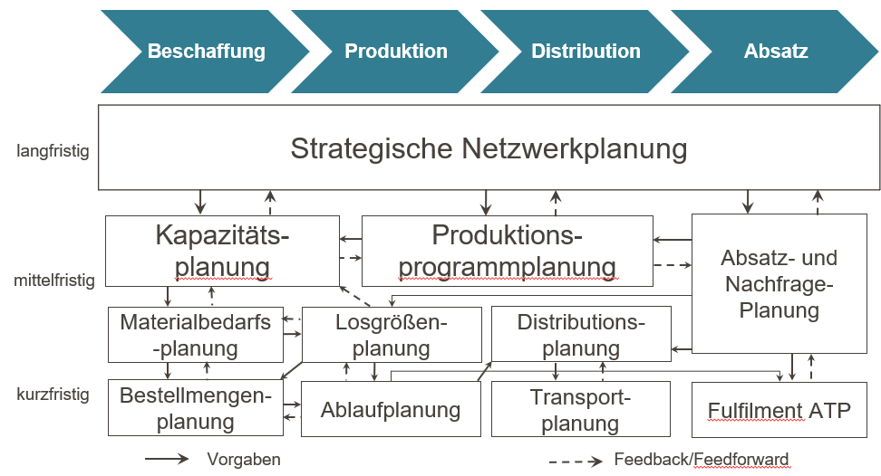

```{r}
#| echo: false
#| warning: false
#| message: false

# Load functions from scm_functions.R
source("../R/scm_functions.R")

library(tidyverse)
library(leaflet)
library(readxl)
library(dplyr)
library(plotly)
library(sf)
library(osrm)
library(leaflet)
library(dplyr)
library(units)
library(ggplot2)
library(knitr)
```


# Strategic Design of Supply Chains

## Strategic Design of Supply Chains {#slide-66}

- **Multi-criteria facility location planning**
- Continuous facility location planning
- Discrete facility location planning

## Learning objectives {#learning-objectives-location-continuous}

After this unit you will be able to …

- **classify** location decisions within strategic supply chain design,
- systematically **capture and evaluate** qualitative location factors,
- **explain and apply** the AHP method and the scoring model,
- **explain** the properties of different distance metrics and **calculate** them,
- **apply and interpret** continuous location methods for simple decision problems.

**Further reading**

- **Model-based regional facility location planning and development:** [@kik2022standortplanung].
- **Facility location planning and continuous decision models:**  [@thonemann2023operations, Chapter 3].
- **Continuous location models and local equilibria:** [@cooper1968locational].

## Planning in Supply Chain Management {#slide-67}

::: slide-subtitle
Supply Chain Planning Matrix
:::



## Strategic Network Planning {#slide-71}

::: slide-subtitle
Objective of facility location planning
:::

::::::: columns
::::: {.column width="60%"}
::: r-stretch
```{r}
#| echo: false
#| warning: false
#| message: false
#| cache: false
#| out-width: "100%"
#| fig-height: 1.1

library(plotly)

top_boxes <- data.frame(
  label = c("Procurement", "Production", "Distribution", "Sales"),
  x0 = c(0.00, 2.00, 4.00, 6.00),
  x1 = c(2.00, 4.00, 6.00, 8.00),
  y0 = 9.25,
  y1 = 9.75
)


shapes <- c(
  lapply(seq_len(nrow(top_boxes)), function(i) {
    shape_path(
      chevron_path(top_boxes$x0[i], top_boxes$x1[i], top_boxes$y0[i], top_boxes$y1[i]),
      fill = cols$top
    )
  })
)


fig <- plot_ly()

fig <- fig %>%
  add_text(
    x = mid(top_boxes$x0, top_boxes$x1),
    y = mid(top_boxes$y0, top_boxes$y1),
    text = top_boxes$label,
    textfont = list(size = 18, color = "white", family = "Arial"),
    hoverinfo = "skip", showlegend = FALSE
  )  %>%
  layout(
    xaxis = list(visible = FALSE, range = c(0, 8), fixedrange = T),
    yaxis = list(visible = FALSE, range = c(9.1, 9.8), fixedrange = T),
    plot_bgcolor = cols$bg,
    paper_bgcolor = cols$bg,
    margin = list(l = 10, r = 10, t = 10, b = 10),
    shapes = shapes,
    width = 900,
    height = 100
  )

fig

```
:::

::: r-stretch
```{r}
#| echo: false
#| warning: false
#| message: false
#| out-width: "95%"
#| fig-height: 5.5

library(DiagrammeR)

grViz("
digraph network {

  graph [
    rankdir = LR,
    bgcolor = 'transparent',
    nodesep = 0.35,
    ranksep = 0.75,
    splines = line
  ]

  node [
    shape = box,
    style = filled,
    fillcolor = '#DCEAF0',
    color = '#4B5563',
    fontname = Arial,
    fontsize = 16,
    width = 0.55,
    height = 0.38,
    fixedsize = true
  ]

  edge [
    color = '#4B4B4B',
    penwidth = 1.3,
    arrowsize = 0.8
  ]

  { rank = same; '7A'; '7B'; '7C'; '7D'; '7E' }
  { rank = same; '6A'; '6B'; '6C'; '6D' }
  { rank = same; '5A'; '5B'; '5C' }
  { rank = same; '4A'; '4B'; '4C' }
  { rank = same; '3A'; '3B'; '3C' }
  { rank = same; '2A'; '2B'; '2C'; '2D' }
  { rank = same; '1A'; '1B'; '1C'; '1D'; '1E' }


  '7A' -> '6A'
  '7B' -> '6A'
  '7B' -> '6B'
  '7C' -> '6B'
  '7C' -> '6C'
  '7D' -> '6C'
  '7D' -> '6D'
  '7E' -> '6D'

  '6A' -> '5A'
  '6B' -> '5A'
  '6B' -> '5B'
  '6C' -> '5B'
  '6C' -> '5C'
  '6D' -> '5C'

  '5A' -> '4A'
  '5B' -> '4A'
  '5B' -> '4B'
  '5C' -> '4B'
  '5C' -> '4C'

  '4A' -> '4B'
  '4B' -> '4C'

  '4A' -> '3A'
  '4A' -> '3B'
  '4A' -> '3C'
  '4B' -> '3B'
  '4B' -> '3C'
  '4C' -> '3C'

  '3A' -> '2A'
  '3A' -> '2B'
  '3B' -> '2B'
  '3B' -> '2C'
  '3C' -> '2C'
  '3C' -> '2D'

  '2B' -> '2A'

  '2A' -> '1A'
  '2A' -> '1B'
  '2B' -> '1C'
  '2C' -> '1C'
  '2D' -> '1D'
  '2D' -> '1E'
}
")
```
:::
:::::

::: {.column width="40%"}
**Decision on the location of:**

- distribution warehouses
- factories
- sales outlets
- supply warehouses
- ...
:::
:::::::

## Strategic Network Planning {#slide-72}

::: slide-subtitle
Phases of location selection
:::


[@chopra2025supply]

## Strategic Network Planning {#slide-73}

::: slide-subtitle
Facility location planning process
:::

::::: columns
::: {.column width="70%"}


[@kik2022standortplanung]
:::

::: {.column width="30%"}
- At global level, options are usually limited (continent/country) $\rightarrow$ factors heavily simplified and aggregated $\rightarrow$ non-specific; goal is strategic fit
- At regional level, goal is to identify the optimal location $\rightarrow$ more precise requirements
:::
:::::

## Strategic Network Planning {#slide-74}

::: slide-subtitle
Location factors
:::

:::::: columns
::: {.column width="70%"}
{width="950"}

[@lahner2020regionaloekonomie]
:::

:::: {.column width="30%"}
::: small-text
- Evaluating sites for new facilities is often difficult
- irreversible in the short term $\rightarrow$ path dependencies
- Multidimensional $\rightarrow$ effects on the system of objectives hard to oversee
- Subjective $\rightarrow$ assessments of soft factors often vary & their importance is weighted differently
:::
::::
::::::

## Strategic Network Planning {#slide-75}

::: slide-subtitle
Methods of facility location planning
:::

::::::: columns
:::: {.column width="60%"}
{width="800"}

::: small-text
[@kik2022standortplanung]
:::
::::

:::: {.column width="40%"}
::: small-text
- Qualitative methods $\rightarrow$ heuristic, mostly survey-based methods $\rightarrow$ snapshot of opinion and collection of individual assessments
- Quantitative methods
  - Optimisation: decision space (options) and one-dimensional system of objectives required
  - Simulation: complex, hard to transfer, multidimensional
  - Game theory: anticipation of competitor behaviour $\rightarrow$ sales maximisation
  - Investment appraisal: exclusively monetary quantities (optimisation)
:::
::::
:::::::

## Strategic Network Planning {#slide-sushifresh-intro}

::: slide-subtitle
Case study: SushiFresh GmbH
:::

::::::: columns
:::: {.column width="45%"}
::: small-text
**SushiFresh GmbH** is a fictitious regional producer of fresh sushi boxes in the Rhine-Main region that supplies six supermarket stores every day. This case study accompanies us through this and the following chapters.

SushiFresh is examining whether, in addition to delivery, an **own production facility** is worthwhile, and has identified three candidate sites.
:::
::::

:::: {.column width="55%"}
```{r}
#| echo: true

# Six stores: coordinates, daily demand mu and standard deviation sigma
filialen <- tibble(
  Filiale = c("Wiesbaden", "Mainz", "Frankfurt", "Ruesselsheim", "Darmstadt", "Offenbach"),
  lat   = c(50.0782, 50.0000, 50.1109, 49.9904, 49.8728, 50.0956),
  lon   = c(8.2398,  8.2711,  8.6821,  8.4116,  8.6512,  8.7761),
  mu    = c(120, 150, 280, 90, 110, 95),
  sigma = c(25, 30, 55, 20, 24, 22)
)

# Three candidate locations for the production facility
standorte <- tibble(
  Standort = c("Wiesbaden-Erbenheim", "Mainz-Hechtsheim", "Raunheim"),
  lat = c(50.0632, 49.9698, 50.0000),
  lon = c(8.2999,  8.2831,  8.4650),
  Fixkosten = c(180000, 210000, 260000)
)

sum(filialen$mu)  # Total demand: 845 boxes/day
```
::::
:::::::

## Qualitative Facility Location Planning {#slide-76}

::: slide-subtitle
Scoring model (utility analysis)
:::

::::::: {.columns .v-center}
:::: {.column width="42%"}
::: smaller-text

### Procedure

1.  Define relevant evaluation criteria
2.  Determine criteria weights
3.  Rate alternatives per criterion
4.  Aggregate weighted partial scores into a total score
5.  Rank alternatives by total score

### Critical points

- Additive model only interpretable to a limited extent
- Poor ratings can be compensated by good ones
- Utility independence of criteria often questionable
- Results are sensitive to the weighting
- Risk of goal fragmentation
:::
::::

:::: {.column width="58%"}
::: callout-note

## Case example

SushiFresh evaluates the three candidate locations **Wiesbaden-Erbenheim**, **Mainz-Hechtsheim** and **Raunheim** for the new production facility using the criteria **transport proximity**, **rental costs** and **availability of skilled labour**, which for simplicity are weighted equally here.

The set-up is deliberately chosen to produce very different location profiles: Wiesbaden-Erbenheim is strong on rental costs, Raunheim on transport proximity, while Mainz-Hechtsheim leads on skilled labour.

This very example shows the weakness of the additive scoring model: despite clearly different profiles of strengths and weaknesses, all alternatives can achieve the same total score.
:::
::::
:::::::

## Qualitative Facility Location Planning

::: slide-subtitle
Scoring model in R: code and results table
:::

::: small-text
```{r}
#| echo: true
#| eval: true
#| warning: false
#| message: false
#| output-location: column
#| code-overflow: wrap

library(dplyr)
library(knitr)

# Table with raw data of the case study (three criteria, equally weighted)
nwa <- tibble(
  Kriterium = c(
    "Transport proximity",
    "Rental costs",
    "Skilled labour availability"
  ),
  Gewicht = c(1/3, 1/3, 1/3),
  `WI-Erb`  = c(5, 8, 2),
  `MZ-Hech` = c(2, 5, 8),
  Raunheim  = c(8, 2, 5)
)

# Calculate the scores of the locations
nutzwert <- c(
    `WI-Erb`  = sum(nwa$Gewicht * nwa$`WI-Erb`),
    `MZ-Hech` = sum(nwa$Gewicht * nwa$`MZ-Hech`),
    Raunheim  = sum(nwa$Gewicht * nwa$Raunheim)
  )

# Combine raw data and scores in one table
nwa <- bind_rows(nwa, nutzwert)

# Set name "Score" in row 4, column Kriterium
nwa$Kriterium[4] <- "Score"

# Output table
nwa |>
  mutate(
    Gewicht = ifelse(is.na(Gewicht), "", sprintf("%.2f", Gewicht)), # Show 2 decimal places
    `WI-Erb` = sprintf("%.1f", `WI-Erb`),
    `MZ-Hech` = sprintf("%.1f", `MZ-Hech`),
    Raunheim = sprintf("%.1f", Raunheim)
  ) |>
  kable(
    col.names = c("Criterion", "Weight", "WI-Erb", "MZ-Hech", "Raunheim"),
    format = "html",
    align = c("l", "c", "c", "c", "c")
  )
```
:::

------------------------------------------------------------------------

## Qualitative Facility Location Planning {#slide-77}

::: slide-subtitle
Analytic Hierarchy Process (AHP method)
:::

::: {.ahp-hierarchy}
::: {.ahp-level}
**Bottom level:** Determine how the alternatives contribute to the criteria.
:::

::: {.ahp-arrow}
⇓
:::

::: {.ahp-level}
**Medium level:** Determine how the evaluation criteria contribute to achieving the objective.
:::

::: {.ahp-arrow}
⇓
:::

::: {.ahp-level}
**Top level:** Determine the best of the given alternatives (objective).
:::

::: {.ahp-source}
Bottom-up hierarchy [@klein2011planung, p. 361]
:::
:::

### Procedure

1.  Carry out pairwise comparisons between all alternatives with respect to the evaluation criteria.
2.  Derive a ranking of alternatives for each evaluation criterion (synthesis).
3.  Carry out pairwise comparisons between all evaluation criteria.
4.  Derive a ranking of the evaluation criteria (synthesis).
5.  Calculate the score for the alternatives.

## Qualitative Facility Location Planning {#slide-78}

::: slide-subtitle
Analytic Hierarchy Process (AHP method) – example
:::

::::::: {.columns .v-center}
:::: {.column width="50%"}
::: callout-note

## Case example

SushiFresh now compares the three candidate locations Wiesbaden-Erbenheim (W-E), Mainz-Hechtsheim (M-H) and Raunheim (R) **pairwise** instead of using directly estimated scores. The following evaluation criteria are used.

1.  Transport proximity: distance to the six stores
2.  Rental costs: annual fixed costs of the site
3.  Skilled labour availability: access to catering/food specialists
:::
::::

:::: {.column width="50%"}
::: smaller-text
**Rating scale**

| Preference                    | Value |
|:------------------------------|:-----|
| Equal                         | 1    |
| Equal to slightly preferred   | 2    |
| Slightly preferred            | 3    |
| Slightly to clearly preferred | 4    |
| Clearly preferred             | 5    |
| Clearly to strongly preferred | 6    |
| Strongly preferred            | 7    |
| Strongly to extremely preferred | 8  |
| Extremely preferred           | 9    |
:::
::::
:::::::

## Qualitative Facility Location Planning {#slide-79}

::: slide-subtitle
Analytic Hierarchy Process (AHP method) – example
:::

::: smaller-text
**Procedure**

1.  **Carry out pairwise comparisons between all alternatives with respect to the evaluation criteria.**
2.  Derive a ranking of alternatives for each evaluation criterion (synthesis).
3.  Carry out pairwise comparisons between all evaluation criteria.
4.  Derive a ranking of the evaluation criteria (synthesis).
5.  Calculate the score for the alternatives.
:::

::::::: {.columns .v-center}
::: {.column width="33%"}
Transport proximity

| site    |  W-E  |  M-H  |  R  |
|:--------|:--------:|:---------:|:----------:|
| W-E  |    1     |     2     |    1/2     |
| M-H |   1/2    |     1     |    1/3     |
| R |    2     |     3     |     1      |
:::

::: {.column width="33%"}
Rental costs

| site    |  W-E  |  M-H  |  R  |
|:--------|:--------:|:---------:|:----------:|
| W-E  |    1     |     2     |     4      |
| M-H |   1/2    |     1     |     2      |
| R |   1/4    |    1/2    |     1      |
:::

::: {.column width="33%"}
Skilled labour

| site    |  W-E  |  M-H  |  R  |
|:--------|:--------:|:---------:|:----------:|
| W-E  |    1     |    1/7    |     2      |
| M-H |    7     |     1     |     5      |
| R|   1/2    |    1/5    |     1      |
:::
:::::::

## Qualitative Facility Location Planning {#slide-80}

::: slide-subtitle
Analytic Hierarchy Process (AHP method) – example
:::

::: smaller-text
**Procedure**

1.  Carry out pairwise comparisons between all alternatives with respect to the evaluation criteria.
2.  **Derive a ranking of alternatives for each evaluation criterion (synthesis).**
3.  Carry out pairwise comparisons between all evaluation criteria.
4.  Derive a ranking of the evaluation criteria (synthesis).
5.  Calculate the score for the alternatives.
:::

::::::: small-text
**Transport proximity** — synthesis (calculation of the principal eigenvector)

:::::: {.columns .v-center}
::: {.column width="31%"}
Column sums

| site    |  W-E  |  M-H  |  R  |
|:--------|:--------:|:---------:|:----------:|
| W-E  |    1     |     2     |    1/2     |
| M-H |   1/2    |     1     |    1/3     |
| R |    2     |     3     |     1      |
|  $\sum$ |    7/2     |     6     |    11/6      |
:::

::: {.column width="31%"}
::: {.fragment .fade-up}

Normalisation

| site    |  W-E  |  M-H  |  R  |
|:--------|:--------:|:---------:|:----------:|
| W-E     |    2/7   |     1/3     |    3/11  |
| M-H     |   1/7    |     1/6     |    2/11  |
| R       |    4/7   |     1/2     |    6/11  |
|  $\sum$ |    1     |     1       |    1     |
:::

:::

::: {.column width="37%"}
::: {.fragment .fade-up}
Consolidation

| site    |  W-E  |  M-H  |  R  | $\varnothing$ |
|:--------|:--------:|:---------:|:----------:|:----------:|
| W-E     |   0.29   |     0.33     |   0.27     | **0.297** |
| M-H     |   0.14   |     0.17     |   0.18     | **0.163** |
| R       |   0.57   |     0.50     |   0.55     | **0.540** |
|  $\sum$ |    1     |     1     |    1       | 1 |
:::
:::
::::::
:::::::

## Qualitative Facility Location Planning {#slide-81}

::: slide-subtitle
Analytic Hierarchy Process (AHP method) – example
:::

::: smaller-text
**Procedure**

1.  Carry out pairwise comparisons between all alternatives with respect to the evaluation criteria.
2.  **Derive a ranking of alternatives for each evaluation criterion (synthesis).**
3.  Carry out pairwise comparisons between all evaluation criteria.
4.  Derive a ranking of the evaluation criteria (synthesis).
5.  Calculate the score for the alternatives.
:::

Preference vectors of all locations for all criteria

| site     | Transport proximity | Rental costs | Skilled labour |
|:---------|:-------------:|:----------:|:----------:|
| WI-Erb   |    0.297     |   0.571   |   0.160   |
| MZ-Hech  |    0.163     |   0.286   |   0.730   |
| Raunheim |    0.540     |   0.143   |   0.110   |

## Qualitative Facility Location Planning {#slide-82}

::: slide-subtitle
Analytic Hierarchy Process (AHP method) – example
:::

::: smaller-text
**Procedure**

1.  Carry out pairwise comparisons between all alternatives with respect to the evaluation criteria.
2.  Derive a ranking of alternatives for each evaluation criterion (synthesis).
3.  **Carry out pairwise comparisons between all evaluation criteria.**
4.  Derive a ranking of the evaluation criteria (synthesis).
5.  Calculate the score for the alternatives.
:::

| Criterion      | Transport proximity | Rental costs | Skilled labour |
|:---------------|:-------------:|:----------:|:----------:|
| Transport proximity |       1       |     3      |     2      |
| Rental costs   |      1/3      |     1      |    1/5     |
| Skilled labour |      1/2      |     5      |     1      |
| $\sum$         |     11/6      |     9      |    16/5     |

## Qualitative Facility Location Planning

::: slide-subtitle
Analytic Hierarchy Process (AHP method) – example
:::

::: smaller-text
**Procedure**

1.  Carry out pairwise comparisons between all alternatives with respect to the evaluation criteria.
2.  Derive a ranking of alternatives for each evaluation criterion (synthesis).
3.  Carry out pairwise comparisons between all evaluation criteria.
4.  **Derive a ranking of the evaluation criteria (synthesis).**
5.  Calculate the score for the alternatives.
:::

Applying the same procedure (geometric mean of the rows, then normalise) as on the previous slide for the locations yields for the three criteria:

| Criterion      | Transport proximity | Rental costs | Skilled labour | $\varnothing$ |
|:---------------|:-------------:|:----------:|:----------:|:----------:|
| Transport proximity |     6/11      |     1/3    |     10/16   | 0.501 |
| Rental costs   |     2/11      |     1/9    |     1/16    | 0.118 |
| Skilled labour |     3/11      |     5/9    |     5/16    | 0.380 |
| $\sum$         |     1         |     1      |     1      | 1 |

## Qualitative Facility Location Planning {#slide-83}

::: slide-subtitle
Analytic Hierarchy Process (AHP method) – example
:::

::: smaller-text
**Procedure**

1.  Carry out pairwise comparisons between all alternatives with respect to the evaluation criteria.
2.  Derive a ranking of alternatives for each evaluation criterion (synthesis).
3.  Carry out pairwise comparisons between all evaluation criteria.
4.  Derive a ranking of the evaluation criteria (synthesis).
5.  **Calculate the score for the alternatives.**
:::

::: smaller-text
$\left(
\begin{array}{ccc}
0.297 & 0.571 & 0.160 \\
0.163 & 0.286 & 0.730 \\
0.540 & 0.143 & 0.110
\end{array}
\right)
\times
\left(
\begin{array}{c}
0.501\\
0.118\\
0.380
\end{array}
\right)
=
\left(
\begin{array}{c}
0.280\\
0.390\\
0.330
\end{array}
\right)
\begin{array}{c}
\text{= Score WI-Erb}\\
\text{= Score MZ-Hech}\\
\text{= Score Raunheim}
\end{array}$

**Result:** The best alternative is Mainz-Hechtsheim — but only **narrowly** ahead of Raunheim!

::: {.fragment .fade-up}
**Advantages of AHP**

- Pairwise comparison increases transparency and simplifies ranking the alternatives.
- AHP offers less scope for decision-makers' "bias" than the scoring model.
- Irrational judgements by decision-makers can be detected via a consistency index
:::
:::

## Qualitative Facility Location Planning {#slide-84}

::: slide-subtitle
Analytic Hierarchy Process (AHP method) – consistency index
:::

:::::: {.columns .v-center}
:::: {.column width="70%"}

::: smaller-text
1.  Product of non-normalised preference matrix and preference vector (criteria comparison): $$\left(\begin{array}{ccc}
     1 & 3 & 2 \\
     1\!/\!3 & 1 & 1\!/\!5 \\
     1\!/\!2 & 5 & 1 \\
     \end{array}
     \right)\times\left(\begin{array}{c}
     0.510\\
     0.118\\
     0.380\\
     \end{array}\right)=\left(\begin{array}{c}
     1.624 \\
     0.364\\
     1.225\\
     \end{array}\right)$$
2.  Divide the vector component-wise by the preference values: $$\begin{align*}
    1.624 / 0.510 &=  3.184\\
    0.364 / 0.118 &=  3.085\\
    1.225 / 0.380 &=  3.224\\
    \text{average }\bar{P} &= 3.164
    \end{align*}$$
3.  Calculate the consistency index with $n=3$ as $$ CI =\frac{\bar{P}- n}{n-1} = 0.08. $$
:::
::::

:::: {.column width="30%"}
::: {.fragment .fade-up}
::: callout-note

## Interpretation

The closer $CI$ is to 0, the more consistent the preference matrix. If $CI=0$, it is perfectly consistent. $\bar{P}$ is the largest eigenvalue of the preference matrix. With $CR \approx 0.08$ the matrix is very close to 0 and can therefore be regarded as consistent.
:::
:::
::::
::::::

## Strategic Design of Supply Chains {#slide-85}

- Multi-criteria facility location planning
- **Continuous facility location planning**
- Discrete facility location planning


## Continuous Facility Location Planning {#slide-86}
::: slide-subtitle
Neoclassical location theory -- Steiner–Weber model
:::

:::::: {.columns .v-center}
:::: {.column width="60%"}
::: small-text
**Assumptions**

1. A homogeneous plane (**sales area**) containing a finite number of **customer locations**.
2. **Demand quantities** are given for each customer location and must be served in full.
3. A **transport cost function** that depends on transport distance and transport quantity.
4. Time is not considered
:::
::::

:::: {.column width="40%"}


::::
::::::

::: {.fragment .fade-up}
**Objective**

We seek the **transport-cost-minimising location** for a production, storage or transhipment facility in the sales area — for SushiFresh: the ideal point in the Rhine-Main region for the new production facility, regardless of the three sites actually available.
:::

---

## Continuous Facility Location Planning {#slide-87}

::: {.slide-subtitle}
Neoclassical location theory – Steiner–Weber model
:::

:::::: {.columns .v-center}
::: {.column width="55%"}
::: {.smaller-text}

**Model formulation**

Determine coordinates $(x,y)$ in the sales area that minimise the weighted total transport distance to the customer locations.

$$
\min\; Z(x,y) = \sum_{i=1}^{n} a_i \cdot d\big((x,y),(u_i,v_i)\big)
$$

**Decision variable**

- $(x,y)$: coordinates of the location to be determined.

**Parameters**

- $(u_i,v_i)$: coordinates of customer location $i$.
- $a_i$: demand of customer location $i$; for SushiFresh: boxes per day.
- $d(\cdot)$: distance measure used.

:::
:::

::: {.column width="45%"}
::: {.smaller-text}
::: {.fragment .fade-up}
**Distance measures**

- Euclidean distance: $d = \sqrt{(x-u_i)^2 + (y-v_i)^2}$
- Manhattan distance: $d = |x-u_i| + |y-v_i|$
- Road distances: shortest paths in a transport network.

```{r}
#| echo: false
#| warning: false
#| message: false


start <- data.frame(
  id = "Wiesbaden-Erbenheim",
  lon = 8.2999,
  lat = 50.0632
)

goal <- data.frame(
  id = "Frankfurt",
  lon = 8.6821,
  lat = 50.1109
)

start_sf <- st_as_sf(start, coords = c("lon", "lat"), crs = 4326)
goal_sf  <- st_as_sf(goal,  coords = c("lon", "lat"), crs = 4326)

xy_start <- st_coordinates(start_sf)
xy_goal  <- st_coordinates(goal_sf)

route_sf <- osrmRoute(src = start_sf, dst = goal_sf) |>
  mutate(
    dist_km = round(as.numeric(distance), 1),
    label_txt = paste0("Road network: ", format(dist_km, nsmall = 1), " km")
  )

euclid_sf <- st_sf(
  name = "Euclidean distance",
  geometry = st_sfc(
    st_linestring(rbind(xy_start[1, ], xy_goal[1, ])),
    crs = 4326
  )
)

manhattan_sf <- st_sf(
  name = "Manhattan distance",
  geometry = st_sfc(
    st_linestring(matrix(
      c(
        xy_start[1, 1], xy_start[1, 2],
        xy_goal[1, 1],  xy_start[1, 2],
        xy_goal[1, 1],  xy_goal[1, 2]
      ),
      ncol = 2,
      byrow = TRUE
    )),
    crs = 4326
  )
)

crs_proj <- 25832

euclid_sf <- euclid_sf |>
  st_transform(crs_proj) |>
  mutate(
    dist_km = round(as.numeric(set_units(st_length(geometry), "km")), 1),
    label_txt = paste0("Euclidean: ", format(dist_km, nsmall = 1), " km")
  ) |>
  st_transform(4326)

manhattan_sf <- manhattan_sf |>
  st_transform(crs_proj) |>
  mutate(
    dist_km = round(as.numeric(set_units(st_length(geometry), "km")), 1),
    label_txt = paste0("Manhattan: ", format(dist_km, nsmall = 1), " km")
  ) |>
  st_transform(4326)

all_routes <- bind_rows(
  euclid_sf |> mutate(route_type = "Euclidean"),
  manhattan_sf |> mutate(route_type = "Manhattan"),
  route_sf |> mutate(route_type = "Road network")
)

label_points <- all_routes |>
  st_transform(crs_proj)

label_geom <- st_line_sample(label_points, sample = 0.5)

label_points <- st_as_sf(
  label_points |>
    st_drop_geometry() |>
    dplyr::select(route_type, label_txt),
  geometry = label_geom,
  crs = crs_proj
) |>
  st_transform(4326)

label_coords <- st_coordinates(label_points)

leaflet(width = "100%", height = 420) |>
  addProviderTiles(providers$OpenStreetMap.Mapnik) |>
  addPolylines(
    data = route_sf,
    color = "#dc2626",
    weight = 5,
    opacity = 0.9,
    label = ~paste0("Road distance (shortest path): ", format(dist_km, nsmall = 1), " km")
  ) |>
  addPolylines(
    data = euclid_sf,
    color = "#2563eb",
    weight = 4,
    opacity = 0.85,
    label = ~paste0("Euclidean distance: ", format(dist_km, nsmall = 1), " km")
  ) |>
  addPolylines(
    data = manhattan_sf,
    color = "#059669",
    weight = 4,
    opacity = 0.85,
    dashArray = "8,8",
    label = ~paste0("Manhattan distance: ", format(dist_km, nsmall = 1), " km")
  ) |>
  addLabelOnlyMarkers(
    lng = label_coords[, 1],
    lat = label_coords[, 2],
    label = label_points$label_txt,
    labelOptions = labelOptions(
      noHide = TRUE,
      textOnly = TRUE,
      direction = "top",
      offset = c(0, -6),
      style = list(
        "color" = "#111827",
        "font-size" = "12px",
        "font-weight" = "600",
        "background-color" = "rgba(255,255,255,0.85)",
        "padding" = "2px 6px",
        "border" = "1px solid rgba(17,24,39,0.15)",
        "border-radius" = "4px",
        "box-shadow" = "0 1px 3px rgba(0,0,0,0.15)"
      )
    )
  ) |>
  addCircleMarkers(
    data = start_sf,
    radius = 6,
    color = "#0f172a",
    fillColor = "#0f172a",
    fillOpacity = 1,
    label = "Wiesbaden-Erbenheim"
  ) |>
  addCircleMarkers(
    data = goal_sf,
    radius = 6,
    color = "#7c3aed",
    fillColor = "#7c3aed",
    fillOpacity = 1,
    label = "Frankfurt"
  ) |>
  addLegend(
    "bottomright",
    colors = c("#2563eb", "#059669", "#dc2626"),
    labels = c("Euclidean", "Manhattan", "Road network"),
    opacity = 1
  ) |>
  fitBounds(
    lng1 = min(c(start$lon, goal$lon)) - 0.01,
    lat1 = min(c(start$lat, goal$lat)) - 0.01,
    lng2 = max(c(start$lon, goal$lon)) + 0.01,
    lat2 = max(c(start$lat, goal$lat)) + 0.01
  )
```
:::
:::

:::
::::::

---

## Continuous Facility Location Planning {#slide-88}
::: slide-subtitle
Steiner–Weber model with Euclidean distance
:::

:::::: columns
:::: {.column width="54%"}
::: {.smaller-text}

### Iterative solution approach

For given customer locations $(u_i,v_i)$ and weights $a_i$, with

$$
g_i(x,y)=\frac{a_i}{\sqrt{(x-u_i)^2+(y-v_i)^2}}
$$

the update rule is

$$
x_{t+1}=\frac{\sum_{i=1}^n u_i\, g_i(x_t,y_t)}{\sum_{i=1}^n g_i(x_t,y_t)},
\qquad
y_{t+1}=\frac{\sum_{i=1}^n v_i\, g_i(x_t,y_t)}{\sum_{i=1}^n g_i(x_t,y_t)}.
$$

### Weiszfeld algorithm (simplified)

1. Choose a starting solution $(x_0,y_0)$, e.g. the weighted centre of gravity.
2. Use the update rule to compute a new location.
3. Repeat the step until the change is smaller than a tolerance.


:::
::::

:::: {.column width="46%"}
::: {.fragment .fade-up}
::: {.smaller-text}
**Implementation in R**

```{r}
#| echo: true
#| eval: true
#| attr-source: 'style="max-height: 380px;"'

steiner_weber_euclid <- function(data, x0 = NULL, y0 = NULL,
                                 tol = 1e-6, max_iter = 1000) {
  # data must contain the columns u, v and a:
  # u = x-coordinate of the customers
  # v = y-coordinate of the customers
  # a = demand weight

  stopifnot(all(c("u", "v", "a") %in% names(data)))

  # Starting value: weighted centre of gravity, if none is given
  if (is.null(x0)) x0 <- sum(data$a * data$u) / sum(data$a)
  if (is.null(y0)) y0 <- sum(data$a * data$v) / sum(data$a)

  x <- x0
  y <- y0

  history <- data.frame(
    iter = 0,
    x = x,
    y = y,
    delta = NA_real_
  )

  for (t in 1:max_iter) {
    # Distance from the current location to each customer
    d <- sqrt((x - data$u)^2 + (y - data$v)^2)

    # Iteration weights according to the Weiszfeld algorithm
    g <- data$a / d

    # Update the coordinates
    x_new <- sum(data$u * g) / sum(g)
    y_new <- sum(data$v * g) / sum(g)

    # Change between two iterations
    delta <- sqrt((x_new - x)^2 + (y_new - y)^2)

    history <- rbind(
      history,
      data.frame(iter = t, x = x_new, y = y_new, delta = delta)
    )

    # Stop once the change is sufficiently small
    if (delta < tol) {
      return(list(
        x = x_new,
        y = y_new,
        iter = t,
        converged = TRUE,
        history = history
      ))
    }

    x <- x_new
    y <- y_new
  }

  list(
    x = x,
    y = y,
    iter = max_iter,
    converged = FALSE,
    history = history
  )
}
```


::: callout-note

## Notes
- Nearby customers with high demand receive a high weight in the iteration step $\rightarrow$ location shifts in that direction
- Sensible starting value: weighted centre of gravity.
- Stop: small change in position or maximum number of iterations.
:::


:::
:::
::::
::::::

---

## Continuous Facility Location Planning {#slide-89}
::: slide-subtitle
Steiner–Weber model with Euclidean distance – example
:::

```{r}
#| include: true

# SushiFresh stores as Steiner-Weber customers: u = longitude, v = latitude
kunden <- data.frame(
  i = c("Wiesbaden", "Mainz", "Frankfurt", "Ruesselsheim", "Darmstadt", "Offenbach"),
  u = c(8.2398, 8.2711, 8.6821, 8.4116, 8.6512, 8.7761),
  v = c(50.0782, 50.0000, 50.1109, 49.9904, 49.8728, 50.0956),
  a = c(120, 150, 280, 90, 110, 95)
)

# deliberately distant starting point (not the centre of gravity) to show the path
res <- steiner_weber_euclid(kunden, x0 = 8.75, y0 = 49.85, tol = 1e-4, max_iter = 100)
iter_tbl <- res$history |>
  mutate(
    Standort = paste0("(", format(round(x, 4), nsmall = 4), "; ", format(round(y, 4), nsmall = 4), ")"),
    Abweichung = ifelse(is.na(delta), "---", format(round(delta, 4), nsmall = 4))
  ) |>
  transmute(`Iteration t` = iter, `Standort (x,y)` = Standort, Abweichung)

input_tbl <- kunden |>
  transmute(`Filiale` = i,
            `Standort (u_i,v_i)` = paste0("(", sprintf("%.4f", u), "; ", sprintf("%.4f", v), ")"),
            `Nachfrage a_i` = a)

anim_df <- res$history |>
  mutate(frame = iter,
         label = paste0("t = ", iter))
```


:::::: {.columns}
::: {.column width="42%"}

```{r}
#| echo: false
#| results: asis
#| out-width: 100%
#| cache: false

fig <- plot_ly(height = "100%", width = 650) |>
  add_markers(data = kunden,
              x = ~u, y = ~v,
              size = ~a^2, sizes = c(10, 400),
              color = I("#5ba3d0"), opacity = 0.85,
              text = ~i, hoverinfo = "text",
              showlegend = FALSE) |>
  add_text(data = kunden,
           x = ~u, y = ~v + 0.02,
           text = ~i, showlegend = FALSE,
           textfont = list(color = "#7a5b3a", size = 12)) |>
  add_lines(data = anim_df,
            x = ~x, y = ~y,
            frame = ~frame,
            line = list(color = "#d11f2f", width = 3),
            showlegend = FALSE,
            hoverinfo = "none") |>
  add_markers(data = anim_df,
              x = ~x, y = ~y,
              frame = ~frame,
              marker = list(color = "#e31a1c", symbol = "x", size = 11),
              text = ~label, hoverinfo = "text",
              showlegend = FALSE) |>
  layout(
    margin = list(l = 40, r = 10, t = 10, b = 35),
    xaxis = list(title = "Longitude", range = c(8.1, 8.9), dtick = 0.2, zeroline = FALSE, gridcolor = "#e5e5e5"),
    yaxis = list(title = "Latitude", range = c(49.75, 50.25), dtick = 0.1, zeroline = FALSE, gridcolor = "#e5e5e5"),
    paper_bgcolor = "white",
    plot_bgcolor = "white"
  ) |>
  animation_opts(frame = 900, transition = 250, redraw = FALSE) |>
  animation_button(x = 1, xanchor = "right", y = 0, yanchor = "top")

htmltools::tagList(
  htmltools::tags$div(class = "anim-title", "Animation of the iteration path"),
  fig
)
```

:::

::: {.column width="58%"}
::: {.smaller-text}

### Input data

```{r}
#| echo: false
#| results: asis
kable(input_tbl, col.names = c("Store", "Location (u_i,v_i)", "Demand a_i"), align = c("c", "c", "c"), format = "html", table.attr = 'class="steiner-table"')
```

### Iterations

```{r}
#| echo: false
#| results: asis
kable(iter_tbl |> slice(1:6), col.names = c("Iteration t", "Location (x,y)", "Deviation"), align = c("c", "c", "c"), format = "html", table.attr = 'class="steiner-table"')
```
:::
:::
::::::


---

## Continuous Facility Location Planning {#slide-steiner-weber-shortcut}
::: slide-subtitle
Euclidean Steiner–Weber model — shortcut
:::

```{r}
#| include: false

# Euclidean optimum from the existing Weiszfeld function (start = CoG)
res_euclid <- steiner_weber_euclid(
  data = kunden,
  x0 = NULL,
  y0 = NULL,
  tol = 1e-6,
  max_iter = 1000
)

euclid_opt <- data.frame(
  x = res_euclid$x,
  y = res_euclid$y
)

# Centre of gravity as weighted mean point
cog <- data.frame(
  x = weighted.mean(kunden$u, kunden$a),
  y = weighted.mean(kunden$v, kunden$a)
)

# Comparison of demand-weighted total distances - this time with the
# actual (spherical) haversine distance instead of naive degree differences,
# since u/v here are longitude/latitude
vergleich <- kunden |>
  mutate(
    `Opt. Standort (x, y)` =
      haversine(euclid_opt$y, euclid_opt$x, v, u) * a,
    `Center of gravity (x, y)` =
      haversine(cog$y, cog$x, v, u) * a
  ) |>
  transmute(
    Filiale = i,
    `Opt. Standort` =
      sprintf(
        "%.1f km * %d = %.0f",
        haversine(euclid_opt$y, euclid_opt$x, v, u),
        a,
        `Opt. Standort (x, y)`
      ),
    `Center of gravity` =
      sprintf(
        "%.1f km * %d = %.0f",
        haversine(cog$y, cog$x, v, u),
        a,
        `Center of gravity (x, y)`
      )
  )

vergleich <- bind_rows(
  vergleich,
  data.frame(
    "Filiale" = NA,
    "Opt. Standort" = sprintf(
      "%.0f",
      sum(haversine(euclid_opt$y, euclid_opt$x, kunden$v, kunden$u) * kunden$a)
    ),
    "Center of gravity" = sprintf(
      "%.0f",
      sum(haversine(cog$y, cog$x, kunden$v, kunden$u) * kunden$a)
    )
  )
)

# For display in the chart
kunden_plot <- kunden |>
  mutate(
    kunden_label = i,
    nachfrage_label = paste0("Demand: ", a)
  )

rmse.eucl <- sum(haversine(euclid_opt$y, euclid_opt$x, kunden$v, kunden$u) * kunden$a)
rmse.cog  <- sum(haversine(cog$y, cog$x, kunden$v, kunden$u) * kunden$a)

```

:::::: {.columns}
::::: {.column width="50%"}

:::: {.small-text}
::: {.callout-tip appearance="simple"}

## Centre of gravity

The centre of gravity is a centroid approximation of the Euclidean Steiner–Weber problem (here: longitude/latitude treated approximately as planar coordinates):

$$
x^{CoG} = \frac{\sum_{i=1}^{n} a_i u_i}{\sum_{i=1}^{n} a_i},
\qquad
y^{CoG} = \frac{\sum_{i=1}^{n} a_i v_i}{\sum_{i=1}^{n} a_i}.
$$
For the SushiFresh example:

$$
(x^{CoG}, y^{CoG}) =
(`r sprintf("%.4f", cog$x)`; `r sprintf("%.4f", cog$y)`).
$$

:::


::: {.callout-note appearance="simple"}
The centre of gravity is quick to compute, but only an approximation:
in the example, the iterative Steiner–Weber location has a lower
demand-weighted total **haversine distance** (`r round(rmse.eucl,0)` vs. `r round(rmse.cog,0)` box-km).
:::


::::
:::::

:::: {.column width="50%"}
::: {.fragment .fade-up}
```{r}
#| echo: false
#| fig-width: 6.3
#| fig-height: 5.5
#| out-width: 100%
#| fig-align: center

ggplot(kunden_plot, aes(x = u, y = v)) +
  geom_point(
    aes(size = a),
    color = "#c97a2b",
    alpha = 0.90
  ) +
  geom_text(
    aes(label = kunden_label),
    vjust = -1.0,
    size = 3.0,
    color = "#6b5a4a"
  ) +
  geom_point(
    data = euclid_opt,
    aes(x = x, y = y),
    inherit.aes = FALSE,
    shape = 4,
    size = 4.2,
    stroke = 1.4,
    color = "#e31a1c"
  ) +
  geom_point(
    data = cog,
    aes(x = x, y = y),
    inherit.aes = FALSE,
    shape = 16,
    size = 3.5,
    color = "#2563eb"
  ) +
  annotate(
    "text",
    x = euclid_opt$x + 0.03,
    y = euclid_opt$y + 0.02,
    label = "Weiszfeld optimum",
    color = "#e31a1c",
    size = 3.1
  ) +
  annotate(
    "text",
    x = cog$x + 0.03,
    y = cog$y - 0.02,
    label = "Centre of gravity",
    color = "#2563eb",
    size = 3.1
  ) +
  scale_size_area(max_size = 12, guide = "none") +
  scale_x_continuous(
    limits = c(8.1, 8.9),
    breaks = seq(8.2, 8.8, 0.2)
  ) +
  scale_y_continuous(
    limits = c(49.75, 50.25),
    breaks = seq(49.8, 50.2, 0.1)
  ) +
  labs(x = "Longitude", y = "Latitude") +
  theme_minimal(base_size = 12) +
  theme(
    panel.grid.major = element_line(color = "#e5e5e5", linewidth = 0.4),
    panel.grid.minor = element_blank(),
    axis.title = element_text(size = 10, color = "#555555"),
    axis.text = element_text(size = 9, color = "#666666"),
    plot.margin = margin(5, 5, 5, 5)
  )
```
:::
::::
::::::

---

## Continuous Facility Location Planning {#slide-steiner-weber-manhattan}

::: slide-subtitle
Steiner–Weber model with Manhattan distances
:::

```{r}
#| include: false

library(dplyr)
library(ggplot2)
library(knitr)

# Weighted median of a coordinate:
# smallest value at which the cumulative demand reaches at least
# half of the total demand
weighted_median <- function(x, w) {
  ord <- order(x)
  x <- x[ord]
  w <- w[ord]

  x[which(cumsum(w) >= sum(w) / 2)][1]
}

# Manhattan optimum: weighted median per coordinate
manhattan_opt <- data.frame(
  x = weighted_median(kunden$u, kunden$a),
  y = weighted_median(kunden$v, kunden$a)
)

```

:::::: {.columns}
:::: {.column width="52%"}

::: {.smaller-text}
::: {.callout-tip appearance="simple"}

## Steiner–Weber model with Manhattan distances

Determine coordinates $(x,y)$ in the sales area that minimise the weighted
total transport distance to the customer locations.

$$
\min \; Z(x,y) = \sum_{i=1}^{n} a_i \left( |x-u_i| + |y-v_i| \right) = \sum_{i=1}^{n} a_i |x-u_i| + \sum_{i=1}^{n} a_i |y-v_i|
$$
:::

**Algorithm for the optimal location**

Determine the **weighted median** for each dimension — shown here
for the $x$-coordinate (longitude):

1. Sort the stores by ascending $u_i$-coordinates.
2. Determine the cumulative demand $A_j = \sum_{i=1}^{j} a_i$.
3. Choose the first customer with $A_j \geq \frac{1}{2}\sum_{i=1}^{n} a_i$.
4. Its $u_i$-coordinate is the optimal $x$-coordinate.

:::
::::

::: {.column width="48%"}

::: {.fragment .fade-up}

```{r}
#| echo: false
#| fig-width: 6.3
#| fig-height: 4.0
#| out-width: 100%
#| fig-align: center

ggplot(kunden_plot, aes(x = u, y = v)) +
  geom_point(
    aes(size = a),
    color = "#c97a2b",
    alpha = 0.90
  ) +
  geom_text(
    aes(label = kunden_label),
    vjust = -1.0,
    size = 3.0,
    color = "#6b5a4a"
  ) +
  geom_point(
    data = manhattan_opt,
    aes(x = x, y = y),
    inherit.aes = FALSE,
    shape = 4,
    size = 4.2,
    stroke = 1.4,
    color = "#15803d"
  ) +
  annotate(
    "text",
    x = manhattan_opt$x + 0.03,
    y = manhattan_opt$y + 0.02,
    label = "Optimum",
    color = "#15803d",
    size = 3.2
  ) +
  scale_size_area(max_size = 12, guide = "none") +
  scale_x_continuous(
    limits = c(8.1, 8.9),
    breaks = seq(8.2, 8.8, 0.2)
  ) +
  scale_y_continuous(
    limits = c(49.75, 50.25),
    breaks = seq(49.8, 50.2, 0.1)
  ) +
  labs(x = "Longitude", y = "Latitude") +
  theme_minimal(base_size = 12) +
  theme(
    panel.grid.major = element_line(color = "#d5d5d5", linewidth = 0.45),
    panel.grid.minor = element_blank(),
    axis.title = element_text(size = 10, color = "#555555"),
    axis.text = element_text(size = 9, color = "#666666"),
    plot.margin = margin(5, 5, 5, 5)
  )
```

::: {.small-text}
::: {.callout-note appearance="simple"}
For the SushiFresh example:
$$
(x^*, y^*) = (`r sprintf("%.4f", manhattan_opt$x)`; `r sprintf("%.4f", manhattan_opt$y)`)
$$
:::
:::
:::
:::
::::::
