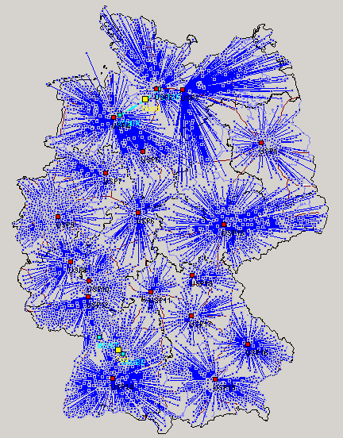
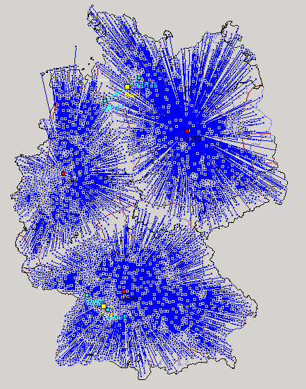
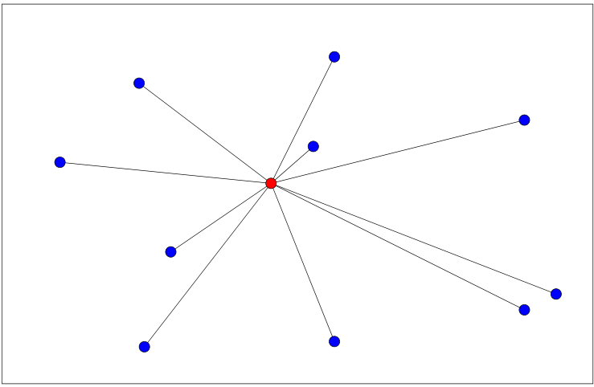
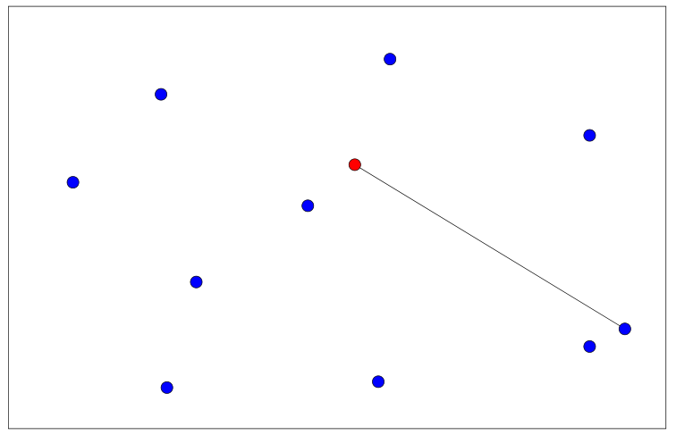
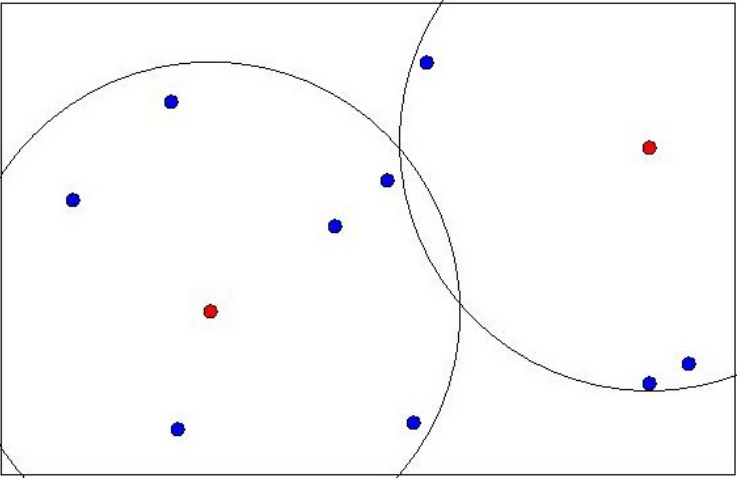
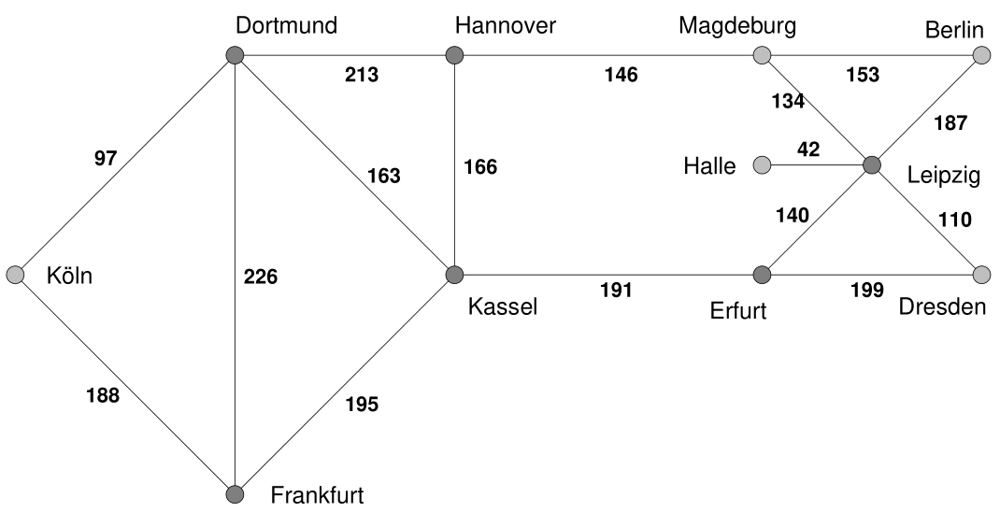
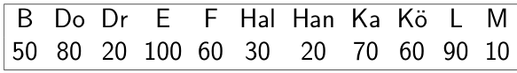
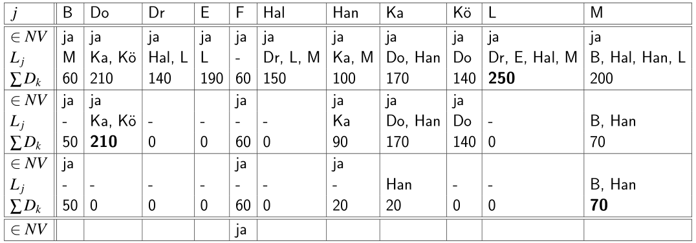

## Strategische Gestaltung von Supply Chains {#slide-92}

- Multikriterielle  Standortplanung
- Kontinuierliche Standortplanung
- Netzwerkplanung
- Diskrete Standortplanung

92

Supply Chain Management

## Planung von Distributionsnetzen {#slide-93}

Einordnung

Supply Chain Management

93

1A

::: {.smartart .chevron1 data-smartart-layout="chevron1"}
:::

I

1B

II

1C

III

1D

IV

1E

V

2A

2B

2C

2D

3A

3B

3C

4A

4B

5A

5B

5C

7A

7B

7C

7D

7E

6A

6B

6C

6D

VI

- in der Regel Abwägung von Servicezielen (Reaktionsschnelligkeit in Distribution) und Kosten (Netzdichte)

## Strategische Netzwerkplanung {#slide-94}

\[Graphic: other: http://schemas.openxmlformats.org/presentationml/2006/ole\]

Horizontale Standortplanung -- Distribution & Zentralität

Distribution

94

::: {layout-ncol="2"}

:::

## Strategische Netzwerkplanung {#slide-95}

\[Graphic: other: http://schemas.openxmlformats.org/presentationml/2006/ole\]

Horizontale Standortplanung -- Distribution

Distribution

95

                                        Trend zur Zentralisierung                             Trend zu dezentralem Lager
  ------------------------------------- ------------------------------------------------- --- ----------------------------------------------------
  Sortiment                             Breites Sortiment                                 ↔   Schmales Sortiment
  Lieferzeit                            Ausreichende Lieferzeit                           ↔   Schnellste Belieferung  Stundengenaue Anlieferung
  Wert der Produkte                     Teure Produkte                                    ↔   Billige Produkte
  Konzentration der Produktionsstätte   Eine „Quelle"                                     ↔   Viele „Quellen"
  Kundenstruktur                        Wenige Großkunden bzw.  homogene Kundenstruktur   ↔   Viele kleine Kunden bzw. Inhomogene Kundenstruktur
  Spezifische Lageranforderungen        Ja                                                ↔   Nein
  Nationale Eigenheiten                 Wenig nationale Eigenheiten                       ↔   Viele nationale Eigenheiten

Quelle: Schulte (2017), S. 703

## Netzwerkplanungsmodelle {#slide-96}

24.06.2026

96

  Charakteristiken
  ------------------------------------------------------------------------------------------------------------------------------------------------------------------------------------------------------------------------------------------------------------------------------------------------------------------------------
  Kunden- und  potentielle   Versorgungsstandorte   sind   identisch Nachfragemengen  der  Kundenstandorte  &  Distanzen   zwischen  den  Standorten   gegeben Abwägung   zwischen   unterschiedlichen  Zielen   Kosten-  bzw .  Servicerestriktionen Auswahlentscheidung   zwischen   verschiedenen   Standortalternativen  

Supply Chain Management

Planung von Distributionsnetzen

                              Entscheid-ungsraum   \# Stand- orte      Daten- typ        \#  Ziele
  --------------------------- -------------------- ------------------- ----------------- -------------------
  Netzwerk-planungs-modelle   diskret              multiple facility   deterministisch   ein-kriteriell
  Steiner-Weber-Modell        kontinuier -lich     single facility     deterministisch   ein-kriteriell
  AHP,  Nutzwert-analyse      diskret              multiple facility   deterministisch   multi- kriteriell

Klassifikation der Modelle

Modelle

## Median  problems {#slide-97}

24.06.2026

97

Supply Chain Management

## Center-probleme {#slide-98}

24.06.2026

98

Supply Chain Management

## Covering   probleme {#slide-99}

24.06.2026

99

Supply Chain Management

## Covering   location   problem {#slide-100}

Beispiel ( Vahrenkamp  2003 , S.  128)

24.06.2026

100

Supply Chain Management

  Problemstellung
  --------------------------------------------------------------------------------------------------------------------------------------------------------------------------------------
  Ein Einzelhandelsunternehmen plant sein Filialnetz im Ruhrgebiet auszubauen. In folgendem Netzwerk sind die Städte und die Fahrzeiten zwischen den Städten (in Minuten) dargestellt.

1

2

3

6

5

4

7

8

12

9

5

7

8

4

3

5

8

15

5

4

12

5

10

## Covering   location   problem {#slide-101}

Beispiel ( Vahrenkamp  2003, p. 128)

24.06.2026

Seite   101

Supply Chain Management

## Covering   location   problem {#slide-102}

Beispiel ( Vahrenkamp  2003, p. 128)

24.06.2026

102

Supply Chain Management

## Covering   location   problem {#slide-103}

Dominierte Spalten und Zeilen löschen

24.06.2026

103

Supply Chain Management

1. Dominierende Spalten löschen

2. Reduzierte Matrix

3.  Domierte  Zeilen löschen

4. Reduzierte Matrix

-  Eröffne Standorte in Knoten 7 sowie 8 (oder 3/4/5)

## Planung von Vertriebsnetzwerken {#slide-104}

Covering   location   problem

24.06.2026

104

Supply Chain Management

## Maximum  covering   location   problem  (MCLP) {#slide-105}

Überblick

24.06.2026

105

Supply Chain Management

## Maximum  covering   location   problem  (MCLP) {#slide-106}

Heuristik

24.06.2026

106

  Idee
  ----------------------------------------------------------------------------------------------
  Greedy -Heuristik   eröffne iterativ diejenigen Standorte, die den höchsten Bedarf abdecken

Supply Chain Management

## Maximum  covering   location   problem  (MCLP) {#slide-107}

Beispiel

24.06.2026

107

Nachfrage:

Sevice   level :  180

Supply Chain Management

## Maximum  covering   location   problem  (MCLP) {#slide-108}

Beispiel - Lösung

24.06.2026

108

Supply Chain Management

