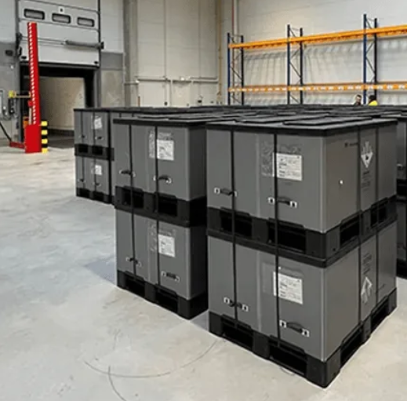
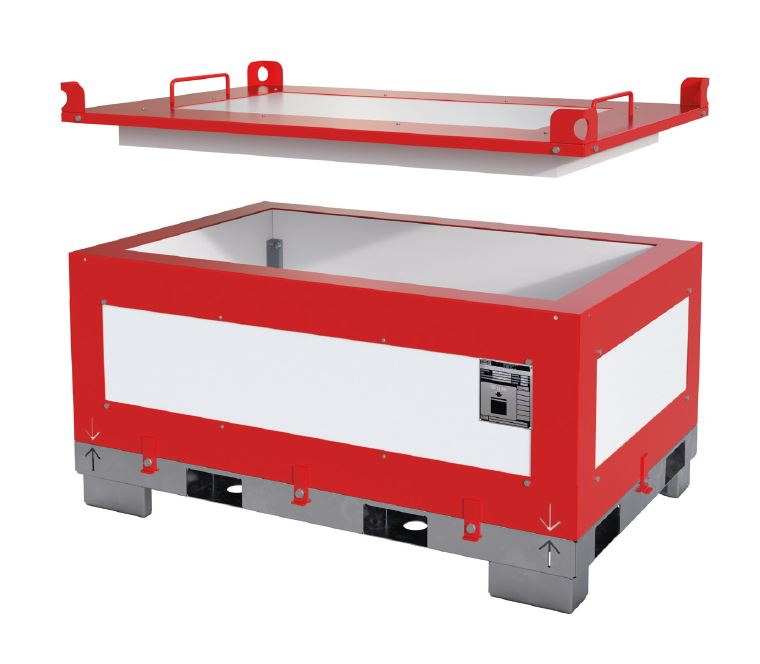

```{r}
#| echo: false
#| warning: false
#| message: false

# Funktionen aus scm_functions.R einbinden
source("../../R/scm_functions.R")

library(tidyverse)
library(leaflet)
library(readxl)
library(dplyr)
library(plotly)

```

---

## Strategische Gestaltung von Supply Chains {#slide-92}

- Multikriterielle  Standortplanung
- Kontinuierliche Standortplanung
- **Diskrete Standortplanung**

---

## Planung von Distributionsnetzen {#slide-93}
::: slide-subtitle
Einordnung
:::

::: r-stretch
```{r}
#| echo: false
#| warning: false
#| message: false
#| out-width: "100%"
#| fig-height: 1.1

library(plotly)

top_boxes <- data.frame(
  label = c("Beschaffung", "Produktion", "Distribution", "Absatz"),
  x0 = c(0.00, 2.00, 4.00, 6.00),
  x1 = c(2.00, 4.00, 6.00, 8.00),
  y0 = 9.25,
  y1 = 9.75
)


shapes <- c(
  lapply(seq_len(nrow(top_boxes)), function(i) {
    shape_path(
      chevron_path(top_boxes$x0[i], top_boxes$x1[i], top_boxes$y0[i], top_boxes$y1[i]),
      fill = cols$top
    )
  })
)


fig <- plot_ly()

fig <- fig %>%
  add_text(
    x = mid(top_boxes$x0, top_boxes$x1),
    y = mid(top_boxes$y0, top_boxes$y1),
    text = top_boxes$label,
    textfont = list(size = 18, color = "white", family = "Arial"),
    hoverinfo = "skip", showlegend = FALSE
  )  %>%
  layout(
    xaxis = list(visible = FALSE, range = c(0, 8), fixedrange = T),
    yaxis = list(visible = FALSE, range = c(9.1, 9.8), fixedrange = T),
    plot_bgcolor = cols$bg,
    paper_bgcolor = cols$bg,
    margin = list(l = 10, r = 10, t = 10, b = 10),
    shapes = shapes,
    width = 1500,
    height = 100
  )

fig

```

```{r}
#| echo: false
#| warning: false
#| message: false
#| out-width: "90%"
#| fig-height: 5.5

library(DiagrammeR)

grViz("
digraph network {

  graph [
    rankdir = LR,
    bgcolor = 'transparent',
    nodesep = 0.35,
    ranksep = 0.75,
    splines = line
  ]

  node [
    shape = box,
    style = filled,
    fillcolor = '#DCEAF0',
    color = '#4B5563',
    fontname = Arial,
    fontsize = 16,
    width = 0.55,
    height = 0.38,
    fixedsize = true
  ]

  edge [
    color = '#4B4B4B',
    penwidth = 1.3,
    arrowsize = 0.8
  ]

  subgraph cluster_beschaffung {
    label = ''
    style = filled
    fillcolor = '#F3E7AE'
    color = '#183A43'
    penwidth = 2

    { rank = same; '7A'; '7B'; '7C'; '7D'; '7E' }
    { rank = same; '6A'; '6B'; '6C'; '6D' }
  }

  { rank = same; '5A'; '5B'; '5C' }
  { rank = same; '4A'; '4B'; '4C' }
  { rank = same; '3A'; '3B'; '3C' }
  { rank = same; '2A'; '2B'; '2C'; '2D' }
  { rank = same; '1A'; '1B'; '1C'; '1D'; '1E' }

  '7A' -> '6A'
  '7B' -> '6A'
  '7B' -> '6B'
  '7C' -> '6B'
  '7C' -> '6C'
  '7D' -> '6C'
  '7D' -> '6D'
  '7E' -> '6D'

  '6A' -> '5A'
  '6B' -> '5A'
  '6B' -> '5B'
  '6C' -> '5B'
  '6C' -> '5C'
  '6D' -> '5C'

  '5A' -> '4A'
  '5B' -> '4A'
  '5B' -> '4B'
  '5C' -> '4B'
  '5C' -> '4C'

  '4A' -> '4B'
  '4B' -> '4C'

  '4A' -> '3A'
  '4A' -> '3B'
  '4A' -> '3C'
  '4B' -> '3B'
  '4B' -> '3C'
  '4C' -> '3C'

  '3A' -> '2A'
  '3A' -> '2B'
  '3B' -> '2B'
  '3B' -> '2C'
  '3C' -> '2C'
  '3C' -> '2D'

  '2B' -> '2A'

  '2A' -> '1A'
  '2A' -> '1B'
  '2B' -> '1C'
  '2C' -> '1C'
  '2D' -> '1D'
  '2D' -> '1E'
}
")
```
:::

$\rightarrow$ Wähle konkrete Standorte im Netzwerk aus $\rightarrow$ in der Regel begrenzte Betrachtung der SC


---

## Fallstudie – Batterielogistik {#slide-cs1}
::: slide-subtitle
Ausgangslage
:::

::: columns
::: {.column width="48%"}

```{r karte}
#| echo: false
#| warning: false
#| message: false
#| out-width: "100%"
#| fig-height: 6.5

# Daten laden
standorte <- readxl::read_excel("../../R/Arvato_Distributionsstandorte_Deutschland.xlsx")

# Automobilwerke in Norddeutschland und Benelux (Kunden / Bedarfsorte)
# Bekannte Werke in der Region: VW Wolfsburg, BMW Hannover,
# Mercedes Bremen, Daimler Düsseldorf, Volvo Gent, Audi Brüssel,
# VW Emden, Ford Köln, Opel Rüsselsheim
kunden <- data.frame(
  name = c(
    "VW Wolfsburg", "VW Emden", "BMW Hannover",
    "Mercedes Bremen", "Daimler Düsseldorf", "Ford Köln",
    "Opel Rüsselsheim", "Volvo Gent", "Audi Brüssel",
    "Stellantis Antwerpen", "DAF Eindhoven", "VW Hannover"
  ),
  lat = c(52.432, 53.367, 52.372, 53.075, 51.220, 50.930,
          49.992, 51.036, 50.852, 51.261, 51.462, 52.377),
  lon = c(10.796, 7.206, 9.738,  8.814,  6.788,  6.960,
          8.389,  3.722,  4.352,  4.403,  5.479,  9.726),
  typ = "Automobilwerk"
)

# Mögliche Lagerstandorte aus Arvato-Daten
# (Repräsentative Standorte aus Norddeutschland + Benelux)
if (exists("standorte") && "lat" %in% names(standorte) && "lon" %in% names(standorte)) {
  lager_data <- standorte %>%
    filter(!is.na(lat), !is.na(lon)) %>%
    head(8)
} else {
  # Fallback: manuelle repräsentative Arvato/Logistik-Standorte
  lager_data <- data.frame(
    name = c(
      "Hannover-Lagerhaus", "Bremen Logistikpark", "Dortmund DC",
      "Köln Depot", "Hamburg Hub", "Düsseldorf Lager",
      "Frankfurt DC", "Antwerpen Hub"
    ),
    lat = c(52.370, 53.080, 51.514, 50.938, 53.551, 51.227, 50.110, 51.222),
    lon = c( 9.732,  8.800,  7.465,  6.960,  9.993,  6.773,  8.682,  4.415)
  )
}

# Haversine-Distanzen (aus scm_functions.R) exemplarisch für ersten Kunden
if (nrow(lager_data) > 0 && "lat" %in% names(lager_data)) {
  lager_data$dist_wolfsburg <- mapply(
    haversine,
    lager_data$lat, lager_data$lon,
    MoreArgs = list(lat2 = 52.432, lon2 = 10.796)
  )
}

# Leaflet-Karte
map <- leaflet(options = leafletOptions(zoomControl = TRUE)) %>%
  addProviderTiles(providers$OpenStreetMap.Mapnik) %>%
  setView(lng = 7.5, lat = 52.0, zoom = 6) %>%

  # Automobilwerke (blau)
  addAwesomeMarkers(
    data        = kunden,
    lng         = ~lon,
    lat         = ~lat,
    label       = ~name,
    icon        = awesomeIcons(
      icon        = "industry",
      library     = "fa",
      markerColor = "blue",
      iconColor   = "white"
    ),
    group = "Automobilwerke"
  ) %>%

  # Potenzielle Lagerstandorte (grün)
  addAwesomeMarkers(
    data        = lager_data,
    lng         = ~lon,
    lat         = ~lat,
    label       = ~name,
    icon        = awesomeIcons(
      icon        = "home",
      library     = "fa",
      markerColor = "green",
      iconColor   = "white"
    ),
    group = "Lagerstandorte"
  ) %>%

  addLayersControl(
    overlayGroups = c("Automobilwerke", "Lagerstandorte"),
    options       = layersControlOptions(collapsed = FALSE)
  ) %>%
  addLegend(
    position = "bottomleft",
    colors   = c("#2A7ACA", "#3DB843"),
    labels   = c("Automobilwerk (Kunde)", "Potenzieller Lagerstandort"),
    title    = "Legende"
  )

map
```

:::
::: {.column width="48%"}

::: {.small-text}

::: {.callout-note appearance="simple"}
## Problemstellung
Zur Versorgung der Automobilwerke in Norddeutschland und den Benelux-Ländern mit Antriebs-Batterien soll eine Versorgungskette aufgebaut werden. Ein bereits in der Automobilbranche tätiger Logistikdienstleister bietet an, die Versorgung der Werke mit Antriebs-Batterien zu übernehmen. Dazu müssen Investitionen in die Lagerstandorte getätigt werden, um die Regularien für Gefahrgutlagerung einzuhalten. 
:::
:::

::: columns
::: {.column width="49%"}
{width="99%"}
:::
::: {.column width="49%"}

:::
:::

:::
:::