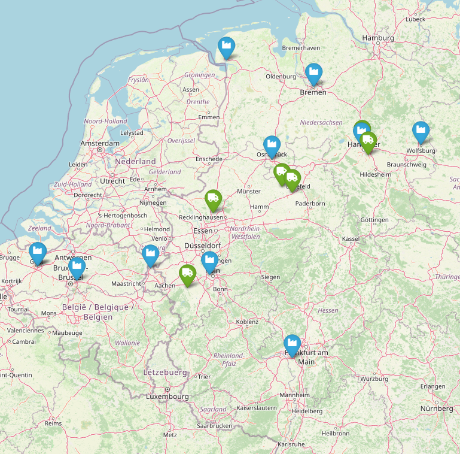

## Strategische Gestaltung von Supply Chains {#slide-109}

- Multikriterielle  Standortplanung
- Kontinuierliche Standortplanung
- Diskrete Standortplanung

109

Supply Chain Management

## Diskrete Standortplanung {#slide-110}

Einordnung

Supply Chain Management

110

1A

::: {.smartart .chevron1 data-smartart-layout="chevron1"}
:::

I

1B

II

1C

III

1D

IV

1E

V

2A

2B

2C

2D

3A

3B

3C

4A

4B

5A

5B

5C

7A

7B

7C

7D

7E

6A

6B

6C

6D

VI

-  Wähle konkrete Standorte im Netzwerk aus   in der Regel begrenzte Betrachtung der SC

## Fallstudie -- Batterielogistik {#slide-111}

Ausgangslage

Supply Chain Management

111

  Problemstellung
  ----------------------------------------------------------------------------------------------------------------------------------------------------------------------------------------------------------------------------------------------------------------------------------------------------------------------------------------------------------------------------------------------------------------------------------------------------------------------------------
  Zur  Versorgung  der  Automobilwerke  in  Norddeut-schland  und den Benelux- Ländern   mit   Antriebs-Batterien   soll   eine   Versor-gungskette   aufgebaut   werden . Ein  bereits  in der  Automobil-branche   tätiger   Logistikdienstleister   bietet  an, die  Versorgung  der Werke  mit   Antriebs-Batterien   zu   übernehmen . Dazu  müssen   Investitionen  in die  Lagerstandorte   getätigt   werden , um die  Regularien  für  Gefahrgutlagerung   einzuhalten . 

::: {layout-ncol="2"}

:::

Quellen: maersk.com; www.lion-care.com

## Fallstudie -- Batterielogistik {#slide-112}

  ID    Werksname              Ort                        Längen-grad   Breiten-grad   Batteriebedarf (MWh/Jahr)
  ----- ---------------------- -------------------------- ------------- -------------- ---------------------------
  C1    Volkswagen Wolfsburg   Wolfsburg, Niedersachsen   10.7796       52.4338        45 000
  C2    Volkswagen Hannover    Hannover, Niedersachsen    9.6846        52.4236        15 000
  C3    Volkswagen Emden       Emden, Niedersachsen       7.207         53.3687        18 000
  C4    Volkswagen Osnabrück   Osnabrück, Niedersachsen   8.0472        52.2736        12 000
  C5    Mercedes-Benz Bremen   Bremen                     8.8072        53.0793        35 000
  C6    Ford Köln              Köln                       6.8996        50.957         30 000
  C7    Opel Rüsselsheim       Rüsselsheim                8.4196        49.9896        25 000
  C8    Volvo Cars Gent        Gent, Belgien              3.7499        51.0645        19 000
  C9    Volvo Trucks Gent      Gent, Belgien              3.733         51.0615        17 000
  C10   Toyota Motor Europe    Zaventem, Belgien          4.46          50.887         40 000
  C11   VDL  Nedcar            Born, Niederlande          5.8106        51.0315        15 000

Rahmendaten

Supply Chain Management

112

  Entscheidungssituation
  ------------------------------------------------------------------------------------------------------------------------------------------------------------------------------------------------------------------------------------------------------------------------------------------------------------------------------------------------------
  Der 3PL muss  entscheiden ,  welche  seiner  Lagerstandorte  er  umrüstet  und  welche  Werke von  welchem  Lager  versorgt   werden   soll . Das  Unternehmen   möchte  die  Entscheidung  so  treffen ,  dass  die  jährlichen   Gesamtkosten  für  Lagerbetrieb  und Transport  minimiert   werden .  Folgende   Informationen   sind   bekannt :

Transportdistanzen in km

Werkstandorte  und  jährliche   Batteriebedarfe

  ID   Standort       Längengrad   Breitengrad   Rüstkosten/Jahr (1000 €)
  ---- -------------- ------------ ------------- --------------------------
  L1   Gütersloh      8.4143       51.8950       450
  L2   Düren          6.4925       50.8078       480
  L3   Dorsten/Marl   6.9635       51.6643       520
  L4   Harsewinkel    8.2306       51.9621       470
  L5   Langenhagen    9.6983       52.4504       510
  L6   Hannover       9.8053       52.3199       460

Lagerstandorte  und  jährliche   Rüstkosten  des  Lagerbetriebs

## Fallstudie -- Batterielogistik {#slide-113}

Aufgabe

Supply Chain Management

113

  Zielformulierung
  ---------------------------------------------------------------------------------------------------------------------------------------------------------------------------------------------------------------------------------------------------------------------------------------------------------------------------------------------------------------------------------------------------------------------------------------------------------------------------------------------------------------------------------------------------------
  Sie  wurden  von  ihrem   Vorgesetzten   aufgefordert   eine   Entscheidungsvorlage  für  erarbeiten ,  wie  die  Batteriedistribution   organisiert   werden   könnte . Die Vorlage  soll   eine   Zuordnung  der Werke  zu   Versorgungslagern   enthalten . Auf Basis  dieser   Zuordnung   erwartet  das Management  eine   Abschätzung  der  jährlichen   Gesamtkosten , die  aus   Ihrem   Vorschlag   resultieren   würden . Dies  soll   als   Grundlage  für  ein   Angebot  und die  Verhandlungen   mit  dem  Automobilkonsortium   dienen .

Aufgaben

- Formulieren Sie einen Ansatz zur Berechnung der jährlichen Gesamtkosten. 
- Formulieren Sie einen Ansatz zur Berechnung der Transportkosten für die Batteriedistribution per LKW.
- Ermitteln Sie dazu einen geeigneten Transportkostensatz für Batterien. 
- Finden Sie eine Zuordnung der Werke zu den Lagerstandorten ermitteln Sie die Gesamtkosten  Ihrer Lösung.

## Warehouse  location   problem {#slide-114}

Problembeschreibung

24.06.2026

114

  Problemstellung
  -----------------------------------------------------------------------------------------------------------------------------------------------------------------------------------------------------------------------------------------------------------------------------------------------------------------------------------------------------------------------------------------------------------------------------------------------------------------------------------------------------------------------------------------------------------------------------
  Gegeben  sei  eine  Menge an  Kundenstandorten  und  eine   Menge  ( potentieller )  Lagerhausstandorte .  Jeder   Kundenstandort  hat  eine   Warennachfrage  ( z.B.  in  Stück  pro Monat/ Jahr ), die von den  Lagerhäusern   beliefert  warden muss. Der Transport der  Waren   verursacht   entfernungsabhängige   Transportkosten . Die  Eröffnung   eines   Lagerhauses   verursacht   Einrichtungskosten .  Es  ist   zu   entscheiden , an  welchen   Standorten   Lagerhäuser   eingerichtet   werden   sollen  und  welche  Kunden  diese   versorgen   sollen .

A

B

C

D

1

2

3

...

...

Supply Chain Management

## Warehouse  location   problem {#slide-115}

Mathematisches Modell 

24.06.2026

115

A

B

C

D

1

2

3

...

  Eigenschaften  der  optimalen   Lösung
  ----------------------------------------

Supply Chain Management

## Warehouse  location   problem {#slide-116}

Beispiel

24.06.2026

116

  Daten
  ------------------------------------------------------
  5  Lagerhausstandorte 7  Kunden Kosten   wie   folgt

A

B

C

D

1

2

3

...

4

5

Supply Chain Management

E

F

G

...

## Warehouse  location   problem {#slide-117}

Mathematisches Modell extensiv am Beispiel

Supply Chain Management

117

## Warehouse  location   problem {#slide-118}

Lösung des WLP mit der Add Heuristik

24.06.2026

118

  Allgemeine Idee
  --------------------------------------------------------------------------------------------------------------------------------------------------------------------------------------------
  " Gierige "  Konstruktionsheuristik     generiert   eine   zulässige   Lösung Veröffentlicht  von Kühn and Hamburger (1963) Eröffne   Lagerstandorte , Solange die  Gesamtkosten   sinken

Supply Chain Management

## Warehouse  location   problem {#slide-119}

Beispiel -- Lösung Add-Heuristik 1/2

24.06.2026

119

  w ij     1    2    3    4    5    6   7          f   S
  -------- ---- ---- ---- ---- ---- --- ---- ----- --- ----
  1        -5   -2   0    0    -1   0   -3   -11   5   -6
  2        -4   0    -6   0    -4   0   0    -14   7   -7
  3        0    0    -5   0    -4   0   -1   -10   5   -5
  4        0    0    0    -1   -1   0   0    -2    6   4
                                                       

- Iteration 1: Matrix der  Savings  (im Vergleich zu Standort 5)

Supply Chain Management

## Warehouse  location   problem {#slide-120}

Beispiel -- Lösung Add-Heuristik 2/2

24.06.2026

120

- Iteration 2: update  Savings  Matrix 

  w ij     1    2    3   4   5   6   7         f   S
  -------- ---- ---- --- --- --- --- ---- ---- --- ----
  1        -1   -2   0   0   0   0   -3   -6   5   -1
                                                   
  3        0    0    0   0   0   0   -1   -1   5   4
                                                   
                                                   

Supply Chain Management

## Warehouse  location   problem {#slide-121}

Lösung des WLP mit der Drop Heuristik

24.06.2026

121

  Allgemeine Idee
  ---------------------------------------------------------------------------------------------------------------------------------------------------
  " Gierige "  Konstruktionsheuristik Veröffentlicht  in Feldmann et al. (1966) Schließe   schrittweise  Lager  solange  die  Gesamtkosten   sinken

Supply Chain Management

## Warehouse  location   problem {#slide-122}

Beispiel -- Lösung Drop-Heuristik 1/3

24.06.2026

122

- Iteration 1:  Savings -Matrix

Supply Chain Management

## Warehouse  location   problem {#slide-123}

Beispiel -- Lösung Drop-Heuristik 2/3

24.06.2026

123

- Iteration 2: neue Lieferzuordnung

<!-- -->

- Iterations  2:  Savingsmatrix

Supply Chain Management

## Warehouse  location   problem {#slide-124}

Beispiel -- Lösung Drop-Heuristik 3/3

24.06.2026

124

- Iterations  3:  Keine Verbesserung

Supply Chain Management

- Iteration 3: neue Lieferzuordnung

