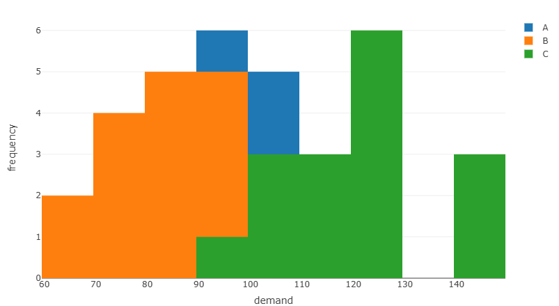
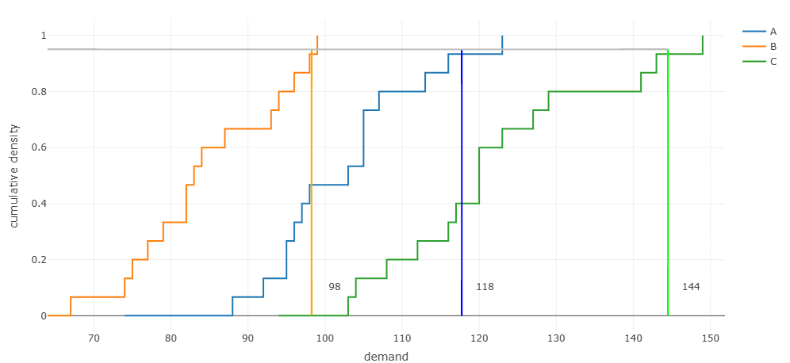
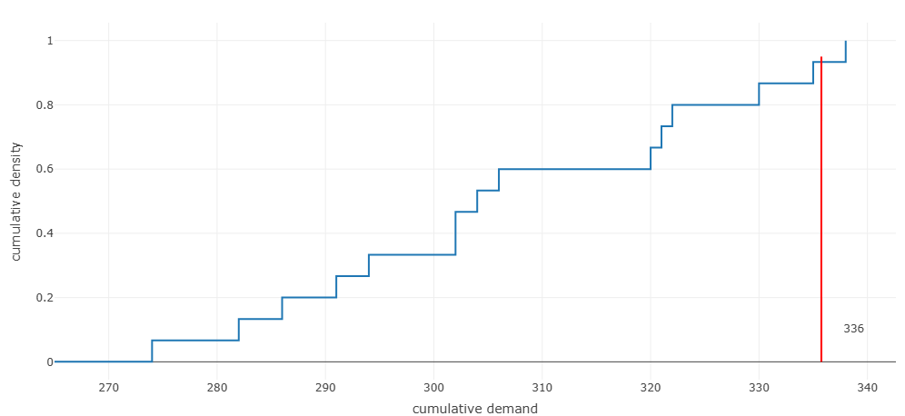
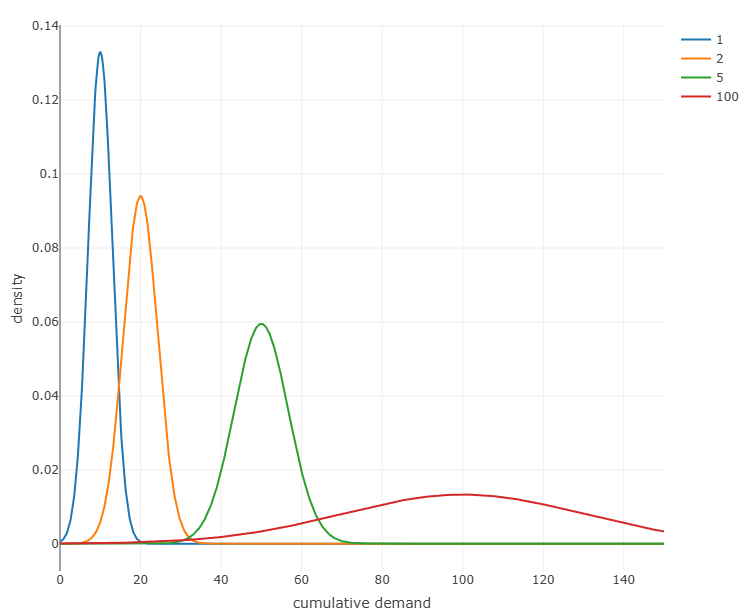
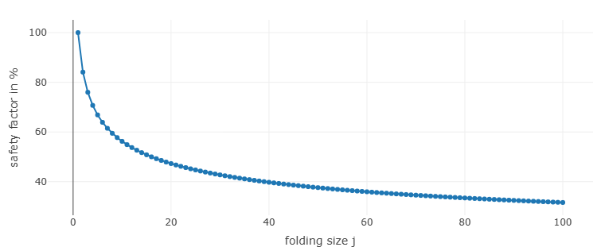

## Unsicherheit in Supply Chains {#slide-140}

- Pooling
- Newsvendor   problem
- Bullwhip -Effekt

Supply Chain Management

140

## Lehrevaluation {#slide-141}

Bewerten Sie die Veranstaltung

Machen Sie Vorschläge zur Verbesserung (Freitext)

Was fehlt? Was ist zu viel? 

Ihre Meinung ist gefragt

Supply Chain Management

141

## Die  natur  der Unsicherheit	 {#slide-142}

Capacity  Pooling

Supply Chain Management

142

  Background ( Cachon  and  Terwiech , 2022,  ch.  17)
  ----------------------------------------------------------------------------------------------------------------------------------------------------------------------------------------------------------------------------------------------------------------------------------------------------------------------------------------------------------------------------------------------------------------------------------------------------------------------------------------------------------------------------------------------------------------------------------
  We consider a car manufacturer, say GM. There are 10 manufacturing plants and 10 vehicles (e.g., Chevy Malibu, GMC Yukon XL,  etc ). For now each plant is assigned to produce just one vehicle; that is, there is no flexibility in the network. Capacity for each vehicle is installed before GM observes the vehicle's demand in the market. Demand, however, is uncertain. Each plant has a capacity to produce 90 units. If demand exceeds capacity for a vehicle, then the excess is lost. If demand is less than capacity, then demand is satisfied but capacity is idle.

A

B

C

D

1

2

3

Plant /  vehicle  type

4

vehicle   market

  Problem
  -----------------------------------------------------------------------------------------------------------------------------------------------------------------------------------------------------------------------------------------------------------------------------------
  Obviously there is no flexibility in production system, but it might be very cost efficient. A consultant advise the management to test a more flexible structure. For evaluation of both system configurations calculate expected sales and expected plant capacity utilization.

A

B

C

D

1

2

3

Plant /  vehicle  type

4

vehicle   market

Original  configuration

Alternative  configuration

## Die  natur  der Unsicherheit	 {#slide-143}

Capacity  Pooling --  empirical   example  -- original  configuration

Supply Chain Management

143

A

1

Plant /  vehicle  type

vehicle   market

B

2

## Die  natur  der Unsicherheit	 {#slide-144}

Capacity  Pooling --  empirical   example  --  pooling   configuration

Supply Chain Management

144

A

1

Plant /  vehicle  type

vehicle   market

B

2

## Die  natur  der Unsicherheit	 {#slide-145}

Alternative  configuration

Supply Chain Management

145

A

1

Plant /  vehicle  type

vehicle   market

B

2

## Die  natur  der Unsicherheit	 {#slide-146}

Chaining   effect  - Long  supply   chains  vs.  short   supply   chains

Supply Chain Management

146

A

B

C

D

1

2

4

3

A

B

C

D

1

2

4

3

  Pooling & Chaining
  ---------------------------------------------------------------------------------------------------------------------------------------------------------------------------------------------------------------------------------------------------------------------------------------------------------------------------------
  Capacity pooling requires to add links to supply networks. Opening connections between facilities increase complexity of managing stock and material flows. Thus, as flexibility increases with links, so do cost. Thus, the question arises, is there an optimal network configuration for a given number of additional links?

Long SC alternative

Short SC alternative

## Die  natur  der Unsicherheit	 {#slide-147}

Chaining   effect  - Long  supply   chains  vs.  short   supply   chains

Supply Chain Management

147

A

B

C

D

1

2

4

3

A

B

C

D

1

2

4

3

Long  chain  alternative

Short  chain  alternative

90

90

90

90

90

Demand

Capacity

100

80

90

90

100

80

90

Demand

Capacity

90

90

90

90

90

90

80

90

80

10

10

10

80

90

80

Supply 

rate

100%

90%

100%

100%

Supply 

rate

100%

100%

100%

100%

  Chaining effect
  ------------------------------------------------------------------------------------------------------------------------------------------------------------------------------------------------------------------------------------------------------------------------------------------------------------------------------------------------------------
  Short chains balance demand among the demand nodes of its (supply) chain only. Thus, buffering of excess demand is limited to the free capacities of a comparable small number of plants. Building longer (supply) chains allows to balance supply and demand over all nodes of the chain by  demand shifting  building  in sequences (chaining effect).  

## Die  natur  der Unsicherheit	 {#slide-148}

Location  pooling  - Beispiel

Supply Chain Management

148

A

B

C

1

2

3

  Periode   Nachfrage A   Nachfrage B   Nachfrage C
  --------- ------------- ------------- -------------
  1         105           93            108
  2         107           74            149
  3         98            64            120
  4         95            96            103
  5         123           75            104
  6         105           79            120
  7         97            67            127
  8         116           87            117

  Periode   Nachfrage A   Nachfrage B   Nachfrage C
  --------- ------------- ------------- -------------
  9         95            99            141
  10        103           98            120
  11        105           94            123
  12        92            82            112
  13        74            84            116
  14        96            77            129
  15        113           82            143
  16        88            83            94

Histogramm

         A      B      C
  ------ ------ ------ ------
  Mean   101    83     120
  SD     11.7   10.6   15.1

Deskriptive Statistiken

QQ  plot

## Die  natur  der Unsicherheit	 {#slide-149}

Location  pooling  - Beispiel

Supply Chain Management

149

A

B

C

1

2

3

Lagerbestand

0

Periode

Periode

## Die  natur  der Unsicherheit	 {#slide-150}

Location  pooling  - Beispiel

Supply Chain Management

150

A

B

C

1

2

3

Bedarf von Markt A

## Die  natur  der Unsicherheit	 {#slide-151}

Location  pooling  -  Example

Supply Chain Management

151

A

B

C

1

2

3

A

B

C

2

-  Wie groß ist der Sicherheitsbestand, wenn der gesamte Bedarf von Knoten 2 bedient wird?

## Die  natur  der Unsicherheit	 {#slide-152}

Location  pooling  -  Example

Supply Chain Management

152

A

B

C

1

2

3

A

B

C

2

## Newsvendor   model   {#slide-153}

Side  notes : Normal Distribution

Supply Chain Management

153

![\\PassOptionsToPackage{svgnames}{xcolor}
\\documentclass{article}
\\usepackage{amsmath}
\\usepackage{amsfonts} 
\\usepackage{amssymb}
\\usepackage{amsthm}
\\usepackage{bm}
\\usepackage{bbm}
\\usepackage\[utf8\]{inputenc} % für deutsche Umlaute latin1
\\usepackage\[T1\]{fontenc}
\\usepackage{nicefrac}
\\usepackage{booktabs}
\\usepackage{multirow}
\\usepackage{geometry} 
\\usepackage{eurosym} 
\\usepackage{kbordermatrix}
\\geometry{lmargin = 0cm, rmargin = 0cm}
\\usepackage{tabularx}
\\usepackage{tcolorbox}
\\usepackage{lmodern}
\\usepackage{courier}
\\usepackage{etex}

\\newcommand{\\Y}{\\mathbf{Y}}
\\newcommand{\\bZ}{\\mathbf{Z}}
\\newcommand{\\X}{\\mathbf{X}}
\\newcommand{\\V}{\\mathbf{V}}
\\newcommand{\\Q}{\\mathbf{Q}}
\\newcommand{\\A}{\\mathbf{A}}
\\newcommand{\\Pb}{\\mathbf{P}}
\\newcommand{\\B}{\\mathbf{B}}
%\\newcommand{\\C}{\\mathbf{C}}
\\newcommand{\\Db}{\\mathbf{D}}
\\newcommand{\\y}{\\mathbf{y}}
\\newcommand{\\f}{\\mathbf{f}}
\\newcommand{\\x}{\\mathbf{x}}
\\newcommand{\\bh}{\\mathbf{h}}
\\newcommand{\\pb}{\\mathbf{p}}
\\newcommand{\\rr}{\\mathbf{r}}
\\newcommand{\\z}{\\mathbf{z}}
\\newcommand{\\Z}{\\mathbf{Z}}
\\newcommand{\\lb}{\\mathbf{l}}
\\newcommand{\\rb}{\\mathbf{r}}
\\newcommand{\\bs}{\\mathbf{s}}
\\newcommand{\\bt}{\\mathbf{t}}
\\newcommand{\\bu}{\\mathbf{u}}
\\newcommand{\\E}{\\mathbf{E}}
\\newcommand{\\Sb}{\\mathbf{S}}
\\newcommand{\\bd}{\\mathbf{d}}
\\newcommand{\\e}{\\mathbf{e}}
\\newcommand{\\ba}{\\mathbf{a}}
\\newcommand{\\bb}{\\mathbf{b}}
\\newcommand{\\bz}{\\mathbf{z}}

%\\newcommand{\\Rre}{\\mathbb{R}}
%\\newcommand{\\Nre}{\\mathbb{N}}
\\newcommand{\\Nrm}{\\mathrm{N}}
\\newcommand{\\Ac}{\\mathcal{A}}
\\newcommand{\\Bc}{\\mathcal{B}}
\\newcommand{\\Cc}{\\mathcal{C}}
\\newcommand{\\Dc}{\\mathcal{D}}
\\newcommand{\\Mc}{\\mathcal{M}}
\\newcommand{\\Ec}{\\mathcal{E}}
\\newcommand{\\Fc}{\\mathcal{F}}
\\newcommand{\\Gc}{\\mathcal{G}}
\\newcommand{\\Erm}{\\mathrm{E}}

\\newcommand{\\Lc}{\\mathcal{L}}
\\newcommand{\\Nc}{\\mathcal{N}}
\\newcommand{\\Oc}{\\mathcal{O}}
\\newcommand{\\Pc}{\\mathcal{P}}
\\newcommand{\\Rc}{\\mathcal{R}}
\\newcommand{\\Sc}{\\mathcal{S}}
\\newcommand{\\ssc}{\\mathcal{s}}
\\newcommand{\\Hc}{\\mathcal{H}}
\\newcommand{\\Ic}{\\mathcal{I}}
\\newcommand{\\Kc}{\\mathcal{K}}
\\newcommand{\\kkc}{\\mathcal{k}}
\\newcommand{\\Tcc}{\\mathcal{T}}
\\newcommand{\\Vc}{\\mathcal{V}}
\\newcommand{\\Jc}{\\mathcal{J}}
\\newcommand{\\Zc}{\\mathcal{Z}}
\\newcommand{\\Yc}{\\mathcal{Y}}
\\newcommand{\\Xc}{\\mathcal{X}}

\\graphicspath{{\"C:/Users/ThomasK/ownCloud/PL/1920/Latex/\"}}

\\pagestyle{empty}
%\\tcbuselibrary{skins}
%\\usetikzlibrary{shadings,shadows}
\\definecolor{basic}{RGB}{0,65,49}

 \\newcolumntype{Y}{\>{\\centering\\arraybackslash}X}
\\newcommand{\\Rre}{\\mathbb{R}}

\\newenvironment{block}\[1\]{%
  \\tcolorbox\[boxsep=1pt,left=2pt,right=2pt,top=4pt,bottom=4pt, noparskip,colframe=basic, fonttitle=\\bfseries,  title=#1\]}%
  {\\endtcolorbox}

\\setlength{\\parindent}{0pt}

\\begin{document}

\\textbf{Definition of normal distribution:} 

Let \$X\$ be a normally distributed random variable with mean \$\\mu\$ and variance \$\\sigma\^2\$ (\$X \\sim N(\\mu, \\sigma\^2)\$). Its PDF \$f(x)\$ and CDF \$F(x)\$ is 
%
\\begin{align\*}
f(x) = & \\frac{1}{\\sigma \\cdot \\sqrt{2 \\cdot \\pi}} \\cdot e\^{- \\frac{(x-\\mu)\^2}{2 \\cdot \\sigma\^2}} \\\\
F(x) = & \\int\_{-\\infty}\^x f(t) dt
\\end{align\*}
%
%

\\end{document}](../images/image168.png "Grafik 38")

## Newsvendor   model   {#slide-154}

Side  notes : Normal  distribution   quantiles  and  distribution   table

Supply Chain Management

154

![\\PassOptionsToPackage{svgnames}{xcolor}
\\documentclass{article}
\\usepackage{amsmath}
\\usepackage{amsfonts} 
\\usepackage{amssymb}
\\usepackage{amsthm}
\\usepackage{bm}
\\usepackage{bbm}
\\usepackage\[utf8\]{inputenc} % für deutsche Umlaute latin1
\\usepackage\[T1\]{fontenc}
\\usepackage{nicefrac}
\\usepackage{booktabs}
\\usepackage{multirow}
\\usepackage{geometry} 
\\usepackage{eurosym} 
\\usepackage{kbordermatrix}
\\geometry{lmargin = 4cm, rmargin = 7cm}
\\usepackage{tabularx}
\\usepackage{tcolorbox}
\\usepackage{lmodern}
\\usepackage{courier}
\\usepackage{etex}

\\newcommand{\\Y}{\\mathbf{Y}}
\\newcommand{\\bZ}{\\mathbf{Z}}
\\newcommand{\\X}{\\mathbf{X}}
\\newcommand{\\V}{\\mathbf{V}}
\\newcommand{\\Q}{\\mathbf{Q}}
\\newcommand{\\A}{\\mathbf{A}}
\\newcommand{\\Pb}{\\mathbf{P}}
\\newcommand{\\B}{\\mathbf{B}}
%\\newcommand{\\C}{\\mathbf{C}}
\\newcommand{\\Db}{\\mathbf{D}}
\\newcommand{\\y}{\\mathbf{y}}
\\newcommand{\\f}{\\mathbf{f}}
\\newcommand{\\x}{\\mathbf{x}}
\\newcommand{\\bh}{\\mathbf{h}}
\\newcommand{\\pb}{\\mathbf{p}}
\\newcommand{\\rr}{\\mathbf{r}}
\\newcommand{\\z}{\\mathbf{z}}
\\newcommand{\\Z}{\\mathbf{Z}}
\\newcommand{\\lb}{\\mathbf{l}}
\\newcommand{\\rb}{\\mathbf{r}}
\\newcommand{\\bs}{\\mathbf{s}}
\\newcommand{\\bt}{\\mathbf{t}}
\\newcommand{\\bu}{\\mathbf{u}}
\\newcommand{\\E}{\\mathbf{E}}
\\newcommand{\\Sb}{\\mathbf{S}}
\\newcommand{\\bd}{\\mathbf{d}}
\\newcommand{\\e}{\\mathbf{e}}
\\newcommand{\\ba}{\\mathbf{a}}
\\newcommand{\\bb}{\\mathbf{b}}
\\newcommand{\\bz}{\\mathbf{z}}

%\\newcommand{\\Rre}{\\mathbb{R}}
%\\newcommand{\\Nre}{\\mathbb{N}}
\\newcommand{\\Nrm}{\\mathrm{N}}
\\newcommand{\\Ac}{\\mathcal{A}}
\\newcommand{\\Bc}{\\mathcal{B}}
\\newcommand{\\Cc}{\\mathcal{C}}
\\newcommand{\\Dc}{\\mathcal{D}}
\\newcommand{\\Mc}{\\mathcal{M}}
\\newcommand{\\Ec}{\\mathcal{E}}
\\newcommand{\\Fc}{\\mathcal{F}}
\\newcommand{\\Gc}{\\mathcal{G}}
\\newcommand{\\Erm}{\\mathrm{E}}

\\newcommand{\\Lc}{\\mathcal{L}}
\\newcommand{\\Nc}{\\mathcal{N}}
\\newcommand{\\Oc}{\\mathcal{O}}
\\newcommand{\\Pc}{\\mathcal{P}}
\\newcommand{\\Rc}{\\mathcal{R}}
\\newcommand{\\Sc}{\\mathcal{S}}
\\newcommand{\\ssc}{\\mathcal{s}}
\\newcommand{\\Hc}{\\mathcal{H}}
\\newcommand{\\Ic}{\\mathcal{I}}
\\newcommand{\\Kc}{\\mathcal{K}}
\\newcommand{\\kkc}{\\mathcal{k}}
\\newcommand{\\Tcc}{\\mathcal{T}}
\\newcommand{\\Vc}{\\mathcal{V}}
\\newcommand{\\Jc}{\\mathcal{J}}
\\newcommand{\\Zc}{\\mathcal{Z}}
\\newcommand{\\Yc}{\\mathcal{Y}}
\\newcommand{\\Xc}{\\mathcal{X}}

\\graphicspath{{\"C:/Users/ThomasK/ownCloud/PL/1920/Latex/\"}}

\\pagestyle{empty}
%\\tcbuselibrary{skins}
%\\usetikzlibrary{shadings,shadows}
\\definecolor{basic}{RGB}{0,65,49}

 \\newcolumntype{Y}{\>{\\centering\\arraybackslash}X}
\\newcommand{\\Rre}{\\mathbb{R}}

\\newenvironment{block}\[1\]{%
  \\tcolorbox\[boxsep=1pt,left=2pt,right=2pt,top=4pt,bottom=4pt, noparskip,colframe=basic, fonttitle=\\bfseries,  title=#1\]}%
  {\\endtcolorbox}

\\setlength{\\parindent}{0pt}

\\begin{document}
\\begin{align\*}
 P(X \\leq a)  = F(a) \\quad & \\Longleftrightarrow  \\quad  \\Phi\\left(\\frac{a - \\mu}{\\sigma}\\right) \\\\\[2ex\]
 P(X \\geq a)  = 1 - F(a) \\quad & \\Longleftrightarrow  \\quad  1 - \\Phi\\left(\\frac{a - \\mu}{\\sigma}\\right) \\end{align\*}
\\end{document}](../images/image171.png "Grafik 27")

## Die  natur  der Unsicherheit	 {#slide-155}

Grundlagen Statistik

Supply Chain Management

155

![\\PassOptionsToPackage{svgnames}{xcolor}
\\documentclass{article}
\\usepackage{amsmath}
\\usepackage{amsfonts} 
\\usepackage{amssymb}
\\usepackage{amsthm}
\\usepackage{bm}
\\usepackage{bbm}
\\usepackage\[utf8\]{inputenc} % für deutsche Umlaute latin1
\\usepackage\[T1\]{fontenc}
\\usepackage{nicefrac}
\\usepackage{booktabs}
\\usepackage{multirow}
\\usepackage{geometry} 
\\usepackage{eurosym} 
\\usepackage{kbordermatrix}
\\geometry{lmargin = 3cm, rmargin = 3cm}
\\usepackage{tabularx}
\\usepackage{tcolorbox}
\\usepackage{lmodern}
\\usepackage{courier}
\\usepackage{etex}

\\newcommand{\\Y}{\\mathbf{Y}}
\\newcommand{\\bZ}{\\mathbf{Z}}
\\newcommand{\\X}{\\mathbf{X}}
\\newcommand{\\V}{\\mathbf{V}}
\\newcommand{\\Q}{\\mathbf{Q}}
\\newcommand{\\A}{\\mathbf{A}}
\\newcommand{\\Pb}{\\mathbf{P}}
\\newcommand{\\B}{\\mathbf{B}}
%\\newcommand{\\C}{\\mathbf{C}}
\\newcommand{\\Db}{\\mathbf{D}}
\\newcommand{\\y}{\\mathbf{y}}
\\newcommand{\\f}{\\mathbf{f}}
\\newcommand{\\x}{\\mathbf{x}}
\\newcommand{\\bh}{\\mathbf{h}}
\\newcommand{\\pb}{\\mathbf{p}}
\\newcommand{\\rr}{\\mathbf{r}}
\\newcommand{\\z}{\\mathbf{z}}
\\newcommand{\\Z}{\\mathbf{Z}}
\\newcommand{\\lb}{\\mathbf{l}}
\\newcommand{\\rb}{\\mathbf{r}}
\\newcommand{\\bs}{\\mathbf{s}}
\\newcommand{\\bt}{\\mathbf{t}}
\\newcommand{\\bu}{\\mathbf{u}}
\\newcommand{\\E}{\\mathbf{E}}
\\newcommand{\\Sb}{\\mathbf{S}}
\\newcommand{\\bd}{\\mathbf{d}}
\\newcommand{\\e}{\\mathbf{e}}
\\newcommand{\\ba}{\\mathbf{a}}
\\newcommand{\\bb}{\\mathbf{b}}
\\newcommand{\\bz}{\\mathbf{z}}

%\\newcommand{\\Rre}{\\mathbb{R}}
%\\newcommand{\\Nre}{\\mathbb{N}}
\\newcommand{\\Nrm}{\\mathrm{N}}
\\newcommand{\\Ac}{\\mathcal{A}}
\\newcommand{\\Bc}{\\mathcal{B}}
\\newcommand{\\Cc}{\\mathcal{C}}
\\newcommand{\\Dc}{\\mathcal{D}}
\\newcommand{\\Mc}{\\mathcal{M}}
\\newcommand{\\Ec}{\\mathcal{E}}
\\newcommand{\\Fc}{\\mathcal{F}}
\\newcommand{\\Gc}{\\mathcal{G}}
\\newcommand{\\Erm}{\\mathrm{E}}

\\newcommand{\\Lc}{\\mathcal{L}}
\\newcommand{\\Nc}{\\mathcal{N}}
\\newcommand{\\Oc}{\\mathcal{O}}
\\newcommand{\\Pc}{\\mathcal{P}}
\\newcommand{\\Rc}{\\mathcal{R}}
\\newcommand{\\Sc}{\\mathcal{S}}
\\newcommand{\\ssc}{\\mathcal{s}}
\\newcommand{\\Hc}{\\mathcal{H}}
\\newcommand{\\Ic}{\\mathcal{I}}
\\newcommand{\\Kc}{\\mathcal{K}}
\\newcommand{\\kkc}{\\mathcal{k}}
\\newcommand{\\Tcc}{\\mathcal{T}}
\\newcommand{\\Vc}{\\mathcal{V}}
\\newcommand{\\Jc}{\\mathcal{J}}
\\newcommand{\\Zc}{\\mathcal{Z}}
\\newcommand{\\Yc}{\\mathcal{Y}}
\\newcommand{\\Xc}{\\mathcal{X}}

\\graphicspath{{\"C:/Users/ThomasK/ownCloud/PL/1920/Latex/\"}}

\\pagestyle{empty}
%\\tcbuselibrary{skins}
%\\usetikzlibrary{shadings,shadows}
\\definecolor{basic}{RGB}{0,65,49}

 \\newcolumntype{Y}{\>{\\centering\\arraybackslash}X}
\\newcommand{\\Rre}{\\mathbb{R}}

\\newenvironment{block}\[1\]{%
  \\tcolorbox\[boxsep=1pt,left=2pt,right=2pt,top=4pt,bottom=4pt, noparskip,colframe=basic, fonttitle=\\bfseries,  title=#1\]}%
  {\\endtcolorbox}

\\setlength{\\parindent}{0pt}

\\begin{document}
Seien \$X_i \\sim N(\\mu_i, \\sigma\^2_i)\$ unabhängige und normalverteilte Zufallsvariablen. Dann gilt

\\begin{align\*}
Z = \\sum\\limits\_{i=1}\^{n} X_i \\sim N\\left(\\sum\\limits\_{i=1}\^{n} \\mu_i, \\sum\\limits\_{i=1}\^{n} \\sigma_i\^2\\right)
\\end{align\*}

\\end{document}](../images/image174.png "Grafik 22")

## Die  natur  der Unsicherheit	 {#slide-156}

Faltung  der  Normalverteilung

Supply Chain Management

156

## Die  natur  der Unsicherheit	 {#slide-157}

Managing  uncertainty   with   safety   stocks

Supply Chain Management

157

A

B

C

1

2

3

A

B

C

1

2

3

A

B

C

2

  No   pooling                                                                                        Virtual pooling                                                                                                                                  Location pooling
  --------------------------------------------------------------------------------------------------- ------------------------------------------------------------------------------------------------------------------------------------------------ -------------------------------------------------------------------------------------------------------
  Clear responsibilities    simple to coordinate Few connections  simple logistics Specialization   High flexibility Lower overall safety stock levels (compared to no pooling)                                                                      Few location   reduction of fixed costs Few connections  simple logistics Low (safety) stock levels
  High total stock level   each supplier keeps own safety stock Risk of disruptions  no backup      Coordination necessary   sharing of stock and demand information Long lead times in case of lateral shipments Complex logistics   high costs   Stock outs affect all markets Allocation problem in case of shortages   market priorities

