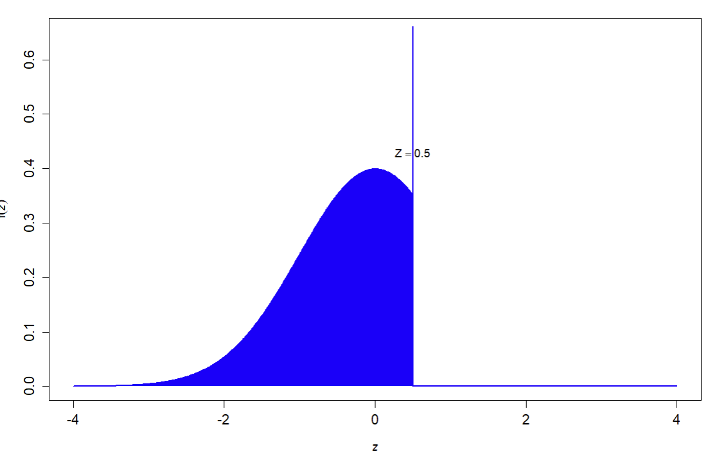

## Unsicherheit in Supply Chains {#slide-158}

- Pooling
- Newsvendor   problem
- Bullwhip -Effekt

Supply Chain Management

158

## Newsvendor   model   {#slide-159}

Problem  statement  &  assumptions

24.06.2026

A  newspaper   seller   has   to   decide  in  the   evening   how   many   daily   newspapers  he  should   order   for   the   coming   weekday .  If   the   demand   during   the   course   of   the   day   is   greater   than   the   order   quantity ,  business   is  lost ( shortfall ).  If   the   demand   is   less   than   the   order   quantity ,  the   surplus   copies   must   be   returned  at a  loss .

Objective :

Find  the   cost -minimal  order   quantity   q   for   each   morning .

Supply Chain Management

159

## Newsvendor   model   {#slide-160}

Ordering   with   normally   distributed   demand  

Supply Chain Management

160

## Newsvendor   model   {#slide-161}

  Demand  distribution
  ---------------------------------------------------------------------------------------------------------------------------------
  Demand  may   realize  at  four  different  levels .  Each   demand   level   has  a  probability   to   occur   as   follows :

Discrete   example

Supply Chain Management

161

1

2

3

## Newsvendor   model   {#slide-162}

Discrete   example  -  continued

Supply Chain Management

162

Expected   cost  &  profits

## Newsvendor   model   {#slide-163}

Discrete   example  -  continued

Supply Chain Management

163

Expected   cost  &  profits

Opportunity   cost

## Newsvendor   model   {#slide-164}

Expected   profit  and  cost   functions

24.06.2026

Supply Chain Management

164

Reformulation of conditional expectations

## Newsvendor   model   {#slide-165}

From   profit  and  cost   function   to   expected   profits  and  cost   functions

24.06.2026

  Optimal cost
  --------------

Supply Chain Management

165

## Newsvendor   model {#slide-166}

Normally   distributed   demand

24.06.2026

Supply Chain Management

166

## Newsvendor   model {#slide-167}

- Foundational Model:  Newsvendor is benchmark for single-period inventory under uncertainty   simplified situation but part of many more complex situations

- Practical Relevance:  Applies to diverse industries; easily adapted to real constraints   typical fields of application are for perishable goods, fashion industry and other products with short life cycles

Integration:  in modern SCM Newsvendor modelling is combined with ML forecasting

Extensions : multiple  products ,  distributions , non-linear  costs , multiple  periods ,  capacity   restriction , ...

Wrap  up

Supply Chain Management

167

## Newsvendor   model   {#slide-168}

Optimization   background  

24.06.2026

  Cost function
  ---------------

  Optimal cost for normal  distribution
  ---------------------------------------

Supply Chain Management

168

## Die  natur  der Unsicherheit	 {#slide-169}

Original  configuration   with   normally   distributed   demand  

Supply Chain Management

169

A

1

Plant /  vehicle  type

vehicle   market

B

2

Definition  of  a  winsorized  normal  distribution

![\\PassOptionsToPackage{svgnames}{xcolor}
\\documentclass{article}
\\usepackage{amsmath}
\\usepackage{amsfonts} 
\\usepackage{amssymb}
\\usepackage{amsthm}
\\usepackage{bm}
\\usepackage{bbm}
\\usepackage\[utf8\]{inputenc} % für deutsche Umlaute latin1
\\usepackage\[T1\]{fontenc}
\\usepackage{nicefrac}
\\usepackage{booktabs}
\\usepackage{multirow}
\\usepackage{geometry} 
\\usepackage{eurosym} 
\\usepackage{kbordermatrix}
\\geometry{lmargin = 4cm, rmargin = 7cm}
\\usepackage{tabularx}
\\usepackage{tcolorbox}
\\usepackage{lmodern}
\\usepackage{courier}
\\usepackage{etex}

\\newcommand{\\Y}{\\mathbf{Y}}
\\newcommand{\\bZ}{\\mathbf{Z}}
\\newcommand{\\X}{\\mathbf{X}}
\\newcommand{\\V}{\\mathbf{V}}
\\newcommand{\\Q}{\\mathbf{Q}}
\\newcommand{\\A}{\\mathbf{A}}
\\newcommand{\\Pb}{\\mathbf{P}}
\\newcommand{\\B}{\\mathbf{B}}
%\\newcommand{\\C}{\\mathbf{C}}
\\newcommand{\\Db}{\\mathbf{D}}
\\newcommand{\\y}{\\mathbf{y}}
\\newcommand{\\f}{\\mathbf{f}}
\\newcommand{\\x}{\\mathbf{x}}
\\newcommand{\\bh}{\\mathbf{h}}
\\newcommand{\\pb}{\\mathbf{p}}
\\newcommand{\\rr}{\\mathbf{r}}
\\newcommand{\\z}{\\mathbf{z}}
\\newcommand{\\Z}{\\mathbf{Z}}
\\newcommand{\\lb}{\\mathbf{l}}
\\newcommand{\\rb}{\\mathbf{r}}
\\newcommand{\\bs}{\\mathbf{s}}
\\newcommand{\\bt}{\\mathbf{t}}
\\newcommand{\\bu}{\\mathbf{u}}
\\newcommand{\\E}{\\mathbf{E}}
\\newcommand{\\Sb}{\\mathbf{S}}
\\newcommand{\\bd}{\\mathbf{d}}
\\newcommand{\\e}{\\mathbf{e}}
\\newcommand{\\ba}{\\mathbf{a}}
\\newcommand{\\bb}{\\mathbf{b}}
\\newcommand{\\bz}{\\mathbf{z}}

%\\newcommand{\\Rre}{\\mathbb{R}}
%\\newcommand{\\Nre}{\\mathbb{N}}
\\newcommand{\\Nrm}{\\mathrm{N}}
\\newcommand{\\Ac}{\\mathcal{A}}
\\newcommand{\\Bc}{\\mathcal{B}}
\\newcommand{\\Cc}{\\mathcal{C}}
\\newcommand{\\Dc}{\\mathcal{D}}
\\newcommand{\\Mc}{\\mathcal{M}}
\\newcommand{\\Ec}{\\mathcal{E}}
\\newcommand{\\Fc}{\\mathcal{F}}
\\newcommand{\\Gc}{\\mathcal{G}}
\\newcommand{\\Erm}{\\mathrm{E}}

\\newcommand{\\Lc}{\\mathcal{L}}
\\newcommand{\\Nc}{\\mathcal{N}}
\\newcommand{\\Oc}{\\mathcal{O}}
\\newcommand{\\Pc}{\\mathcal{P}}
\\newcommand{\\Rc}{\\mathcal{R}}
\\newcommand{\\Sc}{\\mathcal{S}}
\\newcommand{\\ssc}{\\mathcal{s}}
\\newcommand{\\Hc}{\\mathcal{H}}
\\newcommand{\\Ic}{\\mathcal{I}}
\\newcommand{\\Kc}{\\mathcal{K}}
\\newcommand{\\kkc}{\\mathcal{k}}
\\newcommand{\\Tcc}{\\mathcal{T}}
\\newcommand{\\Vc}{\\mathcal{V}}
\\newcommand{\\Jc}{\\mathcal{J}}
\\newcommand{\\Zc}{\\mathcal{Z}}
\\newcommand{\\Yc}{\\mathcal{Y}}
\\newcommand{\\Xc}{\\mathcal{X}}

\\graphicspath{{\"C:/Users/ThomasK/ownCloud/PL/1920/Latex/\"}}

\\pagestyle{empty}
%\\tcbuselibrary{skins}
%\\usetikzlibrary{shadings,shadows}
\\definecolor{basic}{RGB}{0,65,49}

 \\newcolumntype{Y}{\>{\\centering\\arraybackslash}X}
\\newcommand{\\Rre}{\\mathbb{R}}

\\newenvironment{block}\[1\]{%
  \\tcolorbox\[boxsep=1pt,left=2pt,right=2pt,top=4pt,bottom=4pt, noparskip,colframe=basic, fonttitle=\\bfseries,  title=#1\]}%
  {\\endtcolorbox}

\\setlength{\\parindent}{0pt}

\\begin{document}

Let \$X\$ be a winsorized standard normally distributed random variable where for all \$x\>C\$ are set to \$C\$. Then for the pdf holds
%
\\begin{equation\*}
f(x,C) = \\left\\{ \\begin{matrix}
\\varphi(x) & x\<C\\\\
1-\\Phi(C) & x=C \\\\
0   & x\>C
\\end{matrix}\\right.
\\end{equation\*}
%
%

\\end{document}](../images/image198.png "Grafik 28")

## Die  natur  der Unsicherheit	 {#slide-170}

Original  configuration   with   normally   distributed   demand  

Supply Chain Management

170

A

1

Plant /  vehicle  type

vehicle   market

B

2

Expectation   of  a  truncated  normal  distribution

![\\PassOptionsToPackage{svgnames}{xcolor}
\\documentclass{article}
\\usepackage{amsmath}
\\usepackage{amsfonts} 
\\usepackage{amssymb}
\\usepackage{amsthm}
\\usepackage{bm}
\\usepackage{bbm}
\\usepackage\[utf8\]{inputenc} % für deutsche Umlaute latin1
\\usepackage\[T1\]{fontenc}
\\usepackage{nicefrac}
\\usepackage{booktabs}
\\usepackage{multirow}
\\usepackage{geometry} 
\\usepackage{eurosym} 
\\usepackage{kbordermatrix}
\\geometry{lmargin = 4cm, rmargin = 7cm}
\\usepackage{tabularx}
\\usepackage{tcolorbox}
\\usepackage{lmodern}
\\usepackage{courier}
\\usepackage{etex}

\\newcommand{\\Y}{\\mathbf{Y}}
\\newcommand{\\bZ}{\\mathbf{Z}}
\\newcommand{\\X}{\\mathbf{X}}
\\newcommand{\\V}{\\mathbf{V}}
\\newcommand{\\Q}{\\mathbf{Q}}
\\newcommand{\\A}{\\mathbf{A}}
\\newcommand{\\Pb}{\\mathbf{P}}
\\newcommand{\\B}{\\mathbf{B}}
%\\newcommand{\\C}{\\mathbf{C}}
\\newcommand{\\Db}{\\mathbf{D}}
\\newcommand{\\y}{\\mathbf{y}}
\\newcommand{\\f}{\\mathbf{f}}
\\newcommand{\\x}{\\mathbf{x}}
\\newcommand{\\bh}{\\mathbf{h}}
\\newcommand{\\pb}{\\mathbf{p}}
\\newcommand{\\rr}{\\mathbf{r}}
\\newcommand{\\z}{\\mathbf{z}}
\\newcommand{\\Z}{\\mathbf{Z}}
\\newcommand{\\lb}{\\mathbf{l}}
\\newcommand{\\rb}{\\mathbf{r}}
\\newcommand{\\bs}{\\mathbf{s}}
\\newcommand{\\bt}{\\mathbf{t}}
\\newcommand{\\bu}{\\mathbf{u}}
\\newcommand{\\E}{\\mathbf{E}}
\\newcommand{\\Sb}{\\mathbf{S}}
\\newcommand{\\bd}{\\mathbf{d}}
\\newcommand{\\e}{\\mathbf{e}}
\\newcommand{\\ba}{\\mathbf{a}}
\\newcommand{\\bb}{\\mathbf{b}}
\\newcommand{\\bz}{\\mathbf{z}}

%\\newcommand{\\Rre}{\\mathbb{R}}
%\\newcommand{\\Nre}{\\mathbb{N}}
\\newcommand{\\Nrm}{\\mathrm{N}}
\\newcommand{\\Ac}{\\mathcal{A}}
\\newcommand{\\Bc}{\\mathcal{B}}
\\newcommand{\\Cc}{\\mathcal{C}}
\\newcommand{\\Dc}{\\mathcal{D}}
\\newcommand{\\Mc}{\\mathcal{M}}
\\newcommand{\\Ec}{\\mathcal{E}}
\\newcommand{\\Fc}{\\mathcal{F}}
\\newcommand{\\Gc}{\\mathcal{G}}
\\newcommand{\\Erm}{\\mathrm{E}}

\\newcommand{\\Lc}{\\mathcal{L}}
\\newcommand{\\Nc}{\\mathcal{N}}
\\newcommand{\\Oc}{\\mathcal{O}}
\\newcommand{\\Pc}{\\mathcal{P}}
\\newcommand{\\Rc}{\\mathcal{R}}
\\newcommand{\\Sc}{\\mathcal{S}}
\\newcommand{\\ssc}{\\mathcal{s}}
\\newcommand{\\Hc}{\\mathcal{H}}
\\newcommand{\\Ic}{\\mathcal{I}}
\\newcommand{\\Kc}{\\mathcal{K}}
\\newcommand{\\kkc}{\\mathcal{k}}
\\newcommand{\\Tcc}{\\mathcal{T}}
\\newcommand{\\Vc}{\\mathcal{V}}
\\newcommand{\\Jc}{\\mathcal{J}}
\\newcommand{\\Zc}{\\mathcal{Z}}
\\newcommand{\\Yc}{\\mathcal{Y}}
\\newcommand{\\Xc}{\\mathcal{X}}

\\graphicspath{{\"C:/Users/ThomasK/ownCloud/PL/1920/Latex/\"}}

\\pagestyle{empty}
%\\tcbuselibrary{skins}
%\\usetikzlibrary{shadings,shadows}
\\definecolor{basic}{RGB}{0,65,49}

 \\newcolumntype{Y}{\>{\\centering\\arraybackslash}X}
\\newcommand{\\Rre}{\\mathbb{R}}

\\newenvironment{block}\[1\]{%
  \\tcolorbox\[boxsep=1pt,left=2pt,right=2pt,top=4pt,bottom=4pt, noparskip,colframe=basic, fonttitle=\\bfseries,  title=#1\]}%
  {\\endtcolorbox}

\\setlength{\\parindent}{0pt}

\\begin{document}
\\begin{align\*}
 E(X \| X \\leq C) = \\mu - \\sigma \\cdot \\frac{\\varphi(\\beta)}{\\Phi(\\beta)} \\; \\text{with} \\; \\beta = \\frac{C-\\mu}{\\sigma}
\\end{align\*}
\\end{document}](../images/image200.png "Grafik 25")

Expectation   of  a  winsorized  normal  distribution

![\\PassOptionsToPackage{svgnames}{xcolor}
\\documentclass{article}
\\usepackage{amsmath}
\\usepackage{amsfonts} 
\\usepackage{amssymb}
\\usepackage{amsthm}
\\usepackage{bm}
\\usepackage{bbm}
\\usepackage\[utf8\]{inputenc} % für deutsche Umlaute latin1
\\usepackage\[T1\]{fontenc}
\\usepackage{nicefrac}
\\usepackage{booktabs}
\\usepackage{multirow}
\\usepackage{geometry} 
\\usepackage{eurosym} 
\\usepackage{kbordermatrix}
\\geometry{lmargin = 4cm, rmargin = 7cm}
\\usepackage{tabularx}
\\usepackage{tcolorbox}
\\usepackage{lmodern}
\\usepackage{courier}
\\usepackage{etex}

\\newcommand{\\Y}{\\mathbf{Y}}
\\newcommand{\\bZ}{\\mathbf{Z}}
\\newcommand{\\X}{\\mathbf{X}}
\\newcommand{\\V}{\\mathbf{V}}
\\newcommand{\\Q}{\\mathbf{Q}}
\\newcommand{\\A}{\\mathbf{A}}
\\newcommand{\\Pb}{\\mathbf{P}}
\\newcommand{\\B}{\\mathbf{B}}
%\\newcommand{\\C}{\\mathbf{C}}
\\newcommand{\\Db}{\\mathbf{D}}
\\newcommand{\\y}{\\mathbf{y}}
\\newcommand{\\f}{\\mathbf{f}}
\\newcommand{\\x}{\\mathbf{x}}
\\newcommand{\\bh}{\\mathbf{h}}
\\newcommand{\\pb}{\\mathbf{p}}
\\newcommand{\\rr}{\\mathbf{r}}
\\newcommand{\\z}{\\mathbf{z}}
\\newcommand{\\Z}{\\mathbf{Z}}
\\newcommand{\\lb}{\\mathbf{l}}
\\newcommand{\\rb}{\\mathbf{r}}
\\newcommand{\\bs}{\\mathbf{s}}
\\newcommand{\\bt}{\\mathbf{t}}
\\newcommand{\\bu}{\\mathbf{u}}
\\newcommand{\\E}{\\mathbf{E}}
\\newcommand{\\Sb}{\\mathbf{S}}
\\newcommand{\\bd}{\\mathbf{d}}
\\newcommand{\\e}{\\mathbf{e}}
\\newcommand{\\ba}{\\mathbf{a}}
\\newcommand{\\bb}{\\mathbf{b}}
\\newcommand{\\bz}{\\mathbf{z}}

%\\newcommand{\\Rre}{\\mathbb{R}}
%\\newcommand{\\Nre}{\\mathbb{N}}
\\newcommand{\\Nrm}{\\mathrm{N}}
\\newcommand{\\Ac}{\\mathcal{A}}
\\newcommand{\\Bc}{\\mathcal{B}}
\\newcommand{\\Cc}{\\mathcal{C}}
\\newcommand{\\Dc}{\\mathcal{D}}
\\newcommand{\\Mc}{\\mathcal{M}}
\\newcommand{\\Ec}{\\mathcal{E}}
\\newcommand{\\Fc}{\\mathcal{F}}
\\newcommand{\\Gc}{\\mathcal{G}}
\\newcommand{\\Erm}{\\mathrm{E}}

\\newcommand{\\Lc}{\\mathcal{L}}
\\newcommand{\\Nc}{\\mathcal{N}}
\\newcommand{\\Oc}{\\mathcal{O}}
\\newcommand{\\Pc}{\\mathcal{P}}
\\newcommand{\\Rc}{\\mathcal{R}}
\\newcommand{\\Sc}{\\mathcal{S}}
\\newcommand{\\ssc}{\\mathcal{s}}
\\newcommand{\\Hc}{\\mathcal{H}}
\\newcommand{\\Ic}{\\mathcal{I}}
\\newcommand{\\Kc}{\\mathcal{K}}
\\newcommand{\\kkc}{\\mathcal{k}}
\\newcommand{\\Tcc}{\\mathcal{T}}
\\newcommand{\\Vc}{\\mathcal{V}}
\\newcommand{\\Jc}{\\mathcal{J}}
\\newcommand{\\Zc}{\\mathcal{Z}}
\\newcommand{\\Yc}{\\mathcal{Y}}
\\newcommand{\\Xc}{\\mathcal{X}}

\\graphicspath{{\"C:/Users/ThomasK/ownCloud/PL/1920/Latex/\"}}

\\pagestyle{empty}
%\\tcbuselibrary{skins}
%\\usetikzlibrary{shadings,shadows}
\\definecolor{basic}{RGB}{0,65,49}

 \\newcolumntype{Y}{\>{\\centering\\arraybackslash}X}
\\newcommand{\\Rre}{\\mathbb{R}}

\\newenvironment{block}\[1\]{%
  \\tcolorbox\[boxsep=1pt,left=2pt,right=2pt,top=4pt,bottom=4pt, noparskip,colframe=basic, fonttitle=\\bfseries,  title=#1\]}%
  {\\endtcolorbox}

\\setlength{\\parindent}{0pt}

\\begin{document}
\\begin{align\*}
 E(X\^{win}) = \\Phi(\\beta) \\cdot \\left( \\mu - \\sigma \\cdot \\frac{\\varphi(\\beta)}{\\Phi(\\beta)} \\right) + \\left(1-\\Phi(\\beta)\\right) \\cdot C
\\end{align\*}
\\end{document}](../images/image201.png "Grafik 24")

## Location  pooling {#slide-171}

Fair  allocation   problem

Supply Chain Management

171

  General assumptions
  -------------------------------------------------------------------------------------------------------------------------------------------------------------------------------------------------------
  The echelon stock of a distribution system is spatially and temporally distributed among different nodes Response  times   between   distribution   stages   vary Orders  are   placed   sequentially

time

Warehouse 

places   order

Warehouse 

receives   order

Delivery   to  

DCs

Stock 

allocation

DC

IV

DC

V

W

VI

Lead time L

Lead time L

## Location  pooling {#slide-172}

Fair  allocation   problem

Supply Chain Management

172

  Assumptions
  ----------------------------------------------------------------------------------------------------------------------------------------------------------------
  Periodic inventory management  No stocks at warehouse (cross-dock) Identical   leadtimes  and  cost   rates  at  distribution   centers Demands   are   i.n.d.

  Model
  --------------
  Subject   to

![\\PassOptionsToPackage{svgnames}{xcolor}
\\documentclass{article}
\\usepackage{amsmath}
\\usepackage{amsfonts} 
\\usepackage{amssymb}
\\usepackage{amsthm}
\\usepackage{bm}
\\usepackage{bbm}
\\usepackage\[utf8\]{inputenc} % für deutsche Umlaute latin1
\\usepackage\[T1\]{fontenc}
\\usepackage{nicefrac}
\\usepackage{booktabs}
\\usepackage{multirow}
\\usepackage{geometry} 
\\usepackage{eurosym} 
\\usepackage{kbordermatrix}
\\geometry{lmargin = 4cm, rmargin = 7cm}
\\usepackage{tabularx}
\\usepackage{tcolorbox}
\\usepackage{lmodern}
\\usepackage{courier}
\\usepackage{etex}

\\newcommand{\\Y}{\\mathbf{Y}}
\\newcommand{\\bZ}{\\mathbf{Z}}
\\newcommand{\\X}{\\mathbf{X}}
\\newcommand{\\V}{\\mathbf{V}}
\\newcommand{\\Q}{\\mathbf{Q}}
\\newcommand{\\A}{\\mathbf{A}}
\\newcommand{\\Pb}{\\mathbf{P}}
\\newcommand{\\B}{\\mathbf{B}}
%\\newcommand{\\C}{\\mathbf{C}}
\\newcommand{\\Db}{\\mathbf{D}}
\\newcommand{\\y}{\\mathbf{y}}
\\newcommand{\\f}{\\mathbf{f}}
\\newcommand{\\x}{\\mathbf{x}}
\\newcommand{\\bh}{\\mathbf{h}}
\\newcommand{\\pb}{\\mathbf{p}}
\\newcommand{\\rr}{\\mathbf{r}}
\\newcommand{\\z}{\\mathbf{z}}
\\newcommand{\\Z}{\\mathbf{Z}}
\\newcommand{\\lb}{\\mathbf{l}}
\\newcommand{\\rb}{\\mathbf{r}}
\\newcommand{\\bs}{\\mathbf{s}}
\\newcommand{\\bt}{\\mathbf{t}}
\\newcommand{\\bu}{\\mathbf{u}}
\\newcommand{\\E}{\\mathbf{E}}
\\newcommand{\\Sb}{\\mathbf{S}}
\\newcommand{\\bd}{\\mathbf{d}}
\\newcommand{\\e}{\\mathbf{e}}
\\newcommand{\\ba}{\\mathbf{a}}
\\newcommand{\\bb}{\\mathbf{b}}
\\newcommand{\\bz}{\\mathbf{z}}

%\\newcommand{\\Rre}{\\mathbb{R}}
%\\newcommand{\\Nre}{\\mathbb{N}}
\\newcommand{\\Nrm}{\\mathrm{N}}
\\newcommand{\\Ac}{\\mathcal{A}}
\\newcommand{\\Bc}{\\mathcal{B}}
\\newcommand{\\Cc}{\\mathcal{C}}
\\newcommand{\\Dc}{\\mathcal{D}}
\\newcommand{\\Mc}{\\mathcal{M}}
\\newcommand{\\Ec}{\\mathcal{E}}
\\newcommand{\\Fc}{\\mathcal{F}}
\\newcommand{\\Gc}{\\mathcal{G}}
\\newcommand{\\Erm}{\\mathrm{E}}

\\newcommand{\\Lc}{\\mathcal{L}}
\\newcommand{\\Nc}{\\mathcal{N}}
\\newcommand{\\Oc}{\\mathcal{O}}
\\newcommand{\\Pc}{\\mathcal{P}}
\\newcommand{\\Rc}{\\mathcal{R}}
\\newcommand{\\Sc}{\\mathcal{S}}
\\newcommand{\\ssc}{\\mathcal{s}}
\\newcommand{\\Hc}{\\mathcal{H}}
\\newcommand{\\Ic}{\\mathcal{I}}
\\newcommand{\\Kc}{\\mathcal{K}}
\\newcommand{\\kkc}{\\mathcal{k}}
\\newcommand{\\Tcc}{\\mathcal{T}}
\\newcommand{\\Vc}{\\mathcal{V}}
\\newcommand{\\Jc}{\\mathcal{J}}
\\newcommand{\\Zc}{\\mathcal{Z}}
\\newcommand{\\Yc}{\\mathcal{Y}}
\\newcommand{\\Xc}{\\mathcal{X}}

\\graphicspath{{\"C:/Users/ThomasK/ownCloud/PL/1920/Latex/\"}}

\\pagestyle{empty}
%\\tcbuselibrary{skins}
%\\usetikzlibrary{shadings,shadows}
\\definecolor{basic}{RGB}{0,65,49}

 \\newcolumntype{Y}{\>{\\centering\\arraybackslash}X}
\\newcommand{\\Rre}{\\mathbb{R}}

\\newenvironment{block}\[1\]{%
  \\tcolorbox\[boxsep=1pt,left=2pt,right=2pt,top=4pt,bottom=4pt, noparskip,colframe=basic, fonttitle=\\bfseries,  title=#1\]}%
  {\\endtcolorbox}

\\setlength{\\parindent}{0pt}

\\begin{document}

\$\$ \\max\_{a_i} \\alpha \$\$

\\end{document}](../images/image202.png "Grafik 11")

![\\PassOptionsToPackage{svgnames}{xcolor}
\\documentclass{article}
\\usepackage{amsmath}
\\usepackage{amsfonts} 
\\usepackage{amssymb}
\\usepackage{amsthm}
\\usepackage{bm}
\\usepackage{bbm}
\\usepackage\[utf8\]{inputenc} % für deutsche Umlaute latin1
\\usepackage\[T1\]{fontenc}
\\usepackage{nicefrac}
\\usepackage{booktabs}
\\usepackage{multirow}
\\usepackage{geometry} 
\\usepackage{eurosym} 
\\usepackage{kbordermatrix}
\\geometry{lmargin = 4cm, rmargin = 8cm}
\\usepackage{tabularx}
\\usepackage{tcolorbox}
\\usepackage{lmodern}
\\usepackage{courier}
\\usepackage{etex}

\\newcommand{\\Y}{\\mathbf{Y}}
\\newcommand{\\bZ}{\\mathbf{Z}}
\\newcommand{\\X}{\\mathbf{X}}
\\newcommand{\\V}{\\mathbf{V}}
\\newcommand{\\Q}{\\mathbf{Q}}
\\newcommand{\\A}{\\mathbf{A}}
\\newcommand{\\Pb}{\\mathbf{P}}
\\newcommand{\\B}{\\mathbf{B}}
%\\newcommand{\\C}{\\mathbf{C}}
\\newcommand{\\Db}{\\mathbf{D}}
\\newcommand{\\y}{\\mathbf{y}}
\\newcommand{\\f}{\\mathbf{f}}
\\newcommand{\\x}{\\mathbf{x}}
\\newcommand{\\bh}{\\mathbf{h}}
\\newcommand{\\pb}{\\mathbf{p}}
\\newcommand{\\rr}{\\mathbf{r}}
\\newcommand{\\z}{\\mathbf{z}}
\\newcommand{\\Z}{\\mathbf{Z}}
\\newcommand{\\lb}{\\mathbf{l}}
\\newcommand{\\rb}{\\mathbf{r}}
\\newcommand{\\bs}{\\mathbf{s}}
\\newcommand{\\bt}{\\mathbf{t}}
\\newcommand{\\bu}{\\mathbf{u}}
\\newcommand{\\E}{\\mathbf{E}}
\\newcommand{\\Sb}{\\mathbf{S}}
\\newcommand{\\bd}{\\mathbf{d}}
\\newcommand{\\e}{\\mathbf{e}}
\\newcommand{\\ba}{\\mathbf{a}}
\\newcommand{\\bb}{\\mathbf{b}}
\\newcommand{\\bz}{\\mathbf{z}}

%\\newcommand{\\Rre}{\\mathbb{R}}
%\\newcommand{\\Nre}{\\mathbb{N}}
\\newcommand{\\Nrm}{\\mathrm{N}}
\\newcommand{\\Ac}{\\mathcal{A}}
\\newcommand{\\Bc}{\\mathcal{B}}
\\newcommand{\\Cc}{\\mathcal{C}}
\\newcommand{\\Dc}{\\mathcal{D}}
\\newcommand{\\Mc}{\\mathcal{M}}
\\newcommand{\\Ec}{\\mathcal{E}}
\\newcommand{\\Fc}{\\mathcal{F}}
\\newcommand{\\Gc}{\\mathcal{G}}
\\newcommand{\\Erm}{\\mathrm{E}}

\\newcommand{\\Lc}{\\mathcal{L}}
\\newcommand{\\Nc}{\\mathcal{N}}
\\newcommand{\\Oc}{\\mathcal{O}}
\\newcommand{\\Pc}{\\mathcal{P}}
\\newcommand{\\Rc}{\\mathcal{R}}
\\newcommand{\\Sc}{\\mathcal{S}}
\\newcommand{\\ssc}{\\mathcal{s}}
\\newcommand{\\Hc}{\\mathcal{H}}
\\newcommand{\\Ic}{\\mathcal{I}}
\\newcommand{\\Kc}{\\mathcal{K}}
\\newcommand{\\kkc}{\\mathcal{k}}
\\newcommand{\\Tcc}{\\mathcal{T}}
\\newcommand{\\Vc}{\\mathcal{V}}
\\newcommand{\\Jc}{\\mathcal{J}}
\\newcommand{\\Zc}{\\mathcal{Z}}
\\newcommand{\\Yc}{\\mathcal{Y}}
\\newcommand{\\Xc}{\\mathcal{X}}

\\graphicspath{{\"C:/Users/ThomasK/ownCloud/PL/1920/Latex/\"}}

\\pagestyle{empty}
%\\tcbuselibrary{skins}
%\\usetikzlibrary{shadings,shadows}
\\definecolor{basic}{RGB}{0,65,49}

 \\newcolumntype{Y}{\>{\\centering\\arraybackslash}X}
\\newcommand{\\Rre}{\\mathbb{R}}

\\newenvironment{block}\[1\]{%
  \\tcolorbox\[boxsep=1pt,left=2pt,right=2pt,top=4pt,bottom=4pt, noparskip,colframe=basic, fonttitle=\\bfseries,  title=#1\]}%
  {\\endtcolorbox}

\\setlength{\\parindent}{0pt}

\\begin{document}

\\begin{align\*}
\\alpha & \\leq \\alpha_i & \\forall i \\\\
\\sum\_{i} a_i & = A & \\\\
\\alpha_i & = \\Phi\\left( \\frac{ I_i + a_i - \\mu_i}{\\sigma_i} \\right)& \\forall i
\\end{align\*}

\\end{document}](../images/image203.png "Grafik 12")

## Location  pooling {#slide-173}

Fair  allocation   problem  -  Example

Supply Chain Management

173

![\\PassOptionsToPackage{svgnames}{xcolor}
\\documentclass{article}
\\usepackage{amsmath}
\\usepackage{amsfonts} 
\\usepackage{amssymb}
\\usepackage{amsthm}
\\usepackage{bm}
\\usepackage{bbm}
\\usepackage\[utf8\]{inputenc} % für deutsche Umlaute latin1
\\usepackage\[T1\]{fontenc}
\\usepackage{nicefrac}
\\usepackage{booktabs}
\\usepackage{multirow}
\\usepackage{geometry} 
\\usepackage{eurosym} 
\\usepackage{kbordermatrix}
\\geometry{lmargin = 4cm, rmargin = 7cm}
\\usepackage{tabularx}
\\usepackage{tcolorbox}
\\usepackage{lmodern}
\\usepackage{courier}
\\usepackage{etex}

\\newcommand{\\Y}{\\mathbf{Y}}
\\newcommand{\\bZ}{\\mathbf{Z}}
\\newcommand{\\X}{\\mathbf{X}}
\\newcommand{\\V}{\\mathbf{V}}
\\newcommand{\\Q}{\\mathbf{Q}}
\\newcommand{\\A}{\\mathbf{A}}
\\newcommand{\\Pb}{\\mathbf{P}}
\\newcommand{\\B}{\\mathbf{B}}
%\\newcommand{\\C}{\\mathbf{C}}
\\newcommand{\\Db}{\\mathbf{D}}
\\newcommand{\\y}{\\mathbf{y}}
\\newcommand{\\f}{\\mathbf{f}}
\\newcommand{\\x}{\\mathbf{x}}
\\newcommand{\\bh}{\\mathbf{h}}
\\newcommand{\\pb}{\\mathbf{p}}
\\newcommand{\\rr}{\\mathbf{r}}
\\newcommand{\\z}{\\mathbf{z}}
\\newcommand{\\Z}{\\mathbf{Z}}
\\newcommand{\\lb}{\\mathbf{l}}
\\newcommand{\\rb}{\\mathbf{r}}
\\newcommand{\\bs}{\\mathbf{s}}
\\newcommand{\\bt}{\\mathbf{t}}
\\newcommand{\\bu}{\\mathbf{u}}
\\newcommand{\\E}{\\mathbf{E}}
\\newcommand{\\Sb}{\\mathbf{S}}
\\newcommand{\\bd}{\\mathbf{d}}
\\newcommand{\\e}{\\mathbf{e}}
\\newcommand{\\ba}{\\mathbf{a}}
\\newcommand{\\bb}{\\mathbf{b}}
\\newcommand{\\bz}{\\mathbf{z}}

%\\newcommand{\\Rre}{\\mathbb{R}}
%\\newcommand{\\Nre}{\\mathbb{N}}
\\newcommand{\\Nrm}{\\mathrm{N}}
\\newcommand{\\Ac}{\\mathcal{A}}
\\newcommand{\\Bc}{\\mathcal{B}}
\\newcommand{\\Cc}{\\mathcal{C}}
\\newcommand{\\Dc}{\\mathcal{D}}
\\newcommand{\\Mc}{\\mathcal{M}}
\\newcommand{\\Ec}{\\mathcal{E}}
\\newcommand{\\Fc}{\\mathcal{F}}
\\newcommand{\\Gc}{\\mathcal{G}}
\\newcommand{\\Erm}{\\mathrm{E}}

\\newcommand{\\Lc}{\\mathcal{L}}
\\newcommand{\\Nc}{\\mathcal{N}}
\\newcommand{\\Oc}{\\mathcal{O}}
\\newcommand{\\Pc}{\\mathcal{P}}
\\newcommand{\\Rc}{\\mathcal{R}}
\\newcommand{\\Sc}{\\mathcal{S}}
\\newcommand{\\ssc}{\\mathcal{s}}
\\newcommand{\\Hc}{\\mathcal{H}}
\\newcommand{\\Ic}{\\mathcal{I}}
\\newcommand{\\Kc}{\\mathcal{K}}
\\newcommand{\\kkc}{\\mathcal{k}}
\\newcommand{\\Tcc}{\\mathcal{T}}
\\newcommand{\\Vc}{\\mathcal{V}}
\\newcommand{\\Jc}{\\mathcal{J}}
\\newcommand{\\Zc}{\\mathcal{Z}}
\\newcommand{\\Yc}{\\mathcal{Y}}
\\newcommand{\\Xc}{\\mathcal{X}}

\\graphicspath{{\"C:/Users/ThomasK/ownCloud/PL/1920/Latex/\"}}

\\pagestyle{empty}
%\\tcbuselibrary{skins}
%\\usetikzlibrary{shadings,shadows}
\\definecolor{basic}{RGB}{0,65,49}

 \\newcolumntype{Y}{\>{\\centering\\arraybackslash}X}
\\newcommand{\\Rre}{\\mathbb{R}}

\\newenvironment{block}\[1\]{%
  \\tcolorbox\[boxsep=1pt,left=2pt,right=2pt,top=4pt,bottom=4pt, noparskip,colframe=basic, fonttitle=\\bfseries,  title=#1\]}%
  {\\endtcolorbox}

\\setlength{\\parindent}{0pt}

\\begin{document}

\$\$ \\max\_{a_i} \\alpha \$\$

\\end{document}](../images/image202.png "Grafik 8")

![\\PassOptionsToPackage{svgnames}{xcolor}
\\documentclass{article}
\\usepackage{amsmath}
\\usepackage{amsfonts} 
\\usepackage{amssymb}
\\usepackage{amsthm}
\\usepackage{bm}
\\usepackage{bbm}
\\usepackage\[utf8\]{inputenc} % für deutsche Umlaute latin1
\\usepackage\[T1\]{fontenc}
\\usepackage{nicefrac}
\\usepackage{booktabs}
\\usepackage{multirow}
\\usepackage{geometry} 
\\usepackage{eurosym} 
\\usepackage{kbordermatrix}
\\geometry{lmargin = 4cm, rmargin = 8cm}
\\usepackage{tabularx}
\\usepackage{tcolorbox}
\\usepackage{lmodern}
\\usepackage{courier}
\\usepackage{etex}

\\newcommand{\\Y}{\\mathbf{Y}}
\\newcommand{\\bZ}{\\mathbf{Z}}
\\newcommand{\\X}{\\mathbf{X}}
\\newcommand{\\V}{\\mathbf{V}}
\\newcommand{\\Q}{\\mathbf{Q}}
\\newcommand{\\A}{\\mathbf{A}}
\\newcommand{\\Pb}{\\mathbf{P}}
\\newcommand{\\B}{\\mathbf{B}}
%\\newcommand{\\C}{\\mathbf{C}}
\\newcommand{\\Db}{\\mathbf{D}}
\\newcommand{\\y}{\\mathbf{y}}
\\newcommand{\\f}{\\mathbf{f}}
\\newcommand{\\x}{\\mathbf{x}}
\\newcommand{\\bh}{\\mathbf{h}}
\\newcommand{\\pb}{\\mathbf{p}}
\\newcommand{\\rr}{\\mathbf{r}}
\\newcommand{\\z}{\\mathbf{z}}
\\newcommand{\\Z}{\\mathbf{Z}}
\\newcommand{\\lb}{\\mathbf{l}}
\\newcommand{\\rb}{\\mathbf{r}}
\\newcommand{\\bs}{\\mathbf{s}}
\\newcommand{\\bt}{\\mathbf{t}}
\\newcommand{\\bu}{\\mathbf{u}}
\\newcommand{\\E}{\\mathbf{E}}
\\newcommand{\\Sb}{\\mathbf{S}}
\\newcommand{\\bd}{\\mathbf{d}}
\\newcommand{\\e}{\\mathbf{e}}
\\newcommand{\\ba}{\\mathbf{a}}
\\newcommand{\\bb}{\\mathbf{b}}
\\newcommand{\\bz}{\\mathbf{z}}

%\\newcommand{\\Rre}{\\mathbb{R}}
%\\newcommand{\\Nre}{\\mathbb{N}}
\\newcommand{\\Nrm}{\\mathrm{N}}
\\newcommand{\\Ac}{\\mathcal{A}}
\\newcommand{\\Bc}{\\mathcal{B}}
\\newcommand{\\Cc}{\\mathcal{C}}
\\newcommand{\\Dc}{\\mathcal{D}}
\\newcommand{\\Mc}{\\mathcal{M}}
\\newcommand{\\Ec}{\\mathcal{E}}
\\newcommand{\\Fc}{\\mathcal{F}}
\\newcommand{\\Gc}{\\mathcal{G}}
\\newcommand{\\Erm}{\\mathrm{E}}

\\newcommand{\\Lc}{\\mathcal{L}}
\\newcommand{\\Nc}{\\mathcal{N}}
\\newcommand{\\Oc}{\\mathcal{O}}
\\newcommand{\\Pc}{\\mathcal{P}}
\\newcommand{\\Rc}{\\mathcal{R}}
\\newcommand{\\Sc}{\\mathcal{S}}
\\newcommand{\\ssc}{\\mathcal{s}}
\\newcommand{\\Hc}{\\mathcal{H}}
\\newcommand{\\Ic}{\\mathcal{I}}
\\newcommand{\\Kc}{\\mathcal{K}}
\\newcommand{\\kkc}{\\mathcal{k}}
\\newcommand{\\Tcc}{\\mathcal{T}}
\\newcommand{\\Vc}{\\mathcal{V}}
\\newcommand{\\Jc}{\\mathcal{J}}
\\newcommand{\\Zc}{\\mathcal{Z}}
\\newcommand{\\Yc}{\\mathcal{Y}}
\\newcommand{\\Xc}{\\mathcal{X}}

\\graphicspath{{\"C:/Users/ThomasK/ownCloud/PL/1920/Latex/\"}}

\\pagestyle{empty}
%\\tcbuselibrary{skins}
%\\usetikzlibrary{shadings,shadows}
\\definecolor{basic}{RGB}{0,65,49}

 \\newcolumntype{Y}{\>{\\centering\\arraybackslash}X}
\\newcommand{\\Rre}{\\mathbb{R}}

\\newenvironment{block}\[1\]{%
  \\tcolorbox\[boxsep=1pt,left=2pt,right=2pt,top=4pt,bottom=4pt, noparskip,colframe=basic, fonttitle=\\bfseries,  title=#1\]}%
  {\\endtcolorbox}

\\setlength{\\parindent}{0pt}

\\begin{document}

\\begin{align\*}
\\alpha & \\leq \\alpha_i & \\forall i \\\\
\\sum\_{i} a_i & = A & \\\\
\\alpha_i & = \\Phi\\left( \\frac{ I_i + a_i - \\mu_i}{\\sigma_i} \\right)& \\forall i
\\end{align\*}

\\end{document}](../images/image203.png "Grafik 9")

