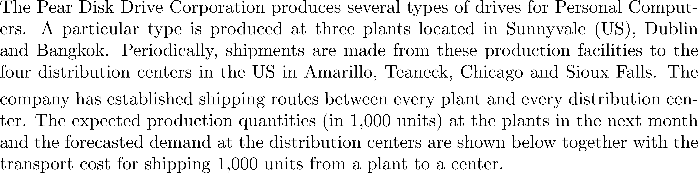
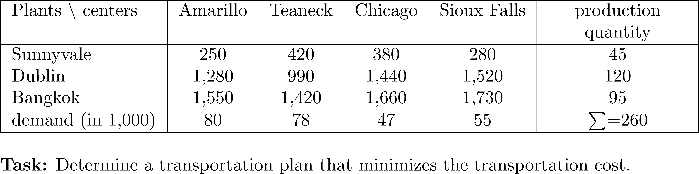
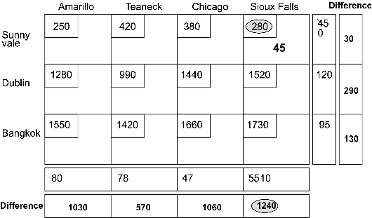
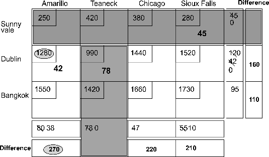
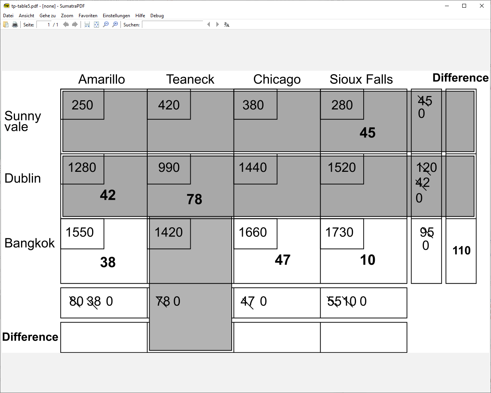
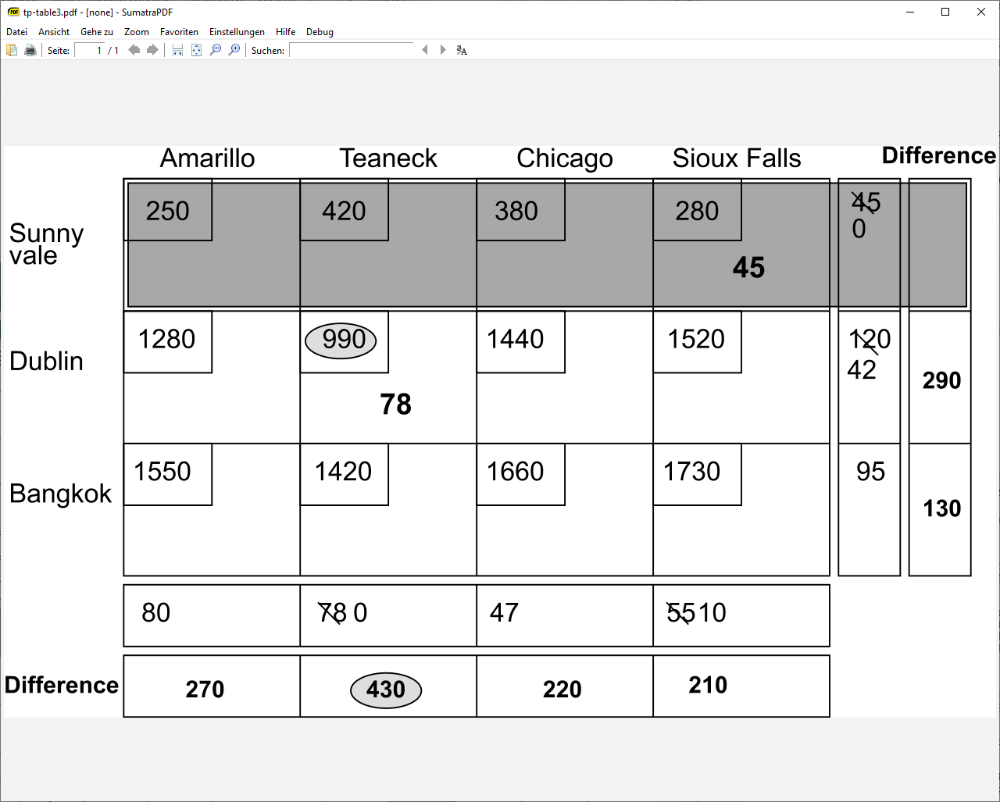
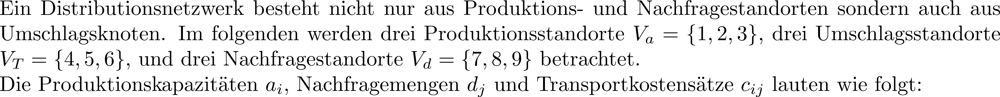
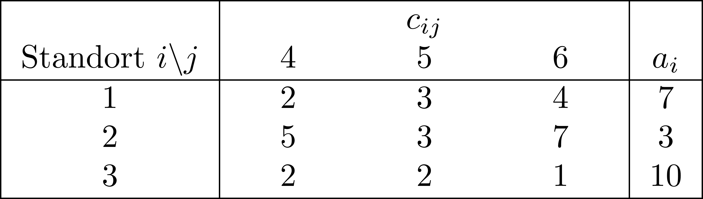
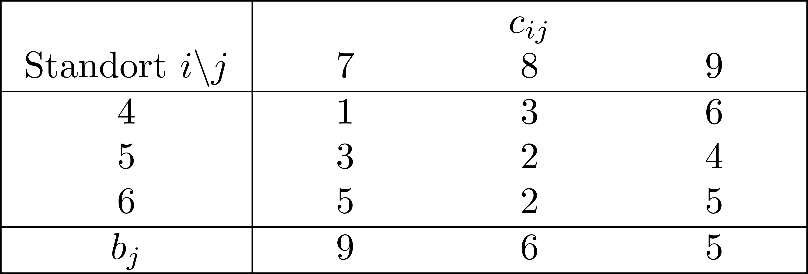
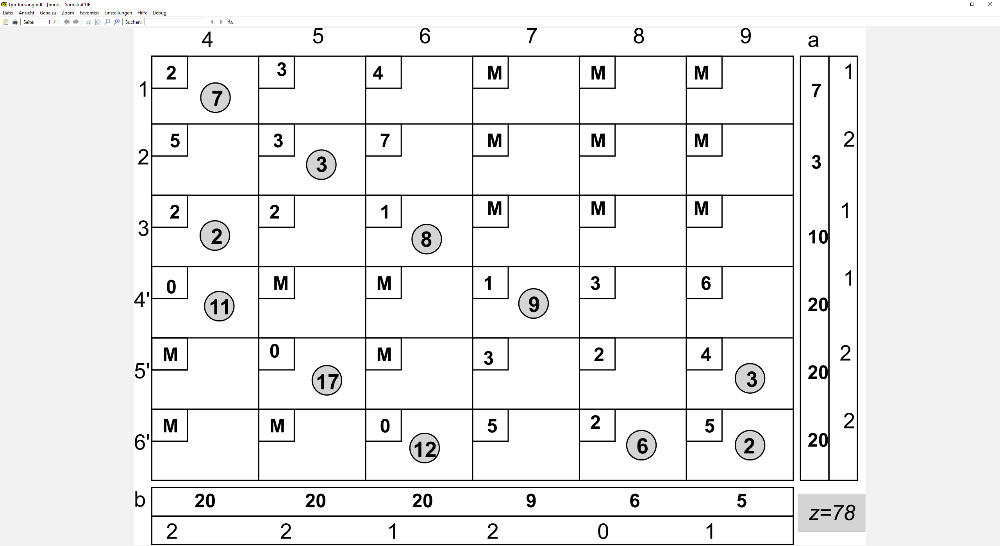

## Transportplanung {#slide-125}

Supply Chain Management

125

## Transportplanung {#slide-126}

Einordnung

Supply Chain Management

126

1A

::: {.smartart .chevron1 data-smartart-layout="chevron1"}
:::

I

1B

II

1C

III

1D

IV

1E

V

2A

2B

2C

2D

3A

3B

3C

4A

4B

5A

5B

5C

7A

7C

7E

6A

6B

6C

6D

VI

- Welche Transportverbindungen sollen gewählt werden?

## Fallstudie -- Batterielogistik {#slide-127}

Ausgangslage - Fortsetzung

Supply Chain Management

127

  Problemstellung
  ----------------------------------------------------------------------------------------------------------------------------------------------------------------------------------------------------------------------------------------------------------------------------------------------------------------------------------------------------------------------------------------------------------------------------------------------------------------------------------------------------------------------------------------------------------------------------------------------------------------------------------------------------------------------------------
  Zur  Versorgung  der  Automobilwerke  in  Norddeutschland  und den Benelux- Ländern   mit   Antriebs-Batterien   wurde   eine   Versorgungskette   aufgebaut   werden . Es  wurden   3 Lager- standorte  ( Düren ,  Harsewinkel ,  Langenhagen )  für den  Batterieumschlag   eingerichtet . In  jedem  Lager  wurden   Lagerkapazitäten  für  Antriebs-Batterien   geschaffen .  Jedes   Automobilwerk   wurde   einem   Versorgungslager   zugeordnet . Nach  einem  Jahr  im   Betrieb   haben   sich  die  Versorgungs-mengen   geändert . Daher  überlegt  das Management des 3 PL,  ob  die  Zuordnung  von  Versorgungslägern  und  Automobilwerken   noch  ideal  ist . 

  ID   Standort      Werke                      Gepl. Liefermenge (in MWh)
  ---- ------------- -------------------------- ----------------------------
  L2   Düren         C6, C7, C8, C9, C10, C11   146 000
  L4   Harsewinkel   C3, C4                     30 000
  L5   Langenhagen   C1, C2, C5                 95 000

## Fallstudie -- Batterielogistik {#slide-128}

  ID    Werksname              Ort                        Längen-grad   Breiten-grad   Batteriebedarf (MWh/Jahr)
  ----- ---------------------- -------------------------- ------------- -------------- ---------------------------
  C1    Volkswagen Wolfsburg   Wolfsburg, Niedersachsen   10.7796       52.4338        35 000
  C2    Volkswagen Hannover    Hannover, Niedersachsen    9.6846        52.4236        25 000
  C3    Volkswagen Emden       Emden, Niedersachsen       7.207         53.3687        11 000
  C4    Volkswagen Osnabrück   Osnabrück, Niedersachsen   8.0472        52.2736        20 000
  C5    Mercedes-Benz Bremen   Bremen                     8.8072        53.0793        45 000
  C6    Ford Köln              Köln                       6.8996        50.957         20 000
  C7    Opel Rüsselsheim       Rüsselsheim                8.4196        49.9896        33 000
  C8    Volvo Cars Gent        Gent, Belgien              3.7499        51.0645        15 000
  C9    Volvo Trucks Gent      Gent, Belgien              3.733         51.0615        26 000
  C10   Toyota Motor Europe    Zaventem, Belgien          4.46          50.887         40 000
  C11   VDL  Nedcar            Born, Niederlande          5.8106        51.0315        10 000

Rahmendaten - Fortsetzung

Supply Chain Management

128

  Entscheidungssituation
  -----------------------------------------------------------------------------------------------------------------------------------------------------------------------------------------------------------------------------------------------------------------------------------------------------------------------------------------------------------------------------------
  Das Management des 3PL muss  entscheiden ,  welche  Werke von  welchem  Lager  aus   versorgt   werden   sollen . Dabei  müssen  die  Kapazitäten  der  Läger   berücksichtigt   werden . Das  Unternehmen   möchte  die  Entscheidung  so  treffen ,  dass  die  jährlichen   Gesamtkosten  für den Transport  minimiert   werden .  Folgende   Informationen   sind   bekannt :

Transportdistanzen in km

Werkstandorte  und  aktualisierte   jährliche   Batteriebedarfsprognosen

  ID   Standort      Längengrad   Breitengrad   Kapazitäten/Jahr (in MWh)
  ---- ------------- ------------ ------------- ---------------------------
  L2   Düren         6.4925       50.8078       150 000
  L4   Harsewinkel   8.2306       51.9621       50 000
  L5   Langenhagen   9.6983       52.4504       100 000

Kapazitäten  der  Lagerstandorte

## Transportproblem {#slide-129}

Problembeschreibung

24.06.2026

129

  Problemstellung
  ------------------------------------------------------------------------------------------------------------------------------------------------------------------------------------------------------------------------------------------------------------------------------------------------------------------------------------------------------------------------------------------------------------------------------------------------------------------------------------------------------------------------------------------------------------------------------
  Gegeben  sei  eine  Menge an  Kunden-/ Bedarfsstandorten  und  eine  Menge an  Versorgungsstandorten .  Jeder   Kundenstandort  hat  eine   Warennachfrage  ( z.B.  in Stück pro Monat/Jahr), die von den  Versorgungsstandorten   beliefert   werden  muss. Die  Versorgungsstandorte   haben   maximale   Versorgungskapazitäten . Der Transport der Waren  verursacht   entfernungsabhängige   Transportkosten .  Es  ist   zu   entscheiden , an  welchen   Standorten   Lagerhäuser   eingerichtet   werden   sollen  und  welche  Kunden  diese   versorgen   sollen .

A

B

C

D

1

2

3

...

...

Supply Chain Management

## Transportproblem {#slide-130}

Mathematisches Modell 

24.06.2026

130

A

B

C

D

1

2

3

...

  Eigenschaften  der  optimalen   Lösung
  ----------------------------------------

Supply Chain Management

## Transportproblem {#slide-131}

Lösung des Transportproblems mit  Vogel's  Approximationsheuristik

24.06.2026

131

  Allgemeine Idee
  ------------------------------------------------------------------------------------------------------------------------------------------------------------------------------------
  Konstruktionsheuristik     generiert   eine   zulässige   Lösung Veröffentlicht  von Reinfeld and Vogel (1958) Regrett-Heuristik     versucht  das " Bedauern "  zu   minimieren

  Ablauf
  --------------------------------------------------------------------------------------------------------------------------------------------------------------------------------------------------------------------------------------------------------------------------------------------------------------------------------------------------------------------------------------------------------------------------------------------------------------------------------------------------------------------------------------------------------------------------------------------------------------------------------------------------------------------------------------------------------------------------------
  Bilde pro Zeile und Spalte in der Transportkostenmatrix die Differenz zwischen dem zweitkleinsten und dem kleinsten Transportkostensatz der noch unbelegten Transportrelationen. Bestimme die Zeile oder Spalte mit der größten Differenz   größtes Bedauern Belege in dieser Zeile bzw. Spalte die Relation mit dem geringsten Transportkostensatz mit der maximal möglichen Transportmenge. Aktualisiere die verbleibenden Angebots- und Nachfragemengen. Lösche die nicht mehr belegbare Zeile oder Spalte. Ist nur noch eine Zeile oder eine Spalte belegbar? wenn "Nein" springe zu Schritt (1). wenn "Ja" verteile die verbleibenden Angebotsmengen auf die verbleibenden Nachfragemengen und terminiere das Verfahren.

Supply Chain Management

## Transportproblem {#slide-132}

Beispiel ( Nahmias  2001, p. 309)

Supply Chain Management

132

{.formula-img}

{.formula-img}

## Transportproblem {#slide-133}

Beispiel mit  Vogel's  Approximationsheuristik -- Schritt 1

Supply Chain Management

133

## Transportproblem {#slide-134}

Beispiel mit  Vogel's  Approximationsheuristik -- Schritte 2-6

Supply Chain Management

134

::: {layout-ncol="2"}

:::

## Umschlagsproblem {#slide-135}

Beispiel (Domschke, 2006, S. 137)

Supply Chain Management

135

{.formula-img}

::: {layout-ncol="2"}

:::

{.formula-img}

7

8

9

1

2

3

...

4

5

6

## Umschlagsproblem {#slide-136}

Mathematisches Modell 

24.06.2026

136

  Eigenschaften  der  optimalen   Lösung
  ----------------------------------------

Supply Chain Management

7

8

9

1

2

3

4

5

6

## Umschlagsproblem {#slide-137}

Transformation in ein Transportproblem

Supply Chain Management

137

![\\PassOptionsToPackage{svgnames}{xcolor}
\\documentclass{article}
\\usepackage{amsmath}
\\usepackage{amsfonts} 
\\usepackage{amssymb}
\\usepackage{amsthm}
\\usepackage{nicefrac}
\\usepackage{booktabs}
\\usepackage{multirow}
\\usepackage{geometry} 
\\usepackage{eurosym} 
\\geometry{lmargin = 4cm, rmargin = 12cm}
\\usepackage{tabularx}
\\usepackage{tcolorbox}

\\graphicspath{{\"C:/Users/ThomasK/ownCloud/PL/1920/Latex/\"}}

\\pagestyle{empty}
%\\tcbuselibrary{skins}
%\\usetikzlibrary{shadings,shadows}
\\definecolor{basic}{RGB}{0,65,49}

 \\newcolumntype{Y}{\>{\\centering\\arraybackslash}X}
\\newcommand{\\Rre}{\\mathbb{R}}

\\newenvironment{block}\[1\]{%
  \\tcolorbox\[boxsep=1pt,left=2pt,right=2pt,top=4pt,bottom=4pt, noparskip,colframe=basic, fonttitle=\\bfseries,  title=#1\]}%
  {\\endtcolorbox}

\\setlength{\\parindent}{0pt}

\\begin{document}
\\small

{\\bfseries Neue Entschiedungsvariable:}

\$\\overline{y}\_j\$: Menge, die \\underline{nicht} in \$j \\! \\in \\! V_T\$ umgeschlagen wird.\\\\

Sei \$L=\\sum\_{i\\in V_a} a_i = \\sum\_{j\\in V_d} d_j\$\\\\  
sodass:
        \\begin{eqnarray\*}
                \\sum\_{j\\in V_T} x\_{ij} &=& a_i \\quad (i\\in V_a)\\\\
                \\sum\_{i\\in V_a} x\_{ij} + \\overline{y}\_j &=& L \\quad (j\\in V_T)\\\\
                \\sum\_{j\\in V_d} x\_{ij} + \\overline{y}\_i &=& L \\quad (i\\in V_T)\\\\
                \\sum\_{i\\in V_T} x\_{ij} &=& d_j \\quad (j\\in V_d)\\\\\[1ex\]
                x\_{ij}, \\overline{y}\_i, \\overline{y}\_j &\\ge& 0 
\\end{eqnarray\*}
\\end{document}](../images/image145.png "Grafik 14")

1

2

3

4

5

6

7

8

9

4'

5'

6'

## Umschlagsproblem {#slide-138}

Beispiel --Vogels Approximationsmethode 

Supply Chain Management

138

![\\PassOptionsToPackage{svgnames}{xcolor}
\\documentclass{article}
\\usepackage{amsmath}
\\usepackage{amsfonts} 
\\usepackage{amssymb}
\\usepackage{amsthm}
\\usepackage{nicefrac}
\\usepackage{booktabs}
\\usepackage{multirow}
\\usepackage{geometry} 
\\usepackage{eurosym} 
\\geometry{lmargin = 3cm, rmargin = 3cm}
\\usepackage{tabularx}
\\usepackage{tcolorbox}

\\graphicspath{{\"C:/Users/ThomasK/ownCloud/PL/1920/Latex/\"}}

\\pagestyle{empty}
%\\tcbuselibrary{skins}
%\\usetikzlibrary{shadings,shadows}
\\definecolor{basic}{RGB}{0,65,49}

 \\newcolumntype{Y}{\>{\\centering\\arraybackslash}X}
\\newcommand{\\Rre}{\\mathbb{R}}

\\newenvironment{block}\[1\]{%
  \\tcolorbox\[boxsep=1pt,left=2pt,right=2pt,top=4pt,bottom=4pt, noparskip,colframe=basic, fonttitle=\\bfseries,  title=#1\]}%
  {\\endtcolorbox}

\\setlength{\\parindent}{0pt}

\\begin{document}
Sei \$\\displaystyle L= \\sum\_{i\\in V_a} a_i = \\sum\_{j\\in V_b} b_j = 20\$ und \$M\$ eine hinreichend große Zahl (\$M=\\infty\$).
\\begin{center}
\\begin{tabular}{\|c\|ccc\|ccc\|c\|}
\\hline
\$\\quad\$Site\$\\quad\$ & \$\\quad\$4\$\\quad\$ &\$\\quad\$ 5\$\\quad\$ &\$\\quad\$ 6\$\\quad\$ &
\$\\quad\$ 7\$\\quad\$ &\$\\quad\$ 8\$\\quad\$ &\$\\quad\$ 9\$\\quad\$ &\$\\quad\$\$a_i\$\$\\quad\$\\\\
\\hline\\addlinespace\\hline
1 & 2 & 3 & 4 & \$M\$ & \$M\$ & \$M\$ & 7\\\\
2 & 5 & 3 & 7 & \$M\$ & \$M\$ & \$M\$ & 3\\\\
3 & 2 & 2 & 1 & \$M\$ & \$M\$ & \$M\$ & 10\\\\
\\hline\\addlinespace\\hline
4\' & 0 & \$M\$ & \$M\$ & 1 & 3 & 6 & 20\\\\
5\' & \$M\$ & 0 & \$M\$ & 3 & 2 & 4 & 20\\\\
6\' & \$M\$ & \$M\$ & 0 & 5 & 2 & 5 & 20\\\\
\\hline\\addlinespace\\hline
\$b_j\$ & 20 & 20 & 20 & 9 & 6 & 5&\\\\
\\hline
\\end{tabular}
\\end{center}
\\end{document}](../images/image161.png "Grafik 11")

## Umschlagsproblem {#slide-139}

Beispiel -- Lösung mit Vogels Approximationsmethode

Supply Chain Management

139

