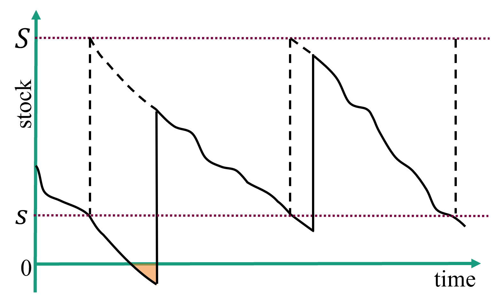
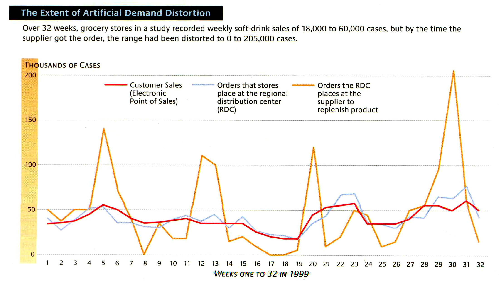
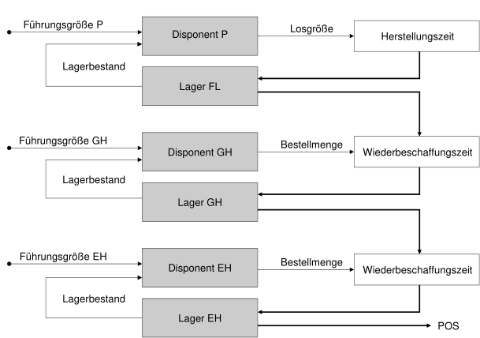
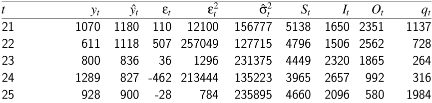
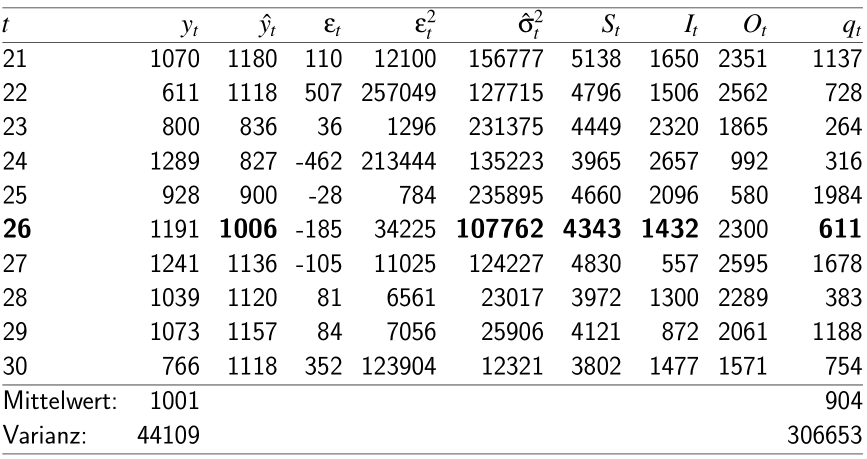
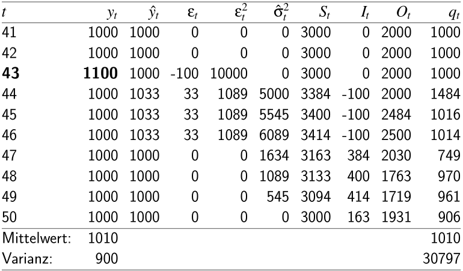
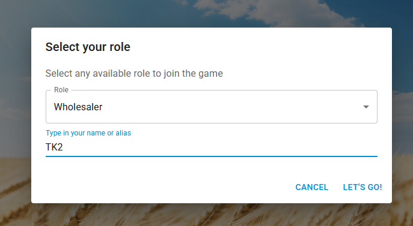

## Unsicherheit in Supply Chains {#slide-174}

- Kapazitäts-Pooling
- Bullwhip -Effekt

Supply Chain Management

174

## Supply  chain   netzwerk {#slide-175}

Topologien

24.06.2026

Supply Chain Management

175

1A

::: {.smartart .chevron1 data-smartart-layout="chevron1"}
:::

I

1B

II

1C

III

1D

IV

1E

V

2A

2B

2C

2D

3A

3B

3C

4A

4B

5A

5B

5C

7A

7B

7C

7D

7E

6A

6B

6C

6D

- 

<!-- -->

- 

VI

konvergent

divergent

Stufe 0

Stufe 2

Stufe 1

Stufe 3

Stufe 4

Stufe 5

Stufe 6

Stufe 7

## Supply  chain   netzwerke {#slide-176}

Bestandsbegriffe in verteilten Systemen

24.06.2026

Supply Chain Management

176

![\\PassOptionsToPackage{svgnames}{xcolor}
\\documentclass{article}
\\usepackage{amsmath}
\\usepackage{amsfonts} 
\\usepackage{amssymb}
\\usepackage{amsthm}
\\usepackage{bm}
\\usepackage{bbm}
\\usepackage\[utf8\]{inputenc} % für deutsche Umlaute latin1
\\usepackage\[T1\]{fontenc}
\\usepackage{nicefrac}
\\usepackage{booktabs}
\\usepackage{multirow}
\\usepackage{geometry} 
\\usepackage{eurosym} 
\\usepackage{kbordermatrix}
\\geometry{lmargin = 4cm, rmargin = 4cm}
\\usepackage{tabularx}
\\usepackage{tcolorbox}
\\usepackage{lmodern}
\\usepackage{courier}
\\usepackage{etex}

\\newcommand{\\Y}{\\mathbf{Y}}
\\newcommand{\\bZ}{\\mathbf{Z}}
\\newcommand{\\X}{\\mathbf{X}}
\\newcommand{\\V}{\\mathbf{V}}
\\newcommand{\\Q}{\\mathbf{Q}}
\\newcommand{\\A}{\\mathbf{A}}
\\newcommand{\\Pb}{\\mathbf{P}}
\\newcommand{\\B}{\\mathbf{B}}
%\\newcommand{\\C}{\\mathbf{C}}
\\newcommand{\\Db}{\\mathbf{D}}
\\newcommand{\\y}{\\mathbf{y}}
\\newcommand{\\f}{\\mathbf{f}}
\\newcommand{\\x}{\\mathbf{x}}
\\newcommand{\\bh}{\\mathbf{h}}
\\newcommand{\\pb}{\\mathbf{p}}
\\newcommand{\\rr}{\\mathbf{r}}
\\newcommand{\\z}{\\mathbf{z}}
\\newcommand{\\Z}{\\mathbf{Z}}
\\newcommand{\\lb}{\\mathbf{l}}
\\newcommand{\\rb}{\\mathbf{r}}
\\newcommand{\\bs}{\\mathbf{s}}
\\newcommand{\\bt}{\\mathbf{t}}
\\newcommand{\\bu}{\\mathbf{u}}
\\newcommand{\\E}{\\mathbf{E}}
\\newcommand{\\Sb}{\\mathbf{S}}
\\newcommand{\\bd}{\\mathbf{d}}
\\newcommand{\\e}{\\mathbf{e}}
\\newcommand{\\ba}{\\mathbf{a}}
\\newcommand{\\bb}{\\mathbf{b}}
\\newcommand{\\bz}{\\mathbf{z}}

%\\newcommand{\\Rre}{\\mathbb{R}}
%\\newcommand{\\Nre}{\\mathbb{N}}
\\newcommand{\\Nrm}{\\mathrm{N}}
\\newcommand{\\Ac}{\\mathcal{A}}
\\newcommand{\\Bc}{\\mathcal{B}}
\\newcommand{\\Cc}{\\mathcal{C}}
\\newcommand{\\Dc}{\\mathcal{D}}
\\newcommand{\\Mc}{\\mathcal{M}}
\\newcommand{\\Ec}{\\mathcal{E}}
\\newcommand{\\Fc}{\\mathcal{F}}
\\newcommand{\\Gc}{\\mathcal{G}}
\\newcommand{\\Erm}{\\mathrm{E}}

\\newcommand{\\Lc}{\\mathcal{L}}
\\newcommand{\\Nc}{\\mathcal{N}}
\\newcommand{\\Oc}{\\mathcal{O}}
\\newcommand{\\Pc}{\\mathcal{P}}
\\newcommand{\\Rc}{\\mathcal{R}}
\\newcommand{\\Sc}{\\mathcal{S}}
\\newcommand{\\ssc}{\\mathcal{s}}
\\newcommand{\\Hc}{\\mathcal{H}}
\\newcommand{\\Ic}{\\mathcal{I}}
\\newcommand{\\Kc}{\\mathcal{K}}
\\newcommand{\\kkc}{\\mathcal{k}}
\\newcommand{\\Tcc}{\\mathcal{T}}
\\newcommand{\\Vc}{\\mathcal{V}}
\\newcommand{\\Jc}{\\mathcal{J}}
\\newcommand{\\Zc}{\\mathcal{Z}}
\\newcommand{\\Yc}{\\mathcal{Y}}
\\newcommand{\\Xc}{\\mathcal{X}}

\\graphicspath{{\"C:/Users/ThomasK/ownCloud/PL/1920/Latex/\"}}

\\pagestyle{empty}
%\\tcbuselibrary{skins}
%\\usetikzlibrary{shadings,shadows}
\\definecolor{basic}{RGB}{0,65,49}

 \\newcolumntype{Y}{\>{\\centering\\arraybackslash}X}
\\newcommand{\\Rre}{\\mathbb{R}}

\\newenvironment{block}\[1\]{%
  \\tcolorbox\[boxsep=1pt,left=2pt,right=2pt,top=4pt,bottom=4pt, noparskip,colframe=basic, fonttitle=\\bfseries,  title=#1\]}%
  {\\endtcolorbox}

\\setlength{\\parindent}{0pt}

\\begin{document}

In mehrstufigen Lagerbestandssytemen fließen Bestände durch Bestellungen durch ein Netzwerk \$N=(V,E)\$ in Richtung der Kunden- bzw. Verbrauchsknoten

\\begin{itemize}
 \\item das \\textbf{Echelon} von Knoten \$i \\in V\$ ist die Knoten Teilmenge \$V(i) \\subset V\$ aller direkten und indirekten Nachfolger von Knoten \$i\$
 \\item der \\textbf{Pipelinebestand} \$P_i\$ von Knoten \$i\$ ist Menge aller Bestellungen/Flussmengen auf den Belieferungskanten \$(k,i) \\in E\$ aller direkten Vorgänger von \$i\$ 
\\item der \\textbf{Echelonbestand} \$I\^{ech}\_i\$ besteht aus dem physischen Bestand \$I_i\$ von Knoten \$i\$ sowie den physischen Beständen \$I_j\$ und Pipelinebeständen \$P_j\$ aller Knoten des Echelons von Knoten \$i\$, d.h. \$j \\in V(i)\$ 
\\item der \\textbf{disposible Echelonbestand} von Knoten \$i \\in V\$ ist die Summe von Echelonbestand \$I\^{ech}\_i\$ und Pipelinebetand \$P_i\$ des Knoten \$i\$
\\end{itemize}

\\end{document}](../images/image204.png "Grafik 15")

## Bullwhip -effekt {#slide-177}

Bestell-

menge

Bestell-

menge

Bestell-

menge

Lieferkettenstruktur

24.06.2026

Supply Chain Management

177

::: {.smartart .chevron1 data-smartart-layout="chevron1"}
:::

1

I

2

3

Stufe 0

(Kunde)

Stufe 2

( distributor )

Stufe 1

(Handle)

Stufe 3

( wholesaler )

4

Stufe 4

(Produzent)

Güterfluss

Informationsfluss

- Zeitverzögerung zwischen Bestellung und Lieferung
- Koordination durch Beachtung von Pipeline- und Echelon-Beständen

## Bullwhip -effekt {#slide-178}

Phänomen

24.06.2026

Supply Chain Management

178

Definition ( Cachon / Terwich , 2022)

The  bullwhip   effect   is   present  in a  supply   chain   if   the   variability   of   demand  at  one   level   of   the   supply   chain   is   greater   than   the   variability   of   demand  at  the   next   downstream   level  in  the   supply   chain ,  where   variability   is    measured   with   the   coefficient   of   variation .

## Bullwhip -effekt {#slide-179}

Dispositionsentscheidungen

24.06.2026

Supply Chain Management

179

Disponent

....

## Bullwhip -Effekt {#slide-180}

Bestimmung der Bestellmenge

24.06.2026

Supply Chain Management

180

## Simulation des  Bullwhip -Effekt {#slide-181}

Setting ( Thonemann , 2005)

24.06.2026

Supply Chain Management

181

C

WS

S

Nachfrage:

i.i.d , rel. konstant

Wiederbeschaffungszeit:  2 Wochen

Backlogging

Historische Werte:

Berechne Werte für Woche 26!

## Procedure   for   determining   order   quantity {#slide-182}

Example

24.06.2026

Supply Chain Management

182

## Simulation des  Bullwhip -Effekt {#slide-183}

Ergebnisse ( Thonemann , 2005)

24.06.2026

Supply Chain Management

183

## Bullwhip -Effekt {#slide-184}

Ursachen & Lösungsansätze

24.06.2026

Supply Chain Management

184

- Nachfrage:  Schwankungen durch stochastische Einflüsse
- Prognosemodell:  Systematischer Fehler durch unpassendes Prognosemodell?
- Länge der Risikoperiode:  Schwankt die Lieferzeit des Lieferanten?
- Liefermenge : Stimmen Liefer- und Bestellmengen überein?
- Lagerbestände : Sind alle Bestände nutzbar?
- Strategisches Bestellverhalten
- Losgröße, Rationierung, ...

Ursachen

Lösungsansätze

- Kosten und Nachfragetransparenz ( downstream )
- Transparenz über Lagerbestände / Lieferstatus ( upstream )
- Anreize für homogene Bestellmengen
- Ankündigung von Rabattaktionen etc.
- ...

## Beergame {#slide-185}

Simulierte Abfolge von Bestellprozessen

Einfluss von Bestellstrategien auf die Erträge der Beteiligten

- Serielle Belieferungsstruktur   4 Stufen
- Je Stufe ein (unabhängiger) Spieler

Je Stufe ein Nachfolger bzw. Vorgänger 

Einleitung

Supply Chain Management

185

\[Graphic: other: http://schemas.openxmlformats.org/presentationml/2006/ole\]

## Beergame {#slide-186}

Pro Supply Chain : 	4 Spieler ( Retailer ,  Wholesaler , Distributor, Producer)

Spielzeit:  		52 Runden

Lieferzeit : 		nach 2 Runden

Backlog : 		ja (negativer Lagerbestand)

Kosten : 		5 GE pro ME Lagerbestand; 

				25 GE pro  backlogged  ME; 

Initiale Werte :		Bestand: 20, 

			Bestellung für Perioden 1-3: 5 ME  

Rahmenbedingungen

Supply Chain Management

186

## Beergame {#slide-187}

Sitzplan

Supply Chain Management

187

Pult

Retailer  

Retailer

Retailer

Retailer

Retailer

Retailer

Retailer

Whole-saler

Whole-saler

Whole-saler

Whole-saler

Whole-saler

Whole-saler

Whole-saler

Distri-butor

Distri-butor

Distri-butor

Distri-butor

Distri-butor

Distri-butor

Distri-butor

Producer

Producer

Producer

Producer

Producer

Producer

Producer

Leinwand

Reihe

1

2

3

4

Team 1

Team 2

Team 3

Team 4

Team 5

Team 6

Team 7

## Slide 188

Supply Chain Management

188

## Beergame {#slide-189}

Öffne  https://beergame.masystem.se/

Je Team:  Retailer  wählt „New game„

Je Team:  Retailer  gibt Teamnamen ein

Je Team:  Retailer  wählt Rolle „ Retailer " und gibt sich einen Namen

Je Team: Alle anderen Spieler wählen „ Join  Game"

Je Team: Alle anderen Spieler suchen nach Teamnamen

Je Team: Alle anderen Spieler wählen Rolle und Alias

Ablauf

Supply Chain Management

189

::: {layout-ncol="3"}

:::

