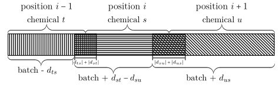
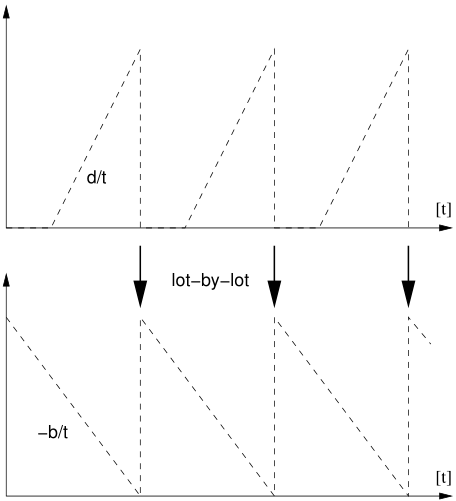
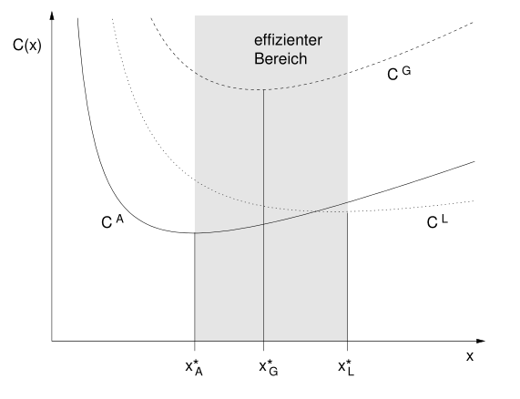
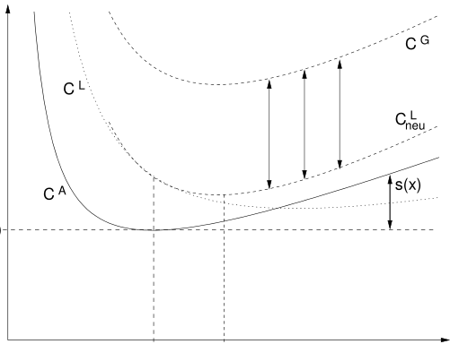
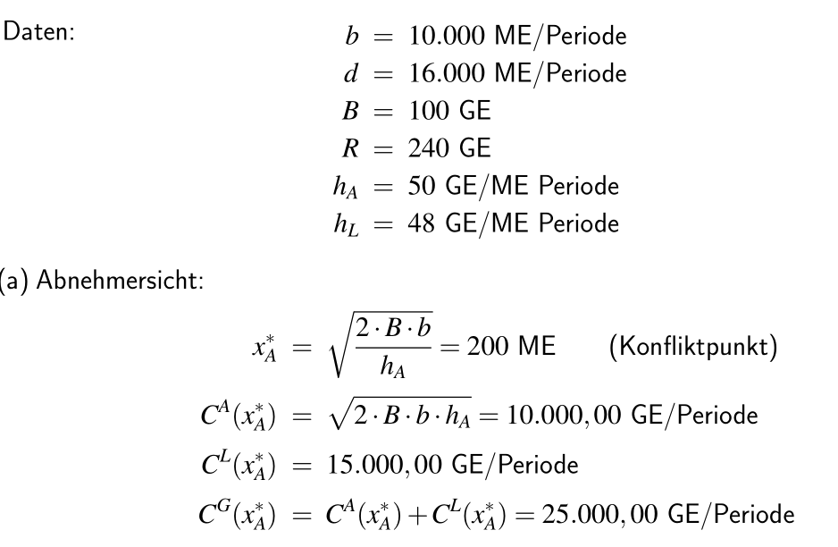
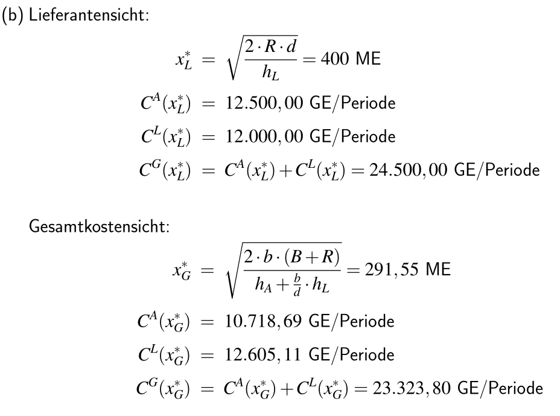
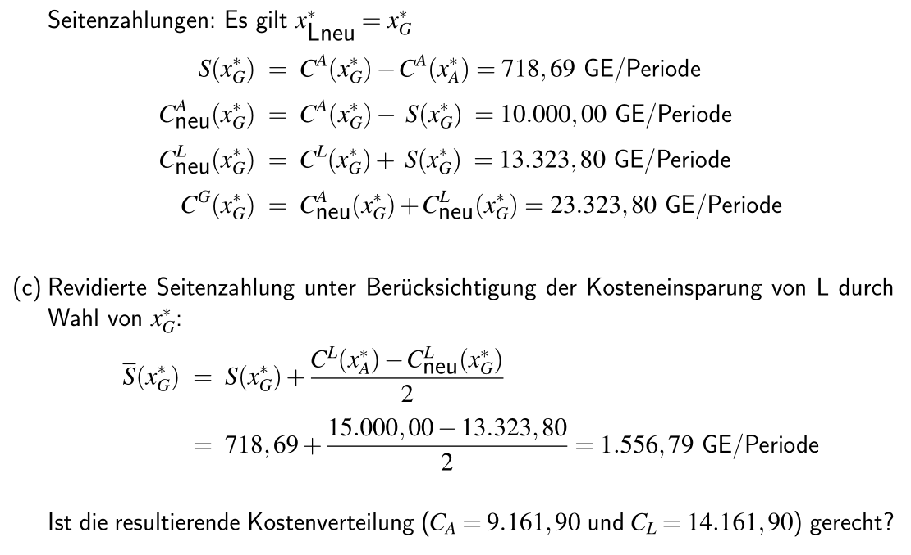

## Koordination in Supply Chains {#slide-190}

- Joint  Economic   Lotsizing  Problem (JELSP)
- Contracting

Supply Chain Management

190

## Koordination durch Kollaboration {#slide-191}

Fallbeispiel Chemie (1/2)

Supply Chain Management

191

  Ausgangslage
  --------------------------------------------------------------------------------------------------------------------------------------------------------------------------------------------------------------------------------------------------------------
  Der Steamcracker Böhlen wird über den Ölhafen Rostock mit Naphtha versorgt. Das Naphtha wird per Pipeline nach Böhlen transportiert. Der Cracker wird kontinuierlich betrieben. Der  Naphthaverbrauch  liegt zwischen 3000 und 5000 Tonnen Naphtha pro Tag. 

Rostock -- Naphtha-Terminal

Böhlen -- Steam-Cracker

Pipeline Rostock - Böhlen

## Koordination durch Kollaboration {#slide-192}

Tanker entladen Produkte in  Tankfarm

Tankfarm  dient als Pufferlager

In Pipeline werden verschiedene Produkte transportiert (Naphtha, Pyrolysebenzin)

-  Produktbatches in Pipeline

Produkte aus Pipeline werden in Tanklager zwischengespeichert

Anlagen und Cracker werden aus Tanklager versorgt

Anlagen laufen kontinuierlich

-   Kontinuierlicher Lagerabgang

Fallbeispiel Chemie (2/2) 

Supply Chain Management

192

Cracker

Anlage A

Anlage B

## Koordination durch kollaborative Planung {#slide-193}

Joint  Economic   Lotsizing  Problem (JELSP)

24.06.2026

Supply Chain Management

193

Lieferant

Produk-tion

Ausgangs-lager

Abnehmer

Produk-tion

Eingangs-lager

Bestellung

Lieferung

  Ziel
  --------------------------------------------------------------------------------------
  Bestimme eine Losgröße, die die Gesamtkosten des Lieferanten und Abnehmers minimiert

## Koordination durch kollaborative Planung {#slide-194}

Losweise  Fertigung

24.06.2026

Supply Chain Management

194

Lieferant

Produk-tion

Ausgangs-lager

Abnehmer

Produk-tion

Eingangs-lager

Bestellung

Los

## Koordination durch kollaborative Planung {#slide-195}

Situation des Abnehmers

24.06.2026

Supply Chain Management

195

  Klass.  Losgrößenmodell
  -------------------------

![\\PassOptionsToPackage{svgnames}{xcolor}
\\documentclass{article}
\\usepackage{amsmath}
\\usepackage{amsfonts} 
\\usepackage{amssymb}
\\usepackage{amsthm}
\\usepackage{nicefrac}
\\usepackage{booktabs}
\\usepackage{multirow}
\\usepackage{geometry} 
\\usepackage{eurosym} 
\\geometry{lmargin = 4cm, rmargin = 10cm}
\\usepackage{tabularx}
\\usepackage{tcolorbox}

\\graphicspath{{\"C:/Users/ThomasK/ownCloud/PL/1920/Latex/\"}}

\\pagestyle{empty}
%\\tcbuselibrary{skins}
%\\usetikzlibrary{shadings,shadows}
\\definecolor{basic}{RGB}{0,65,49}

 \\newcolumntype{Y}{\>{\\centering\\arraybackslash}X}
\\newcommand{\\Rre}{\\mathbb{R}}

\\newenvironment{block}\[1\]{%
  \\tcolorbox\[boxsep=1pt,left=2pt,right=2pt,top=4pt,bottom=4pt, noparskip,colframe=basic, fonttitle=\\bfseries,  title=#1\]}%
  {\\endtcolorbox}

\\setlength{\\parindent}{0pt}

\\begin{document}
{\\bfseries Beobachtung:}
\$\$q=\\frac{b}{T}\\cdot t\\quad\\mbox{and}\\quad\\overline{l}= \\frac{q}{2}\$\$
\\end{document}](../images/image226.png "Grafik 43")

![\\PassOptionsToPackage{svgnames}{xcolor}
\\documentclass{article}
\\usepackage{amsmath}
\\usepackage{amsfonts} 
\\usepackage{amssymb}
\\usepackage{amsthm}
\\usepackage{nicefrac}
\\usepackage{booktabs}
\\usepackage{multirow}
\\usepackage{geometry} 
\\usepackage{eurosym} 
\\geometry{lmargin = 4cm, rmargin = 8cm}
\\usepackage{tabularx}
\\usepackage{tcolorbox}

\\graphicspath{{\"C:/Users/ThomasK/ownCloud/PL/1920/Latex/\"}}

\\pagestyle{empty}
%\\tcbuselibrary{skins}
%\\usetikzlibrary{shadings,shadows}
\\definecolor{basic}{RGB}{0,65,49}

 \\newcolumntype{Y}{\>{\\centering\\arraybackslash}X}
\\newcommand{\\Rre}{\\mathbb{R}}

\\newenvironment{block}\[1\]{%
  \\tcolorbox\[boxsep=1pt,left=2pt,right=2pt,top=4pt,bottom=4pt, noparskip,colframe=basic, fonttitle=\\bfseries,  title=#1\]}%
  {\\endtcolorbox}

\\setlength{\\parindent}{0pt}

\\begin{document}

\$\$ \\min \\rightarrow 
K_A(q)  = \\underbrace{\\frac{b}{q}\\cdot c_B\^A}\_{K\^B_A} 
+ \\underbrace{\\frac{1}{2} \\cdot q \\cdot c\^{A}\_L}\_{K\^L_A}\$\$
\\end{document}](../images/image227.png "Grafik 51")

![\\PassOptionsToPackage{svgnames}{xcolor}
\\documentclass{article}
\\usepackage{amsmath}
\\usepackage{amsfonts} 
\\usepackage{amssymb}
\\usepackage{amsthm}
\\usepackage{nicefrac}
\\usepackage{booktabs}
\\usepackage{multirow}
\\usepackage{geometry} 
\\usepackage{eurosym} 
\\geometry{lmargin = 4cm, rmargin = 8cm}
\\usepackage{tabularx}
\\usepackage{tcolorbox}

\\graphicspath{{\"C:/Users/ThomasK/ownCloud/PL/1920/Latex/\"}}

\\pagestyle{empty}
%\\tcbuselibrary{skins}
%\\usetikzlibrary{shadings,shadows}
\\definecolor{basic}{RGB}{0,65,49}

 \\newcolumntype{Y}{\>{\\centering\\arraybackslash}X}
\\newcommand{\\Rre}{\\mathbb{R}}

\\newenvironment{block}\[1\]{%
  \\tcolorbox\[boxsep=1pt,left=2pt,right=2pt,top=4pt,bottom=4pt, noparskip,colframe=basic, fonttitle=\\bfseries,  title=#1\]}%
  {\\endtcolorbox}

\\setlength{\\parindent}{0pt}

\\begin{document}
Lösung: Erste Ableitung
\\begin{eqnarray\*}
K_A\^\\prime(q) &=& - \\frac{b}{q\^2}\\cdot c_B\^A + \\frac{c_L\^{A}}{2} \\stackrel{!}= 0
\\\\\[1ex\]
\\Rightarrow\\qquad  q\^2 &=& \\frac{2\\cdot b\\cdot c_B\^A}{c_L\^{A}}\\\\\[3ex\]
\\Rightarrow\\qquad  q_c\^\\ast &=& \\sqrt{\\frac{2\\cdot b\\cdot c_B\^A}{c_L\^{A}}}
\\;\\qquad\\quad
\\mbox{}
\\\\\[1ex\]
  K_A(q_A\^\\ast) &=& \\sqrt{2\\cdot b\\cdot c_B\^A\\cdot c_L\^{A}}\\qquad
\\mbox{}
\\\\
\\end{eqnarray\*}\\end{document}](../images/image228.png "Grafik 53")

Lieferant

Produk-tion

Ausgangs-lager

Abnehmer

Produk-tion

Eingangs-lager

Bestellung

Los

Lagerbestand Abnehmer

Zeit

## Koordination durch kollaborative Planung {#slide-196}

Situation des Lieferanten

24.06.2026

Supply Chain Management

196

  EOQ- modell   mit   begrenzter   Produktionsgeschwindigkeit
  -------------------------------------------------------------

![\\PassOptionsToPackage{svgnames}{xcolor}
\\documentclass{article}
\\usepackage{amsmath}
\\usepackage{amsfonts} 
\\usepackage{amssymb}
\\usepackage{amsthm}
\\usepackage{nicefrac}
\\usepackage{booktabs}
\\usepackage{multirow}
\\usepackage{geometry} 
\\usepackage{eurosym} 
\\geometry{lmargin = 4cm, rmargin = 8cm}
\\usepackage{tabularx}
\\usepackage{tcolorbox}

\\graphicspath{{\"C:/Users/ThomasK/ownCloud/PL/1920/Latex/\"}}

\\pagestyle{empty}
%\\tcbuselibrary{skins}
%\\usetikzlibrary{shadings,shadows}
\\definecolor{basic}{RGB}{0,65,49}

 \\newcolumntype{Y}{\>{\\centering\\arraybackslash}X}
\\newcommand{\\Rre}{\\mathbb{R}}

\\newenvironment{block}\[1\]{%
  \\tcolorbox\[boxsep=1pt,left=2pt,right=2pt,top=4pt,bottom=4pt, noparskip,colframe=basic, fonttitle=\\bfseries,  title=#1\]}%
  {\\endtcolorbox}

\\setlength{\\parindent}{0pt}

\\begin{document}

\$\$ \\min \\rightarrow 
K_L(q)  = \\frac{b}{q}\\cdot c_B\^L + \\frac{q}{2} \\cdot \\frac{b}{d} \\cdot c\^{L}\_L\$\$
\\end{document}](../images/image229.png "Grafik 36")

![\\PassOptionsToPackage{svgnames}{xcolor}
\\documentclass{article}
\\usepackage{amsmath}
\\usepackage{amsfonts} 
\\usepackage{amssymb}
\\usepackage{amsthm}
\\usepackage{nicefrac}
\\usepackage{booktabs}
\\usepackage{multirow}
\\usepackage{geometry} 
\\usepackage{eurosym} 
\\geometry{lmargin = 4cm, rmargin = 8cm}
\\usepackage{tabularx}
\\usepackage{tcolorbox}

\\graphicspath{{\"C:/Users/ThomasK/ownCloud/PL/1920/Latex/\"}}

\\pagestyle{empty}
%\\tcbuselibrary{skins}
%\\usetikzlibrary{shadings,shadows}
\\definecolor{basic}{RGB}{0,65,49}

 \\newcolumntype{Y}{\>{\\centering\\arraybackslash}X}
\\newcommand{\\Rre}{\\mathbb{R}}

\\newenvironment{block}\[1\]{%
  \\tcolorbox\[boxsep=1pt,left=2pt,right=2pt,top=4pt,bottom=4pt, noparskip,colframe=basic, fonttitle=\\bfseries,  title=#1\]}%
  {\\endtcolorbox}

\\setlength{\\parindent}{0pt}

\\begin{document}
Solution: Consider first order derivate of \$C(q)\$
\\begin{eqnarray\*}
K_L\^\\prime(q) &=& - \\frac{b}{q\^2}\\cdot c_B\^L + \\frac{b \\cdot c_L\^{L}}{2 \\cdot d} \\stackrel{!}= 0
\\\\\[1ex\]
\\Rightarrow\\qquad  q\^2 &=& \\frac{2\\cdot d\\cdot c_B\^L \\cdot b}{c_L\^{L} \\cdot b}\\\\\[3ex\]
\\Rightarrow\\qquad  q_L\^\\ast &=& \\sqrt{\\frac{2\\cdot d\\cdot c_B\^L}{c_L\^{L}}}
\\;\\qquad\\quad
\\mbox{}
\\\\\[1ex\]
\\end{eqnarray\*}\\end{document}](../images/image230.png "Grafik 38")

![\\PassOptionsToPackage{svgnames}{xcolor}
\\documentclass{article}
\\usepackage{amsmath}
\\usepackage{amsfonts} 
\\usepackage{amssymb}
\\usepackage{amsthm}
\\usepackage{nicefrac}
\\usepackage{booktabs}
\\usepackage{multirow}
\\usepackage{geometry} 
\\usepackage{eurosym} 
\\geometry{lmargin = 4cm, rmargin = 10cm}
\\usepackage{tabularx}
\\usepackage{tcolorbox}

\\graphicspath{{\"C:/Users/ThomasK/ownCloud/PL/1920/Latex/\"}}

\\pagestyle{empty}
%\\tcbuselibrary{skins}
%\\usetikzlibrary{shadings,shadows}
\\definecolor{basic}{RGB}{0,65,49}

 \\newcolumntype{Y}{\>{\\centering\\arraybackslash}X}
\\newcommand{\\Rre}{\\mathbb{R}}

\\newenvironment{block}\[1\]{%
  \\tcolorbox\[boxsep=1pt,left=2pt,right=2pt,top=4pt,bottom=4pt, noparskip,colframe=basic, fonttitle=\\bfseries,  title=#1\]}%
  {\\endtcolorbox}

\\setlength{\\parindent}{0pt}

\\begin{document}
{\\bfseries durchschnittlicher Lagerbestand:}
\$\$ \\bar{l} = 0 \\cdot \\frac{t_2}{t} + \\frac{q}{2} \\cdot \\frac{t_1}{t} = \\frac{q}{2} \\cdot \\frac{b}{d}\$\$
\\end{document}](../images/image231.png "Grafik 13")

Lagerbestand Lieferant

Zeit

Lieferant

Produk-tion

Ausgangs-lager

Abnehmer

Produk-tion

Eingangs-lager

Bestellung

Los

## Koordination durch kollaborative Planung {#slide-197}

Situation der Supply Chain

24.06.2026

Supply Chain Management

197

Zeit

Lagerbestände

Lieferant

Produk-tion

Ausgangs-lager

Abnehmer

Produk-tion

Eingangs-lager

Los

## Koordination durch kollaborative Planung {#slide-198}

Kostenfunktionen von Lieferant, Abnehmer und Supply Chain

24.06.2026

Supply Chain Management

198

Verhandlungsmacht Abnehmer

Verhandlungs-macht Lieferant

- Verhandlungen über Losgröße um von Einsparungen zu profitieren
- Idee: Partner mit größerer Verhandlungsmacht muss überzeugt werden
-  Seitenzahlungen des schwächeren Partners an stärkeren Partner

## Koordination durch kollaborative Planung {#slide-199}

Seitenzahlungen -- Situation des stärkeren Partners

24.06.2026

Supply Chain Management

199

Kosten

Losgröße

Verhandlungsmacht Abnehmer

Verhandlungs-macht Lieferant

## Koordination durch kollaborative Planung {#slide-200}

Seitenzahlungen -- Situation des schwächeren Partners 

24.06.2026

Supply Chain Management

200

## Koordination durch kollaborative Planung {#slide-201}

Seitenzahlungen -- Situation des stärkeren Partners -  revised

24.06.2026

Supply Chain Management

201

## Koordination durch kollaborative Planung {#slide-202}

Beispiel

Supply Chain Management

202

  Problemstellung
  -----------------------------------------------------------------------------------------------------------------------------------------------------------------
  Gegeben ist eine Lieferanten-Abnehmer Beziehung (Verhandlungsmacht beim Abnehmer). Die Versorgung durch den Lieferanten erfolgt durch das lot- by -lot Prinzip.

Bestimmen Sie den Konfliktpunkt, d.h. die für den Abnehmer optimale Bestellmenge. Welche Kosten resultieren hieraus für den Abnehmer und für den Lieferanten? 

Der Lieferant möchte den Abnehmer durch Seitenzahlungen dazu bewegen, auch andere Liefermengen zu akzeptieren. Welche Losgröße ist aus Sicht des Lieferanten anzustreben, wenn die Seitenzahlungen genau die beim Abnehmer entstehenden Mehrkosten kompensieren sollen?

Der Abnehmer ist bereit Seitenzahlungen entgegenzunehmen. Er möchte aber nicht nur seine Mehrkosten erstattet haben, sondern zusätzlich an der Hälfte der beim Lieferanten entstehenden Kosteneinsparungen beteiligt werden. Welche Kosten entstehen jetzt bei den Partnern und wie hoch sind die erfolgten Seitenzahlungen?

## Koordination durch kollaborative Planung {#slide-203}

Beispiel - Lösung

Supply Chain Management

203

## Koordination durch kollaborative Planung {#slide-204}

Beispiel - Lösung

Supply Chain Management

204

