## Sustainable  SCM {#slide-205}

Supply Chain Management

205

## Nachhaltigkeits- & Umweltmanagement {#slide-206}

Nachhaltigkeitsparadigmen :

Zukunftsorientierung

Multidimensionalität

Systemdenken

Nachhaltigkeitsstrategien :

Effizienz: Minimiere Verschwendung

Suffizienz: Reduziere Verwendung

Konsistenz: Schaffe Transparenz und Kohärenz mit Nachhaltigkeitszielen

Resilienz: Gestalte Prozesse robust

Allgemeine Grundsätze

Supply Chain Management

206

  Definition Nachhaltigkeits- & Umweltmanagement
  ---------------------------------------------------------------------------------------------------------------------------------------------------------------------------------------------------------------------------------------------------------------------------------------------------------------------------------------
  Nachhaltigkeitsmanagement  bezeichnet alle Konzepte, Prozesse und Strukturen, die nachhaltiges Wirtschaften in einem Unternehmen sicherstellen und befördern. Das  Umweltmanagement  umfasst dabei die Teile des Managementsystems, die die Umweltverträglichkeit unternehmerischer Produkte und Prozesse bewerten und sicherstellen.

Gesellschaft

Wirtschaft

Umwelt

Nachhaltigkeit

Umwelt-

management

Corporate  social

responsibility

Nachhaltigkeitsmanagement

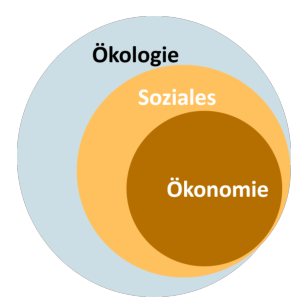

## Nachhaltigkeit {#slide-207}

Allgemeine Konzepte

Supply Chain Management

207

::: {.smartart .pyramid1 data-smartart-layout="pyramid1"}
:::

Nachhaltigkeitspyramide

(Ellen MacArthur  Foundation )

## Nachhaltigkeit und Management {#slide-208}

Supply Chain Management

208

Rechnungswesen

Controlling

Unternehmensführung

ökonomisch

ökologisch

sozial

strategisch

intergenerational

Zeit

taktisch

operativ

Fokus

Aufbau von Managementsystemen

Rechnungswesen: Informationsbereitstellung

Controlling: Anreizkompatible Verhaltenssteuerung

Unternehmensführung: Zielformulierung

Günther et al. (2008), Cetinkaya et al. (2011)

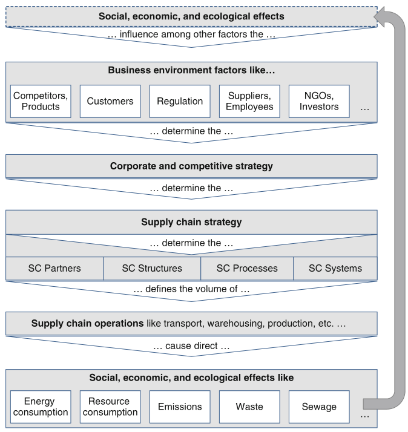

Ablauf von Managementprozessen

## Sustainable  Supply Chain Management {#slide-209}

Begriffsabgrenzung

Supply Chain Management

209

Beschaffung

Res-sourcen

Produktion

Distribution

Absatz

Kunden

Nutzung

Rückgabe

Wieder-nutzung

Wiederauf -bereitung

Wiederauf -integration

Recycling

Abfallverwertung

Lineare/klassische Supply Chain 

Reverse Supply Chain 

Circular  Supply Chain 

  Sustainable  SCM  bezeichnet die Planung, Ausführung und Kontrolle von Geschäftsprozessen unter Berücksichtigung ökonomischer, ökologischer und sozialer Ziele um die langfristige Wettbewerbsfähigkeit der Supply Chain sicherzustellen.
  -------------------------------------------------------------------------------------------------------------------------------------------------------------------------------------------------------------------------------------------

## Sustainable  SCM {#slide-210}

Strategische  Poistionierung

Supply Chain Management

210

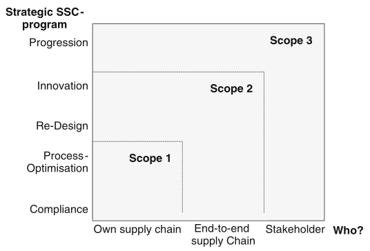

Cetinkaya et al.(2011)

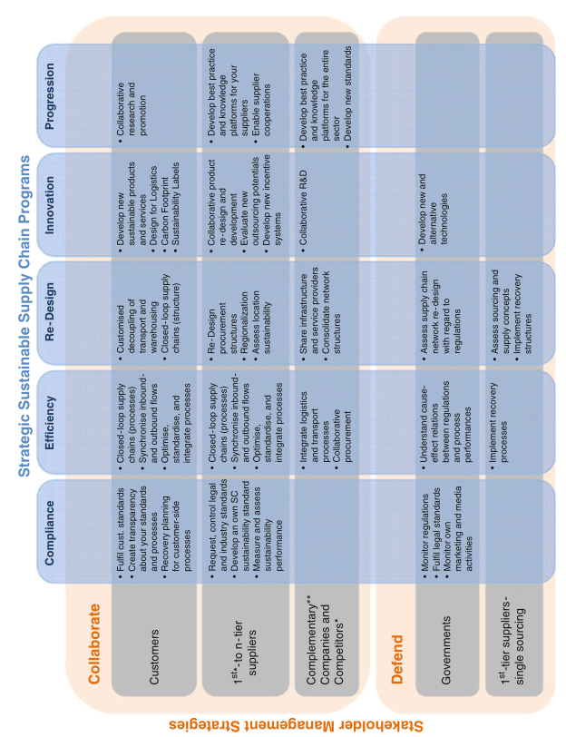

## Sustainable  SCM {#slide-211}

Planungsaufgaben

Supply Chain Management

211

Stint (2017)

## Sustainable  Supply Chain Management {#slide-212}

Circular  Supply Chains & strategische Konzepte

Supply Chain Management

212

Beschaffung

Produktion

Distribution

Absatz

Nutzung

Rückgabe

Wieder-nutzung

Wiederauf -bereitung

Re-integration

Recycling

- Circular   Product  Design

<!-- -->

- Reyclingfähigkeit
- Wiederverwendung
- Recycled   content

<!-- -->

- Sustainable   logistics

<!-- -->

- Gewichtsreduktion
- Distanzreduktion
- Transportvermeidung

<!-- -->

- Circular   production

<!-- -->

- Erneuerbare Energie
- Verwendung von Produktionsabfällen
- Kreislaufführung von Betriebs- und Hilfsstoffen

ReUse

ReManufacturing

Abfall-verwertung

## Circular  Supply Chain Management {#slide-213}

Normstrategien Produktdesign

Supply Chain Management

213

Produkt-

komplexität

Kunden-

präferenzen

hoch

niedrig

dynamisch

statisch

Computer

Smartphones

Stahl

Verpackungen

Möbel

Bekleidung

Haushaltsgeräte

Autos

Design  for  

Recycled  Content

Design  for  

Repair  &  Durability

Design  for   Remanufacture  & 

Reuse

Design  for  

Recycling

In Anlehnung an  Bouchery  et al. 2017

## Circular  Supply Chains {#slide-214}

Beispiele

Supply Chain Management

214

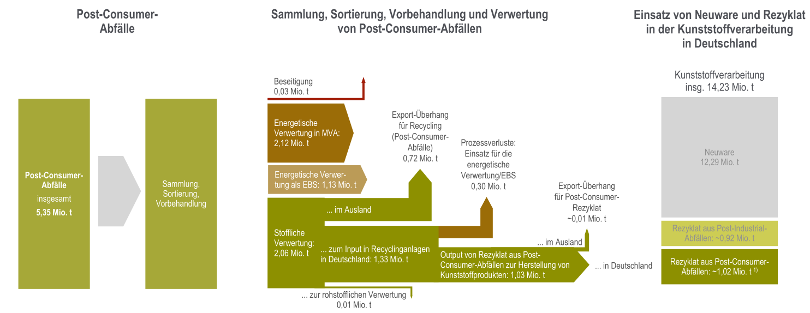

Conversio  (2023), EPA (2015)

## Taktisches Nachhaltigkeitsmanagement {#slide-215}

Eigenschaften von Bewertungssystemen

Ebene : strategisch, taktisch, operativ

Objekt : Prozess, Produkt, System

Dimensionalität : 1,  n

Scope :  gate - to -gate(ga2ga),  cradle - to -gate (cr2ga),  cradle - to -grave (cr2gr),  cradle-to-cradle  (cr2gr)

Informationen : qualitativ, quantitativ 

\...

Thomas

Instrumente der Nachhaltigkeitsbewertung

Supply Chain Management

215

  Instrument                           Objekt                       Dim.    Scope           Informationen   Ebene
  ------------------------------------ ---------------------------- ------- --------------- --------------- ------------------------
  Checklisten / Tests                  System / Produkt / Prozess   n       meist  ga2ga    qualitativ      strategisch
  Audits                               System / Prozess             n       meist ga2ga     qualitativ      strategisch
  Berichte                             System                       n       ga2ga / cr2ga   qualitativ      strategisch
  Szenarioanalysen                     System / Prozess             n       ga2ga           quantitativ     strategisch
  Balanced   Scorecard                 System                       n       meist ga2ga     quantitativ     strategisch / taktisch
  Stoff- und Energiebilanzen           System /  Prozess            n       meist  ga2ga    quantitativ     taktisch
  Environmental  Priority   Strategy   Prozess                      1       ga2gr           quantitativ     taktisch 
  Indikatorsysteme                     Produkte                     n       cr2gr           quantitativ     Taktisch
  Umweltkosten-rechnung                Prozess  / Produkt           1       ga2ga / ga2gr   quantitativ     taktisch /  operativ
  Kennzahlen-systeme                   System / Prozess             1 / n   meist  ga2ga    quantitativ     operativ
  ABC-Analyse                          System / Prozess / Produkt   1       cr2gr           quantitativ     operativ
  Lebenszyklus-analysen (LCA/LCC)      Prozesse / Produkte          n       cr2gr, cr2cr    quantitativ     operativ

## Instrumente der Nachhaltigkeitsbewertung {#slide-216}

Anforderungen (nachhaltiger) Kostenrechnungssysteme

Objektivität

Validität

Reliabilität

Praktikabilität

Komponenten ökologischer & sozialer Kosten

Opportunitätskosten

Kosten externer Effekte

Vermeidungskosten

Beseitigungskosten

Substitutionskosten

\...

Umweltkostenrechnung

Supply Chain Management

216

Günther et al. (2008), Hunkeler et al. (2008)

Übersicht über Kostenbegriffe

Übersicht über Kostenbegriffe

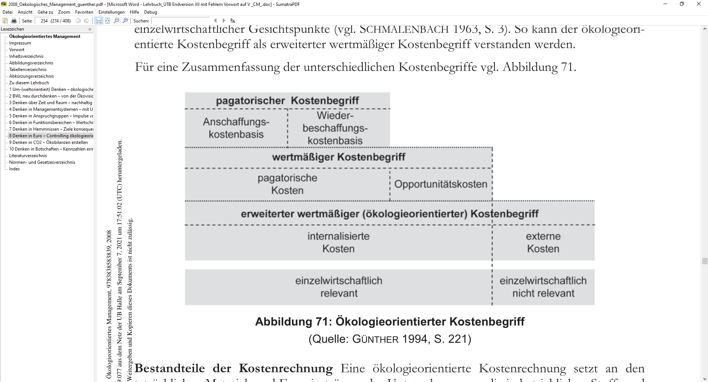

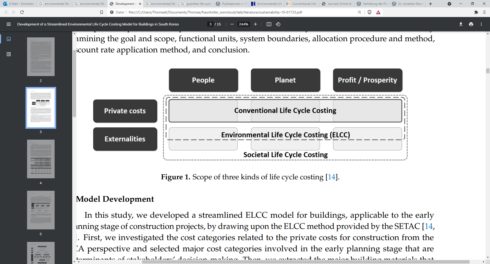

## SSCM & Ökobilanzierung {#slide-217}

Cradle - to -Gate /  Scope  2

Cradle-to-Cradle

Cradle - to -Grave /  Scope  3

Bilanzgrenzen

Supply Chain Management

217

Beschaffung

Res-sourcen

Produktion

Distribution

Absatz

Kunden

Nutzung

Rückgabe

Wieder-nutzung

Wiederauf -bereitung

Wiederauf -integration

Recycling

Abfallverwertung

Gate- to -Gate /  Scope  1

natürliche Umwandlungsprozesse

## Fallstudie  Circular  Chemical Industry {#slide-218}

Supply Chain Management

218

## Global Carbon  stocks  and  cycles {#slide-219}

24.06.2026

© Fraunhofer

Seite   219

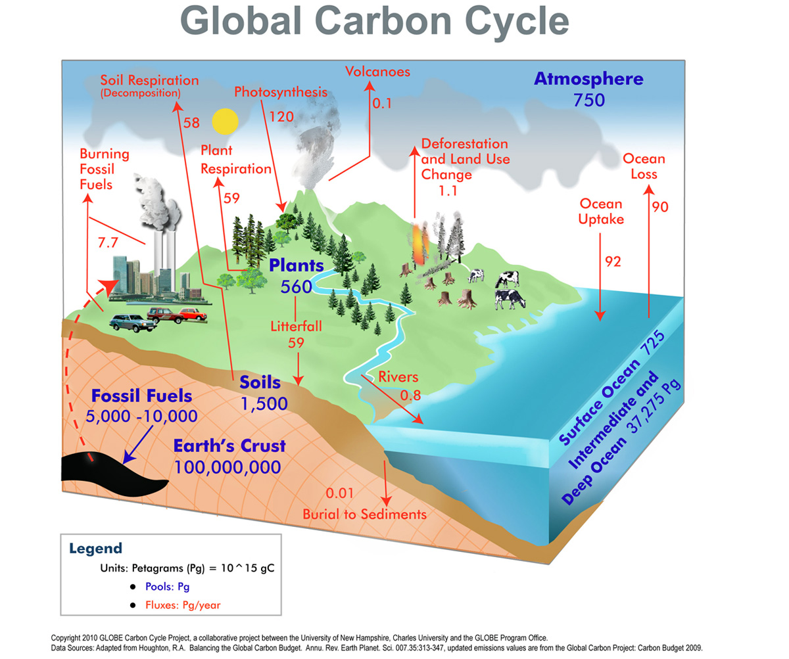

- Total global carbon amount: 75 Mill. Gt
- Atmospheric carbon: 750-850 Gt   total contribution by fossil emissions: about 300 Gt

<!-- -->

- Biosphere : 
- 	  about  700  Gt  in  living   biomass

Units: 1 Pg  = 1 Gt = 1 Bill. tons

- Carbon cycles:

<!-- -->

- slow cycles: rock cycles  building of carbon-containing sedimentary rocks
- Fast  cycles :  terrestrial   runoff ,  ocean  pump ( sedimentation ),  biological   cycle , ( technological   cycle )

## Global Carbon  Cycles {#slide-220}

24.06.2026

Friedlingstein  et al. 2020

Seite   220

-   Reduce  fossil  carbon   emissions   to   atmosphere  and/ or   increase   carbon   uptake   by  at least 5  GtC / year  

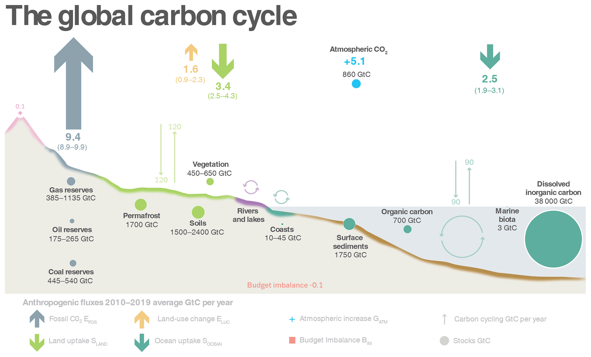

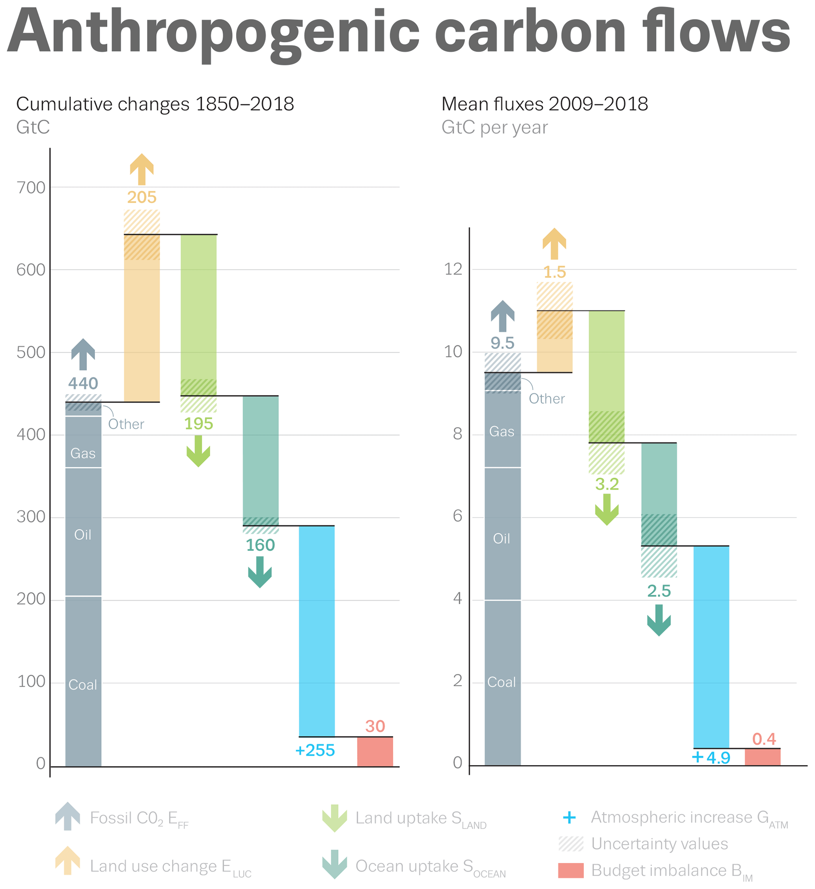

## Fast  biological   carbon   cycle {#slide-221}

24.06.2026

By Zac  Kayler , Maria  Janowiak , Chris  Swanston  - https://www.fs.usda.gov/ccrc/topics/global-carbon, Public Domain, https://commons.wikimedia.org/w/index.php?curid=95677627

Seite   221

- Atmospheric   carbon   is   used   as   biological  „ fuel "  of  plants
- Via  biological   cycles   carbon  sed  to   build  plants and  animals  ( biomass )
- Part  of   carbon   biomass   dissolves  in  soil  and  ocean  ( sequestration )

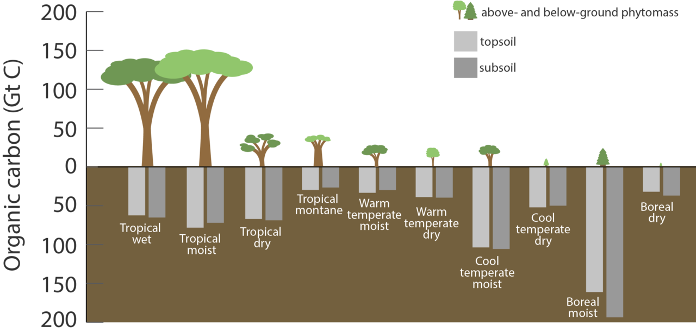

P

A

Atmospheric   carbon

Photo -  synthesis

respiration

carbon   sequestration

feeding

## Technological (fossil)  carbon   usage {#slide-222}

24.06.2026

Seite   222

fuels

chemicals

fossil  carbon

refining

Atmospheric   carbon

burning

Linear fossil  carbon   usage

Prod .

waste

\~85%

\~15%

fuels

chemicals

(fossil)  carbon

refining

stored   carbon  (CO2)

Burn &  capture

Carbon  capture  &  storage  (CCS)

Prod .

waste

- Fossil  carbons  ( coal ,  oil , gas)  are   predominately   used   as   fuels   for   transportation  (25-30%),  electricity  &  heat   generation  (30-35%) and  industrial   energy   generation  (15-20%)
- Fossil  carbon   is   used   as   building  block  for   plastics  &  polymers  (\~8%),  chemical  intermediates like  urea  (\~5-6%) and  other   products  like  detergents  (\~2-3%)
- Traditional  technological   carbon   usage   pathways  end in  atmospheric   carbon   emissions   which   need   to   be   avoided

IEA (2024): World Energy Outlook

## Technological  carbon   cycling {#slide-223}

24.06.2026

Seite   223

fuels

chemicals

biomass   carbon

refining

Atmospheric   carbon

burning

  Biomass   carbon   usage

Prod .

waste

fuels

chemicals

Atmospheric   carbon

refining

Atmospheric   carbon

burning

Synthetic   carbon

Prod .

waste

fuels

chemicals

(fossil)  carbon

refining

stored   carbon  (CO2)

burn  &  capture

Carbon  capture  &  utilization  (CCU)

Prod .

waste

plants

## Chemische Supply Chains {#slide-224}

Grundstruktur -- Status quo

Supply Chain Management

224

Rohstoffe

Res-sourcen

Basis- chemiekalien

Zwischen-produkte

Endprodukte

Kunden

Raffinerieprodukte:

Naphtha, Erdgas, Propan, Ethan, Butan,...

Nichtmetalle:

Schwefel, Chlor, Phosphor, Silicium, 

Industriegase:

Sauerstoff, Wasserstoff,\...

Olefine Ethylen, Propylen, .

Aromaten 

Benzen ,  Toluen , ...

Alkohole

Methanol, ...

Stickstoff-, Chlor- und Schwefel-verbindungen 

Ammoniak, Salzsäure, Sulfate, ...

Halogenierte Kohlenwasserstoffe

Carbonsäuren

Essigsäure, Acrylsäure, ...

Aldehyde

Düngemittel

Chemiefasern

Kunststoffe

Seifen, Wasch-/ Reinigungsmittel

Agrar-Chemikalien

Lacke & Anstriche

Polyolefine

PE, PP, Styrol, ...

Amine

Phosphate

## Chemische Wertschöpfungsketten {#slide-225}

Beispiele

Supply Chain Management

225

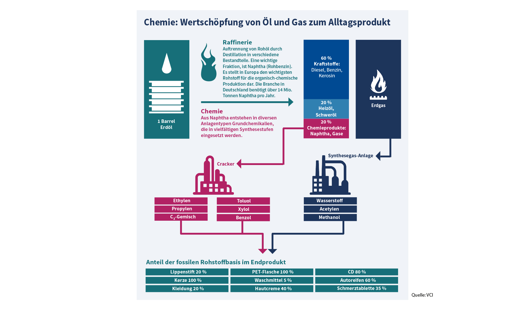

ICIS (2024)

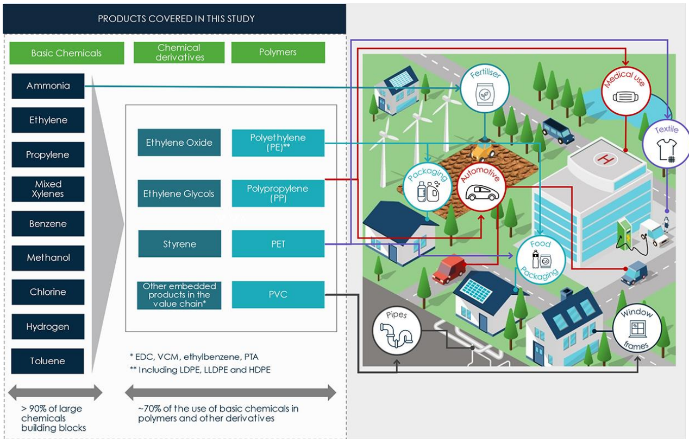

## Deutsche Chemieindustrie {#slide-226}

Überblick

24.06.2026

© Fraunhofer IMW

Seite   226

Sektorale Treibhausgasemissionen ( Scope  1)

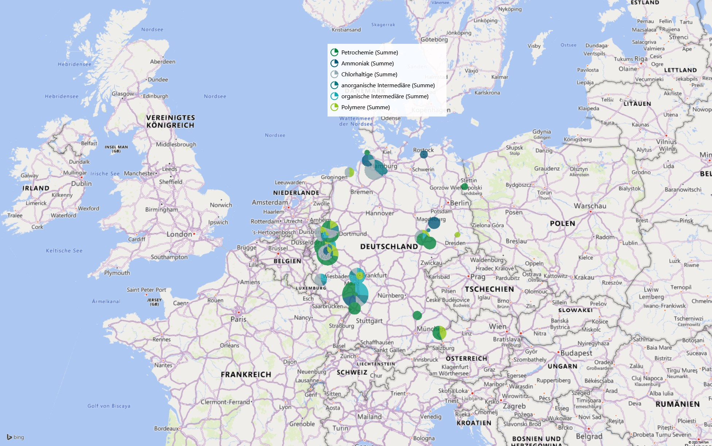

\[Graphic: other: http://schemas.openxmlformats.org/drawingml/2006/chart\]

## Deutsche Chemieindustrie {#slide-227}

- Chemieindustrie ist stark export-orientiert   ca. 60% der erzeugten Waren werden im Ausland abgesetzt
- Ca. 5% der Waren werden konsumiert,  ca. 35% dienen als Vorprodukte in anderen inländischen Industrien
- Bedeutende Kundenbranchen sind

<!-- -->

- Pharmaindustrie
- Bauwirtschaft
- Kunststoff- und Gummiwaren
- Dienstleistungsbranche
- Maschinen- und Kfz-Bau

Industrielle Verflechtung und Verwendung chemischer Erzeugnisse

24.06.2026

Supply Chain Management

Seite   227

\[Graphic: other: http://schemas.openxmlformats.org/drawingml/2006/chart\]

Ausländische 

Verwendung

Inländische 

Verwendung

Konsum

Chemie

Verwendung chemischer Erzeugnisse in Mrd. Euro (2021)

Destatis (2024)

