## Nachhaltige Chemie {#slide-228}

Defossilisierung  erfordert Umstellung der Energie- und Rohstoffbasis auf klimaneutrale Ressourcen

- Rohstoffbasis ist primär Kohlenstoff  

<!-- -->

- Biogener Kohlenstoff   Biomasse
- Atmosphärischer Kohlenstoff  CO2
- Kohlenstoff aus Technosphäre  Abfälle

<!-- -->

- Energieversorgung  Nutzung nachhaltiger Energie 

<!-- -->

- Strom
- Wärme

Transformationspfade

Supply Chain Management

228

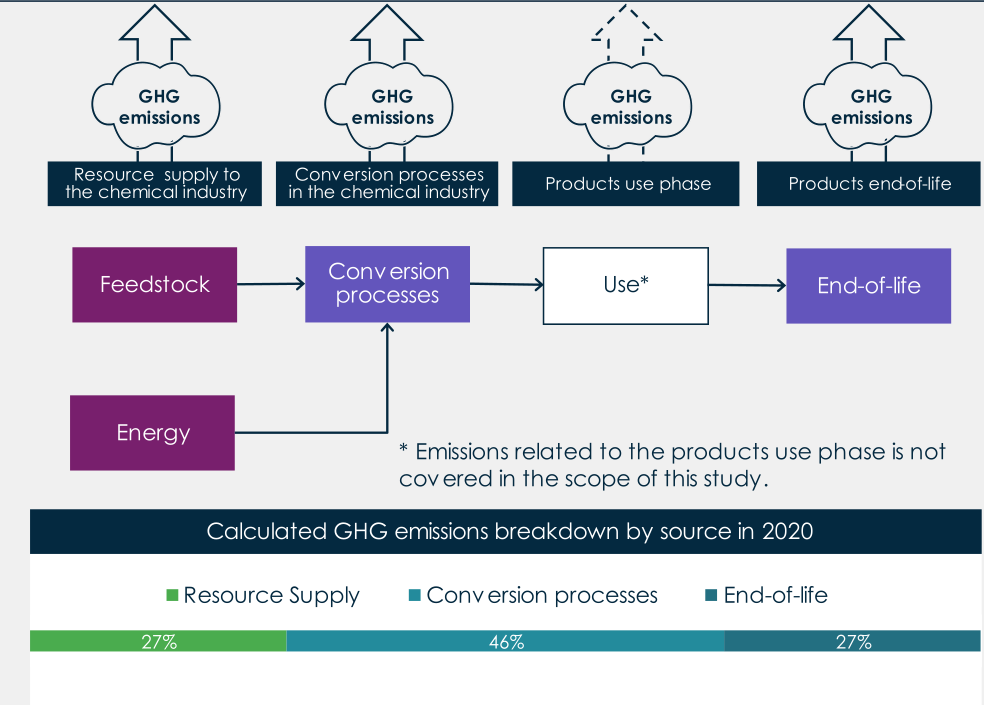

ICIS (2024)

## Nachhaltige Chemische Supply Chains (1) {#slide-229}

Recycling

Supply Chain Management

229

Rohstoffe

Res-sourcen

Basis- chemiekalien

Zwischen-produkte

Endprodukte

Kunden

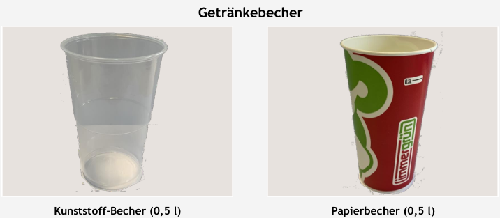

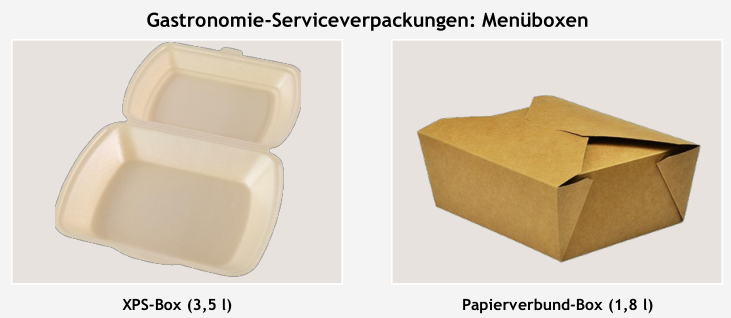

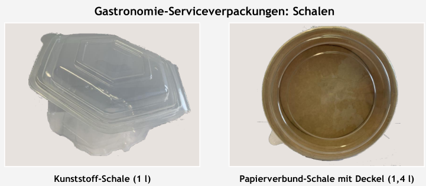

Rückgabe

Mechan . Recycling

Chemisches Recycling

Thermische Verwertung

Mehrweg-

behälter

Recyclate  

(z.B.  RePET )

Syn . Rohstoffe 

(z.B. Synthesegas)

Abgeschiedenes 

CO 2

Deponie

## Nachhaltige Chemische Supply Chains  {#slide-230}

Biomasse

Supply Chain Management

230

Rohstoffe

Res-sourcen

Basis- chemiekalien

Zwischen-produkte

Endprodukte

Kunden

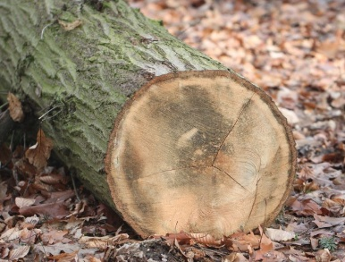

natürliche Umwandlungs-prozesse (biogenes CO 2 )

Abfallkaskade

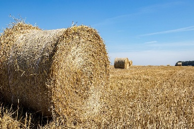

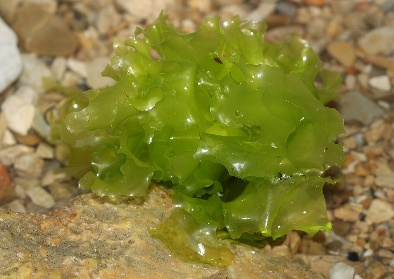

Thermische Verwertung

## Nachhaltige Chemische Supply Chains {#slide-231}

Carbon Capture  Utilization  (CCU) - Nutzung von CO 2 

Supply Chain Management

231

Rohstoffe

Res-sourcen

Basis- chemiekalien

Zwischen-produkte

Endprodukte

Kunden

natürliche Umwandlungs-prozesse

Abfallkaskade

Thermische Verwertung

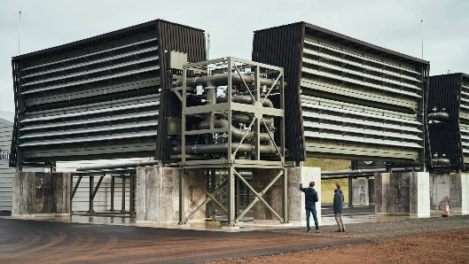

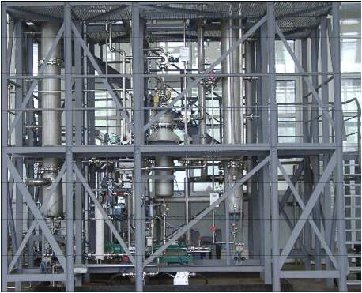

CCU

aus Industrieprozessen

CCU

aus Luft

Direct  Air Capture

## Konventionelle Pfade, Produkte und Systemgrenzen {#slide-232}

24.06.2026

© Fraunhofer

Seite   232

Naphtha

Cracking

Olefins

Aromatics

Ethane

CNG/LPG

Haber-Bosch

N 2

Ammoniak

Urea

Urea 

synthesis

H 2

Steam  reforming

CO/CO 2

Sulfuric acid

Sulfur

Sulfur dioxide

Sulfuric acid synthesis

Sodium chloride solution

Electrolysis

Chlorine

Caustic  Soda

Methanol

Synthesis gas

Acetic   acid

Methanol 

synthesis

Acetic   acid   synthesis  

Poly- merisation

Polyolefins

Raffination

PET/PS/ rubber

Fibres

Rohstoffe

Zwischenprodukte

Endprodukte

## Alternative Technologiepfade {#slide-233}

Erneuerbare Kohlenstoffquellen -- Biomasse & DAC

24.06.2026

© Fraunhofer

Seite   233

Berücksichtigung von Abfallströmen über komplette Abfallhierarchie

Rohstoffe

Zwischenprodukte

Endprodukte

Polyolefins

PET/PS/ rubber

Pyrolysis  oil

Plastic   waste  (grade 1)

Pyrolysis

Cracking

Olefins

Aromatics

Mechanical   recycling

Plastic   waste  (grade 2)

MVA

Plastic   waste  (grade 3)

Heat

Power

CO 2

CCU/S

...

## Alternative Technologiepfade {#slide-234}

Erneuerbare Kohlenstoffquellen -- Biomasse & DAC

24.06.2026

© Fraunhofer

Seite   234

H 2

Electricity

CO 2

Electrolysis

Haber-Bosch

H 2 O

Ammonia

Urea

Urea  

synthesis

DAC

Methanol

Synthesis gas

Biomass

Gasification

MTO

Methanol-synthesis

MTA

Olefins

Aromatics

Hydrolysis & Fermentation

Ethanol

Dehydrogenation

Ethylene

Acetic   acid

Polyolefins

PET/PS/ rubber

Fibres

Kohlenstoffversorgung erfolgt über Biomasse, Luftabscheidung, CCU und Abfallrecycling

Rohstoffe

Zwischenprodukte

Endprodukte

CCU

## Transformation der Chemie {#slide-235}

Grundidee

Supply Chain Management

235

Umwelt- / Marktparameter

Szenarienevaluierung

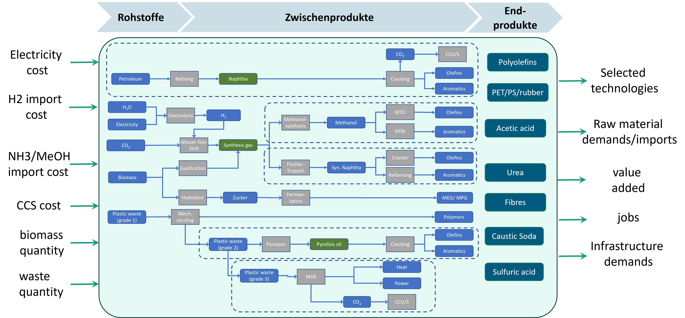

## Study design {#slide-236}

Methodological   procedure

24.06.2026

© Fraunhofer

Seite   236

LCA  data  

  energy  & material  flows

Fixed  data   inputs

Final  product   demands

Demand in  Mt  /  year

Ressource  availability

Waste

Biomass

Imports

CCS

Ressource  prices

electricity

biomass

imports

Variable  data   inputs

Scenarios

Ressources

Prices

Technologies

Optimization

- Ressource  usage
- Technology  capacities
- Energy  demand
- Material  demand
- Costs

Technological  results

Impact  assessment

- Direct  and  induced   employment
- Value  added
- Cost   distribution
- Sensitivities

Socio-economic   results

## Optimization of Chemical Production Networks {#slide-237}

Mixed-integer  optimization   model

24.06.2026

© Fraunhofer

Seite   237

Reduction targets

Technology availability

Ressource  capacities

costs

Technology 

selection

Feedstock 

demands

Final product demand

Limitations

\*

Optimization model

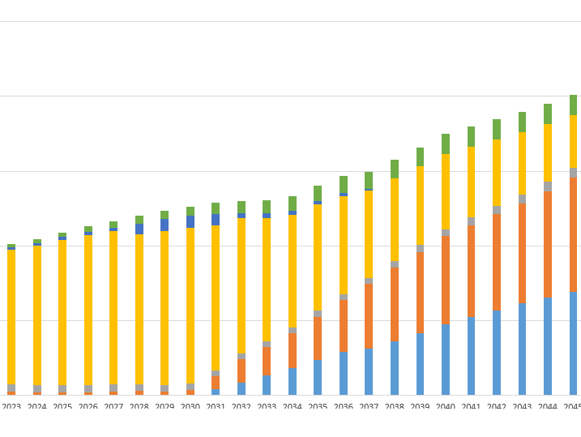

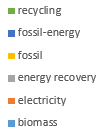

Feedstock demands

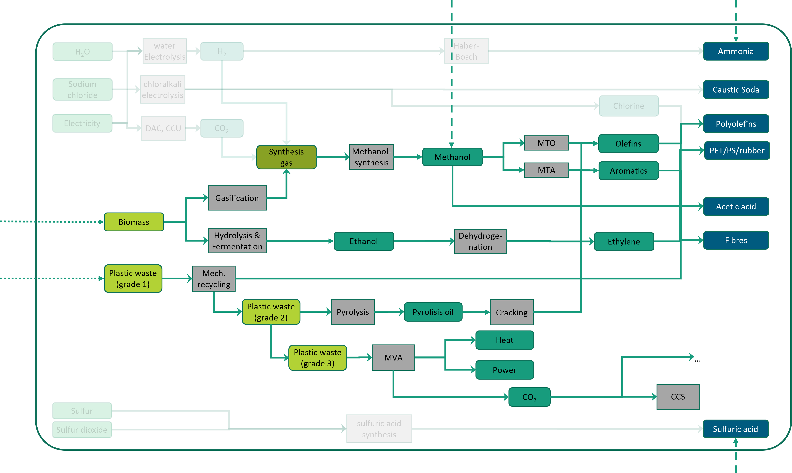

Technology selection

## Optimization of Chemical Production Networks {#slide-238}

Potential  technology   portfolio  --  domestic  intermediate  production

24.06.2026

© Fraunhofer

Seite   238

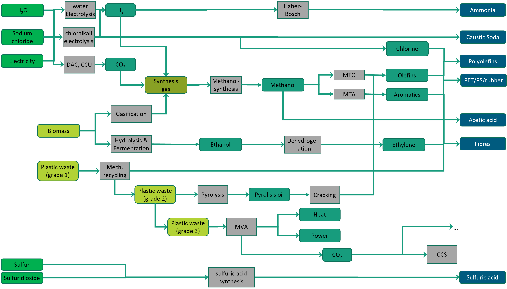

## Optimization of Chemical Production Networks {#slide-239}

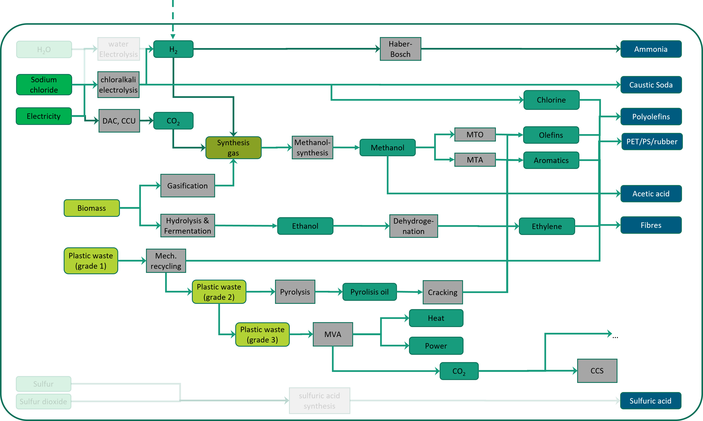

Potential  technology   portfolio  -- hydrogen  import

24.06.2026

© Fraunhofer

Seite   239

## Optimization of Chemical Production Networks {#slide-240}

Potential  technology   portfolio  -- hydrogen derivative  imports

24.06.2026

© Fraunhofer

Seite   240

## Optimization of Chemical Production Networks {#slide-241}

Potential  technology   portfolio  --  basic   chemical   imports

24.06.2026

© Fraunhofer

Seite   241

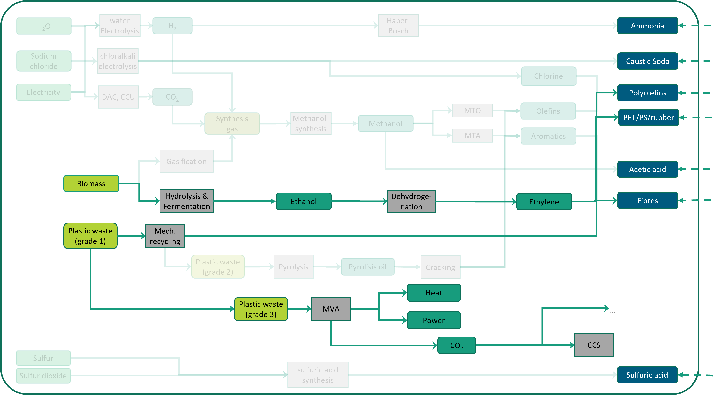

## Socio-economic  Analysis {#slide-242}

24.06.2026

© Fraunhofer

Seite   242

Objective:  Determine value-added and employment effects of economic activity

Gross   production   value

Intermediate  consumption

De- preciation

Wages  /  Salaries

Prrofit

Taxes

Interest

( net )  value   added

Gross   production   value

Direct   Effect

Gross   production   value

Indirect   effect

Induced   effects

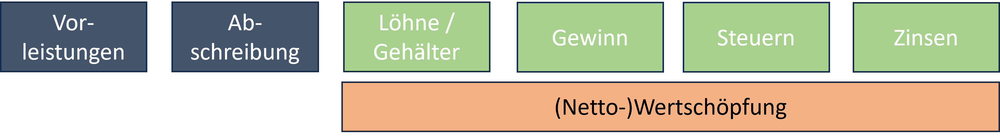

( gross )

Basic idea

## Socio-economic  Analysis {#slide-243}

Estimation of direct employment effects in chemical industry

24.06.2026

© Fraunhofer

Seite   243

Capacities

Total  job   count  (FTEs)

current

Chemical  processes

Public  statistics

Corporate 

statistics

zukünftige 

Struktur der Chemie

Capacities

Optimization

results

New  processes   ( MtO ,  MtA , etc.)

Est.  processes  

(Haber-Bosch,  electrolysis , etc.)

estimate   labor   intensities  in FTE per ton

Labor  intensities   of   similar   technologies

capacities

Optimization  

results

Production   quantities

## Transformation  scenarios {#slide-244}

Idea

24.06.2026

© Fraunhofer

Seite   244

Überblick

::: {.smartart .chevron1 data-smartart-layout="chevron1"}
:::

Basis: Focus on biomass & circular economy

Depth of added value / total job count

Mix: Fossil  feedstocks  & CCS

Hydrogen:  few   biomass

Import 1: Possibility of green hydrogen imports

Import 2: Possibility of importing hydrogen + derivatives

Import 3: Possibility of importing hydrogen + derivatives + HVCs

## Transformation  scenarios {#slide-245}

Parameters

24.06.2026

© Fraunhofer

Seite   245

  Szenarien  ( Werte für 2045)   Basis                Mix                   Hydrogen       Import 1                   Import 2                              Import 3
  ------------------------------ -------------------- --------------------- -------------- -------------------------- ------------------------------------- ----------------------------------------------
  Fokus                          Circular   economy   fossile  feedstocks   CCU            Carbon  self-sufficiency   intermediate  imports                 Free trade
  Fossil  feedstocks             Not  allowed         Allowed               Not  allowed   Not  allowed               Not  allowed                          Not  allowed
  CCS --  capacity               Moderate             High                  moderate       moderate                   moderate                              moderate
  Biomass   capacity             high                 high                  niedrig        high                       high                                  High
  Allowed   imports              none                 none                  none           hydrogen                   hydrogen ammonia   methanol ethanol   hydrogen ammonia   methanol   ethanol   HVCs

## Overview of the status quo and supply scenarios in 2045 {#slide-246}

\[Graphic: other: http://schemas.openxmlformats.org/drawingml/2006/chart\]

Operating and  investment   costs

24.06.2026

© Fraunhofer

Seite   246

16,4 Mrd. €

Avg. OPEX per  tonne  of chemical product

1433 €/t

2023   €/t

1987 €/t

1771 €/t

1685 €/t

2821 €/t

## Key findings of the study {#slide-247}

Many roads lead to Rome

24.06.2026

© Fraunhofer

Seite   247

\[Graphic: other: http://schemas.openxmlformats.org/drawingml/2006/chart\]

\[Graphic: other: http://schemas.openxmlformats.org/drawingml/2006/chart\]

\[Graphic: other: http://schemas.openxmlformats.org/drawingml/2006/chart\]

## Key findings of the study {#slide-248}

\[Graphic: other: http://schemas.openxmlformats.org/drawingml/2006/chart\]

Socio-economic   interactions

24.06.2026

© Fraunhofer

Seite   248

Status quo      job   count  2020

  operating   cost  2020

\[Graphic: other: http://schemas.openxmlformats.org/drawingml/2006/chart\]

## Key findings of the study {#slide-249}

CCS is always part of the solution

24.06.2026

© Fraunhofer

Seite   249

\[Graphic: other: http://schemas.openxmlformats.org/drawingml/2006/chart\]

\[Graphic: other: http://schemas.openxmlformats.org/drawingml/2006/chart\]

## Key findings of the study {#slide-250}

\[Graphic: other: http://schemas.openxmlformats.org/drawingml/2006/chart\]

Circular   economy   boosts   employment

24.06.2026

© Fraunhofer

Seite   250

Status quo employment in 2020

\[Graphic: other: http://schemas.openxmlformats.org/drawingml/2006/chart\]

## Key findings of the study {#slide-251}

Technology and import mix are mutually dependent

24.06.2026

© Fraunhofer

Seite   251

\[Graphic: other: http://schemas.openxmlformats.org/drawingml/2006/chart\]

\[Graphic: other: http://schemas.openxmlformats.org/drawingml/2006/chart\]

\[Graphic: other: http://schemas.openxmlformats.org/drawingml/2006/chart\]

