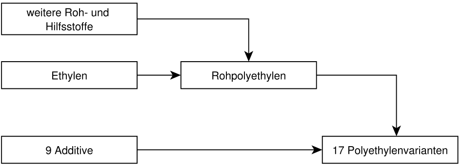
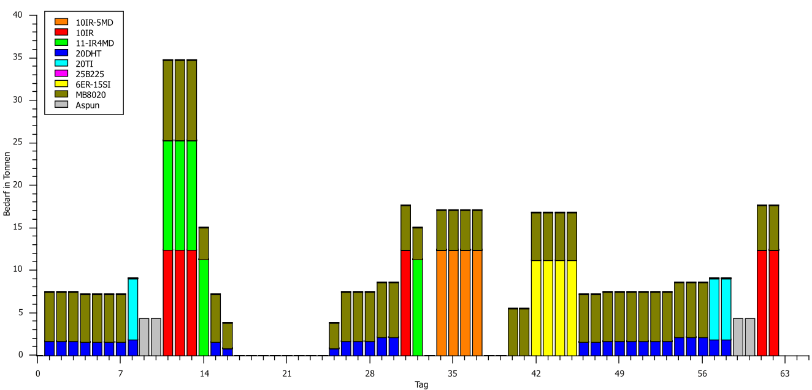
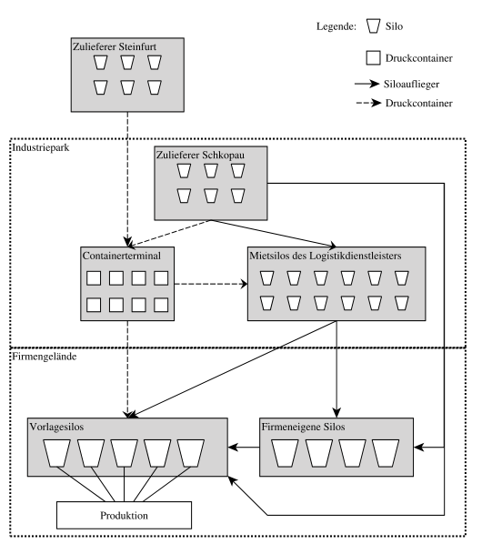
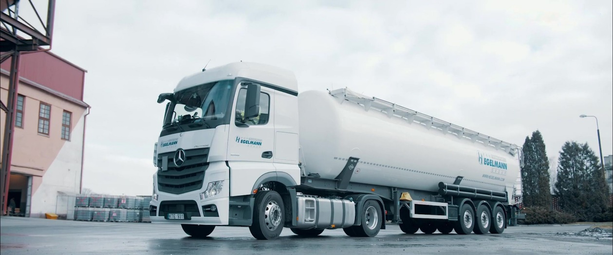
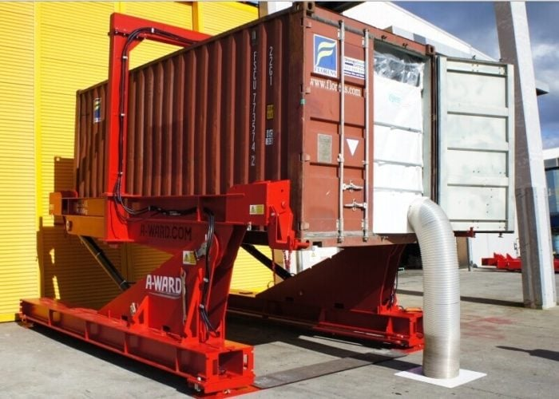
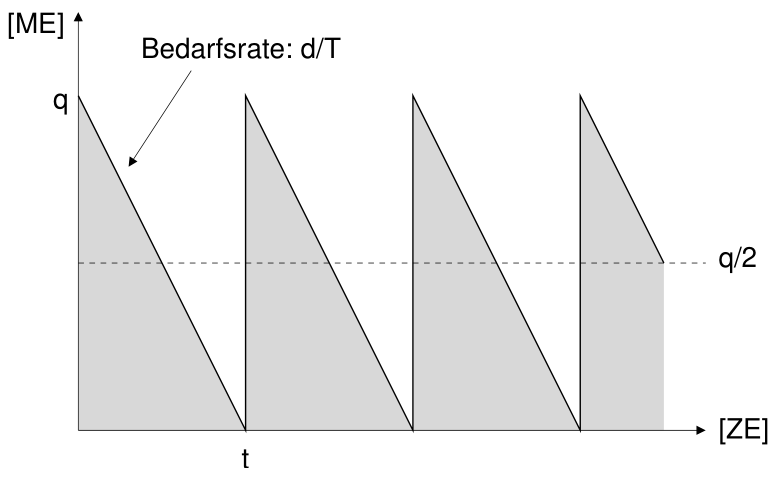
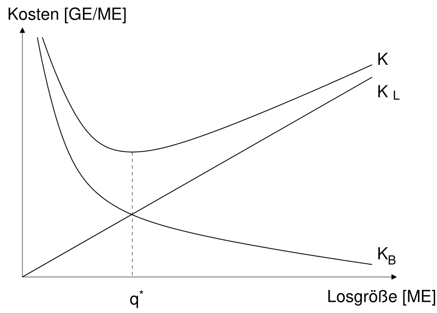
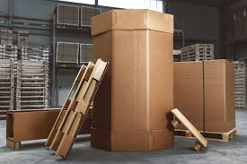
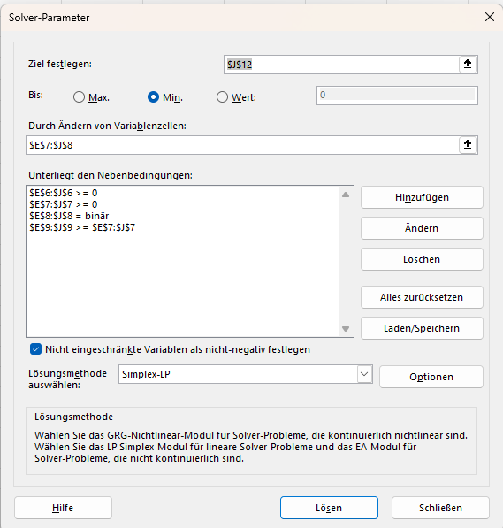
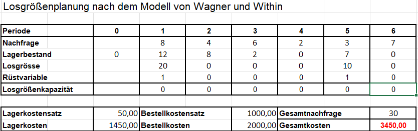

## Koordination in Supply Chains {#slide-252}

- Losgrößenplanung
- Joint  Economic   Lotsizing  Problem (JELSP)
- Contracting

Beschaffung

252

## Kooperationsformen {#slide-253}

24.06.2026

Supply Chain Management

253

Markt

Hierarchie

Hierarchie

Markt

Netzwerke

Verträge

Tausch

Langfrist-

Verträge

Lizensierung

Profit 

centers

Abteilungen

Joint

ventures

## Losbildung {#slide-254}

Bei der Beschaffung von Rohstoffen und Vorprodukten bzw. der Produktion von Fertigerzeugnissen muss entschieden werden, wieviel bestellt bzw. produziert wird

- Im einfachsten Fall wird der benötigte Bedarf unmittelbar vor dem Verbrauchszeitpunkt bereitgestellt und entsprechend kurzfristig vor bestellt oder gefertigt   minimiert Lagerbestand und damit Lagerhaltungskosten
- Dies führt jedoch in vielen Fällen zu kleinen Bestellmengen bzw. Fertigungslosen   hohe Bestellkosten (pro Stück) bzw. Rüstkosten (pro Stück) z.B. durch

<!-- -->

- Unterausgelastete Transportmittel

Vorbereitungsaufwand für Fertigungsequipment

Verwaltungskosten

...

-  Optimierung der gesamten Bereitstellungskosten bestehend aus Lagerhaltungs- und Bestell-/Rüstkosten   Losgrößenplanung

Problemstellung

Supply Chain Management

254

## Losgrößenplanung {#slide-255}

  Dimension                    Ausprägungen
  ---------------------------- --------------------------------------------
  Planungshorizont             Endlich                          Unendlich
  Zeitliche Entwicklung        Statisch                       Dynamisch
  Bestimmtheit                 Deterministisch        Stochastisch
  Anzahl der Produkte                                             Mehrere
  Produktionsgeschwindigkeit   Endlich                          Unendlich
  Kapazität                    Kapazitiert                 Unkapazitiert
  Wertschöpfungsstufen                                          Mehrere
  ...                          ...

Losgrößenprobleme treten in großer Vielfalt in wirtschaftlichen Entscheidungsprozessen auf

wenn Effizienzgewinne durch die Bündelung von Stoffströmen generiert werden können, entstehen oft Losgrößenprobleme

- Abwägung zwischen Vorbereitung (Bündelung) und Flexibilität (minimale Losgröße)
- Z.T. sehr komplexe Modellstrukturen können entstehen  mehrstufige Losgrößen

Entscheidungs- und Parameterraum

Supply Chain Management

255

## Losgrößenplanung {#slide-256}

  Problemstellung
  -----------------------------------------------------------------------------------------------------------------------------------------------------------------------------------------------------------------------------------------------------------------------------------------------------------------------------------------------------------------------------------------------------------------------------------------------------------------------------------------------------------------------
  Ein Kunststoffverarbeiter produziert verschiedene Arten von PE-Folien. Dabei wird Polyethylene (PE) polymerisiert und das PE-Granulat mit verschiedenen granulierten Zuschlagstoffen (Additive) gemischt und das Gemisch im folgenden extrudiert. Jede Art von PE-Folie hat ein eigenes „Rezept", dass die Art und Menge der Additive vorgibt. Die Produktion der PE-Folien erfolgt in Kampagnenfahrweise. Der Gesamtbedarf eines Additives in einer Periode ergibt sich damit aus dem geplanten Produktionsprogramm.

Fallstudie Chemie-Supply-Chain

Supply Chain Management

256

Produktionssystem

Additivnachfrage

## Losgrößenplanung {#slide-257}

Fallstudie Chemie-Supply-Chain

Supply Chain Management

257

Druckcontainer / dry  bullk   container

Siloauflieger

## Statische Losgrößenplanung {#slide-258}

Fallstudie Chemie-Supply-Chain -- Problemstellung

Supply Chain Management

258

Bestimmen Sie die Losgröße mit der das Vorprodukt hergestellt werden soll. Ziel ist die Minimierung der Lagerhaltungs- und Lieferkosten

Wie groß ist die Reichweite des Loses? Wie häufig muss bestellt werden?

Wie hoch sind die monatlichen Gesamtkosten? Welcher Anteil entfällt auf Liefer- und Lagerhaltungskosten? Wie hoch sind die Logistikstückkosten?

  Problemstellung
  -------------------------------------------------------------------------------------------------------------------------------------------------------------------------------------------------------------------------------------------------------------------------------------------------------------------------------------------------------------------------------------------------------------------------------------------------------
  Das Additiv MB8020 wird in den meisten Produkten beigemischt. Der tägliche Bedarf des Additives beträgt ca. 4 Tonnen (30 Tage pro Monat). Es wird vom Zulieferer aus Steinfurt bezogen per  Siloauflieger  bezogen und in der örtlichen  Silofarm  eingelagert. Die Lagerhaltungskosten betragen 200 € pro Tonne und Monat. Für jede Lieferung (unabhängig von der Bestellmenge) berechnet der Logistikdienstleister Transportkosten  i.H.v . 3000 €.

## Statische Losgrößenplanung {#slide-259}

Ziel: Minimierung der entscheidungsabhängigen Kosten

Entscheidungsvariable: Losgröße

Abhängige Variablen: Reichweite, Lagerbestand, Bestellhäufigkeit

Weitere Annahmen:

Lagerhaltungskosten proportional zu Lagermenge und -- dauer

Bestellkosten proportional zu Anzahl der Bestellungen

Keine initialen/finalen Bestände

Lagerzugangsgeschwindigkeit unendlich 

Bedarfsrate endlich

Losgrößenmodell nach Harris &  Andler

Supply Chain Management

259

  Dimension                 Ausprägungen
  ------------------------- -----------------
  Planungshorizont          Unendlich
  Zeitliche Entwicklung     Statisch
  Bestimmtheit              Deterministisch
  Anzahl der Produkte       1
  Zugangs-geschwindigkeit   Unendlich
  Kapazität                 Unkapazitiert
  Wertschöpfungsstufen      1

## Statische Losgrößenplanung {#slide-260}

Losgrößenmodell nach Harris &  Andler

Supply Chain Management

260

Eingangsdaten / Parameter

Variablen

## Statische Losgrößenplanung {#slide-261}

Statisches Losgrößenmodell nach Harris &  Andler

Supply Chain Management

261

## Statische Losgrößenplanung {#slide-262}

Statisches Losgrößenmodell nach Harris &  Andler

Supply Chain Management

262

![\\PassOptionsToPackage{svgnames}{xcolor}
\\documentclass{article}
\\usepackage{amsmath}
\\usepackage{amsfonts} 
\\usepackage{amssymb}
\\usepackage{amsthm}
\\usepackage{nicefrac}
\\usepackage{booktabs}
\\usepackage{multirow}
\\usepackage{geometry} 
\\usepackage{eurosym} 
\\geometry{lmargin = 4cm, rmargin = 4cm}
\\usepackage{tabularx}
\\usepackage{tcolorbox}

\\graphicspath{{\"C:/Users/ThomasK/ownCloud/PL/1920/Latex/\"}}

\\pagestyle{empty}
%\\tcbuselibrary{skins}
%\\usetikzlibrary{shadings,shadows}
\\definecolor{basic}{RGB}{0,65,49}

 \\newcolumntype{Y}{\>{\\centering\\arraybackslash}X}
\\newcommand{\\Rre}{\\mathbb{R}}

\\newenvironment{block}\[1\]{%
  \\tcolorbox\[boxsep=1pt,left=2pt,right=2pt,top=4pt,bottom=4pt, noparskip,colframe=basic, fonttitle=\\bfseries,  title=#1\]}%
  {\\endtcolorbox}

\\setlength{\\parindent}{0pt}

\\begin{document}
Objective function
\$\$ \\min \\rightarrow 
K(q)  = \\underbrace{\\frac{d}{q}\\cdot c_B}\_{K_B} 
+ \\underbrace{\\frac{1}{2} \\cdot q \\cdot c_L}\_{K_L}\$\$
\\end{document}](../images/image284.png "Grafik 18")

![\\PassOptionsToPackage{svgnames}{xcolor}
\\documentclass{article}
\\usepackage{amsmath}
\\usepackage{amsfonts} 
\\usepackage{amssymb}
\\usepackage{amsthm}
\\usepackage{nicefrac}
\\usepackage{booktabs}
\\usepackage{multirow}
\\usepackage{geometry} 
\\usepackage{eurosym} 
\\geometry{lmargin = 4cm, rmargin = 4cm}
\\usepackage{tabularx}
\\usepackage{tcolorbox}

\\graphicspath{{\"C:/Users/ThomasK/ownCloud/PL/1920/Latex/\"}}

\\pagestyle{empty}
%\\tcbuselibrary{skins}
%\\usetikzlibrary{shadings,shadows}
\\definecolor{basic}{RGB}{0,65,49}

 \\newcolumntype{Y}{\>{\\centering\\arraybackslash}X}
\\newcommand{\\Rre}{\\mathbb{R}}

\\newenvironment{block}\[1\]{%
  \\tcolorbox\[boxsep=1pt,left=2pt,right=2pt,top=4pt,bottom=4pt, noparskip,colframe=basic, fonttitle=\\bfseries,  title=#1\]}%
  {\\endtcolorbox}

\\setlength{\\parindent}{0pt}

\\begin{document}
Lösung: Erste Ableitung von \$K(q)\$
\\begin{eqnarray\*}
K\^\\prime(q) &=& - \\frac{d}{q\^2}\\cdot c_B + \\frac{c_L}{2} \\stackrel{!}= 0
\\\\\[1ex\]
\\Rightarrow\\qquad  q\^2 &=& \\frac{2\\cdot d\\cdot c_B}{c_L}\\\\\[3ex\]
\\Rightarrow\\qquad  q\^\\ast &=& \\sqrt{\\frac{2\\cdot d\\cdot c_B}{c_L}}
\\;\\qquad\\quad
\\mbox{\~\~\~(optimale Losgröße)}
\\\\\[1ex\]
  K(q\^\\ast) &=& \\sqrt{2\\cdot d\\cdot c_B\\cdot c_L}\\qquad
\\mbox{(Minimale Gesamtkosten)}
\\\\
\\end{eqnarray\*}\\end{document}](../images/image285.png "Grafik 2")

## Statische Losgrößenplanung {#slide-263}

Fallstudie Chemie-Supply-Chain -- Lösung

Supply Chain Management

263

![\\PassOptionsToPackage{svgnames}{xcolor}
\\documentclass{article}
\\usepackage{amsmath}
\\usepackage{amsfonts} 
\\usepackage{amssymb}
\\usepackage{amsthm}
\\usepackage{nicefrac}
\\usepackage{booktabs}
\\usepackage{multirow}
\\usepackage{geometry} 
\\usepackage{eurosym} 
\\geometry{lmargin = 4cm, rmargin = 4cm}
\\usepackage{tabularx}
\\usepackage{tcolorbox}

\\graphicspath{{\"C:/Users/ThomasK/ownCloud/PL/1920/Latex/\"}}

\\pagestyle{empty}
%\\tcbuselibrary{skins}
%\\usetikzlibrary{shadings,shadows}
\\definecolor{basic}{RGB}{0,65,49}

 \\newcolumntype{Y}{\>{\\centering\\arraybackslash}X}
\\newcommand{\\Rre}{\\mathbb{R}}

\\newenvironment{block}\[1\]{%
  \\tcolorbox\[boxsep=1pt,left=2pt,right=2pt,top=4pt,bottom=4pt, noparskip,colframe=basic, fonttitle=\\bfseries,  title=#1\]}%
  {\\endtcolorbox}

\\setlength{\\parindent}{0pt}

\\begin{document}
\\begin{eqnarray\*}
d &=& 120\\;\\mbox{ t / Monat}  \\\\
c_B&=& 3000\\qquad\\;\\mbox{(Bestellkosten)}\\\\
c_L&=& 200\\qquad\\mbox{(Lagerhaltungskostensatz)}
\\end{eqnarray\*}
(a)\~durch Einsetzen folgt:
\\begin{eqnarray\*}
q\^\\ast&=& \\sqrt{\\frac{2\\cdot 120 \\cdot 3000}{200}}=60 \\;\\mbox{\[Tonnen\]}
\\end{eqnarray\*}
(b)\~Die Reichweite eines Loses beträgt
\\begin{eqnarray\*}
\\frac{q\^\*}{d}&=& \\frac{60}{4}=15\\;\\mbox{\[Tage\] oder}\\; 0.5\\;\\mbox{\[Monate\]}
\\end{eqnarray\*}
(c)\~Die Gesamtkosten der Versorgung und Logistikstückkosten:
\\begin{eqnarray\*}
K(q\^\\ast= 60)&=& 12000 \\;\\mbox{\[\\euro{} pro Monat\]}\\\\\[.3ex\]
K_L(q\^\\ast=60) = K_B(q\^\\ast=60)&=& 6000\\;\\mbox{\[\\euro{} pro Monat\]}\\\\\[.3ex\]
\\frac{K(q\^\\ast)}{d}= \\frac{12000}{120}&=&  100\\;\\mbox{\[\\euro{} pro Tonne\]}
\\end{eqnarray\*}
\\end{document}](../images/image286.png "Grafik 23")

## Statische Losgrößenplanung {#slide-264}

Im Kostenminimum sind Lagerhaltungs- und Bestellkosten gleich!

Kostenfunktion(en)

Supply Chain Management

264

## Statische Losgrößenplanung mit Gebinden {#slide-265}

Fallstudie Chemie-Supply-Chain -- Problemstellung

Supply Chain Management

265

  Problemstellung
  ----------------------------------------------------------------------------------------------------------------------------------------------------------------------------------------------------------------------------------------------------------------------------------------------------------------------------------------------------------------------------------------------------------------------------------------------------------------------------------------------------------------------------------------------------------------------------------------------------------------------------------------------------------------------------------------------------------------
  Ihr Lieferant in Schkopau bietet Ihnen an in Zukunft auch das Additiv MB8020 liefern zu können. Aufgrund der Nähe kann der Lieferant das Additiv in  Oktabins  (s.u.) mit einem Fassungsvermögen von 2 Tonnen anliefern. Der Verkaufspreis beträgt 1.050 € pro Tonne Additiv. Die fixen Bestellkosten 1000 €.  Der bisherige Lieferant aus Steinfurt verkauft das Additiv zu 1.000 € pro Tonne. Die  Siloauflieger  haben eine Kapazität von 25 Tonnen.  Aus logistischen Gründen kann das Additiv bei beiden Lieferanten nur in vollständigen Gebinde (entweder  Oktabins  oder  Siloauflieger ) gekauft werden. Der Lagerhaltungskostensatz pro Tonne und Monat wird mit 20% des Verkaufspreises angenommen.

Bei welchem Lieferanten sollte das Additiv bestellt werden?

Wie groß sind die Logistikkosten in Relation zu den gesamten Beschaffungskosten?

## Statische Losgrößenplanung mit Gebinden {#slide-266}

Fallstudie Chemie-Supply-Chain -- Lösung

Supply Chain Management

266

## Dynamische Losgrößenplanung {#slide-267}

Fallstudie Chemie-Supply-Chain -- Problemstellung

Supply Chain Management

267

  Problemstellung
  -------------------------------------------------------------------------------------------------------------------------------------------------------------------------------------------------------------------------------------------------------------------------------------------------------------------------------------------------------------------------------------------------------------------------------------------------------------------------------------------------------------------------------------
  Der Bedarf für das Additiv  Aspun  schwankt stark von Woche zu Woche, da es nur in wenigen  Produktten  verwendet wird. Es wird vom Lieferanten in Schkopau bezogen. Die Nachfrage nach  Aspun  in den folgenden Wochen ist in folgender Tabelle dargestellt: Jede Bestellung verursacht Kosten von 1000 € und der Lagerhaltungskostensatz liegt bei 50 €/Tonne und Woche. Es gibt keine Beschaffungs- oder Lagerrestriktionen. Der Bedarf an  Aspun  muss in jeder Woche vollständig vorrätig sein, Fehlmengen sind nicht erlaubt.

  Woche          1   2   3   4   5   6
  -------------- --- --- --- --- --- ---
  Bedarf \[t\]   8   4   6   2   3   7

Bestimmen Sie wann und wieviel  Aspun  bestellt werden sollte um die Logistikkosten zu minimieren 

## Dynamische Losgrößenplanung {#slide-268}

Wagner- Whitin -Modell -- Annahmen & Notation

Supply Chain Management

268

  Dimension                 Ausprägungen
  ------------------------- -----------------
  Planungshorizont          Endlich
  Zeitliche Entwicklung     Dynamisch
  Bestimmtheit              Deterministisch
  Anzahl der Produkte       1
  Zugangs-geschwindigkeit   Unendlich
  Kapazität                 Unkapazitiert
  Wertschöpfungsstufen      1

Eingangsdaten / Parameter

Variablen

## Dynamische Losgrößenplanung {#slide-269}

Wagner- Whitin -Modell -- MILP-Formulierung - generisch

Supply Chain Management

269

![\\PassOptionsToPackage{svgnames}{xcolor}
\\documentclass{article}
\\usepackage{amsmath}
\\usepackage{amsfonts} 
\\usepackage{amssymb}
\\usepackage{amsthm}
\\usepackage{nicefrac}
\\usepackage{booktabs}
\\usepackage{multirow}
\\usepackage{geometry} 
\\usepackage{eurosym} 
\\geometry{lmargin = 4cm, rmargin = 19cm}
\\usepackage{tabularx}
\\usepackage{tcolorbox}

\\graphicspath{{\"C:/Users/ThomasK/ownCloud/PL/1920/Latex/\"}}

\\pagestyle{empty}
%\\tcbuselibrary{skins}
%\\usetikzlibrary{shadings,shadows}
\\definecolor{basic}{RGB}{0,65,49}

 \\newcolumntype{Y}{\>{\\centering\\arraybackslash}X}
\\newcommand{\\Rre}{\\mathbb{R}}

\\newenvironment{block}\[1\]{%
  \\tcolorbox\[boxsep=1pt,left=2pt,right=2pt,top=4pt,bottom=4pt, noparskip,colframe=basic, fonttitle=\\bfseries,  title=#1\]}%
  {\\endtcolorbox}

\\setlength{\\parindent}{0pt}

\\begin{document}
\\begin{align\*}
\\multicolumn{3}{l}{\\mbox{Zielfunktion:}}\\\\
\\min\\rightarrow C&= \\sum\_{t=1}\^T (c_B\\cdot y_t + c_L\\cdot l_t) &\\\\
\\multicolumn{5}{l}{\\mbox{Lagerbilanzgleichung:}}\\\\
\\qquad\\qquad\\qquad\\qquad\\qquad\\qquad l_t &=  l\_{t-1} + q_t - d_t & \\forall t=1,\\ldots T\\\\
\\multicolumn{3}{l}{\\mbox{Lageranfangs- /Lagernendbedingungen:}}\\\\
\\qquad l_0 &= 0 &\\\\
\\qquad l_T &= 0 &\\\\
\\multicolumn{3}{l}{\\mbox{Bestellrestriktion:}}\\\\
\\qquad q_t &\\leq  M\\cdot y_t & \\forall t=1,\\ldots T \\quad (\\mbox{with } M\\geq\\sum\_{t=1}\^T d_t)\\\\
\\multicolumn{3}{l}{\\mbox{Nicht-Negativitätsbedingunggen:}}\\\\
\\qquad l_t,q_t&\\ge 0  &\\forall t=1,\\ldots T\\\\
\\multicolumn{3}{l}{\\mbox{Ganzzahligkeitsbedingungen:}}\\\\
\\qquad y_t&\\in \\{0,1\\} & \\forall t=1,\\ldots T\\\\
\\end{align\*}
\\end{document}](../images/image289.png "Grafik 2")

## Dynamische Losgrößenplanung {#slide-270}

Wagner- Whitin -Modell -- MILP-Formulierung - extensiv

Supply Chain Management

270

![\\PassOptionsToPackage{svgnames}{xcolor}
\\documentclass{article}
\\usepackage{amsmath}
\\usepackage{amsfonts} 
\\usepackage{amssymb}
\\usepackage{amsthm}
\\usepackage{nicefrac}
\\usepackage{booktabs}
\\usepackage{multirow}
\\usepackage{geometry} 
\\usepackage{eurosym} 
\\geometry{lmargin = 4cm, rmargin = 4cm}
\\usepackage{tabularx}
\\usepackage{tcolorbox}

\\graphicspath{{\"C:/Users/ThomasK/ownCloud/PL/1920/Latex/\"}}

\\pagestyle{empty}
%\\tcbuselibrary{skins}
%\\usetikzlibrary{shadings,shadows}
\\definecolor{basic}{RGB}{0,65,49}

 \\newcolumntype{Y}{\>{\\centering\\arraybackslash}X}
\\newcommand{\\Rre}{\\mathbb{R}}

\\newenvironment{block}\[1\]{%
  \\tcolorbox\[boxsep=1pt,left=2pt,right=2pt,top=4pt,bottom=4pt, noparskip,colframe=basic, fonttitle=\\bfseries,  title=#1\]}%
  {\\endtcolorbox}

\\setlength{\\parindent}{0pt}

\\begin{document}
\\begin{eqnarray\*}
\\min\\rightarrow C &=&\\sum\_{t=1}\^6 (1000\\cdot y_t + 50\\cdot l_t)\\\\
l_0 + q_1 - l_1 &=& 8\\\\\[-0.5ex\]
l_1 + q_2 - l_2 &=& 4\\\\\[-0.5ex\]
l_2 + q_3 - l_3 &=& 6\\\\\[-0.5ex\]
l_3 + q_4 - l_4 &=& 2\\\\\[-0.5ex\]
l_4 + q_5 - l_5 &=& 3\\\\\[-0.5ex\]
l_5 + q_6 - l_6 &=& 7\\\\
l_0 = l_6 &=& 0\\\\
q_1 - 30\\cdot y_1 &\\leq& 0\\\\\[-0.5ex\]
q_2 - 30\\cdot y_2 &\\leq& 0\\\\\[-0.5ex\]
q_3 - 30\\cdot y_3 &\\leq& 0\\\\\[-0.5ex\]
q_4 - 30\\cdot y_4 &\\leq& 0\\\\\[-0.5ex\]
q_5 - 30\\cdot y_5 &\\leq& 0\\\\\[-0.5ex\]
q_6 - 30\\cdot y_6 &\\leq& 0\\\\
q_1, q_2, q_3, q_4, q_5, q_6 &\\geq& 0\\\\
y_1, y_2, y_3, y_4, y_5, y_6 &\\in& \\{0,1\\}
\\end{eqnarray\*}\\end{document}](../images/image290.png "Grafik 9")

                         1      2     3     4   5      6   Sum
  ---------------------- ------ ----- ----- --- ------ --- ------
  Losgröße               20     0     0     0   10     0   
  Lagerbestand           12     8     2     0   7      0   
  Lagerhaltungs-kosten   600    400   100   0   350    0   1450
  Bestellkosten          1000   0     0     0   1000   0   2000
  Gesamtkosten           1600   400   100   0   1350   0   3450

## Dynamische Losgrößenplanung {#slide-271}

Losgrößenheuristiken

Supply Chain Management

271

  Beobachtung
  ----------------------------------------------------------------------------------------------------------------------------------------------------------------------------------------------------------------------------------------------------------------------------------------------------
  In der Praxis werden oft suboptimierende Losgrößenverfahren eingesetzt, die Bestellentscheidungen auf der Basis von Kostenvergleichen herbeiführen: Verfahren der gleitenden wirtschaftlichen Losgröße Stückperioden-Ausgleichsverfahren Verfahren von  Silver  und Meal Verfahren von  Groff , ..

  Kostengrößen
  ---------------------------------------------------------------------------------------------------------------------------------------------------------------------------------------------------------------------------------------------------------------------------------------------------------------------------------------------------------------------------------------------------------------------------------------------------------------------------------
  Die  Gesamtkosten  einer Bestellentscheidung, definiert als die Summe aus Bestell- und Lagerhaltungskosten, wenn der gesamte Bedarf für eine Reihe aufeinander folgender Perioden zusammen bestellt wird. Die  Stückkosten  einer Bestellentscheidung, definiert als das Verhältnis der Gesamtkosten zur der bestellten Menge. Die  durchschnittlichen Periodenkosten  einer Bestellentscheidung, definiert als das Verhältnis der Gesamtkosten zur Anzahl eingehender Perioden

## Dynamische Losgrößenplanung {#slide-272}

Gesamtkosten einer Bestellentscheidung

Supply Chain Management

272

## Dynamische Losgrößenplanung {#slide-273}

Gleitende wirtschaftliche Losgröße

Supply Chain Management

273

  Idee
  ------------------------------------------------------------------------------------------------------------
  Bedarf der nachfolgenden Periode wird in einer Bestellung berücksichtigt solange die Stückkosten abnehmen.

  von / bis   P eriod e   Gesamtstückkosten   Bestellmenge
  ----------------------- ------------------- --------------

  α  =   1 β  =  1 , 2 ,3      
  ------------------------- -- --

![\\PassOptionsToPackage{svgnames}{xcolor}
\\documentclass{article}
\\usepackage{amsmath}
\\usepackage{amsfonts} 
\\usepackage{amssymb}
\\usepackage{amsthm}
\\usepackage{nicefrac}
\\usepackage{booktabs}
\\usepackage{multirow}
\\usepackage{geometry} 
\\usepackage{eurosym} 
\\geometry{lmargin = 4cm, rmargin = 4cm}
\\usepackage{tabularx}
\\usepackage{tcolorbox}

\\graphicspath{{\"C:/Users/ThomasK/ownCloud/PL/1920/Latex/\"}}

\\pagestyle{empty}
%\\tcbuselibrary{skins}
%\\usetikzlibrary{shadings,shadows}
\\definecolor{basic}{RGB}{0,65,49}

 \\newcolumntype{Y}{\>{\\centering\\arraybackslash}X}
\\newcommand{\\Rre}{\\mathbb{R}}

\\newenvironment{block}\[1\]{%
  \\tcolorbox\[boxsep=1pt,left=2pt,right=2pt,top=4pt,bottom=4pt, noparskip,colframe=basic, fonttitle=\\bfseries,  title=#1\]}%
  {\\endtcolorbox}

\\setlength{\\parindent}{0pt}

\\begin{document}
\$\\frac{K\_{11}}{d_1}=\\frac{1000}{8}=125\$
\\end{document}](../images/image293.png "Grafik 86")

![\\PassOptionsToPackage{svgnames}{xcolor}
\\documentclass{article}
\\usepackage{amsmath}
\\usepackage{amsfonts} 
\\usepackage{amssymb}
\\usepackage{amsthm}
\\usepackage{nicefrac}
\\usepackage{booktabs}
\\usepackage{multirow}
\\usepackage{geometry} 
\\usepackage{eurosym} 
\\geometry{lmargin = 4cm, rmargin = 4cm}
\\usepackage{tabularx}
\\usepackage{tcolorbox}

\\graphicspath{{\"C:/Users/ThomasK/ownCloud/PL/1920/Latex/\"}}

\\pagestyle{empty}
%\\tcbuselibrary{skins}
%\\usetikzlibrary{shadings,shadows}
\\definecolor{basic}{RGB}{0,65,49}

 \\newcolumntype{Y}{\>{\\centering\\arraybackslash}X}
\\newcommand{\\Rre}{\\mathbb{R}}

\\newenvironment{block}\[1\]{%
  \\tcolorbox\[boxsep=1pt,left=2pt,right=2pt,top=4pt,bottom=4pt, noparskip,colframe=basic, fonttitle=\\bfseries,  title=#1\]}%
  {\\endtcolorbox}

\\setlength{\\parindent}{0pt}

\\begin{document}
\$\\frac{K\_{12}}{d_1+d_2}=\\frac{1200}{12}=100\$
\\end{document}](../images/image294.png "Grafik 45")

![\\PassOptionsToPackage{svgnames}{xcolor}
\\documentclass{article}
\\usepackage{amsmath}
\\usepackage{amsfonts} 
\\usepackage{amssymb}
\\usepackage{amsthm}
\\usepackage{nicefrac}
\\usepackage{booktabs}
\\usepackage{multirow}
\\usepackage{geometry} 
\\usepackage{eurosym} 
\\geometry{lmargin = 4cm, rmargin = 4cm}
\\usepackage{tabularx}
\\usepackage{tcolorbox}

\\graphicspath{{\"C:/Users/ThomasK/ownCloud/PL/1920/Latex/\"}}

\\pagestyle{empty}
%\\tcbuselibrary{skins}
%\\usetikzlibrary{shadings,shadows}
\\definecolor{basic}{RGB}{0,65,49}

 \\newcolumntype{Y}{\>{\\centering\\arraybackslash}X}
\\newcommand{\\Rre}{\\mathbb{R}}

\\newenvironment{block}\[1\]{%
  \\tcolorbox\[boxsep=1pt,left=2pt,right=2pt,top=4pt,bottom=4pt, noparskip,colframe=basic, fonttitle=\\bfseries,  title=#1\]}%
  {\\endtcolorbox}

\\setlength{\\parindent}{0pt}

\\begin{document}
\$q_1\\!=\\! 12\$
\\end{document}](../images/image295.png "Grafik 50")

![\\PassOptionsToPackage{svgnames}{xcolor}
\\documentclass{article}
\\usepackage{amsmath}
\\usepackage{amsfonts} 
\\usepackage{amssymb}
\\usepackage{amsthm}
\\usepackage{nicefrac}
\\usepackage{booktabs}
\\usepackage{multirow}
\\usepackage{geometry} 
\\usepackage{eurosym} 
\\geometry{lmargin = 4cm, rmargin = 4cm}
\\usepackage{tabularx}
\\usepackage{tcolorbox}

\\graphicspath{{\"C:/Users/ThomasK/ownCloud/PL/1920/Latex/\"}}

\\pagestyle{empty}
%\\tcbuselibrary{skins}
%\\usetikzlibrary{shadings,shadows}
\\definecolor{basic}{RGB}{0,65,49}

 \\newcolumntype{Y}{\>{\\centering\\arraybackslash}X}
\\newcommand{\\Rre}{\\mathbb{R}}

\\newenvironment{block}\[1\]{%
  \\tcolorbox\[boxsep=1pt,left=2pt,right=2pt,top=4pt,bottom=4pt, noparskip,colframe=basic, fonttitle=\\bfseries,  title=#1\]}%
  {\\endtcolorbox}

\\setlength{\\parindent}{0pt}

\\begin{document}
\$\\frac{K\_{13}}{d_1+d_2+d_3}=\\frac{1800}{18}=100\$
\\end{document}](../images/image296.png "Grafik 48")

  α  =   3 β  =  3,4,5,6      
  ------------------------ -- --

![\\PassOptionsToPackage{svgnames}{xcolor}
\\documentclass{article}
\\usepackage{amsmath}
\\usepackage{amsfonts} 
\\usepackage{amssymb}
\\usepackage{amsthm}
\\usepackage{nicefrac}
\\usepackage{booktabs}
\\usepackage{multirow}
\\usepackage{geometry} 
\\usepackage{eurosym} 
\\geometry{lmargin = 4cm, rmargin = 4cm}
\\usepackage{tabularx}
\\usepackage{tcolorbox}

\\graphicspath{{\"C:/Users/ThomasK/ownCloud/PL/1920/Latex/\"}}

\\pagestyle{empty}
%\\tcbuselibrary{skins}
%\\usetikzlibrary{shadings,shadows}
\\definecolor{basic}{RGB}{0,65,49}

 \\newcolumntype{Y}{\>{\\centering\\arraybackslash}X}
\\newcommand{\\Rre}{\\mathbb{R}}

\\newenvironment{block}\[1\]{%
  \\tcolorbox\[boxsep=1pt,left=2pt,right=2pt,top=4pt,bottom=4pt, noparskip,colframe=basic, fonttitle=\\bfseries,  title=#1\]}%
  {\\endtcolorbox}

\\setlength{\\parindent}{0pt}

\\begin{document}
\$\\frac{K\_{33}}{d_3}=\\frac{1000}{6}=167\$
\\end{document}](../images/image297.png "Grafik 73")

![\\PassOptionsToPackage{svgnames}{xcolor}
\\documentclass{article}
\\usepackage{amsmath}
\\usepackage{amsfonts} 
\\usepackage{amssymb}
\\usepackage{amsthm}
\\usepackage{nicefrac}
\\usepackage{booktabs}
\\usepackage{multirow}
\\usepackage{geometry} 
\\usepackage{eurosym} 
\\geometry{lmargin = 4cm, rmargin = 4cm}
\\usepackage{tabularx}
\\usepackage{tcolorbox}

\\graphicspath{{\"C:/Users/ThomasK/ownCloud/PL/1920/Latex/\"}}

\\pagestyle{empty}
%\\tcbuselibrary{skins}
%\\usetikzlibrary{shadings,shadows}
\\definecolor{basic}{RGB}{0,65,49}

 \\newcolumntype{Y}{\>{\\centering\\arraybackslash}X}
\\newcommand{\\Rre}{\\mathbb{R}}

\\newenvironment{block}\[1\]{%
  \\tcolorbox\[boxsep=1pt,left=2pt,right=2pt,top=4pt,bottom=4pt, noparskip,colframe=basic, fonttitle=\\bfseries,  title=#1\]}%
  {\\endtcolorbox}

\\setlength{\\parindent}{0pt}

\\begin{document}
\$\\frac{K\_{34}}{d_3+d_4}=\\frac{1100}{8}=136\$
\\end{document}](../images/image298.png "Grafik 75")

![\\PassOptionsToPackage{svgnames}{xcolor}
\\documentclass{article}
\\usepackage{amsmath}
\\usepackage{amsfonts} 
\\usepackage{amssymb}
\\usepackage{amsthm}
\\usepackage{nicefrac}
\\usepackage{booktabs}
\\usepackage{multirow}
\\usepackage{geometry} 
\\usepackage{eurosym} 
\\geometry{lmargin = 4cm, rmargin = 4cm}
\\usepackage{tabularx}
\\usepackage{tcolorbox}

\\graphicspath{{\"C:/Users/ThomasK/ownCloud/PL/1920/Latex/\"}}

\\pagestyle{empty}
%\\tcbuselibrary{skins}
%\\usetikzlibrary{shadings,shadows}
\\definecolor{basic}{RGB}{0,65,49}

 \\newcolumntype{Y}{\>{\\centering\\arraybackslash}X}
\\newcommand{\\Rre}{\\mathbb{R}}

\\newenvironment{block}\[1\]{%
  \\tcolorbox\[boxsep=1pt,left=2pt,right=2pt,top=4pt,bottom=4pt, noparskip,colframe=basic, fonttitle=\\bfseries,  title=#1\]}%
  {\\endtcolorbox}

\\setlength{\\parindent}{0pt}

\\begin{document}
\$\\frac{K\_{35}}{d_3+d_4+d_5}=\\frac{1400}{11}=127\$
\\end{document}](../images/image299.png "Grafik 77")

![\\PassOptionsToPackage{svgnames}{xcolor}
\\documentclass{article}
\\usepackage{amsmath}
\\usepackage{amsfonts} 
\\usepackage{amssymb}
\\usepackage{amsthm}
\\usepackage{nicefrac}
\\usepackage{booktabs}
\\usepackage{multirow}
\\usepackage{geometry} 
\\usepackage{eurosym} 
\\geometry{lmargin = 4cm, rmargin = 4cm}
\\usepackage{tabularx}
\\usepackage{tcolorbox}

\\graphicspath{{\"C:/Users/ThomasK/ownCloud/PL/1920/Latex/\"}}

\\pagestyle{empty}
%\\tcbuselibrary{skins}
%\\usetikzlibrary{shadings,shadows}
\\definecolor{basic}{RGB}{0,65,49}

 \\newcolumntype{Y}{\>{\\centering\\arraybackslash}X}
\\newcommand{\\Rre}{\\mathbb{R}}

\\newenvironment{block}\[1\]{%
  \\tcolorbox\[boxsep=1pt,left=2pt,right=2pt,top=4pt,bottom=4pt, noparskip,colframe=basic, fonttitle=\\bfseries,  title=#1\]}%
  {\\endtcolorbox}

\\setlength{\\parindent}{0pt}

\\begin{document}
\$\\frac{K\_{36}}{d_3+d_4+d_5+d_6}=\\frac{2450}{18}=136\$
\\end{document}](../images/image300.png "Grafik 96")

![\\PassOptionsToPackage{svgnames}{xcolor}
\\documentclass{article}
\\usepackage{amsmath}
\\usepackage{amsfonts} 
\\usepackage{amssymb}
\\usepackage{amsthm}
\\usepackage{nicefrac}
\\usepackage{booktabs}
\\usepackage{multirow}
\\usepackage{geometry} 
\\usepackage{eurosym} 
\\geometry{lmargin = 4cm, rmargin = 4cm}
\\usepackage{tabularx}
\\usepackage{tcolorbox}

\\graphicspath{{\"C:/Users/ThomasK/ownCloud/PL/1920/Latex/\"}}

\\pagestyle{empty}
%\\tcbuselibrary{skins}
%\\usetikzlibrary{shadings,shadows}
\\definecolor{basic}{RGB}{0,65,49}

 \\newcolumntype{Y}{\>{\\centering\\arraybackslash}X}
\\newcommand{\\Rre}{\\mathbb{R}}

\\newenvironment{block}\[1\]{%
  \\tcolorbox\[boxsep=1pt,left=2pt,right=2pt,top=4pt,bottom=4pt, noparskip,colframe=basic, fonttitle=\\bfseries,  title=#1\]}%
  {\\endtcolorbox}

\\setlength{\\parindent}{0pt}

\\begin{document}
\$q_3\\!=\\! 11\$
\\end{document}](../images/image301.png "Grafik 83")

  α  =   6 β  =  6      
  ------------------ -- --

![\\PassOptionsToPackage{svgnames}{xcolor}
\\documentclass{article}
\\usepackage{amsmath}
\\usepackage{amsfonts} 
\\usepackage{amssymb}
\\usepackage{amsthm}
\\usepackage{nicefrac}
\\usepackage{booktabs}
\\usepackage{multirow}
\\usepackage{geometry} 
\\usepackage{eurosym} 
\\geometry{lmargin = 4cm, rmargin = 4cm}
\\usepackage{tabularx}
\\usepackage{tcolorbox}

\\graphicspath{{\"C:/Users/ThomasK/ownCloud/PL/1920/Latex/\"}}

\\pagestyle{empty}
%\\tcbuselibrary{skins}
%\\usetikzlibrary{shadings,shadows}
\\definecolor{basic}{RGB}{0,65,49}

 \\newcolumntype{Y}{\>{\\centering\\arraybackslash}X}
\\newcommand{\\Rre}{\\mathbb{R}}

\\newenvironment{block}\[1\]{%
  \\tcolorbox\[boxsep=1pt,left=2pt,right=2pt,top=4pt,bottom=4pt, noparskip,colframe=basic, fonttitle=\\bfseries,  title=#1\]}%
  {\\endtcolorbox}

\\setlength{\\parindent}{0pt}

\\begin{document}
\$\\frac{K_6}{d_6}=\\frac{1000}{7}=143\$
\\end{document}](../images/image302.png "Grafik 89")

![\\PassOptionsToPackage{svgnames}{xcolor}
\\documentclass{article}
\\usepackage{amsmath}
\\usepackage{amsfonts} 
\\usepackage{amssymb}
\\usepackage{amsthm}
\\usepackage{nicefrac}
\\usepackage{booktabs}
\\usepackage{multirow}
\\usepackage{geometry} 
\\usepackage{eurosym} 
\\geometry{lmargin = 4cm, rmargin = 4cm}
\\usepackage{tabularx}
\\usepackage{tcolorbox}

\\graphicspath{{\"C:/Users/ThomasK/ownCloud/PL/1920/Latex/\"}}

\\pagestyle{empty}
%\\tcbuselibrary{skins}
%\\usetikzlibrary{shadings,shadows}
\\definecolor{basic}{RGB}{0,65,49}

 \\newcolumntype{Y}{\>{\\centering\\arraybackslash}X}
\\newcommand{\\Rre}{\\mathbb{R}}

\\newenvironment{block}\[1\]{%
  \\tcolorbox\[boxsep=1pt,left=2pt,right=2pt,top=4pt,bottom=4pt, noparskip,colframe=basic, fonttitle=\\bfseries,  title=#1\]}%
  {\\endtcolorbox}

\\setlength{\\parindent}{0pt}

\\begin{document}
\$q_6\\!=\\! 7\$
\\end{document}](../images/image303.png "Grafik 93")

Gesamtkosten : 3600 €

## Dynamische Losgrößenplanung {#slide-274}

Silver -Meal-Verfahren

Supply Chain Management

274

  Idee
  -----------------------------------------------------------------------------------------------------------------------------------------------------
  Der Bedarf nachfolgender Perioden wird bei einer Bestellung berücksichtigt, so- lange sich hierdurch die durchschnittlichen Periodenkosten abnehmen

  von / bis   P eriod e   Gesamtstückkosten   Bestellmenge
  ----------------------- ------------------- --------------

  α  =   1 β  =  1 ,   2 ,3      
  --------------------------- -- --

![\\PassOptionsToPackage{svgnames}{xcolor}
\\documentclass{article}
\\usepackage{amsmath}
\\usepackage{amsfonts} 
\\usepackage{amssymb}
\\usepackage{amsthm}
\\usepackage{nicefrac}
\\usepackage{booktabs}
\\usepackage{multirow}
\\usepackage{geometry} 
\\usepackage{eurosym} 
\\geometry{lmargin = 4cm, rmargin = 4cm}
\\usepackage{tabularx}
\\usepackage{tcolorbox}

\\graphicspath{{\"C:/Users/ThomasK/ownCloud/PL/1920/Latex/\"}}

\\pagestyle{empty}
%\\tcbuselibrary{skins}
%\\usetikzlibrary{shadings,shadows}
\\definecolor{basic}{RGB}{0,65,49}

 \\newcolumntype{Y}{\>{\\centering\\arraybackslash}X}
\\newcommand{\\Rre}{\\mathbb{R}}

\\newenvironment{block}\[1\]{%
  \\tcolorbox\[boxsep=1pt,left=2pt,right=2pt,top=4pt,bottom=4pt, noparskip,colframe=basic, fonttitle=\\bfseries,  title=#1\]}%
  {\\endtcolorbox}

\\setlength{\\parindent}{0pt}

\\begin{document}
\$\\frac{1000}{1}=1000\$
\\end{document}](../images/image304.png "Grafik 2")

![\\PassOptionsToPackage{svgnames}{xcolor}
\\documentclass{article}
\\usepackage{amsmath}
\\usepackage{amsfonts} 
\\usepackage{amssymb}
\\usepackage{amsthm}
\\usepackage{nicefrac}
\\usepackage{booktabs}
\\usepackage{multirow}
\\usepackage{geometry} 
\\usepackage{eurosym} 
\\geometry{lmargin = 4cm, rmargin = 4cm}
\\usepackage{tabularx}
\\usepackage{tcolorbox}

\\graphicspath{{\"C:/Users/ThomasK/ownCloud/PL/1920/Latex/\"}}

\\pagestyle{empty}
%\\tcbuselibrary{skins}
%\\usetikzlibrary{shadings,shadows}
\\definecolor{basic}{RGB}{0,65,49}

 \\newcolumntype{Y}{\>{\\centering\\arraybackslash}X}
\\newcommand{\\Rre}{\\mathbb{R}}

\\newenvironment{block}\[1\]{%
  \\tcolorbox\[boxsep=1pt,left=2pt,right=2pt,top=4pt,bottom=4pt, noparskip,colframe=basic, fonttitle=\\bfseries,  title=#1\]}%
  {\\endtcolorbox}

\\setlength{\\parindent}{0pt}

\\begin{document}
\$\\frac{1200}{2}=600\$
\\end{document}](../images/image305.png "Grafik 11")

![\\PassOptionsToPackage{svgnames}{xcolor}
\\documentclass{article}
\\usepackage{amsmath}
\\usepackage{amsfonts} 
\\usepackage{amssymb}
\\usepackage{amsthm}
\\usepackage{nicefrac}
\\usepackage{booktabs}
\\usepackage{multirow}
\\usepackage{geometry} 
\\usepackage{eurosym} 
\\geometry{lmargin = 4cm, rmargin = 4cm}
\\usepackage{tabularx}
\\usepackage{tcolorbox}

\\graphicspath{{\"C:/Users/ThomasK/ownCloud/PL/1920/Latex/\"}}

\\pagestyle{empty}
%\\tcbuselibrary{skins}
%\\usetikzlibrary{shadings,shadows}
\\definecolor{basic}{RGB}{0,65,49}

 \\newcolumntype{Y}{\>{\\centering\\arraybackslash}X}
\\newcommand{\\Rre}{\\mathbb{R}}

\\newenvironment{block}\[1\]{%
  \\tcolorbox\[boxsep=1pt,left=2pt,right=2pt,top=4pt,bottom=4pt, noparskip,colframe=basic, fonttitle=\\bfseries,  title=#1\]}%
  {\\endtcolorbox}

\\setlength{\\parindent}{0pt}

\\begin{document}
\$q_1\\!=\\! 12\$
\\end{document}](../images/image295.png "Grafik 50")

![\\PassOptionsToPackage{svgnames}{xcolor}
\\documentclass{article}
\\usepackage{amsmath}
\\usepackage{amsfonts} 
\\usepackage{amssymb}
\\usepackage{amsthm}
\\usepackage{nicefrac}
\\usepackage{booktabs}
\\usepackage{multirow}
\\usepackage{geometry} 
\\usepackage{eurosym} 
\\geometry{lmargin = 4cm, rmargin = 4cm}
\\usepackage{tabularx}
\\usepackage{tcolorbox}

\\graphicspath{{\"C:/Users/ThomasK/ownCloud/PL/1920/Latex/\"}}

\\pagestyle{empty}
%\\tcbuselibrary{skins}
%\\usetikzlibrary{shadings,shadows}
\\definecolor{basic}{RGB}{0,65,49}

 \\newcolumntype{Y}{\>{\\centering\\arraybackslash}X}
\\newcommand{\\Rre}{\\mathbb{R}}

\\newenvironment{block}\[1\]{%
  \\tcolorbox\[boxsep=1pt,left=2pt,right=2pt,top=4pt,bottom=4pt, noparskip,colframe=basic, fonttitle=\\bfseries,  title=#1\]}%
  {\\endtcolorbox}

\\setlength{\\parindent}{0pt}

\\begin{document}
\$\\frac{1800}{3}=600\$
\\end{document}](../images/image306.png "Grafik 13")

  α  =   3 β  =  3,4,5,6      
  ------------------------ -- --

![\\PassOptionsToPackage{svgnames}{xcolor}
\\documentclass{article}
\\usepackage{amsmath}
\\usepackage{amsfonts} 
\\usepackage{amssymb}
\\usepackage{amsthm}
\\usepackage{nicefrac}
\\usepackage{booktabs}
\\usepackage{multirow}
\\usepackage{geometry} 
\\usepackage{eurosym} 
\\geometry{lmargin = 4cm, rmargin = 4cm}
\\usepackage{tabularx}
\\usepackage{tcolorbox}

\\graphicspath{{\"C:/Users/ThomasK/ownCloud/PL/1920/Latex/\"}}

\\pagestyle{empty}
%\\tcbuselibrary{skins}
%\\usetikzlibrary{shadings,shadows}
\\definecolor{basic}{RGB}{0,65,49}

 \\newcolumntype{Y}{\>{\\centering\\arraybackslash}X}
\\newcommand{\\Rre}{\\mathbb{R}}

\\newenvironment{block}\[1\]{%
  \\tcolorbox\[boxsep=1pt,left=2pt,right=2pt,top=4pt,bottom=4pt, noparskip,colframe=basic, fonttitle=\\bfseries,  title=#1\]}%
  {\\endtcolorbox}

\\setlength{\\parindent}{0pt}

\\begin{document}
\$\\frac{1000}{1}=1000\$
\\end{document}](../images/image304.png "Grafik 16")

![\\PassOptionsToPackage{svgnames}{xcolor}
\\documentclass{article}
\\usepackage{amsmath}
\\usepackage{amsfonts} 
\\usepackage{amssymb}
\\usepackage{amsthm}
\\usepackage{nicefrac}
\\usepackage{booktabs}
\\usepackage{multirow}
\\usepackage{geometry} 
\\usepackage{eurosym} 
\\geometry{lmargin = 4cm, rmargin = 4cm}
\\usepackage{tabularx}
\\usepackage{tcolorbox}

\\graphicspath{{\"C:/Users/ThomasK/ownCloud/PL/1920/Latex/\"}}

\\pagestyle{empty}
%\\tcbuselibrary{skins}
%\\usetikzlibrary{shadings,shadows}
\\definecolor{basic}{RGB}{0,65,49}

 \\newcolumntype{Y}{\>{\\centering\\arraybackslash}X}
\\newcommand{\\Rre}{\\mathbb{R}}

\\newenvironment{block}\[1\]{%
  \\tcolorbox\[boxsep=1pt,left=2pt,right=2pt,top=4pt,bottom=4pt, noparskip,colframe=basic, fonttitle=\\bfseries,  title=#1\]}%
  {\\endtcolorbox}

\\setlength{\\parindent}{0pt}

\\begin{document}
\$\\frac{1100}{2}=550\$
\\end{document}](../images/image307.png "Grafik 18")

![\\PassOptionsToPackage{svgnames}{xcolor}
\\documentclass{article}
\\usepackage{amsmath}
\\usepackage{amsfonts} 
\\usepackage{amssymb}
\\usepackage{amsthm}
\\usepackage{nicefrac}
\\usepackage{booktabs}
\\usepackage{multirow}
\\usepackage{geometry} 
\\usepackage{eurosym} 
\\geometry{lmargin = 4cm, rmargin = 4cm}
\\usepackage{tabularx}
\\usepackage{tcolorbox}

\\graphicspath{{\"C:/Users/ThomasK/ownCloud/PL/1920/Latex/\"}}

\\pagestyle{empty}
%\\tcbuselibrary{skins}
%\\usetikzlibrary{shadings,shadows}
\\definecolor{basic}{RGB}{0,65,49}

 \\newcolumntype{Y}{\>{\\centering\\arraybackslash}X}
\\newcommand{\\Rre}{\\mathbb{R}}

\\newenvironment{block}\[1\]{%
  \\tcolorbox\[boxsep=1pt,left=2pt,right=2pt,top=4pt,bottom=4pt, noparskip,colframe=basic, fonttitle=\\bfseries,  title=#1\]}%
  {\\endtcolorbox}

\\setlength{\\parindent}{0pt}

\\begin{document}
\$\\frac{1400}{3}=467\$
\\end{document}](../images/image308.png "Grafik 20")

![\\PassOptionsToPackage{svgnames}{xcolor}
\\documentclass{article}
\\usepackage{amsmath}
\\usepackage{amsfonts} 
\\usepackage{amssymb}
\\usepackage{amsthm}
\\usepackage{nicefrac}
\\usepackage{booktabs}
\\usepackage{multirow}
\\usepackage{geometry} 
\\usepackage{eurosym} 
\\geometry{lmargin = 4cm, rmargin = 4cm}
\\usepackage{tabularx}
\\usepackage{tcolorbox}

\\graphicspath{{\"C:/Users/ThomasK/ownCloud/PL/1920/Latex/\"}}

\\pagestyle{empty}
%\\tcbuselibrary{skins}
%\\usetikzlibrary{shadings,shadows}
\\definecolor{basic}{RGB}{0,65,49}

 \\newcolumntype{Y}{\>{\\centering\\arraybackslash}X}
\\newcommand{\\Rre}{\\mathbb{R}}

\\newenvironment{block}\[1\]{%
  \\tcolorbox\[boxsep=1pt,left=2pt,right=2pt,top=4pt,bottom=4pt, noparskip,colframe=basic, fonttitle=\\bfseries,  title=#1\]}%
  {\\endtcolorbox}

\\setlength{\\parindent}{0pt}

\\begin{document}
\$\\frac{2450}{4}=613\$
\\end{document}](../images/image309.png "Grafik 22")

![\\PassOptionsToPackage{svgnames}{xcolor}
\\documentclass{article}
\\usepackage{amsmath}
\\usepackage{amsfonts} 
\\usepackage{amssymb}
\\usepackage{amsthm}
\\usepackage{nicefrac}
\\usepackage{booktabs}
\\usepackage{multirow}
\\usepackage{geometry} 
\\usepackage{eurosym} 
\\geometry{lmargin = 4cm, rmargin = 4cm}
\\usepackage{tabularx}
\\usepackage{tcolorbox}

\\graphicspath{{\"C:/Users/ThomasK/ownCloud/PL/1920/Latex/\"}}

\\pagestyle{empty}
%\\tcbuselibrary{skins}
%\\usetikzlibrary{shadings,shadows}
\\definecolor{basic}{RGB}{0,65,49}

 \\newcolumntype{Y}{\>{\\centering\\arraybackslash}X}
\\newcommand{\\Rre}{\\mathbb{R}}

\\newenvironment{block}\[1\]{%
  \\tcolorbox\[boxsep=1pt,left=2pt,right=2pt,top=4pt,bottom=4pt, noparskip,colframe=basic, fonttitle=\\bfseries,  title=#1\]}%
  {\\endtcolorbox}

\\setlength{\\parindent}{0pt}

\\begin{document}
\$q_3\\!=\\! 11\$
\\end{document}](../images/image301.png "Grafik 83")

  α  =   6 β  =  6      
  ------------------ -- --

![\\PassOptionsToPackage{svgnames}{xcolor}
\\documentclass{article}
\\usepackage{amsmath}
\\usepackage{amsfonts} 
\\usepackage{amssymb}
\\usepackage{amsthm}
\\usepackage{nicefrac}
\\usepackage{booktabs}
\\usepackage{multirow}
\\usepackage{geometry} 
\\usepackage{eurosym} 
\\geometry{lmargin = 4cm, rmargin = 4cm}
\\usepackage{tabularx}
\\usepackage{tcolorbox}

\\graphicspath{{\"C:/Users/ThomasK/ownCloud/PL/1920/Latex/\"}}

\\pagestyle{empty}
%\\tcbuselibrary{skins}
%\\usetikzlibrary{shadings,shadows}
\\definecolor{basic}{RGB}{0,65,49}

 \\newcolumntype{Y}{\>{\\centering\\arraybackslash}X}
\\newcommand{\\Rre}{\\mathbb{R}}

\\newenvironment{block}\[1\]{%
  \\tcolorbox\[boxsep=1pt,left=2pt,right=2pt,top=4pt,bottom=4pt, noparskip,colframe=basic, fonttitle=\\bfseries,  title=#1\]}%
  {\\endtcolorbox}

\\setlength{\\parindent}{0pt}

\\begin{document}
\$\\frac{1000}{1}=1000\$
\\end{document}](../images/image304.png "Grafik 24")

![\\PassOptionsToPackage{svgnames}{xcolor}
\\documentclass{article}
\\usepackage{amsmath}
\\usepackage{amsfonts} 
\\usepackage{amssymb}
\\usepackage{amsthm}
\\usepackage{nicefrac}
\\usepackage{booktabs}
\\usepackage{multirow}
\\usepackage{geometry} 
\\usepackage{eurosym} 
\\geometry{lmargin = 4cm, rmargin = 4cm}
\\usepackage{tabularx}
\\usepackage{tcolorbox}

\\graphicspath{{\"C:/Users/ThomasK/ownCloud/PL/1920/Latex/\"}}

\\pagestyle{empty}
%\\tcbuselibrary{skins}
%\\usetikzlibrary{shadings,shadows}
\\definecolor{basic}{RGB}{0,65,49}

 \\newcolumntype{Y}{\>{\\centering\\arraybackslash}X}
\\newcommand{\\Rre}{\\mathbb{R}}

\\newenvironment{block}\[1\]{%
  \\tcolorbox\[boxsep=1pt,left=2pt,right=2pt,top=4pt,bottom=4pt, noparskip,colframe=basic, fonttitle=\\bfseries,  title=#1\]}%
  {\\endtcolorbox}

\\setlength{\\parindent}{0pt}

\\begin{document}
\$q_6\\!=\\! 7\$
\\end{document}](../images/image303.png "Grafik 93")

Gesamtkosten : 3600 €

## Dynamische Losgrößenplanung {#slide-275}

Stückperioden-Ausgleichsverfahren

Supply Chain Management

275

  Idee
  ------------------------------------------------------------------------------------------------------------------------------------------------
  Der Bedarf nachfolgender Perioden wird bei einer Bestellung berücksichtigt, solange sich hierdurch die Lagerkosten den Bestellkosten annähern.

  von / bis   P eriod e   \|Lagerkosten -- Bestellkosten\|   Bestellmenge
  ----------------------- ---------------------------------- --------------

  α  =   1 β  =  1 , 2 ,3,4,5      
  ----------------------------- -- --

![\\PassOptionsToPackage{svgnames}{xcolor}
\\documentclass{article}
\\usepackage{amsmath}
\\usepackage{amsfonts} 
\\usepackage{amssymb}
\\usepackage{amsthm}
\\usepackage{nicefrac}
\\usepackage{booktabs}
\\usepackage{multirow}
\\usepackage{geometry} 
\\usepackage{eurosym} 
\\geometry{lmargin = 4cm, rmargin = 4cm}
\\usepackage{tabularx}
\\usepackage{tcolorbox}

\\graphicspath{{\"C:/Users/ThomasK/ownCloud/PL/1920/Latex/\"}}

\\pagestyle{empty}
%\\tcbuselibrary{skins}
%\\usetikzlibrary{shadings,shadows}
\\definecolor{basic}{RGB}{0,65,49}

 \\newcolumntype{Y}{\>{\\centering\\arraybackslash}X}
\\newcommand{\\Rre}{\\mathbb{R}}

\\newenvironment{block}\[1\]{%
  \\tcolorbox\[boxsep=1pt,left=2pt,right=2pt,top=4pt,bottom=4pt, noparskip,colframe=basic, fonttitle=\\bfseries,  title=#1\]}%
  {\\endtcolorbox}

\\setlength{\\parindent}{0pt}

\\begin{document}
\$\|0-1000\|=1000\$
\\end{document}](../images/image310.png "Grafik 22")

![\\PassOptionsToPackage{svgnames}{xcolor}
\\documentclass{article}
\\usepackage{amsmath}
\\usepackage{amsfonts} 
\\usepackage{amssymb}
\\usepackage{amsthm}
\\usepackage{nicefrac}
\\usepackage{booktabs}
\\usepackage{multirow}
\\usepackage{geometry} 
\\usepackage{eurosym} 
\\geometry{lmargin = 4cm, rmargin = 4cm}
\\usepackage{tabularx}
\\usepackage{tcolorbox}

\\graphicspath{{\"C:/Users/ThomasK/ownCloud/PL/1920/Latex/\"}}

\\pagestyle{empty}
%\\tcbuselibrary{skins}
%\\usetikzlibrary{shadings,shadows}
\\definecolor{basic}{RGB}{0,65,49}

 \\newcolumntype{Y}{\>{\\centering\\arraybackslash}X}
\\newcommand{\\Rre}{\\mathbb{R}}

\\newenvironment{block}\[1\]{%
  \\tcolorbox\[boxsep=1pt,left=2pt,right=2pt,top=4pt,bottom=4pt, noparskip,colframe=basic, fonttitle=\\bfseries,  title=#1\]}%
  {\\endtcolorbox}

\\setlength{\\parindent}{0pt}

\\begin{document}
\$\|200-1000\|=800\$
\\end{document}](../images/image311.png "Grafik 24")

![\\PassOptionsToPackage{svgnames}{xcolor}
\\documentclass{article}
\\usepackage{amsmath}
\\usepackage{amsfonts} 
\\usepackage{amssymb}
\\usepackage{amsthm}
\\usepackage{nicefrac}
\\usepackage{booktabs}
\\usepackage{multirow}
\\usepackage{geometry} 
\\usepackage{eurosym} 
\\geometry{lmargin = 4cm, rmargin = 4cm}
\\usepackage{tabularx}
\\usepackage{tcolorbox}

\\graphicspath{{\"C:/Users/ThomasK/ownCloud/PL/1920/Latex/\"}}

\\pagestyle{empty}
%\\tcbuselibrary{skins}
%\\usetikzlibrary{shadings,shadows}
\\definecolor{basic}{RGB}{0,65,49}

 \\newcolumntype{Y}{\>{\\centering\\arraybackslash}X}
\\newcommand{\\Rre}{\\mathbb{R}}

\\newenvironment{block}\[1\]{%
  \\tcolorbox\[boxsep=1pt,left=2pt,right=2pt,top=4pt,bottom=4pt, noparskip,colframe=basic, fonttitle=\\bfseries,  title=#1\]}%
  {\\endtcolorbox}

\\setlength{\\parindent}{0pt}

\\begin{document}
\$q_1\\!=\\! 20\$
\\end{document}](../images/image312.png "Grafik 32")

![\\PassOptionsToPackage{svgnames}{xcolor}
\\documentclass{article}
\\usepackage{amsmath}
\\usepackage{amsfonts} 
\\usepackage{amssymb}
\\usepackage{amsthm}
\\usepackage{nicefrac}
\\usepackage{booktabs}
\\usepackage{multirow}
\\usepackage{geometry} 
\\usepackage{eurosym} 
\\geometry{lmargin = 4cm, rmargin = 4cm}
\\usepackage{tabularx}
\\usepackage{tcolorbox}

\\graphicspath{{\"C:/Users/ThomasK/ownCloud/PL/1920/Latex/\"}}

\\pagestyle{empty}
%\\tcbuselibrary{skins}
%\\usetikzlibrary{shadings,shadows}
\\definecolor{basic}{RGB}{0,65,49}

 \\newcolumntype{Y}{\>{\\centering\\arraybackslash}X}
\\newcommand{\\Rre}{\\mathbb{R}}

\\newenvironment{block}\[1\]{%
  \\tcolorbox\[boxsep=1pt,left=2pt,right=2pt,top=4pt,bottom=4pt, noparskip,colframe=basic, fonttitle=\\bfseries,  title=#1\]}%
  {\\endtcolorbox}

\\setlength{\\parindent}{0pt}

\\begin{document}
\$\|800-1000\|=200\$
\\end{document}](../images/image313.png "Grafik 26")

  α  =   5 β  =  5,6      
  -------------------- -- --

![\\PassOptionsToPackage{svgnames}{xcolor}
\\documentclass{article}
\\usepackage{amsmath}
\\usepackage{amsfonts} 
\\usepackage{amssymb}
\\usepackage{amsthm}
\\usepackage{nicefrac}
\\usepackage{booktabs}
\\usepackage{multirow}
\\usepackage{geometry} 
\\usepackage{eurosym} 
\\geometry{lmargin = 4cm, rmargin = 4cm}
\\usepackage{tabularx}
\\usepackage{tcolorbox}

\\graphicspath{{\"C:/Users/ThomasK/ownCloud/PL/1920/Latex/\"}}

\\pagestyle{empty}
%\\tcbuselibrary{skins}
%\\usetikzlibrary{shadings,shadows}
\\definecolor{basic}{RGB}{0,65,49}

 \\newcolumntype{Y}{\>{\\centering\\arraybackslash}X}
\\newcommand{\\Rre}{\\mathbb{R}}

\\newenvironment{block}\[1\]{%
  \\tcolorbox\[boxsep=1pt,left=2pt,right=2pt,top=4pt,bottom=4pt, noparskip,colframe=basic, fonttitle=\\bfseries,  title=#1\]}%
  {\\endtcolorbox}

\\setlength{\\parindent}{0pt}

\\begin{document}
\$q_5\\!=\\! 10\$
\\end{document}](../images/image314.png "Grafik 38")

Gesamtkosten : 3450 €

![\\PassOptionsToPackage{svgnames}{xcolor}
\\documentclass{article}
\\usepackage{amsmath}
\\usepackage{amsfonts} 
\\usepackage{amssymb}
\\usepackage{amsthm}
\\usepackage{nicefrac}
\\usepackage{booktabs}
\\usepackage{multirow}
\\usepackage{geometry} 
\\usepackage{eurosym} 
\\geometry{lmargin = 4cm, rmargin = 4cm}
\\usepackage{tabularx}
\\usepackage{tcolorbox}

\\graphicspath{{\"C:/Users/ThomasK/ownCloud/PL/1920/Latex/\"}}

\\pagestyle{empty}
%\\tcbuselibrary{skins}
%\\usetikzlibrary{shadings,shadows}
\\definecolor{basic}{RGB}{0,65,49}

 \\newcolumntype{Y}{\>{\\centering\\arraybackslash}X}
\\newcommand{\\Rre}{\\mathbb{R}}

\\newenvironment{block}\[1\]{%
  \\tcolorbox\[boxsep=1pt,left=2pt,right=2pt,top=4pt,bottom=4pt, noparskip,colframe=basic, fonttitle=\\bfseries,  title=#1\]}%
  {\\endtcolorbox}

\\setlength{\\parindent}{0pt}

\\begin{document}
\$\|1100-1000\|=100\$
\\end{document}](../images/image315.png "Grafik 30")

![\\PassOptionsToPackage{svgnames}{xcolor}
\\documentclass{article}
\\usepackage{amsmath}
\\usepackage{amsfonts} 
\\usepackage{amssymb}
\\usepackage{amsthm}
\\usepackage{nicefrac}
\\usepackage{booktabs}
\\usepackage{multirow}
\\usepackage{geometry} 
\\usepackage{eurosym} 
\\geometry{lmargin = 4cm, rmargin = 4cm}
\\usepackage{tabularx}
\\usepackage{tcolorbox}

\\graphicspath{{\"C:/Users/ThomasK/ownCloud/PL/1920/Latex/\"}}

\\pagestyle{empty}
%\\tcbuselibrary{skins}
%\\usetikzlibrary{shadings,shadows}
\\definecolor{basic}{RGB}{0,65,49}

 \\newcolumntype{Y}{\>{\\centering\\arraybackslash}X}
\\newcommand{\\Rre}{\\mathbb{R}}

\\newenvironment{block}\[1\]{%
  \\tcolorbox\[boxsep=1pt,left=2pt,right=2pt,top=4pt,bottom=4pt, noparskip,colframe=basic, fonttitle=\\bfseries,  title=#1\]}%
  {\\endtcolorbox}

\\setlength{\\parindent}{0pt}

\\begin{document}
\$\|1700-1000\|=700\$
\\end{document}](../images/image316.png "Grafik 28")

![\\PassOptionsToPackage{svgnames}{xcolor}
\\documentclass{article}
\\usepackage{amsmath}
\\usepackage{amsfonts} 
\\usepackage{amssymb}
\\usepackage{amsthm}
\\usepackage{nicefrac}
\\usepackage{booktabs}
\\usepackage{multirow}
\\usepackage{geometry} 
\\usepackage{eurosym} 
\\geometry{lmargin = 4cm, rmargin = 4cm}
\\usepackage{tabularx}
\\usepackage{tcolorbox}

\\graphicspath{{\"C:/Users/ThomasK/ownCloud/PL/1920/Latex/\"}}

\\pagestyle{empty}
%\\tcbuselibrary{skins}
%\\usetikzlibrary{shadings,shadows}
\\definecolor{basic}{RGB}{0,65,49}

 \\newcolumntype{Y}{\>{\\centering\\arraybackslash}X}
\\newcommand{\\Rre}{\\mathbb{R}}

\\newenvironment{block}\[1\]{%
  \\tcolorbox\[boxsep=1pt,left=2pt,right=2pt,top=4pt,bottom=4pt, noparskip,colframe=basic, fonttitle=\\bfseries,  title=#1\]}%
  {\\endtcolorbox}

\\setlength{\\parindent}{0pt}

\\begin{document}
\$\|0-1000\|=1000\$
\\end{document}](../images/image310.png "Grafik 33")

![\\PassOptionsToPackage{svgnames}{xcolor}
\\documentclass{article}
\\usepackage{amsmath}
\\usepackage{amsfonts} 
\\usepackage{amssymb}
\\usepackage{amsthm}
\\usepackage{nicefrac}
\\usepackage{booktabs}
\\usepackage{multirow}
\\usepackage{geometry} 
\\usepackage{eurosym} 
\\geometry{lmargin = 4cm, rmargin = 4cm}
\\usepackage{tabularx}
\\usepackage{tcolorbox}

\\graphicspath{{\"C:/Users/ThomasK/ownCloud/PL/1920/Latex/\"}}

\\pagestyle{empty}
%\\tcbuselibrary{skins}
%\\usetikzlibrary{shadings,shadows}
\\definecolor{basic}{RGB}{0,65,49}

 \\newcolumntype{Y}{\>{\\centering\\arraybackslash}X}
\\newcommand{\\Rre}{\\mathbb{R}}

\\newenvironment{block}\[1\]{%
  \\tcolorbox\[boxsep=1pt,left=2pt,right=2pt,top=4pt,bottom=4pt, noparskip,colframe=basic, fonttitle=\\bfseries,  title=#1\]}%
  {\\endtcolorbox}

\\setlength{\\parindent}{0pt}

\\begin{document}
\$\|350-1000\|=650\$
\\end{document}](../images/image317.png "Grafik 36")
